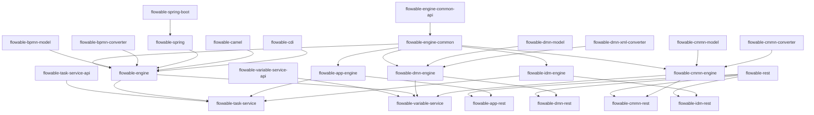

# Flowable Engine 项目整体架构设计

## 1. 架构模式概述

### 1.1 架构模式

Flowable Engine 采用了**模块化单体架构（Modular Monolithic Architecture）**，结合了**分层架构（Layered Architecture）**和**服务导向架构（Service-Oriented Architecture）**的设计理念。

#### 核心设计理念

1. **模块化设计**：将系统划分为多个独立的功能模块，每个模块负责特定的业务领域
2. **接口驱动**：通过定义清晰的接口契约，实现模块间的松耦合
3. **可扩展性**：支持通过配置和扩展点来定制引擎行为
4. **多租户支持**：内置多租户架构，支持SaaS场景

### 1.2 架构层次

```
┌─────────────────────────────────────────────────────────────┐
│                     应用层 (Application Layer)              │
│  ┌──────────────┐  ┌──────────────┐  ┌──────────────┐  │
│  │  REST API    │  │  Spring Boot  │  │  OSGi Bundle  │  │
│  └──────────────┘  └──────────────┘  └──────────────┘  │
└─────────────────────────────────────────────────────────────┘
┌─────────────────────────────────────────────────────────────┐
│                     服务层 (Service Layer)                  │
│  ┌──────────────┐  ┌──────────────┐  ┌──────────────┐  │
│  │ ProcessEngine │  │  AppEngine    │  │ TaskService   │  │
│  └──────────────┘  └──────────────┘  └──────────────┘  │
└─────────────────────────────────────────────────────────────┘
┌─────────────────────────────────────────────────────────────┐
│                   引擎层 (Engine Layer)                      │
│  ┌──────────────┐  ┌──────────────┐  ┌──────────────┐  │
│  │BPMN Engine   │  │  DMN Engine   │  │ CMMN Engine   │  │
│  └──────────────┘  └──────────────┘  └──────────────┘  │
└─────────────────────────────────────────────────────────────┘
┌─────────────────────────────────────────────────────────────┐
│                   数据层 (Data Layer)                       │
│  ┌──────────────┐  ┌──────────────┐  ┌──────────────┐  │
│  │   MyBatis    │  │  DataSource   │  │  Cache        │  │
│  └──────────────┘  └──────────────┘  └──────────────┘  │
└─────────────────────────────────────────────────────────────┘
```

## 2. 目录结构划分逻辑

### 2.1 模块分类

#### 2.1.1 核心引擎模块

| 模块名称 | 职责描述 | 依赖关系 |
|---------|---------|---------|
| `flowable-engine` | BPMN 2.0 流程引擎核心实现 | flowable-engine-common |
| `flowable-app-engine` | 应用引擎，支持应用定义和部署 | flowable-engine, flowable-idm-engine |
| `flowable-dmn-engine` | DMN 决策引擎 | flowable-dmn-model, flowable-engine-common |
| `flowable-cmmn-engine` | CMMN 案例管理引擎 | flowable-cmmn-model, flowable-engine-common |
| `flowable-idm-engine` | 身份管理引擎 | flowable-idm-api |

#### 2.1.2 API 模块

| 模块名称 | 职责描述 | 依赖关系 |
|---------|---------|---------|
| `flowable-engine-common-api` | 公共API定义 | 无 |
| `flowable-app-engine-api` | 应用引擎API | flowable-engine-common-api |
| `flowable-dmn-api` | DMN API | flowable-engine-common-api |
| `flowable-cmmn-api` | CMMN API | flowable-engine-common-api |
| `flowable-idm-api` | 身份管理API | flowable-engine-common-api |
| `flowable-task-service-api` | 任务服务API | flowable-engine-common-api |
| `flowable-variable-service-api` | 变量服务API | flowable-engine-common-api |

#### 2.1.3 服务模块

| 模块名称 | 职责描述 | 依赖关系 |
|---------|---------|---------|
| `flowable-task-service` | 任务管理服务 | flowable-task-service-api |
| `flowable-batch-service` | 批处理服务 | flowable-engine-common |
| `flowable-eventsubscription-service` | 事件订阅服务 | flowable-engine-common |
| `flowable-entitylink-service` | 实体关联服务 | flowable-engine-common |
| `flowable-identitylink-service` | 身份关联服务 | flowable-engine-common |
| `flowable-variable-service` | 变量管理服务 | flowable-variable-service-api |
| `flowable-job-service` | 作业管理服务 | flowable-engine-common |

#### 2.1.4 集成模块

| 模块名称 | 职责描述 | 依赖关系 |
|---------|---------|---------|
| `flowable-spring` | Spring框架集成 | flowable-engine |
| `flowable-spring-boot` | Spring Boot集成 | flowable-spring |
| `flowable-cdi` | CDI集成 | flowable-engine |
| `flowable-camel` | Apache Camel集成 | flowable-engine |
| `flowable-cxf` | Apache CXF集成 | flowable-engine |

#### 2.1.5 REST 模块

| 模块名称 | 职责描述 | 依赖关系 |
|---------|---------|---------|
| `flowable-rest` | REST API基础模块 | flowable-engine-common-rest |
| `flowable-app-rest` | 应用REST API | flowable-app-engine, flowable-rest |
| `flowable-dmn-rest` | DMN REST API | flowable-dmn-engine, flowable-rest |
| `flowable-cmmn-rest` | CMMN REST API | flowable-cmmn-engine, flowable-rest |
| `flowable-idm-rest` | 身份管理REST API | flowable-idm-engine, flowable-rest |

#### 2.1.6 工具和辅助模块

| 模块名称 | 职责描述 | 依赖关系 |
|---------|---------|---------|
| `flowable-bpmn-model` | BPMN 2.0模型定义 | 无 |
| `flowable-bpmn-converter` | BPMN XML转换器 | flowable-bpmn-model |
| `flowable-bpmn-layout` | BPMN布局生成 | flowable-bpmn-model |
| `flowable-dmn-model` | DMN模型定义 | 无 |
| `flowable-dmn-xml-converter` | DMN XML转换器 | flowable-dmn-model |
| `flowable-cmmn-model` | CMMN模型定义 | 无 |
| `flowable-cmmn-converter` | CMMN XML转换器 | flowable-cmmn-model |
| `flowable-image-generator` | 流程图生成器 | flowable-bpmn-model |
| `flowable-form-model` | 表单模型定义 | 无 |
| `flowable-event-registry` | 事件注册表 | flowable-event-registry-model |
| `flowable-event-registry-model` | 事件注册表模型 | 无 |

### 2.2 模块职责边界

#### 2.2.1 核心引擎层职责

**flowable-engine**：
- BPMN 2.0流程定义解析和执行
- 流程实例生命周期管理
- 任务、网关、事件等BPMN元素处理
- 流程变量管理
- 异步执行和作业调度

**flowable-app-engine**：
- 应用定义和部署管理
- 应用资源管理
- 应用版本控制
- 应用与流程定义的关联

**flowable-dmn-engine**：
- DMN决策表解析和执行
- 决策服务提供
- 决策结果缓存
- 与BPMN流程的集成

**flowable-cmmn-engine**：
- CMMN案例定义解析和执行
- 案例实例生命周期管理
- 里程碑、任务、事件等CMMN元素处理
- 与BPMN流程的集成

**flowable-idm-engine**：
- 用户和组管理
- 权限和角色管理
- 身份认证
- 多租户支持

#### 2.2.2 服务层职责

**flowable-task-service**：
- 任务创建、分配、完成
- 任务查询和过滤
- 任务监听器管理
- 任务历史记录

**flowable-variable-service**：
- 流程变量存储和检索
- 变量类型转换
- 变量作用域管理
- 变量序列化和反序列化

**flowable-job-service**：
- 异步作业调度
- 作业执行和重试
- 作业历史记录
- 作业失败处理

**flowable-eventsubscription-service**：
- 事件订阅管理
- 事件触发和分发
- 事件监听器管理

#### 2.2.3 集成层职责

**flowable-spring**：
- Spring Bean集成
- 事务管理
- Spring配置支持

**flowable-spring-boot**：
- Spring Boot自动配置
- 健康检查
- 监控端点

**flowable-camel**：
- Camel路由集成
- 消息传递
- 服务调用

### 2.3 设计考量

#### 2.3.1 模块化设计原则

1. **高内聚低耦合**：每个模块专注于单一职责，模块间通过API交互
2. **接口隔离**：定义清晰的API边界，隐藏实现细节
3. **依赖倒置**：高层模块不依赖低层模块，都依赖抽象
4. **开闭原则**：对扩展开放，对修改关闭

#### 2.3.2 模块依赖规则

```
API 模块 (无依赖)
    ↓
模型模块 (依赖API)
    ↓
引擎模块 (依赖模型和API)
    ↓
服务模块 (依赖引擎)
    ↓
集成模块 (依赖服务和引擎)
    ↓
REST模块 (依赖集成和服务)
```

**关键依赖规则**：
- API模块不依赖任何其他模块
- 引擎模块可以依赖API和模型模块
- 服务模块可以依赖引擎和API模块
- 集成模块可以依赖服务、引擎和API模块
- REST模块可以依赖集成、服务和API模块

## 3. 模块依赖关系

### 3.1 核心依赖图



### 3.2 关键依赖路径

#### 3.2.1 流程引擎依赖路径

```
flowable-engine-common-api (公共API)
    ↓
flowable-engine-common (公共实现)
    ↓
flowable-bpmn-model (BPMN模型)
    ↓
flowable-bpmn-converter (BPMN转换器)
    ↓
flowable-engine (流程引擎)
```

#### 3.2.2 任务服务依赖路径

```
flowable-engine-common-api (公共API)
    ↓
flowable-task-service-api (任务API)
    ↓
flowable-engine-common (公共实现)
    ↓
flowable-task-service (任务服务)
```

#### 3.2.3 Spring集成依赖路径

```
flowable-engine-common-api (公共API)
    ↓
flowable-engine-common (公共实现)
    ↓
flowable-engine (流程引擎)
    ↓
flowable-spring (Spring集成)
    ↓
flowable-spring-boot (Spring Boot集成)
```

### 3.3 依赖规则

1. **单向依赖**：模块间的依赖关系是单向的，避免循环依赖
2. **层次化依赖**：按照API → 模型 → 引擎 → 服务 → 集成的层次组织依赖
3. **最小依赖**：每个模块只依赖必要的模块，减少耦合
4. **版本兼容**：API模块保持向后兼容，引擎模块可以演进

## 4. 核心数据流向

### 4.1 流程部署数据流

```
┌─────────────┐
│  BPMN文件   │
└──────┬──────┘
       │
       ▼
┌─────────────┐
│ Repository   │
│ Service      │
└──────┬──────┘
       │
       ▼
┌─────────────┐
│ BPMN Parser  │
└──────┬──────┘
       │
       ▼
┌─────────────┐
│ BpmnModel    │
└──────┬──────┘
       │
       ▼
┌─────────────┐
│ Deployment   │
│ Entity       │
└──────┬──────┘
       │
       ▼
┌─────────────┐
│  Database    │
└─────────────┘
```

### 4.2 流程启动数据流

```
┌─────────────┐
│  用户请求   │
└──────┬──────┘
       │
       ▼
┌─────────────┐
│ Runtime      │
│ Service      │
└──────┬──────┘
       │
       ▼
┌─────────────┐
│ Process      │
│ Definition   │
│ Cache        │
└──────┬──────┘
       │
       ▼
┌─────────────┐
│ Execution    │
│ Manager      │
└──────┬──────┘
       │
       ▼
┌─────────────┐
│ Process      │
│ Instance     │
└──────┬──────┘
       │
       ▼
┌─────────────┐
│  Database    │
└─────────────┘
```

### 4.3 任务处理数据流

```
┌─────────────┐
│  流程执行   │
└──────┬──────┘
       │
       ▼
┌─────────────┐
│ Task         │
│ Service      │
└──────┬──────┘
       │
       ▼
┌─────────────┐
│ Task Entity  │
└──────┬──────┘
       │
       ▼
┌─────────────┐
│ Task         │
│ Listener     │
└──────┬──────┘
       │
       ▼
┌─────────────┐
│ Task Event   │
│ Dispatcher  │
└──────┬──────┘
       │
       ▼
┌─────────────┐
│  Database    │
└─────────────┘
```

### 4.4 事件处理数据流

```
┌─────────────┐
│  外部事件   │
└──────┬──────┘
       │
       ▼
┌─────────────┐
│ Event        │
│ Registry     │
└──────┬──────┘
       │
       ▼
┌─────────────┐
│ Event        │
│ Subscription │
│ Service      │
└──────┬──────┘
       │
       ▼
┌─────────────┐
│ Event        │
│ Listener     │
└──────┬──────┘
       │
       ▼
┌─────────────┐
│ Process/Task │
│ Execution    │
└─────────────┘
```

## 5. 组件/模块交互机制

### 5.1 事件总线机制

Flowable使用事件总线模式实现组件间的松耦合通信。

#### 5.1.1 事件类型

```java
// 流程引擎事件类型
ENTITY_CREATED, ENTITY_INITIALIZED, ENTITY_UPDATED, ENTITY_DELETED,
TASK_CREATED, TASK_ASSIGNED, TASK_COMPLETED,
PROCESS_STARTED, PROCESS_COMPLETED, PROCESS_CANCELLED,
...
```

#### 5.1.2 事件监听器

```java
public interface FlowableEventListener {
    void onEvent(FlowableEvent event);
    boolean isFailOnException();
    boolean isFireOnTransactionLifecycleEvent();
    String getOnTransaction();
}
```

#### 5.1.3 事件分发流程

```
Event Source
    ↓
Event Dispatcher
    ↓
Event Listener Registry
    ↓
Event Listeners (filtered by type)
    ↓
Event Handling
```

### 5.2 API调用机制

#### 5.2.1 服务接口

```java
// 流程引擎接口
public interface ProcessEngine extends Engine {
    RepositoryService getRepositoryService();
    RuntimeService getRuntimeService();
    TaskService getTaskService();
    HistoryService getHistoryService();
    IdentityService getIdentityService();
    ManagementService getManagementService();
    // ...
}
```

#### 5.2.2 命令模式

Flowable使用命令模式封装所有服务操作。

```java
public interface Command<T> {
    T execute(CommandContext commandContext);
}

public interface CommandExecutor {
    <T> T execute(Command<T> command);
    <T> T execute(CommandConfig<T> commandConfig);
}
```

#### 5.2.3 命令拦截器链

```
Command Request
    ↓
Command Interceptor Chain
    ↓
Command Context
    ↓
Command Execution
    ↓
Result
```

### 5.3 状态管理机制

#### 5.3.1 流程实例状态

```
RUNNING (运行中)
    ↓
SUSPENDED (暂停)
    ↓
COMPLETED (已完成)
    ↓
CANCELLED (已取消)
```

#### 5.3.2 任务状态

```
CREATED (已创建)
    ↓
ASSIGNED (已分配)
    ↓
CLAIMED (已认领)
    ↓
COMPLETED (已完成)
    ↓
DELETED (已删除)
```

#### 5.3.3 状态转换规则

```
RUNNING → SUSPENDED (暂停流程)
SUSPENDED → RUNNING (恢复流程)
RUNNING → COMPLETED (正常完成)
RUNNING → CANCELLED (取消流程)
```

### 5.4 异步执行机制

#### 5.4.1 异步作业

```java
public interface AsyncExecutor {
    void executeAsyncJob(Job job);
    void scheduleAsyncJob(Job job);
    void cancelAsyncJob(Job job);
}
```

#### 5.4.2 作业调度

```
Job Creation
    ↓
Job Queue
    ↓
Job Executor (AsyncExecutor)
    ↓
Job Execution
    ↓
Result/Failure Handling
```

### 5.5 缓存机制

#### 5.5.1 缓存类型

- **流程定义缓存**：缓存已部署的流程定义
- **部署缓存**：缓存部署信息
- **实体缓存**：缓存流程实例、任务等实体

#### 5.5.2 缓存策略

```java
public interface ProcessDefinitionCache {
    ProcessDefinitionEntity get(String processDefinitionId);
    void add(String processDefinitionId, ProcessDefinitionEntity processDefinition);
    void remove(String processDefinitionId);
    void clear();
}
```

## 6. 架构特性评估

### 6.1 可扩展性

#### 6.1.1 扩展点

1. **监听器扩展**：通过事件监听器扩展功能
2. **委托扩展**：通过JavaDelegate实现自定义逻辑
3. **服务任务扩展**：通过服务任务集成外部系统
4. **命令拦截器**：通过拦截器横切关注点

#### 6.1.2 扩展性评分

| 维度 | 评分 | 说明 |
|-----|------|------|
| 功能扩展 | ⭐⭐⭐⭐⭐ | 提供丰富的扩展点 |
| 技术扩展 | ⭐⭐⭐⭐ | 支持多种集成方式 |
| 性能扩展 | ⭐⭐⭐⭐ | 支持集群和缓存 |
| 部署扩展 | ⭐⭐⭐⭐⭐ | 支持多种部署模式 |

### 6.2 可维护性

#### 6.2.1 模块化程度

- **高内聚**：每个模块职责单一明确
- **低耦合**：模块间通过API交互
- **清晰的层次**：分层架构便于理解

#### 6.2.2 代码质量

- **统一的代码风格**：遵循Java编码规范
- **完善的注释**：关键类和方法都有详细注释
- **单元测试**：核心功能有完善的测试覆盖

#### 6.2.3 可维护性评分

| 维度 | 评分 | 说明 |
|-----|------|------|
| 代码可读性 | ⭐⭐⭐⭐⭐ | 代码结构清晰 |
| 模块独立性 | ⭐⭐⭐⭐⭐ | 模块职责明确 |
| 测试覆盖 | ⭐⭐⭐⭐ | 核心功能测试完善 |
| 文档完整性 | ⭐⭐⭐⭐ | 有完善的用户和开发文档 |

### 6.3 性能特性

#### 6.3.1 性能优化

1. **缓存机制**：流程定义、部署等关键数据缓存
2. **异步执行**：支持异步任务和异步历史
3. **批量操作**：支持批量查询和更新
4. **数据库优化**：优化的SQL查询和索引

#### 6.3.2 性能评分

| 维度 | 评分 | 说明 |
|-----|------|------|
| 响应时间 | ⭐⭐⭐⭐ | 缓存优化响应快 |
| 吞吐量 | ⭐⭐⭐⭐ | 支持异步和批量 |
| 资源利用 | ⭐⭐⭐⭐ | 合理的缓存策略 |
| 可扩展性 | ⭐⭐⭐⭐ | 支持集群部署 |

### 6.4 安全性

#### 6.4.1 安全特性

1. **身份认证**：集成多种身份认证方式
2. **权限控制**：基于角色的访问控制
3. **多租户**：支持数据隔离
4. **SQL注入防护**：使用参数化查询

#### 6.4.2 安全性评分

| 维度 | 评分 | 说明 |
|-----|------|------|
| 身份认证 | ⭐⭐⭐⭐ | 支持多种认证方式 |
| 权限控制 | ⭐⭐⭐⭐ | 基于角色的访问控制 |
| 数据隔离 | ⭐⭐⭐⭐⭐ | 完善的多租户支持 |
| 安全审计 | ⭐⭐⭐ | 基础的审计日志 |

## 7. 架构优势与挑战

### 7.1 架构优势

1. **模块化设计**：清晰的模块边界，便于理解和维护
2. **丰富的扩展点**：支持灵活的功能扩展
3. **多引擎支持**：BPMN、DMN、CMMN多引擎协同
4. **成熟的集成**：与Spring、Camel等框架深度集成
5. **多租户支持**：原生支持SaaS场景

### 7.2 架构挑战

1. **模块数量多**：模块数量庞大，学习曲线陡峭
2. **依赖关系复杂**：模块间依赖关系复杂，需要仔细管理
3. **配置复杂**：配置项众多，需要深入理解
4. **性能调优**：需要根据场景进行性能调优
5. **集群部署**：集群部署需要额外的配置和管理

### 7.3 改进建议

1. **简化模块**：考虑合并一些小的模块，减少模块数量
2. **依赖可视化**：提供依赖关系可视化工具
3. **配置简化**：提供更简单的配置方式
4. **性能监控**：增强性能监控和诊断能力
5. **文档增强**：提供更多架构设计文档

## 8. 总结

Flowable Engine采用了模块化单体架构，结合了分层架构和服务导向架构的设计理念。项目通过清晰的模块划分、丰富的扩展点和成熟的集成能力，为业务流程管理提供了强大而灵活的平台。

架构的核心优势在于：
- 高度模块化，职责清晰
- 丰富的扩展点，支持灵活定制
- 多引擎协同，支持复杂业务场景
- 成熟的集成，与主流框架无缝对接

面临的挑战主要包括模块数量多、依赖关系复杂、配置复杂等，但通过良好的文档和社区支持，这些问题都可以得到有效解决。

总体而言，Flowable Engine的架构设计是成熟和专业的，为企业级业务流程管理提供了坚实的基础。
