# Flowable 技术设计文档 - Node.js + NestJS + MySQL

## 文档说明

本文档基于 Flowable 7.0.0 源码分析和最佳实践，提供 Node.js + NestJS + MySQL 技术栈重新实现流程引擎的完整技术设计方案。

---

## 一、系统架构设计

### 1.1 分层架构

采用经典的四层架构设计，确保系统的高内聚低耦合：

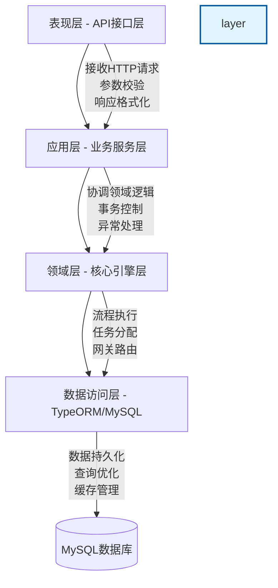

#### 表现层（Presentation Layer）

**职责**：
- 接收 HTTP 请求
- 请求参数校验（使用 class-validator）
- 响应格式化（统一响应格式）
- 异常处理和错误响应

**技术实现**：
```typescript
// process-definition.controller.ts
@Controller('api/v1/process-definitions')
export class ProcessDefinitionController {
  constructor(
    private readonly processDefinitionService: ProcessDefinitionService,
  ) {}

  @Post()
  @ApiOperation({ summary: '部署流程定义' })
  @ApiBody({ type: DeployProcessDefinitionDto })
  async deploy(@Body() dto: DeployProcessDefinitionDto): Promise<ApiResponse<Deployment>> {
    const result = await this.processDefinitionService.deploy(dto);
    return {
      code: 200,
      message: '部署成功',
      data: result,
      timestamp: Date.now(),
    };
  }

  @Get(':id')
  @ApiOperation({ summary: '查询流程定义' })
  async findById(@Param('id') id: string): Promise<ApiResponse<ProcessDefinition>> {
    const result = await this.processDefinitionService.findById(id);
    return {
      code: 200,
      message: '查询成功',
      data: result,
      timestamp: Date.now(),
    };
  }
}
```

#### 应用层（Application Layer）

**职责**：
- 封装业务流程
- 协调领域层组件
- 事务控制
- 权限校验

**技术实现**：
```typescript
// process-definition.service.ts
@Injectable()
export class ProcessDefinitionService {
  constructor(
    private readonly bpmnParserService: BpmnParserService,
    private readonly processDefinitionRepository: ProcessDefinitionRepository,
    private readonly eventBus: EventBusService,
  ) {}

  @Transactional() // 事务控制
  async deploy(dto: DeployProcessDefinitionDto): Promise<Deployment> {
    // 1. 解析 BPMN XML
    const bpmnModel = await this.bpmnParserService.parse(dto.bpmnXml);
    
    // 2. 验证 BPMN 模型
    const errors = this.bpmnParserService.validate(bpmnModel);
    if (errors.length > 0) {
      throw new BusinessException('BPMN 模型验证失败', errors);
    }
    
    // 3. 生成流程定义 ID 和版本号
    const processDefinition = await this.createProcessDefinition(bpmnModel);
    
    // 4. 保存流程定义到数据库
    const saved = await this.processDefinitionRepository.save(processDefinition);
    
    // 5. 生成流程图（可选）
    if (dto.generateDiagram) {
      await this.generateProcessDiagram(saved);
    }
    
    // 6. 发布流程部署事件
    this.eventBus.emit('process.definition.deployed', {
      processDefinitionId: saved.id,
      deploymentId: saved.deploymentId,
    });
    
    return saved;
  }
}
```

#### 领域层（Domain Layer）

**职责**：
- 核心业务逻辑实现
- 流程引擎核心算法
- BPMN 元素执行逻辑
- 网关路由算法

**核心组件**：
- `BpmnParserService`：BPMN 解析
- `ProcessExecutorService`：流程执行
- `GatewayExecutorService`：网关执行
- `TaskExecutorService`：任务执行
- `ExpressionEvaluatorService`：表达式求值

#### 数据访问层（Data Access Layer）

**职责**：
- 数据库操作封装
- 查询优化
- 缓存管理
- 事务管理

**技术实现**：使用 TypeORM 进行 ORM 映射

---

### 1.2 模块划分（NestJS 模块化）

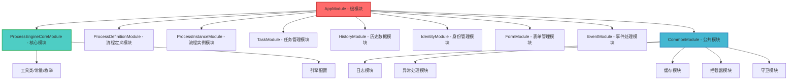

#### 模块职责

| 模块名称 | 职责描述 | 主要服务 |
|---------|---------|---------|
| `ProcessEngineCoreModule` | 核心引擎模块，提供全局服务 | `ProcessEngineService`, `EventBusService`, `ExpressionEvaluatorService` |
| `ProcessDefinitionModule` | 流程定义管理 | `ProcessDefinitionService`, `BpmnParserService` |
| `ProcessInstanceModule` | 流程实例管理 | `ProcessInstanceService`, `ExecutionService` |
| `TaskModule` | 任务管理 | `TaskService`, `TaskListenerService` |
| `HistoryModule` | 历史数据管理 | `HistoryService`, `HistoricProcessInstanceService` |
| `IdentityModule` | 身份管理 | `IdentityService`, `UserService`, `GroupService` |
| `FormModule` | 表单管理 | `FormService`, `FormDataService` |
| `EventModule` | 事件处理 | `TimerService`, `EventSubscriptionService` |
| `CommonModule` | 公共模块 | 日志、异常、缓存、拦截器、守卫 |

#### 模块依赖关系

```
ProcessEngineCoreModule (全局模块，无依赖)
    ↓
ProcessDefinitionModule (依赖 Core)
ProcessInstanceModule (依赖 Core, Definition)
TaskModule (依赖 Core, Instance, Identity)
HistoryModule (依赖 Core, Instance, Task)
IdentityModule (依赖 Core)
FormModule (依赖 Core)
EventModule (依赖 Core, Instance, Task)
CommonModule (无依赖，被所有模块依赖)
```

---

## 二、数据库表结构设计

### 2.1 E-R 核心关系图

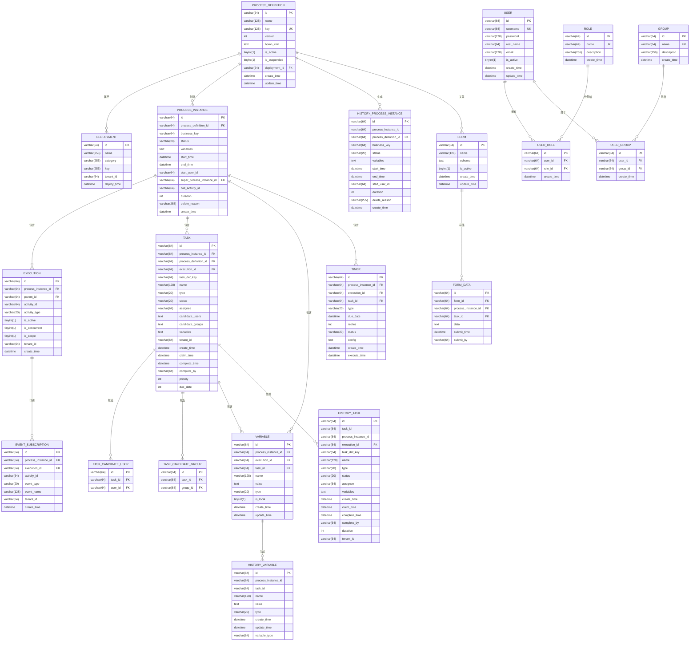

---

### 2.2 核心表详细设计

#### 2.2.1 流程定义表（process_definition）

| 字段名 | 类型 | 长度 | 约束 | 说明 |
|-------|------|------|------|------|
| id | varchar | 64 | PK | 流程定义 ID（UUID） |
| name | varchar | 128 | NOT NULL | 流程定义名称 |
| key | varchar | 128 | UK, NOT NULL | 流程定义键（唯一标识） |
| version | int | - | NOT NULL | 版本号 |
| bpmn_xml | text | - | NOT NULL | BPMN 2.0 XML 内容（可压缩存储） |
| is_active | tinyint | 1 | DEFAULT 1 | 是否激活（1-激活，0-暂停） |
| is_suspended | tinyint | 1 | DEFAULT 0 | 是否暂停（1-暂停，0-未暂停） |
| deployment_id | varchar | 64 | FK | 部署 ID |
| create_time | datetime | - | NOT NULL | 创建时间 |
| update_time | datetime | - | - | 更新时间 |

**索引设计**：
```sql
-- 主键索引
PRIMARY KEY (id)

-- 唯一索引（key + version）
UNIQUE INDEX uk_key_version (key, version)

-- 普通索引
INDEX idx_deployment_id (deployment_id)
INDEX idx_is_active (is_active)
INDEX idx_create_time (create_time)
```

**TypeORM 实体定义**：
```typescript
// process-definition.entity.ts
@Entity('process_definition')
export class ProcessDefinition {
  @PrimaryGeneratedColumn('uuid')
  id: string;

  @Column({ name: 'name', length: 128 })
  name: string;

  @Column({ name: 'key', length: 128, unique: true })
  key: string;

  @Column({ type: 'int' })
  version: number;

  @Column({ name: 'bpmn_xml', type: 'text' })
  bpmnXml: string;

  @Column({ name: 'is_active', type: 'tinyint', width: 1, default: 1 })
  isActive: boolean;

  @Column({ name: 'is_suspended', type: 'tinyint', width: 1, default: 0 })
  isSuspended: boolean;

  @Column({ name: 'deployment_id', length: 64 })
  deploymentId: string;

  @ManyToOne(() => Deployment)
  @JoinColumn({ name: 'deployment_id' })
  deployment: Deployment;

  @CreateDateColumn({ name: 'create_time' })
  createTime: Date;

  @UpdateDateColumn({ name: 'update_time' })
  updateTime: Date;
}
```

---

#### 2.2.2 流程实例表（process_instance）

| 字段名 | 类型 | 长度 | 约束 | 说明 |
|-------|------|------|------|------|
| id | varchar | 64 | PK | 流程实例 ID（UUID） |
| process_definition_id | varchar | 64 | FK, NOT NULL | 流程定义 ID |
| business_key | varchar | 64 | - | 业务键（关联业务系统） |
| status | varchar | 20 | NOT NULL | 实例状态（RUNNING/SUSPENDED/COMPLETED/TERMINATED） |
| variables | text | - | - | 流程变量（JSON 格式） |
| start_time | datetime | - | NOT NULL | 开始时间 |
| end_time | datetime | - | - | 结束时间 |
| start_user_id | varchar | 64 | FK | 启动人 ID |
| super_process_instance_id | varchar | 64 | FK | 父流程实例 ID（子流程） |
| call_activity_id | varchar | 64 | - | 调用活动 ID |
| duration | int | - | - | 持续时间（毫秒） |
| delete_reason | varchar | 255 | - | 删除原因 |
| create_time | datetime | - | NOT NULL | 创建时间 |

**索引设计**：
```sql
-- 主键索引
PRIMARY KEY (id)

-- 普通索引
INDEX idx_process_definition_id (process_definition_id)
INDEX idx_business_key (business_key)
INDEX idx_status (status)
INDEX idx_start_user_id (start_user_id)
INDEX idx_super_process_instance_id (super_process_instance_id)
INDEX idx_create_time (create_time)
```

**TypeORM 实体定义**：
```typescript
// process-instance.entity.ts
@Entity('process_instance')
export class ProcessInstance {
  @PrimaryGeneratedColumn('uuid')
  id: string;

  @Column({ name: 'process_definition_id', length: 64 })
  processDefinitionId: string;

  @ManyToOne(() => ProcessDefinition)
  @JoinColumn({ name: 'process_definition_id' })
  processDefinition: ProcessDefinition;

  @Column({ name: 'business_key', length: 64, nullable: true })
  businessKey: string;

  @Column({ 
    name: 'status', 
    length: 20, 
    type: 'enum',
    enum: ProcessInstanceStatus,
    default: ProcessInstanceStatus.RUNNING
  })
  status: ProcessInstanceStatus;

  @Column({ name: 'variables', type: 'json', nullable: true })
  variables: Record<string, any>;

  @Column({ name: 'start_time', type: 'datetime' })
  startTime: Date;

  @Column({ name: 'end_time', type: 'datetime', nullable: true })
  endTime: Date;

  @Column({ name: 'start_user_id', length: 64, nullable: true })
  startUserId: string;

  @Column({ name: 'super_process_instance_id', length: 64, nullable: true })
  superProcessInstanceId: string;

  @Column({ name: 'call_activity_id', length: 64, nullable: true })
  callActivityId: string;

  @Column({ name: 'duration', type: 'int', nullable: true })
  duration: number;

  @Column({ name: 'delete_reason', length: 255, nullable: true })
  deleteReason: string;

  @CreateDateColumn({ name: 'create_time' })
  createTime: Date;

  // 关联关系
  @OneToMany(() => Execution, execution => execution.processInstance)
  executions: Execution[];

  @OneToMany(() => Task, task => task.processInstance)
  tasks: Task[];
}

export enum ProcessInstanceStatus {
  RUNNING = 'RUNNING',
  SUSPENDED = 'SUSPENDED',
  COMPLETED = 'COMPLETED',
  TERMINATED = 'TERMINATED',
}
```

---

#### 2.2.3 任务表（task）

| 字段名 | 类型 | 长度 | 约束 | 说明 |
|-------|------|------|------|------|
| id | varchar | 64 | PK | 任务 ID（UUID） |
| process_instance_id | varchar | 64 | FK, NOT NULL | 流程实例 ID |
| process_definition_id | varchar | 64 | FK, NOT NULL | 流程定义 ID |
| execution_id | varchar | 64 | FK | 执行实例 ID |
| task_def_key | varchar | 64 | NOT NULL | 任务定义键（BPMN 节点 ID） |
| name | varchar | 128 | - | 任务名称 |
| type | varchar | 20 | NOT NULL | 任务类型（USER/SYSTEM/DELEGATE） |
| status | varchar | 20 | NOT NULL | 任务状态（CREATED/CLAIMED/COMPLETED/DELEGATED） |
| assignee | varchar | 64 | - | 任务分配人 |
| candidate_users | text | - | 候选用户（逗号分隔） |
| candidate_groups | text | - | 候选组（逗号分隔） |
| variables | text | - | 任务变量（JSON 格式） |
| tenant_id | varchar | 64 | - | 租户 ID |
| create_time | datetime | - | NOT NULL | 创建时间 |
| claim_time | datetime | - | 认领时间 |
| complete_time | datetime | - | 完成时间 |
| complete_by | varchar | 64 | - | 完成人 ID |
| priority | int | - | DEFAULT 50 | 优先级（0-100） |
| due_date | int | - | - | 到期时间（时间戳） |

**索引设计**：
```sql
-- 主键索引
PRIMARY KEY (id)

-- 普通索引
INDEX idx_process_instance_id (process_instance_id)
INDEX idx_process_definition_id (process_definition_id)
INDEX idx_execution_id (execution_id)
INDEX idx_assignee (assignee)
INDEX idx_status (status)
INDEX idx_create_time (create_time)
INDEX idx_complete_time (complete_time)
```

**TypeORM 实体定义**：
```typescript
// task.entity.ts
@Entity('task')
export class Task {
  @PrimaryGeneratedColumn('uuid')
  id: string;

  @Column({ name: 'process_instance_id', length: 64 })
  processInstanceId: string;

  @ManyToOne(() => ProcessInstance)
  @JoinColumn({ name: 'process_instance_id' })
  processInstance: ProcessInstance;

  @Column({ name: 'process_definition_id', length: 64 })
  processDefinitionId: string;

  @Column({ name: 'execution_id', length: 64, nullable: true })
  executionId: string;

  @Column({ name: 'task_def_key', length: 64 })
  taskDefinitionKey: string;

  @Column({ name: 'name', length: 128, nullable: true })
  name: string;

  @Column({ 
    name: 'type', 
    length: 20, 
    type: 'enum',
    enum: TaskType,
    default: TaskType.USER
  })
  type: TaskType;

  @Column({ 
    name: 'status', 
    length: 20, 
    type: 'enum',
    enum: TaskStatus,
    default: TaskStatus.CREATED
  })
  status: TaskStatus;

  @Column({ name: 'assignee', length: 64, nullable: true })
  assignee: string;

  @Column({ name: 'candidate_users', type: 'text', nullable: true })
  candidateUsers: string;

  @Column({ name: 'candidate_groups', type: 'text', nullable: true })
  candidateGroups: string;

  @Column({ name: 'variables', type: 'json', nullable: true })
  variables: Record<string, any>;

  @Column({ name: 'tenant_id', length: 64, nullable: true })
  tenantId: string;

  @CreateDateColumn({ name: 'create_time' })
  createTime: Date;

  @Column({ name: 'claim_time', type: 'datetime', nullable: true })
  claimTime: Date;

  @Column({ name: 'complete_time', type: 'datetime', nullable: true })
  completeTime: Date;

  @Column({ name: 'complete_by', length: 64, nullable: true })
  completeBy: string;

  @Column({ name: 'priority', type: 'int', default: 50 })
  priority: number;

  @Column({ name: 'due_date', type: 'int', nullable: true })
  dueDate: number;

  // 关联关系
  @OneToMany(() => TaskCandidateUser, candidateUser => candidateUser.task)
  candidateUsers: TaskCandidateUser[];

  @OneToMany(() => TaskCandidateGroup, candidateGroup => candidateGroup.task)
  candidateGroups: TaskCandidateGroup[];
}

export enum TaskType {
  USER = 'USER',
  SYSTEM = 'SYSTEM',
  DELEGATE = 'DELEGATE',
}

export enum TaskStatus {
  CREATED = 'CREATED',
  CLAIMED = 'CLAIMED',
  ASSIGNED = 'ASSIGNED',
  COMPLETED = 'COMPLETED',
  DELEGATED = 'DELEGATED',
  DELETED = 'DELETED',
}
```

---

#### 2.2.4 用户表（user）

| 字段名 | 类型 | 长度 | 约束 | 说明 |
|-------|------|------|------|------|
| id | varchar | 64 | PK | 用户 ID（UUID） |
| username | varchar | 64 | UK, NOT NULL | 用户名（唯一） |
| password | varchar | 128 | NOT NULL | 密码（bcrypt 加密） |
| real_name | varchar | 64 | - | 真实姓名 |
| email | varchar | 128 | - | 邮箱 |
| is_active | tinyint | 1 | DEFAULT 1 | 是否激活 |
| create_time | datetime | - | NOT NULL | 创建时间 |
| update_time | datetime | - | - | 更新时间 |

**索引设计**：
```sql
-- 主键索引
PRIMARY KEY (id)

-- 唯一索引
UNIQUE INDEX uk_username (username)

-- 普通索引
INDEX idx_email (email)
INDEX idx_is_active (is_active)
```

**TypeORM 实体定义**：
```typescript
// user.entity.ts
@Entity('user')
export class User {
  @PrimaryGeneratedColumn('uuid')
  id: string;

  @Column({ name: 'username', length: 64, unique: true })
  username: string;

  @Column({ name: 'password', length: 128 })
  password: string;

  @Column({ name: 'real_name', length: 64, nullable: true })
  realName: string;

  @Column({ name: 'email', length: 128, nullable: true })
  email: string;

  @Column({ name: 'is_active', type: 'tinyint', width: 1, default: 1 })
  isActive: boolean;

  @CreateDateColumn({ name: 'create_time' })
  createTime: Date;

  @UpdateDateColumn({ name: 'update_time' })
  updateTime: Date;

  // 关联关系
  @OneToMany(() => UserRole, userRole => userRole.user)
  roles: UserRole[];

  @OneToMany(() => UserGroup, userGroup => userGroup.user)
  groups: UserGroup[];
}
```

---

#### 2.2.5 作业表（job）

基于Flowable的`JobInfo`和`Job`接口设计，用于存储异步作业和定时器作业。

| 字段名 | 类型 | 长度 | 约束 | 说明 |
|-------|------|------|------|------|
| id_ | varchar | 64 | PK | 作业ID（UUID） |
| job_type_ | varchar | 255 | NOT NULL | 作业类型（timer/message/externalWorker） |
| job_handler_type_ | varchar | 255 | NOT NULL | 作业处理器类型 |
| process_inst_id_ | varchar | 64 | FK | 流程实例ID |
| process_def_id_ | varchar | 64 | FK | 流程定义ID |
| execution_id_ | varchar | 64 | FK | 执行ID |
| element_id_ | varchar | 255 | - | BPMN元素ID |
| element_name_ | varchar | 255 | - | BPMN元素名称 |
| retries_ | int | - | DEFAULT 3 | 重试次数 |
| duedate_ | datetime | - | - | 到期时间 |
| exception_msg_ | text | - | - | 异常消息 |
| exception_stack_ | longtext | - | - | 异常堆栈 |
| job_handler_cfg_ | longblob | - | - | 作业处理器配置（JSON） |
| tenant_id_ | varchar | 64 | - | 租户ID |
| create_time_ | datetime | - | NOT NULL | 创建时间 |

**索引设计**：
```sql
PRIMARY KEY (id_)
INDEX idx_duedate (duedate_)
INDEX idx_process_inst_id (process_inst_id_)
INDEX idx_execution_id (execution_id_)
INDEX idx_job_type (job_type_)
```

**TypeORM 实体定义**：
```typescript
// job.entity.ts
@Entity('act_ru_job')
export class JobEntity {
  @PrimaryColumn({ length: 64 })
  id_: string;

  @Column({ length: 255 })
  job_type_: string;

  @Column({ length: 255 })
  job_handler_type_: string;

  @Column({ length: 64, nullable: true })
  process_inst_id_: string;

  @Column({ length: 64, nullable: true })
  process_def_id_: string;

  @Column({ length: 64, nullable: true })
  execution_id_: string;

  @Column({ length: 255, nullable: true })
  element_id_: string;

  @Column({ length: 255, nullable: true })
  element_name_: string;

  @Column({ type: 'int', default: 3 })
  retries_: number;

  @Column({ type: 'datetime', nullable: true })
  duedate_: Date;

  @Column({ type: 'text', nullable: true })
  exception_msg_: string;

  @Column({ type: 'longtext', nullable: true })
  exception_stack_: string;

  @Column({ type: 'longblob', nullable: true })
  job_handler_cfg_: Buffer;

  @Column({ length: 64, nullable: true })
  tenant_id_: string;

  @Column({ type: 'datetime' })
  create_time_: Date;
}
```

---

#### 2.2.6 死信作业表（deadletter_job）

存储重试失败后进入死信队列的作业。

| 字段名 | 类型 | 长度 | 约束 | 说明 |
|-------|------|------|------|------|
| id_ | varchar | 64 | PK | 作业ID |
| job_type_ | varchar | 255 | NOT NULL | 作业类型 |
| job_handler_type_ | varchar | 255 | NOT NULL | 作业处理器类型 |
| process_inst_id_ | varchar | 64 | FK | 流程实例ID |
| execution_id_ | varchar | 64 | FK | 执行ID |
| exception_msg_ | text | - | - | 异常消息 |
| exception_stack_ | longtext | - | - | 异常堆栈 |
| job_handler_cfg_ | longblob | - | - | 作业处理器配置 |
| tenant_id_ | varchar | 64 | - | 租户ID |
| create_time_ | datetime | - | NOT NULL | 创建时间 |

**TypeORM 实体定义**：
```typescript
// deadletter-job.entity.ts
@Entity('act_ru_deadletter_job')
export class DeadLetterJobEntity {
  @PrimaryColumn({ length: 64 })
  id_: string;

  @Column({ length: 255 })
  job_type_: string;

  @Column({ length: 255 })
  job_handler_type_: string;

  @Column({ length: 64, nullable: true })
  process_inst_id_: string;

  @Column({ length: 64, nullable: true })
  execution_id_: string;

  @Column({ type: 'text', nullable: true })
  exception_msg_: string;

  @Column({ type: 'longtext', nullable: true })
  exception_stack_: string;

  @Column({ type: 'longblob', nullable: true })
  job_handler_cfg_: Buffer;

  @Column({ length: 64, nullable: true })
  tenant_id_: string;

  @Column({ type: 'datetime' })
  create_time_: Date;
}
```

---

#### 2.2.7 身份链接表（identity_link）

基于Flowable的`IdentityLink`接口设计，用于管理任务和流程实例的身份关联。

| 字段名 | 类型 | 长度 | 约束 | 说明 |
|-------|------|------|------|------|
| id_ | varchar | 64 | PK | 唯一标识 |
| type_ | varchar | 64 | NOT NULL | 类型（assignee/candidate/owner/starter/participant/reactivator） |
| user_id_ | varchar | 255 | - | 用户ID |
| group_id_ | varchar | 255 | - | 组ID |
| task_id_ | varchar | 64 | FK | 任务ID |
| proc_inst_id_ | varchar | 64 | FK | 流程实例ID |
| proc_def_id_ | varchar | 64 | FK | 流程定义ID |
| create_time_ | datetime | - | - | 创建时间 |

**索引设计**：
```sql
PRIMARY KEY (id_)
INDEX idx_task_id (task_id_)
INDEX idx_proc_inst_id (proc_inst_id_)
INDEX idx_user_id (user_id_)
INDEX idx_group_id (group_id_)
INDEX idx_type (type_)
```

**TypeORM 实体定义**：
```typescript
// identity-link.entity.ts
@Entity('act_ru_identitylink')
export class IdentityLinkEntity {
  @PrimaryColumn({ length: 64 })
  id_: string;

  @Column({ length: 64 })
  type_: string;

  @Column({ length: 255, nullable: true })
  user_id_: string;

  @Column({ length: 255, nullable: true })
  group_id_: string;

  @Column({ length: 64, nullable: true })
  task_id_: string;

  @Column({ length: 64, nullable: true })
  proc_inst_id_: string;

  @Column({ length: 64, nullable: true })
  proc_def_id_: string;

  @Column({ type: 'datetime', nullable: true })
  create_time_: Date;
}

// 身份链接类型常量
export class IdentityLinkType {
  static readonly ASSIGNEE = 'assignee';
  static readonly CANDIDATE = 'candidate';
  static readonly OWNER = 'owner';
  static readonly STARTER = 'starter';
  static readonly PARTICIPANT = 'participant';
  static readonly REACTIVATOR = 'reactivator';
}
```

---

#### 2.2.8 事件订阅表（event_subscription）

基于Flowable的`EventSubscription`接口设计，用于存储信号和消息事件订阅。

| 字段名 | 类型 | 长度 | 约束 | 说明 |
|-------|------|------|------|------|
| id_ | varchar | 64 | PK | 唯一标识 |
| event_type_ | varchar | 255 | NOT NULL | 事件类型（signal/message/conditional） |
| event_name_ | varchar | 255 | - | 事件名称 |
| execution_id_ | varchar | 64 | FK | 执行ID |
| proc_inst_id_ | varchar | 64 | FK | 流程实例ID |
| activity_id_ | varchar | 255 | - | 活动ID |
| proc_def_id_ | varchar | 64 | FK | 流程定义ID |
| tenant_id_ | varchar | 64 | - | 租户ID |
| created_ | datetime | - | NOT NULL | 创建时间 |

**索引设计**：
```sql
PRIMARY KEY (id_)
INDEX idx_event_type_name (event_type_, event_name_)
INDEX idx_execution_id (execution_id_)
INDEX idx_proc_inst_id (proc_inst_id_)
```

**TypeORM 实体定义**：
```typescript
// event-subscription.entity.ts
@Entity('act_ru_event_subscr')
export class EventSubscriptionEntity {
  @PrimaryColumn({ length: 64 })
  id_: string;

  @Column({ length: 255 })
  event_type_: string;

  @Column({ length: 255, nullable: true })
  event_name_: string;

  @Column({ length: 64, nullable: true })
  execution_id_: string;

  @Column({ length: 64, nullable: true })
  proc_inst_id_: string;

  @Column({ length: 255, nullable: true })
  activity_id_: string;

  @Column({ length: 64, nullable: true })
  proc_def_id_: string;

  @Column({ length: 64, nullable: true })
  tenant_id_: string;

  @Column({ type: 'datetime' })
  created_: Date;
}

// 事件类型常量
export class EventType {
  static readonly SIGNAL = 'signal';
  static readonly MESSAGE = 'message';
  static readonly CONDITIONAL = 'conditional';
}
```

---

#### 2.2.9 表单定义表（form_definition）

基于Flowable的`FormDefinition`接口设计。

| 字段名 | 类型 | 长度 | 约束 | 说明 |
|-------|------|------|------|------|
| id_ | varchar | 64 | PK | 唯一标识 |
| category_ | varchar | 255 | - | 分类 |
| name_ | varchar | 255 | - | 显示名称 |
| key_ | varchar | 255 | NOT NULL | 唯一标识键 |
| description_ | text | - | - | 描述 |
| version_ | int | - | NOT NULL | 版本号 |
| resource_name_ | varchar | 255 | - | 资源名称 |
| deployment_id_ | varchar | 64 | FK | 部署ID |
| tenant_id_ | varchar | 64 | - | 租户ID |
| create_time_ | datetime | - | NOT NULL | 创建时间 |

**索引设计**：
```sql
PRIMARY KEY (id_)
UNIQUE INDEX uk_key_version (key_, version_)
INDEX idx_deployment_id (deployment_id_)
```

**TypeORM 实体定义**：
```typescript
// form-definition.entity.ts
@Entity('fl_form_definition')
export class FormDefinitionEntity {
  @PrimaryColumn({ length: 64 })
  id_: string;

  @Column({ length: 255, nullable: true })
  category_: string;

  @Column({ length: 255, nullable: true })
  name_: string;

  @Column({ length: 255 })
  key_: string;

  @Column({ type: 'text', nullable: true })
  description_: string;

  @Column({ type: 'int' })
  version_: number;

  @Column({ length: 255, nullable: true })
  resource_name_: string;

  @Column({ length: 64, nullable: true })
  deployment_id_: string;

  @Column({ length: 64, nullable: true })
  tenant_id_: string;

  @Column({ type: 'datetime' })
  create_time_: Date;
}
```

---

#### 2.2.10 表单实例表（form_instance）

基于Flowable的`FormInstance`接口设计，存储表单提交记录。

| 字段名 | 类型 | 长度 | 约束 | 说明 |
|-------|------|------|------|------|
| id_ | varchar | 64 | PK | 唯一标识 |
| form_definition_id_ | varchar | 64 | FK, NOT NULL | 表单定义ID |
| task_id_ | varchar | 64 | FK | 任务ID |
| process_instance_id_ | varchar | 64 | FK | 流程实例ID |
| process_definition_id_ | varchar | 64 | FK | 流程定义ID |
| scope_id_ | varchar | 64 | - | 作用域ID |
| scope_type_ | varchar | 64 | - | 作用域类型 |
| scope_definition_id_ | varchar | 64 | - | 作用域定义ID |
| submitted_date_ | datetime | - | NOT NULL | 提交日期 |
| submitted_by_ | varchar | 64 | - | 提交人 |
| form_values_id_ | varchar | 64 | - | 表单值文档ID |
| tenant_id_ | varchar | 64 | - | 租户ID |
| form_value_bytes_ | longblob | - | - | 表单值字节数组 |

**索引设计**：
```sql
PRIMARY KEY (id_)
INDEX idx_form_definition_id (form_definition_id_)
INDEX idx_task_id (task_id_)
INDEX idx_process_instance_id (process_instance_id_)
INDEX idx_submitted_date (submitted_date_)
```

**TypeORM 实体定义**：
```typescript
// form-instance.entity.ts
@Entity('fl_form_instance')
export class FormInstanceEntity {
  @PrimaryColumn({ length: 64 })
  id_: string;

  @Column({ length: 64 })
  form_definition_id_: string;

  @Column({ length: 64, nullable: true })
  task_id_: string;

  @Column({ length: 64, nullable: true })
  process_instance_id_: string;

  @Column({ length: 64, nullable: true })
  process_definition_id_: string;

  @Column({ length: 64, nullable: true })
  scope_id_: string;

  @Column({ length: 64, nullable: true })
  scope_type_: string;

  @Column({ length: 64, nullable: true })
  scope_definition_id_: string;

  @Column({ type: 'datetime' })
  submitted_date_: Date;

  @Column({ length: 64, nullable: true })
  submitted_by_: string;

  @Column({ length: 64, nullable: true })
  form_values_id_: string;

  @Column({ length: 64, nullable: true })
  tenant_id_: string;

  @Column({ type: 'longblob', nullable: true })
  form_value_bytes_: Buffer;
}
```

---

#### 2.2.11 批处理表（batch）

用于存储批量操作记录。

| 字段名 | 类型 | 长度 | 约束 | 说明 |
|-------|------|------|------|------|
| id_ | varchar | 64 | PK | 唯一标识 |
| type_ | varchar | 255 | NOT NULL | 批处理类型（migration/deletion/dmn） |
| total_batches_ | int | - | NOT NULL | 总批次数 |
| completed_batches_ | int | - | DEFAULT 0 | 完成批次数 |
| failed_batches_ | int | - | DEFAULT 0 | 失败批次数 |
| tenant_id_ | varchar | 64 | - | 租户ID |
| create_time_ | datetime | - | NOT NULL | 创建时间 |
| end_time_ | datetime | - | - | 结束时间 |
| created_by_ | varchar | 64 | - | 创建人 |
| search_key_ | text | - | - | 搜索键 |

**TypeORM 实体定义**：
```typescript
// batch.entity.ts
@Entity('fl_batch')
export class BatchEntity {
  @PrimaryColumn({ length: 64 })
  id_: string;

  @Column({ length: 255 })
  type_: string;

  @Column({ type: 'int' })
  total_batches_: number;

  @Column({ type: 'int', default: 0 })
  completed_batches_: number;

  @Column({ type: 'int', default: 0 })
  failed_batches_: number;

  @Column({ length: 64, nullable: true })
  tenant_id_: string;

  @Column({ type: 'datetime' })
  create_time_: Date;

  @Column({ type: 'datetime', nullable: true })
  end_time_: Date;

  @Column({ length: 64, nullable: true })
  created_by_: string;

  @Column({ type: 'text', nullable: true })
  search_key_: string;
}
```

---

#### 2.2.12 批处理部分表（batch_part）

存储批处理的每个部分。

| 字段名 | 类型 | 长度 | 约束 | 说明 |
|-------|------|------|------|------|
| id_ | varchar | 64 | PK | 唯一标识 |
| batch_id_ | varchar | 64 | FK, NOT NULL | 批处理ID |
| type_ | varchar | 255 | NOT NULL | 类型 |
| status_ | varchar | 255 | NOT NULL | 状态（pending/completed/failed） |
| data_ | text | - | - | 处理数据（JSON） |
| create_time_ | datetime | - | NOT NULL | 创建时间 |
| end_time_ | datetime | - | - | 结束时间 |
| error_message_ | text | - | - | 错误消息 |

**TypeORM 实体定义**：
```typescript
// batch-part.entity.ts
@Entity('fl_batch_part')
export class BatchPartEntity {
  @PrimaryColumn({ length: 64 })
  id_: string;

  @Column({ length: 64 })
  batch_id_: string;

  @Column({ length: 255 })
  type_: string;

  @Column({ length: 255 })
  status_: string;

  @Column({ type: 'text', nullable: true })
  data_: string;

  @Column({ type: 'datetime' })
  create_time_: Date;

  @Column({ type: 'datetime', nullable: true })
  end_time_: Date;

  @Column({ type: 'text', nullable: true })
  error_message_: string;
}
```

---

#### 2.2.13 内容项表（content_item）

用于存储流程附件和文档的元数据。

| 字段名 | 类型 | 长度 | 约束 | 说明 |
|-------|------|------|------|------|
| id_ | varchar | 64 | PK | 唯一标识 |
| name_ | varchar | 255 | NOT NULL | 名称 |
| description_ | text | - | - | 描述 |
| type_ | varchar | 255 | - | MIME类型 |
| content_size_ | bigint | - | - | 内容大小 |
| process_instance_id_ | varchar | 64 | FK | 流程实例ID |
| task_id_ | varchar | 64 | FK | 任务ID |
| scope_id_ | varchar | 64 | - | 作用域ID |
| scope_type_ | varchar | 64 | - | 作用域类型 |
| created_by_ | varchar | 64 | - | 创建人 |
| created_ | datetime | - | NOT NULL | 创建时间 |
| last_modified_by_ | varchar | 64 | - | 最后修改人 |
| last_modified_ | datetime | - | - | 最后修改时间 |
| tenant_id_ | varchar | 64 | - | 租户ID |
| content_store_id_ | text | - | - | 内容存储引用 |

**TypeORM 实体定义**：
```typescript
// content-item.entity.ts
@Entity('fl_content_item')
export class ContentItemEntity {
  @PrimaryColumn({ length: 64 })
  id_: string;

  @Column({ length: 255 })
  name_: string;

  @Column({ type: 'text', nullable: true })
  description_: string;

  @Column({ length: 255, nullable: true })
  type_: string;

  @Column({ type: 'bigint', nullable: true })
  content_size_: number;

  @Column({ length: 64, nullable: true })
  process_instance_id_: string;

  @Column({ length: 64, nullable: true })
  task_id_: string;

  @Column({ length: 64, nullable: true })
  scope_id_: string;

  @Column({ length: 64, nullable: true })
  scope_type_: string;

  @Column({ length: 64, nullable: true })
  created_by_: string;

  @Column({ type: 'datetime' })
  created_: Date;

  @Column({ length: 64, nullable: true })
  last_modified_by_: string;

  @Column({ type: 'datetime', nullable: true })
  last_modified_: Date;

  @Column({ length: 64, nullable: true })
  tenant_id_: string;

  @Column({ type: 'text', nullable: true })
  content_store_id_: string;
}
```

---

#### 2.2.14 评论表（comment）

用于存储流程和任务的评论。

| 字段名 | 类型 | 长度 | 约束 | 说明 |
|-------|------|------|------|------|
| id_ | varchar | 64 | PK | 唯一标识 |
| user_id_ | varchar | 64 | - | 用户ID |
| task_id_ | varchar | 64 | FK | 任务ID |
| process_instance_id_ | varchar | 64 | FK | 流程实例ID |
| type_ | varchar | 255 | - | 评论类型 |
| message_ | text | NOT NULL | 评论内容 |
| time_ | datetime | NOT NULL | 评论时间 |
| tenant_id_ | varchar | 64 | - | 租户ID |

**TypeORM 实体定义**：
```typescript
// comment.entity.ts
@Entity('fl_comment')
export class CommentEntity {
  @PrimaryColumn({ length: 64 })
  id_: string;

  @Column({ length: 64, nullable: true })
  user_id_: string;

  @Column({ length: 64, nullable: true })
  task_id_: string;

  @Column({ length: 64, nullable: true })
  process_instance_id_: string;

  @Column({ length: 255, nullable: true })
  type_: string;

  @Column({ type: 'text' })
  message_: string;

  @Column({ type: 'datetime' })
  time_: Date;

  @Column({ length: 64, nullable: true })
  tenant_id_: string;
}
```

---

#### 2.2.15 抄送记录表（cc_record）

用于存储任务抄送记录，实现流程抄送功能。

| 字段名 | 类型 | 长度 | 约束 | 说明 |
|-------|------|------|------|------|
| id_ | varchar | 64 | PK | 唯一标识 |
| task_id_ | varchar | 64 | FK, NOT NULL | 任务ID |
| process_instance_id_ | varchar | 64 | FK | 流程实例ID |
| process_definition_id_ | varchar | 64 | FK | 流程定义ID |
| cc_user_id_ | varchar | 64 | NOT NULL | 被抄送人ID |
| cc_type_ | varchar | 20 | NOT NULL | 抄送类型（USER/GROUP/ROLE） |
| cc_source_ | varchar | 20 | NOT NULL | 抄送来源（MANUAL/AUTO_TASK/AUTO_PROCESS） |
| status_ | varchar | 20 | NOT NULL | 状态（UNREAD/READ） |
| read_time_ | datetime | - | - | 阅读时间 |
| cc_reason_ | text | - | - | 抄送原因 |
| creator_id_ | varchar | 64 | NOT NULL | 创建人ID |
| tenant_id_ | varchar | 64 | - | 租户ID |
| create_time_ | datetime | - | NOT NULL | 创建时间 |

**索引设计**：
```sql
PRIMARY KEY (id_)
INDEX idx_task_id (task_id_)
INDEX idx_process_instance_id (process_instance_id_)
INDEX idx_cc_user_id (cc_user_id_)
INDEX idx_status (status_)
INDEX idx_create_time (create_time_)
```

**TypeORM 实体定义**：
```typescript
// cc-record.entity.ts
@Entity('act_ru_cc_record')
export class CcRecordEntity {
  @PrimaryColumn({ length: 64 })
  id_: string;

  @Column({ length: 64 })
  task_id_: string;

  @Column({ length: 64, nullable: true })
  process_instance_id_: string;

  @Column({ length: 64, nullable: true })
  process_definition_id_: string;

  @Column({ length: 64 })
  cc_user_id_: string;

  @Column({ length: 20 })
  cc_type_: string; // USER / GROUP / ROLE

  @Column({ length: 20 })
  cc_source_: string; // MANUAL / AUTO_TASK / AUTO_PROCESS

  @Column({ length: 20 })
  status_: string; // UNREAD / READ

  @Column({ type: 'datetime', nullable: true })
  read_time_: Date;

  @Column({ type: 'text', nullable: true })
  cc_reason_: string;

  @Column({ length: 64 })
  creator_id_: string;

  @Column({ length: 64, nullable: true })
  tenant_id_: string;

  @Column({ type: 'datetime' })
  create_time_: Date;
}

// 抄送类型枚举
export enum CcType {
  USER = 'USER',
  GROUP = 'GROUP',
  ROLE = 'ROLE',
}

// 抄送来源枚举
export enum CcSource {
  MANUAL = 'MANUAL',
  AUTO_TASK = 'AUTO_TASK',
  AUTO_PROCESS = 'AUTO_PROCESS',
}

// 抄送状态枚举
export enum CcStatus {
  UNREAD = 'UNREAD',
  READ = 'READ',
}
```

---

#### 2.2.16 抄送配置表（cc_config）

用于配置流程或任务的自动抄送规则。

| 字段名 | 类型 | 长度 | 约束 | 说明 |
|-------|------|------|------|------|
| id_ | varchar | 64 | PK | 唯一标识 |
| process_definition_id_ | varchar | 64 | FK | 流程定义ID |
| task_def_key_ | varchar | 64 | - | 任务定义键（为空表示流程级别） |
| cc_targets_ | text | NOT NULL | 抄送目标（JSON数组） |
| cc_type_ | varchar | 20 | NOT NULL | 抄送类型 |
| cc_source_ | varchar | 20 | NOT NULL | 触发来源 |
| condition_expr_ | text | - | 条件表达式 |
| is_active_ | tinyint | 1 | DEFAULT 1 | 是否启用 |
| tenant_id_ | varchar | 64 | - | 租户ID |
| create_time_ | datetime | - | NOT NULL | 创建时间 |
| update_time_ | datetime | - | - | 更新时间 |

**索引设计**：
```sql
PRIMARY KEY (id_)
INDEX idx_process_definition_id (process_definition_id_)
INDEX idx_task_def_key (task_def_key_)
INDEX idx_is_active (is_active_)
```

**TypeORM 实体定义**：
```typescript
// cc-config.entity.ts
@Entity('act_re_cc_config')
export class CcConfigEntity {
  @PrimaryColumn({ length: 64 })
  id_: string;

  @Column({ length: 64, nullable: true })
  process_definition_id_: string;

  @Column({ length: 64, nullable: true })
  task_def_key_: string;

  @Column({ type: 'text' })
  cc_targets_: string; // JSON数组: ["user1", "user2"] 或 ["group:manager"]

  @Column({ length: 20 })
  cc_type_: string;

  @Column({ length: 20 })
  cc_source_: string;

  @Column({ type: 'text', nullable: true })
  condition_expr_: string; // UEL表达式

  @Column({ type: 'tinyint', width: 1, default: 1 })
  is_active_: boolean;

  @Column({ length: 64, nullable: true })
  tenant_id_: string;

  @Column({ type: 'datetime' })
  create_time_: Date;

  @Column({ type: 'datetime', nullable: true })
  update_time_: Date;
}
```

---

#### 2.2.17 任务驳回记录表（task_reject）

用于记录任务驳回/退回操作历史。

| 字段名 | 类型 | 长度 | 约束 | 说明 |
|-------|------|------|------|------|
| id_ | varchar | 64 | PK | 唯一标识 |
| task_id_ | varchar | 64 | FK, NOT NULL | 任务ID |
| process_instance_id_ | varchar | 64 | FK | 流程实例ID |
| reject_type_ | varchar | 20 | NOT NULL | 驳回类型（ROLLBACK/REJECT/DENY） |
| reject_strategy_ | varchar | 30 | NOT NULL | 驳回策略 |
| source_activity_id_ | varchar | 64 | NOT NULL | 源活动ID |
| target_activity_id_ | varchar | 64 | - | 目标活动ID |
| reason_ | text | - | - | 驳回原因 |
| operator_id_ | varchar | 64 | NOT NULL | 操作人ID |
| create_time_ | datetime | - | NOT NULL | 创建时间 |

**索引设计**：
```sql
PRIMARY KEY (id_)
INDEX idx_task_id (task_id_)
INDEX idx_process_instance_id (process_instance_id_)
INDEX idx_operator_id (operator_id_)
INDEX idx_create_time (create_time_)
```

**TypeORM 实体定义**：
```typescript
// task-reject.entity.ts
@Entity('act_ru_task_reject')
export class TaskRejectEntity {
  @PrimaryColumn({ length: 64 })
  id_: string;

  @Column({ length: 64 })
  task_id_: string;

  @Column({ length: 64, nullable: true })
  process_instance_id_: string;

  @Column({ length: 20 })
  reject_type_: string; // ROLLBACK / REJECT / DENY

  @Column({ length: 30 })
  reject_strategy_: string; // TO_PREVIOUS / TO_STARTER / TO_SPECIFIC / TO_ANY_HISTORY

  @Column({ length: 64 })
  source_activity_id_: string;

  @Column({ length: 64, nullable: true })
  target_activity_id_: string;

  @Column({ type: 'text', nullable: true })
  reason_: string;

  @Column({ length: 64 })
  operator_id_: string;

  @Column({ type: 'datetime' })
  create_time_: Date;
}

// 驳回类型枚举
export enum RejectType {
  ROLLBACK = 'ROLLBACK',   // 退回：退回到之前的某个节点
  REJECT = 'REJECT',       // 驳回：直接驳回给发起人或指定人
  DENY = 'DENY',           // 拒绝：拒绝申请，终止流程
}

// 驳回策略枚举
export enum RejectStrategy {
  TO_PREVIOUS = 'TO_PREVIOUS',           // 退回到上一节点
  TO_STARTER = 'TO_STARTER',             // 退回到发起人
  TO_SPECIFIC = 'TO_SPECIFIC',           // 退回到指定节点
  TO_ANY_HISTORY = 'TO_ANY_HISTORY',     // 退回到任意历史节点
  NOT_ALLOWED = 'NOT_ALLOWED',           // 不允许退回
}
```

---

#### 2.2.18 驳回配置表（reject_config）

用于配置任务节点的驳回策略。

| 字段名 | 类型 | 长度 | 约束 | 说明 |
|-------|------|------|------|------|
| id_ | varchar | 64 | PK | 唯一标识 |
| process_definition_id_ | varchar | 64 | FK | 流程定义ID |
| task_def_key_ | varchar | 64 | NOT NULL | 任务定义键 |
| reject_strategy_ | varchar | 30 | NOT NULL | 默认驳回策略 |
| allowed_strategies_ | text | - | 允许的驳回策略（JSON数组） |
| target_activity_ids_ | text | - | 可退回的目标节点ID（JSON数组） |
| is_enabled_ | tinyint | 1 | DEFAULT 1 | 是否启用驳回 |
| tenant_id_ | varchar | 64 | - | 租户ID |
| create_time_ | datetime | - | NOT NULL | 创建时间 |
| update_time_ | datetime | - | - | 更新时间 |

**索引设计**：
```sql
PRIMARY KEY (id_)
INDEX idx_process_definition_id (process_definition_id_)
INDEX idx_task_def_key (task_def_key_)
INDEX idx_is_enabled (is_enabled_)
```

**TypeORM 实体定义**：
```typescript
// reject-config.entity.ts
@Entity('act_re_reject_config')
export class RejectConfigEntity {
  @PrimaryColumn({ length: 64 })
  id_: string;

  @Column({ length: 64, nullable: true })
  process_definition_id_: string;

  @Column({ length: 64 })
  task_def_key_: string;

  @Column({ length: 30 })
  reject_strategy_: string;

  @Column({ type: 'text', nullable: true })
  allowed_strategies_: string; // JSON数组: ["TO_PREVIOUS", "TO_STARTER"]

  @Column({ type: 'text', nullable: true })
  target_activity_ids_: string; // JSON数组: ["node1", "node2"]

  @Column({ type: 'tinyint', width: 1, default: 1 })
  is_enabled_: boolean;

  @Column({ length: 64, nullable: true })
  tenant_id_: string;

  @Column({ type: 'datetime' })
  create_time_: Date;

  @Column({ type: 'datetime', nullable: true })
  update_time_: Date;
}
```

---

#### 2.2.19 多实例配置表（multi_instance_config）

用于配置多实例任务的退回策略。

| 字段名 | 类型 | 长度 | 约束 | 说明 |
|-------|------|------|------|------|
| id_ | varchar | 64 | PK | 唯一标识 |
| process_definition_id_ | varchar | 64 | FK | 流程定义ID |
| task_def_key_ | varchar | 64 | NOT NULL | 任务定义键 |
| mi_reject_strategy_ | varchar | 30 | NOT NULL | 多实例退回策略 |
| completion_condition_ | text | - | 完成条件表达式 |
| is_sequential_ | tinyint | 1 | DEFAULT 0 | 是否串行 |
| tenant_id_ | varchar | 64 | - | 租户ID |
| create_time_ | datetime | - | NOT NULL | 创建时间 |
| update_time_ | datetime | - | - | 更新时间 |

**索引设计**：
```sql
PRIMARY KEY (id_)
INDEX idx_process_definition_id (process_definition_id_)
INDEX idx_task_def_key (task_def_key_)
```

**TypeORM 实体定义**：
```typescript
// multi-instance-config.entity.ts
@Entity('act_re_multi_instance_config')
export class MultiInstanceConfigEntity {
  @PrimaryColumn({ length: 64 })
  id_: string;

  @Column({ length: 64, nullable: true })
  process_definition_id_: string;

  @Column({ length: 64 })
  task_def_key_: string;

  @Column({ length: 30 })
  mi_reject_strategy_: string;

  @Column({ type: 'text', nullable: true })
  completion_condition_: string;

  @Column({ type: 'tinyint', width: 1, default: 0 })
  is_sequential_: boolean;

  @Column({ length: 64, nullable: true })
  tenant_id_: string;

  @Column({ type: 'datetime' })
  create_time_: Date;

  @Column({ type: 'datetime', nullable: true })
  update_time_: Date;
}

// 多实例退回策略枚举
export enum MultiInstanceRejectStrategy {
  ALL_BACK = 'ALL_BACK',               // 全部退回：所有实例退回
  ONLY_CURRENT = 'ONLY_CURRENT',       // 仅当前：只退回当前实例
  MAJORITY_BACK = 'MAJORITY_BACK',     // 多数退回：超过半数退回时全部退回
  KEEP_COMPLETED = 'KEEP_COMPLETED',   // 保留已完成：已完成的实例不受影响
  RESET_ALL = 'RESET_ALL',             // 重置全部：所有实例重新开始
  WAIT_COMPLETION = 'WAIT_COMPLETION', // 等待完成：等待所有实例完成后退回
  IMMEDIATE = 'IMMEDIATE',             // 立即退回：立即退回到目标节点
}
```

---

### 2.3 索引策略

#### 2.3.1 索引设计原则

1. **主键索引**：所有表的 `id` 字段设置为主键（varchar(64)，UUID 生成）
2. **唯一索引**：用于保证数据唯一性（如用户名、流程定义 key+version）
3. **联合索引**：用于优化多字段查询（如 process_definition_id + status）
4. **单字段索引**：用于优化单字段查询（如 assignee、business_key）

#### 2.3.2 核心索引清单

| 表名 | 索引名 | 字段 | 类型 | 说明 |
|------|-------|------|------|------|
| process_definition | PRIMARY | id | 主键索引 |
| process_definition | uk_key_version | key, version | 唯一索引 |
| process_definition | idx_deployment_id | deployment_id | 普通索引 |
| process_instance | PRIMARY | id | 主键索引 |
| process_instance | idx_process_definition_id | process_definition_id | 普通索引 |
| process_instance | idx_business_key | business_key | 普通索引 |
| process_instance | idx_status | status | 普通索引 |
| task | PRIMARY | id | 主键索引 |
| task | idx_process_instance_id | process_instance_id | 普通索引 |
| task | idx_assignee | assignee | 普通索引 |
| task | idx_status | status | 普通索引 |
| task | idx_create_time | create_time | 普通索引 |
| user | PRIMARY | id | 主键索引 |
| user | uk_username | username | 唯一索引 |

#### 2.3.3 索引优化建议

1. **避免过度索引**：每个表索引数量不超过 5 个
2. **使用覆盖索引**：查询只使用索引字段，避免回表
3. **定期维护索引**：定期执行 `ANALYZE TABLE` 更新统计信息
4. **监控索引使用情况**：使用 `EXPLAIN` 分析查询执行计划

---

## 三、API 接口设计

### 3.1 通用请求/响应格式

#### 3.1.1 请求头

```
Authorization: Bearer {JWT_TOKEN}
Content-Type: application/json
Accept: application/json
```

#### 3.1.2 统一响应格式

```typescript
interface ApiResponse<T> {
  code: number;        // 状态码（200-成功，4xx-客户端错误，5xx-服务端错误）
  message: string;      // 响应消息
  data: T;             // 业务数据
  timestamp: number;     // 时间戳（毫秒）
}
```

#### 3.1.3 分页请求格式

```typescript
interface PageQuery {
  page: number;         // 页码（从1开始）
  pageSize: number;     // 每页大小（默认20，最大100）
  sortBy?: string;      // 排序字段
  sortOrder?: 'ASC' | 'DESC'; // 排序方向
}
```

#### 3.1.4 分页响应格式

```typescript
interface PageResponse<T> {
  items: T[];          // 数据列表
  total: number;        // 总记录数
  page: number;         // 当前页码
  pageSize: number;     // 每页大小
  totalPages: number;   // 总页数
}
```

---

### 3.2 流程定义 API

#### 3.2.1 部署流程定义

**接口路径**：`POST /api/v1/process-definitions`

**请求参数**：
```typescript
interface DeployProcessDefinitionDto {
  name: string;          // 流程定义名称
  key: string;           // 流程定义键
  category?: string;      // 分类
  bpmnXml: string;       // BPMN 2.0 XML 内容
  generateDiagram?: boolean; // 是否生成流程图（默认true）
}
```

**响应示例**：
```json
{
  "code": 200,
  "message": "部署成功",
  "data": {
    "id": "proc-def-001",
    "name": "请假流程",
    "key": "leave",
    "version": 1,
    "deploymentId": "deploy-001",
    "createTime": "2026-02-12T03:30:00.000Z"
  },
  "timestamp": 1739326200000
}
```

---

#### 3.2.2 查询流程定义列表

**接口路径**：`GET /api/v1/process-definitions`

**请求参数**：
```typescript
interface ProcessDefinitionQueryDto extends PageQuery {
  key?: string;         // 流程定义键（模糊查询）
  name?: string;         // 流程定义名称（模糊查询）
  category?: string;      // 分类
  latestVersion?: boolean; // 是否只查询最新版本
  isActive?: boolean;    // 是否激活
}
```

**响应示例**：
```json
{
  "code": 200,
  "message": "查询成功",
  "data": {
    "items": [
      {
        "id": "proc-def-001",
        "name": "请假流程",
        "key": "leave",
        "version": 1,
        "isActive": true,
        "createTime": "2026-02-12T03:30:00.000Z"
      }
    ],
    "total": 1,
    "page": 1,
    "pageSize": 20,
    "totalPages": 1
  },
  "timestamp": 1739326200000
}
```

---

#### 3.2.3 查询流程定义详情

**接口路径**：`GET /api/v1/process-definitions/:id`

**响应示例**：
```json
{
  "code": 200,
  "message": "查询成功",
  "data": {
    "id": "proc-def-001",
    "name": "请假流程",
    "key": "leave",
    "version": 1,
    "bpmnXml": "<?xml version=\"1.0\" encoding=\"UTF-8\"?>...",
    "isActive": true,
    "createTime": "2026-02-12T03:30:00.000Z",
    "updateTime": "2026-02-12T03:30:00.000Z"
  },
  "timestamp": 1739326200000
}
```

---

#### 3.2.4 暂停流程定义

**接口路径**：`PUT /api/v1/process-definitions/:id/suspend`

**请求参数**：
```typescript
interface SuspendProcessDefinitionDto {
  suspendProcessInstances?: boolean; // 是否同时暂停流程实例
}
```

---

#### 3.2.5 激活流程定义

**接口路径**：`PUT /api/v1/process-definitions/:id/activate`

**请求参数**：
```typescript
interface ActivateProcessDefinitionDto {
  activateProcessInstances?: boolean; // 是否同时激活流程实例
}
```

---

#### 3.2.6 删除流程定义

**接口路径**：`DELETE /api/v1/process-definitions/:id`

**请求参数**：
```typescript
interface DeleteProcessDefinitionDto {
  cascade?: boolean; // 是否级联删除（默认false）
}
```

---

### 3.3 流程实例 API

#### 3.3.1 启动流程实例

**接口路径**：`POST /api/v1/process-instances`

**请求参数**：
```typescript
interface StartProcessInstanceDto {
  processDefinitionId?: string;  // 流程定义 ID（与 key 二选一）
  processDefinitionKey?: string;  // 流程定义键（与 id 二选一）
  businessKey?: string;         // 业务键
  variables?: Record<string, any>; // 流程变量
  startUserId?: string;         // 启动人 ID
}
```

**响应示例**：
```json
{
  "code": 200,
  "message": "启动成功",
  "data": {
    "id": "proc-inst-001",
    "processDefinitionId": "proc-def-001",
    "businessKey": "ORDER123",
    "status": "RUNNING",
    "startTime": "2026-02-12T03:30:00.000Z",
    "tasks": [
      {
        "id": "task-001",
        "name": "提交申请",
        "status": "CREATED"
      }
    ]
  },
  "timestamp": 1739326200000
}
```

---

#### 3.3.2 查询流程实例列表

**接口路径**：`GET /api/v1/process-instances`

**请求参数**：
```typescript
interface ProcessInstanceQueryDto extends PageQuery {
  processDefinitionId?: string;
  processDefinitionKey?: string;
  businessKey?: string;
  status?: ProcessInstanceStatus;
  startUserId?: string;
  startTime?: Date;
  endTime?: Date;
}
```

---

#### 3.3.3 查询流程实例详情

**接口路径**：`GET /api/v1/process-instances/:id`

---

#### 3.3.4 挂起流程实例

**接口路径**：`PUT /api/v1/process-instances/:id/suspend`

---

#### 3.3.5 激活流程实例

**接口路径**：`PUT /api/v1/process-instances/:id/activate`

---

#### 3.3.6 终止流程实例

**接口路径**：`DELETE /api/v1/process-instances/:id`

**请求参数**：
```typescript
interface TerminateProcessInstanceDto {
  reason: string; // 终止原因
}
```

---

### 3.4 任务 API

#### 3.4.1 查询待办任务

**接口路径**：`GET /api/v1/tasks/todo`

**请求参数**：
```typescript
interface TodoTaskQueryDto extends PageQuery {
  processInstanceId?: string;
  processDefinitionKey?: string;
  assignee?: string;      // 任务分配人
}
```

**响应示例**：
```json
{
  "code": 200,
  "message": "查询成功",
  "data": {
    "items": [
      {
        "id": "task-001",
        "name": "审批申请",
        "processInstanceId": "proc-inst-001",
        "processDefinitionKey": "leave",
        "assignee": "user001",
        "status": "CREATED",
        "createTime": "2026-02-12T03:30:00.000Z",
        "priority": 50
      }
    ],
    "total": 1,
    "page": 1,
    "pageSize": 20,
    "totalPages": 1
  },
  "timestamp": 1739326200000
}
```

---

#### 3.4.2 查询已办任务

**接口路径**：`GET /api/v1/tasks/done`

**请求参数**：
```typescript
interface DoneTaskQueryDto extends PageQuery {
  processInstanceId?: string;
  processDefinitionKey?: string;
  completeBy?: string;    // 完成人
  startTime?: Date;
  endTime?: Date;
}
```

---

#### 3.4.3 认领任务

**接口路径**：`POST /api/v1/tasks/:id/claim`

**请求参数**：
```typescript
interface ClaimTaskDto {
  userId: string; // 认领人 ID
}
```

---

#### 3.4.4 完成任务

**接口路径**：`POST /api/v1/tasks/:id/complete`

**请求参数**：
```typescript
interface CompleteTaskDto {
  userId: string;
  variables?: Record<string, any>; // 任务变量
  comment?: string;               // 审批意见
}
```

---

#### 3.4.5 退回任务

**接口路径**：`POST /api/v1/tasks/:id/rollback`

**请求参数**：
```typescript
interface RollbackTaskDto {
  userId: string;
  targetActivityId: string; // 目标活动 ID
  reason: string;           // 退回原因
}
```

---

#### 3.4.6 驳回任务

**接口路径**：`POST /api/v1/tasks/:id/reject`

**请求参数**：
```typescript
interface RejectTaskDto {
  userId: string;                    // 操作用户ID
  rejectType: RejectType;            // 驳回类型
  rejectStrategy?: RejectStrategy;   // 驳回策略（可选，默认使用配置）
  targetActivityId?: string;         // 目标活动ID（TO_SPECIFIC策略时必填）
  reason?: string;                   // 驳回原因
}

// 驳回类型枚举
enum RejectType {
  ROLLBACK = 'ROLLBACK',   // 退回：退回到之前的某个节点
  REJECT = 'REJECT',       // 驳回：直接驳回给发起人或指定人
  DENY = 'DENY',           // 拒绝：拒绝申请，终止流程
}

// 驳回策略枚举
enum RejectStrategy {
  TO_PREVIOUS = 'TO_PREVIOUS',           // 退回到上一节点
  TO_STARTER = 'TO_STARTER',             // 退回到发起人
  TO_SPECIFIC = 'TO_SPECIFIC',           // 退回到指定节点
  TO_ANY_HISTORY = 'TO_ANY_HISTORY',     // 退回到任意历史节点
  NOT_ALLOWED = 'NOT_ALLOWED',           // 不允许退回
}
```

**响应示例**：
```json
{
  "code": 200,
  "message": "驳回成功",
  "data": {
    "taskId": "task-002",
    "targetActivityId": "submitTask",
    "targetActivityName": "提交申请"
  },
  "timestamp": 1739326200000
}
```

---

#### 3.4.7 委托任务

**接口路径**：`POST /api/v1/tasks/:id/delegate`

**请求参数**：
```typescript
interface DelegateTaskDto {
  fromUserId: string;  // 委托人
  toUserId: string;    // 被委托人
}
```

---

#### 3.4.8 创建抄送

**接口路径**：`POST /api/v1/tasks/:id/cc`

**请求参数**：
```typescript
interface CreateCcDto {
  ccUserIds: string[];     // 被抄送人ID列表
  ccType: CcType;          // 抄送类型
  ccReason?: string;       // 抄送原因
}

// 抄送类型枚举
enum CcType {
  USER = 'USER',    // 抄送给指定用户
  GROUP = 'GROUP',  // 抄送给组
  ROLE = 'ROLE',    // 抄送给角色
}
```

**响应示例**：
```json
{
  "code": 200,
  "message": "抄送成功",
  "data": {
    "ccRecords": [
      {
        "id": "cc-001",
        "taskId": "task-001",
        "ccUserId": "user002",
        "ccType": "USER",
        "status": "UNREAD",
        "createTime": "2026-02-12T03:30:00.000Z"
      }
    ]
  },
  "timestamp": 1739326200000
}
```

---

#### 3.4.9 查询抄送列表

**接口路径**：`GET /api/v1/cc`

**请求参数**：
```typescript
interface CcQueryDto extends PageQuery {
  ccUserId?: string;           // 被抄送人ID
  taskId?: string;             // 任务ID
  processInstanceId?: string;  // 流程实例ID
  status?: CcStatus;           // 状态
  startTime?: Date;            // 开始时间
  endTime?: Date;              // 结束时间
}

// 抄送状态枚举
enum CcStatus {
  UNREAD = 'UNREAD',  // 未读
  READ = 'READ',      // 已读
}
```

**响应示例**：
```json
{
  "code": 200,
  "message": "查询成功",
  "data": {
    "items": [
      {
        "id": "cc-001",
        "taskId": "task-001",
        "taskName": "审批申请",
        "processInstanceId": "proc-inst-001",
        "ccUserId": "user002",
        "ccType": "USER",
        "status": "UNREAD",
        "ccReason": "请知悉",
        "createTime": "2026-02-12T03:30:00.000Z"
      }
    ],
    "total": 1,
    "page": 1,
    "pageSize": 20,
    "totalPages": 1
  },
  "timestamp": 1739326200000
}
```

---

#### 3.4.10 标记抄送已读

**接口路径**：`PUT /api/v1/cc/:id/read`

**响应示例**：
```json
{
  "code": 200,
  "message": "标记成功",
  "data": {
    "id": "cc-001",
    "status": "READ",
    "readTime": "2026-02-12T04:00:00.000Z"
  },
  "timestamp": 1739326200000
}
```

---

#### 3.4.11 查询可退回节点

**接口路径**：`GET /api/v1/tasks/:id/reject-targets`

**响应示例**：
```json
{
  "code": 200,
  "message": "查询成功",
  "data": {
    "taskId": "task-001",
    "currentActivityId": "approveTask",
    "currentActivityName": "审批申请",
    "allowedStrategies": ["TO_PREVIOUS", "TO_STARTER", "TO_ANY_HISTORY"],
    "targetNodes": [
      {
        "activityId": "submitTask",
        "activityName": "提交申请",
        "activityType": "userTask",
        "execTime": "2026-02-12T02:00:00.000Z",
        "assignee": "user001"
      },
      {
        "activityId": "managerApprove",
        "activityName": "经理审批",
        "activityType": "userTask",
        "execTime": "2026-02-12T02:30:00.000Z",
        "assignee": "manager001"
      }
    ]
  },
  "timestamp": 1739326200000
}
```

---

#### 3.4.12 配置驳回策略

**接口路径**：`POST /api/v1/reject-configs`

**请求参数**：
```typescript
interface CreateRejectConfigDto {
  processDefinitionId: string;           // 流程定义ID
  taskDefKey: string;                    // 任务定义键
  rejectStrategy: RejectStrategy;        // 默认驳回策略
  allowedStrategies?: RejectStrategy[];  // 允许的驳回策略
  targetActivityIds?: string[];          // 可退回的目标节点ID
  isEnabled?: boolean;                   // 是否启用
}
```

---

#### 3.4.13 配置多实例退回策略

**接口路径**：`POST /api/v1/multi-instance-configs`

**请求参数**：
```typescript
interface CreateMultiInstanceConfigDto {
  processDefinitionId: string;                 // 流程定义ID
  taskDefKey: string;                          // 任务定义键
  miRejectStrategy: MultiInstanceRejectStrategy; // 多实例退回策略
  completionCondition?: string;                // 完成条件表达式
  isSequential?: boolean;                      // 是否串行
}

// 多实例退回策略枚举
enum MultiInstanceRejectStrategy {
  ALL_BACK = 'ALL_BACK',               // 全部退回
  ONLY_CURRENT = 'ONLY_CURRENT',       // 仅当前实例退回
  MAJORITY_BACK = 'MAJORITY_BACK',     // 多数退回
  KEEP_COMPLETED = 'KEEP_COMPLETED',   // 保留已完成
  RESET_ALL = 'RESET_ALL',             // 重置全部
  WAIT_COMPLETION = 'WAIT_COMPLETION', // 等待完成
  IMMEDIATE = 'IMMEDIATE',             // 立即退回
}
```

---

### 3.5 历史数据 API

#### 3.5.1 查询历史流程实例

**接口路径**：`GET /api/v1/history/process-instances`

**请求参数**：
```typescript
interface HistoricProcessInstanceQueryDto extends PageQuery {
  processDefinitionId?: string;
  processDefinitionKey?: string;
  businessKey?: string;
  status?: ProcessInstanceStatus;
  startUserId?: string;
  startTime?: Date;
  endTime?: Date;
}
```

---

#### 3.5.2 查询历史任务

**接口路径**：`GET /api/v1/history/tasks`

**请求参数**：
```typescript
interface HistoricTaskQueryDto extends PageQuery {
  processInstanceId?: string;
  assignee?: string;
  completeBy?: string;
  startTime?: Date;
  endTime?: Date;
}
```

---

#### 3.5.3 查询历史变量

**接口路径**：`GET /api/v1/history/variables`

**请求参数**：
```typescript
interface HistoricVariableQueryDto extends PageQuery {
  processInstanceId?: string;
  taskId?: string;
  variableName?: string;
}
```

---

## 四、核心算法流程图

### 4.1 流程实例启动流程

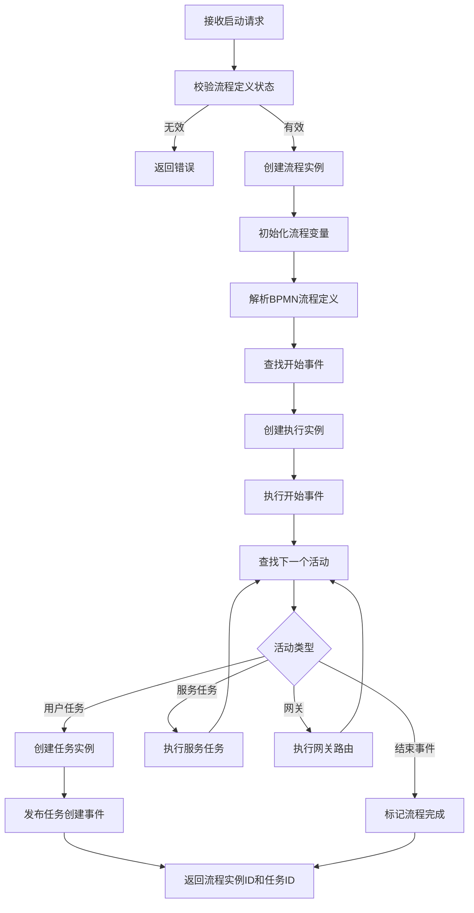

---

### 4.2 任务分配算法流程

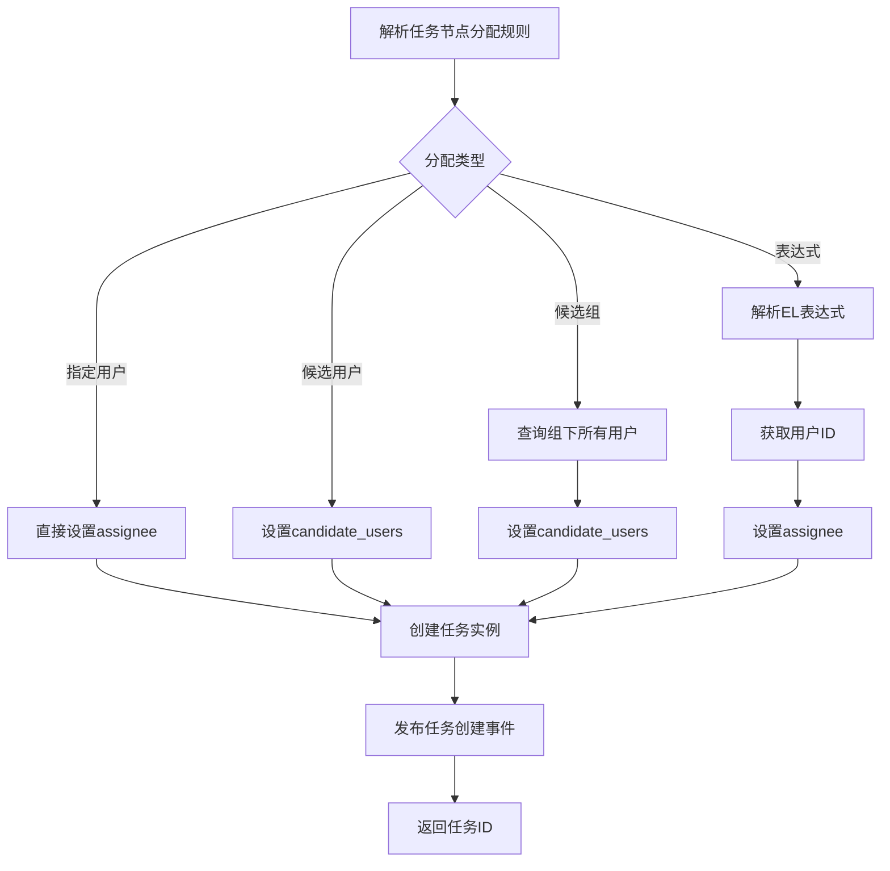

---

### 4.3 排他网关执行流程

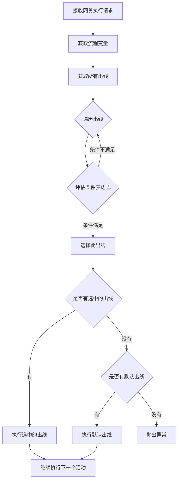

---

### 4.4 并行网关执行流程

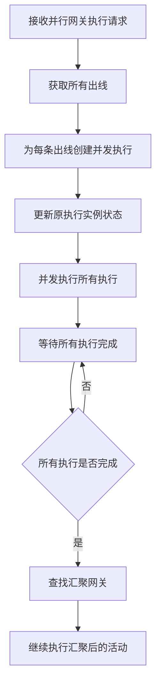

---

### 4.5 包容网关执行流程

包容网关（Inclusive Gateway）也称为 OR 网关，是排他网关和并行网关的结合体。它可以根据条件选择一个或多个分支执行，同时在汇聚时等待所有激活的分支完成。

#### 4.5.1 包容网关特性

| 特性 | 描述 |
|------|------|
| **分叉行为** | 评估所有出线条件，选择所有条件为真的分支并行执行 |
| **汇聚行为** | 等待所有能够到达该网关的执行全部到达后才继续 |
| **默认出线** | 当没有条件满足时，可以选择执行默认出线 |
| **条件表达式** | 支持UEL表达式、JavaScript表达式等 |

#### 4.5.2 分叉包容网关执行流程

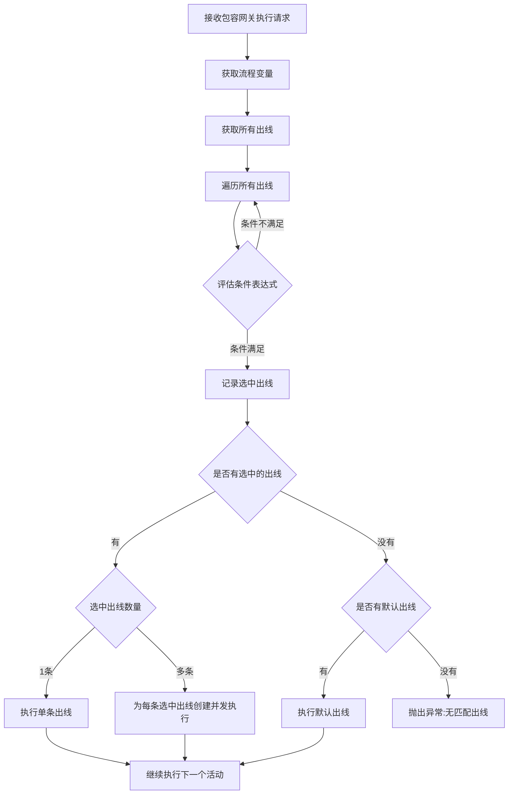

#### 4.5.3 汇聚包容网关执行流程

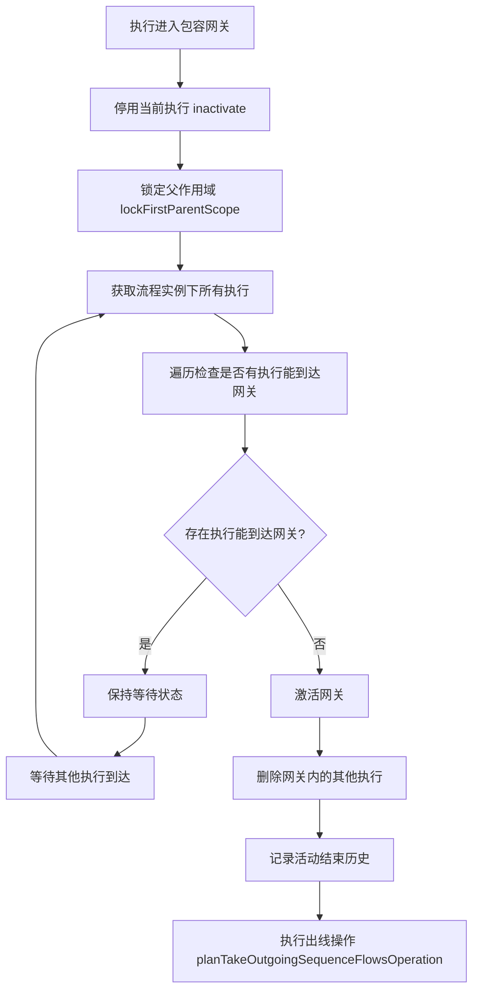

#### 4.5.4 TypeScript 实现

```typescript
// inclusive-gateway.executor.ts
import { Injectable } from '@nestjs/common';
import { ExecutionEntity } from '../entities/execution.entity';
import { BpmnGateway, BpmnSequenceFlow } from '../interfaces/bpmn.interface';
import { ExpressionEvaluatorService } from './expression-evaluator.service';
import { ExecutionService } from './execution.service';
import { BusinessException } from '../exceptions/business.exception';

@Injectable()
export class InclusiveGatewayExecutorService {
  constructor(
    private readonly expressionEvaluator: ExpressionEvaluatorService,
    private readonly executionService: ExecutionService,
  ) {}

  /**
   * 执行包容网关分叉逻辑
   * @param execution 当前执行实例
   * @param gateway 网关定义
   */
  async executeFork(execution: ExecutionEntity, gateway: BpmnGateway): Promise<void> {
    // 1. 获取流程变量
    const variables = await this.executionService.getVariables(execution.processInstanceId);
    
    // 2. 获取所有出线
    const outgoingFlows = gateway.outgoing || [];
    
    // 3. 评估所有条件，收集满足条件的出线
    const selectedFlows: BpmnSequenceFlow[] = [];
    let defaultFlow: BpmnSequenceFlow | null = null;
    
    for (const flow of outgoingFlows) {
      // 检查是否是默认出线
      if (flow.id === gateway.default) {
        defaultFlow = flow;
        continue;
      }
      
      // 评估条件表达式
      if (flow.conditionExpression) {
        const result = await this.expressionEvaluator.evaluate(
          flow.conditionExpression,
          variables,
        );
        if (result === true) {
          selectedFlows.push(flow);
        }
      } else {
        // 无条件的出线默认选中
        selectedFlows.push(flow);
      }
    }
    
    // 4. 如果没有匹配的出线，使用默认出线
    if (selectedFlows.length === 0) {
      if (defaultFlow) {
        selectedFlows.push(defaultFlow);
      } else {
        throw new BusinessException('包容网关没有匹配的出线');
      }
    }
    
    // 5. 根据选中的出线数量决定执行策略
    if (selectedFlows.length === 1) {
      // 单条出线，直接执行
      await this.executionService.takeOutgoingFlow(execution, selectedFlows[0]);
    } else {
      // 多条出线，创建并发执行
      await this.createConcurrentExecutions(execution, selectedFlows);
    }
  }

  /**
   * 执行包容网关汇聚逻辑
   * @param execution 当前执行实例
   * @param gateway 网关定义
   */
  async executeJoin(execution: ExecutionEntity, gateway: BpmnGateway): Promise<void> {
    // 1. 停用当前执行
    execution.isActive = false;
    await this.executionService.save(execution);
    
    // 2. 锁定父作用域（防止并发问题）
    await this.lockFirstParentScope(execution);
    
    // 3. 检查是否所有能到达网关的执行都已到达
    const canActivate = await this.checkAllExecutionsArrived(execution, gateway);
    
    if (canActivate) {
      // 4. 激活网关
      await this.activateGateway(execution, gateway);
    }
    // 否则保持等待状态
  }

  /**
   * 创建并发执行实例
   */
  private async createConcurrentExecutions(
    execution: ExecutionEntity,
    flows: BpmnSequenceFlow[],
  ): Promise<void> {
    const parentExecution = await this.executionService.findById(execution.parentId);
    
    for (let i = 0; i < flows.length; i++) {
      const flow = flows[i];
      
      if (i === 0) {
        // 第一条出线使用原执行
        await this.executionService.takeOutgoingFlow(execution, flow);
      } else {
        // 其他出线创建新的并发执行
        const concurrentExecution = await this.executionService.create({
          processInstanceId: execution.processInstanceId,
          parentId: execution.parentId,
          activityId: execution.activityId,
          isActive: true,
          isConcurrent: true,
          isScope: false,
        });
        
        await this.executionService.takeOutgoingFlow(concurrentExecution, flow);
      }
    }
  }

  /**
   * 检查所有能到达网关的执行是否都已到达
   */
  private async checkAllExecutionsArrived(
    execution: ExecutionEntity,
    gateway: BpmnGateway,
  ): Promise<boolean> {
    // 获取流程实例下所有执行
    const allExecutions = await this.executionService.findByProcessInstanceId(
      execution.processInstanceId,
    );
    
    // 检查是否有执行能够到达当前网关
    for (const exec of allExecutions) {
      // 跳过当前执行
      if (exec.id === execution.id) {
        continue;
      }
      
      // 跳过已在网关中的执行
      if (exec.activityId === gateway.id) {
        // 如果执行是活跃的，说明还未被处理
        if (exec.isActive) {
          return false;
        }
        continue;
      }
      
      // 检查执行是否在同一执行路径上（同一父执行）
      if (exec.parentId !== execution.parentId) {
        continue;
      }
      
      // 检查执行是否能到达当前网关（通过流程图分析）
      const canReach = await this.isReachable(
        execution.processDefinitionId,
        exec.activityId,
        gateway.id,
      );
      
      if (canReach) {
        return false;
      }
    }
    
    return true;
  }

  /**
   * 激活网关并继续执行
   */
  private async activateGateway(
    execution: ExecutionEntity,
    gateway: BpmnGateway,
  ): Promise<void> {
    // 1. 删除网关内的其他执行（汇聚）
    const executionsInGateway = await this.executionService.findInactiveByActivityId(
      execution.processInstanceId,
      gateway.id,
    );
    
    for (const execInGateway of executionsInGateway) {
      if (execInGateway.id !== execution.id &&
          execInGateway.parentId === execution.parentId) {
        await this.executionService.delete(execInGateway.id);
      }
    }
    
    // 2. 激活当前执行
    execution.isActive = true;
    await this.executionService.save(execution);
    
    // 3. 执行出线
    await this.executionService.takeOutgoingFlows(execution, true);
  }

  /**
   * 锁定父作用域
   */
  private async lockFirstParentScope(execution: ExecutionEntity): Promise<void> {
    let currentExecution = execution;
    
    while (currentExecution.parentId) {
      const parentExecution = await this.executionService.findById(currentExecution.parentId);
      
      if (parentExecution && parentExecution.isScope) {
        // 强制更新以获取锁
        await this.executionService.touch(parentExecution.id);
        return;
      }
      
      currentExecution = parentExecution;
    }
  }

  /**
   * 检查从源活动是否能到达目标活动
   */
  private async isReachable(
    processDefinitionId: string,
    sourceActivityId: string,
    targetActivityId: string,
  ): Promise<boolean> {
    // 这里需要实现流程图遍历算法
    // 检查从 sourceActivityId 是否存在路径到达 targetActivityId
    // 实际实现需要解析 BPMN 流程定义并进行图遍历
    
    // 简化实现：使用缓存的前驱节点映射
    const reachableCache = await this.getReachableCache(processDefinitionId);
    const reachableNodes = reachableCache.get(sourceActivityId) || new Set();
    
    return reachableNodes.has(targetActivityId);
  }

  /**
   * 获取可达性缓存
   */
  private async getReachableCache(processDefinitionId: string): Promise<Map<string, Set<string>>> {
    // 实际实现应该使用缓存
    // 这里返回一个空的 Map 作为示例
    return new Map();
  }
}
```

#### 4.5.5 包容网关执行器服务

```typescript
// gateway-executor.service.ts
@Injectable()
export class GatewayExecutorService {
  constructor(
    private readonly exclusiveGatewayExecutor: ExclusiveGatewayExecutorService,
    private readonly parallelGatewayExecutor: ParallelGatewayExecutorService,
    private readonly inclusiveGatewayExecutor: InclusiveGatewayExecutorService,
  ) {}

  async executeGateway(execution: ExecutionEntity, gateway: BpmnGateway): Promise<void> {
    switch (gateway.type) {
      case 'exclusive':
        await this.exclusiveGatewayExecutor.execute(execution, gateway);
        break;
      case 'parallel':
        await this.parallelGatewayExecutor.execute(execution, gateway);
        break;
      case 'inclusive':
        // 判断是分叉还是汇聚
        if (this.isForkGateway(gateway)) {
          await this.inclusiveGatewayExecutor.executeFork(execution, gateway);
        } else {
          await this.inclusiveGatewayExecutor.executeJoin(execution, gateway);
        }
        break;
      default:
        throw new BusinessException(`不支持的网关类型: ${gateway.type}`);
    }
  }

  private isForkGateway(gateway: BpmnGateway): boolean {
    // 根据入线和出线数量判断
    const incomingCount = gateway.incoming?.length || 0;
    const outgoingCount = gateway.outgoing?.length || 0;
    
    // 单入多出为分叉，多入单出为汇聚
    // 多入多出为混合网关（需要特殊处理）
    return incomingCount <= 1 && outgoingCount > 1;
  }
}
```

#### 4.5.6 包容网关数据库实体

```typescript
// inclusive-gateway-state.entity.ts
@Entity('inclusive_gateway_state')
export class InclusiveGatewayStateEntity {
  @PrimaryColumn({ length: 64 })
  id_: string;

  @Column({ length: 64 })
  execution_id_: string;

  @Column({ length: 64 })
  process_instance_id_: string;

  @Column({ length: 255 })
  gateway_id_: string;

  @Column({ length: 255 })
  gateway_name_: string;

  @Column({ type: 'int' })
  total_joins_: number; // 需要汇聚的总数

  @Column({ type: 'int', default: 0 })
  current_joins_: number; // 当前已汇聚数

  @Column({ type: 'datetime' })
  create_time_: Date;

  @Column({ type: 'datetime', nullable: true })
  complete_time_: Date;
}
```

#### 4.5.7 包容网关使用示例

**BPMN XML 示例**：
```xml
<definitions xmlns="http://www.omg.org/spec/BPMN/20100524/MODEL">
  <process id="inclusiveGatewayExample" name="包容网关示例">
    
    <!-- 开始事件 -->
    <startEvent id="start" name="开始"/>
    
    <!-- 包容网关（分叉） -->
    <inclusiveGateway id="forkGateway" name="包容网关-分叉" default="defaultFlow">
      <extensionElements>
        <activiti:executionListener event="start" class="com.example.GatewayListener"/>
      </extensionElements>
    </inclusiveGateway>
    
    <!-- 条件分支 -->
    <sequenceFlow id="flow1" sourceRef="forkGateway" targetRef="task1">
      <conditionExpression xsi:type="tFormalExpression">${amount > 10000}</conditionExpression>
    </sequenceFlow>
    
    <sequenceFlow id="flow2" sourceRef="forkGateway" targetRef="task2">
      <conditionExpression xsi:type="tFormalExpression">${amount > 5000}</conditionExpression>
    </sequenceFlow>
    
    <sequenceFlow id="flow3" sourceRef="forkGateway" targetRef="task3">
      <conditionExpression xsi:type="tFormalExpression">${urgent == true}</conditionExpression>
    </sequenceFlow>
    
    <sequenceFlow id="defaultFlow" sourceRef="forkGateway" targetRef="task4"/>
    
    <!-- 用户任务 -->
    <userTask id="task1" name="财务审批"/>
    <userTask id="task2" name="经理审批"/>
    <userTask id="task3" name="加急处理"/>
    <userTask id="task4" name="普通审批"/>
    
    <!-- 包容网关（汇聚） -->
    <inclusiveGateway id="joinGateway" name="包容网关-汇聚"/>
    
    <!-- 结束事件 -->
    <endEvent id="end" name="结束"/>
    
    <!-- 连接线 -->
    <sequenceFlow id="s1" sourceRef="start" targetRef="forkGateway"/>
    <sequenceFlow id="s2" sourceRef="task1" targetRef="joinGateway"/>
    <sequenceFlow id="s3" sourceRef="task2" targetRef="joinGateway"/>
    <sequenceFlow id="s4" sourceRef="task3" targetRef="joinGateway"/>
    <sequenceFlow id="s5" sourceRef="task4" targetRef="joinGateway"/>
    <sequenceFlow id="s6" sourceRef="joinGateway" targetRef="end"/>
    
  </process>
</definitions>
```

**执行场景说明**：

| 变量值 | 激活分支 | 说明 |
|--------|----------|------|
| `amount=15000, urgent=true` | task1, task2, task3 | 三个条件都满足 |
| `amount=8000, urgent=false` | task2 | 只有第二个条件满足 |
| `amount=3000, urgent=false` | task4 | 无条件满足，走默认分支 |
| `amount=6000, urgent=true` | task2, task3 | 两个条件满足 |

---

### 4.6 子流程和嵌套子流程设计

子流程是 BPMN 2.0 中的重要概念，用于将复杂的业务流程分解为更小、更可管理的单元。Flowable 支持多种类型的子流程，本节将详细说明各类子流程的设计和实现。

#### 4.6.1 子流程类型概述

| 子流程类型 | 英文名称 | 描述 | 使用场景 |
|-----------|---------|------|---------|
| **内嵌子流程** | Embedded SubProcess | 在父流程内部定义的子流程，共享同一流程定义 | 将复杂流程分解为逻辑单元 |
| **调用活动** | Call Activity | 调用外部独立的流程定义，创建新的流程实例 | 复用通用流程、跨流程调用 |
| **事件子流程** | Event SubProcess | 由事件触发的子流程，可中断或非中断主流程 | 异常处理、补偿逻辑 |
| **事务子流程** | Transaction SubProcess | 具有事务特性的子流程，支持提交/回滚 | 需要原子性操作的业务 |

#### 4.6.2 内嵌子流程（Embedded SubProcess）

内嵌子流程是在父流程定义内部定义的，与父流程共享同一个流程定义和流程实例。

##### 执行流程图

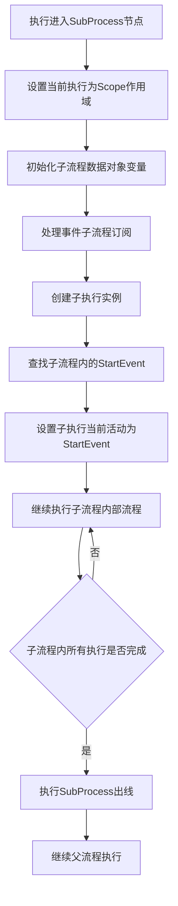

##### TypeScript 实现

```typescript
// subprocess.executor.ts
import { Injectable } from '@nestjs/common';
import { ExecutionEntity } from '../entities/execution.entity';
import { BpmnSubProcess, BpmnStartEvent, FlowElement } from '../interfaces/bpmn.interface';
import { ExecutionService } from './execution.service';
import { ProcessInstanceHelperService } from './process-instance-helper.service';
import { BusinessException } from '../exceptions/business.exception';

@Injectable()
export class SubProcessExecutorService {
  constructor(
    private readonly executionService: ExecutionService,
    private readonly processInstanceHelper: ProcessInstanceHelperService,
  ) {}

  /**
   * 执行内嵌子流程
   * @param execution 当前执行实例
   * @param subProcess 子流程定义
   */
  async execute(execution: ExecutionEntity, subProcess: BpmnSubProcess): Promise<void> {
    // 1. 查找子流程内的起始事件
    const startEvent = this.findStartEvent(subProcess);
    if (!startEvent) {
      throw new BusinessException(`子流程 ${subProcess.id} 没有找到起始事件`);
    }

    // 2. 设置当前执行为 Scope 作用域
    execution.isScope = true;
    await this.executionService.save(execution);

    // 3. 初始化子流程数据对象变量
    const dataObjectVars = this.processDataObjects(subProcess.dataObjects || []);
    if (Object.keys(dataObjectVars).length > 0) {
      await this.executionService.setVariablesLocal(execution.id, dataObjectVars);
    }

    // 4. 处理事件子流程（如果存在）
    await this.processInstanceHelper.processAvailableEventSubProcesses(
      execution,
      subProcess,
    );

    // 5. 创建子执行实例
    const childExecution = await this.executionService.create({
      processInstanceId: execution.processInstanceId,
      parentId: execution.id,
      activityId: startEvent.id,
      activityType: 'startEvent',
      isActive: true,
      isConcurrent: false,
      isScope: false,
      currentFlowElement: startEvent,
    });

    // 6. 继续执行子流程
    await this.executionService.continueProcess(childExecution);
  }

  /**
   * 查找子流程内的起始事件
   */
  private findStartEvent(subProcess: BpmnSubProcess): BpmnStartEvent | null {
    const flowElements = subProcess.flowElements || [];
    for (const element of flowElements) {
      if (element.$type === 'bpmn:StartEvent') {
        // 内嵌子流程只允许无事件定义的起始事件
        const startEvent = element as BpmnStartEvent;
        if (!startEvent.eventDefinitions || startEvent.eventDefinitions.length === 0) {
          return startEvent;
        }
      }
    }
    return null;
  }

  /**
   * 处理数据对象
   */
  private processDataObjects(dataObjects: any[]): Record<string, any> {
    const variables: Record<string, any> = {};
    for (const dataObject of dataObjects) {
      if (dataObject.name && dataObject.value !== undefined) {
        variables[dataObject.name] = dataObject.value;
      }
    }
    return variables;
  }

  /**
   * 子流程完成时的处理
   */
  async complete(execution: ExecutionEntity, subProcess: BpmnSubProcess): Promise<void> {
    // 1. 清理子流程作用域内的所有执行
    const childExecutions = await this.executionService.findByParentId(execution.id);
    for (const child of childExecutions) {
      await this.executionService.delete(child.id);
    }

    // 2. 清理事件子流程订阅
    await this.cleanupEventSubProcessSubscriptions(execution);

    // 3. 执行子流程的出线
    await this.executionService.takeOutgoingFlows(execution, true);
  }

  /**
   * 清理事件子流程订阅
   */
  private async cleanupEventSubProcessSubscriptions(execution: ExecutionEntity): Promise<void> {
    // 实际实现需要删除与该执行相关的事件订阅
  }
}
```

##### 数据库实体设计

```typescript
// execution.entity.ts 中的子流程相关字段
@Entity('execution')
export class ExecutionEntity {
  // ... 其他字段

  @Column({ name: 'is_scope', type: 'tinyint', width: 1, default: 0 })
  isScope: boolean; // 标识是否为作用域执行（子流程）

  @Column({ name: 'scope_id', length: 64, nullable: true })
  scopeId: string; // 作用域ID（子流程ID）

  // 父子关系
  @ManyToOne(() => ExecutionEntity, execution => execution.children)
  @JoinColumn({ name: 'parent_id' })
  parent: ExecutionEntity;

  @OneToMany(() => ExecutionEntity, execution => execution.parent)
  children: ExecutionEntity[];
}
```

#### 4.6.3 调用活动（Call Activity）

调用活动用于调用外部独立的流程定义，会创建一个新的流程实例（子流程实例），与父流程实例建立关联关系。

##### 执行流程图

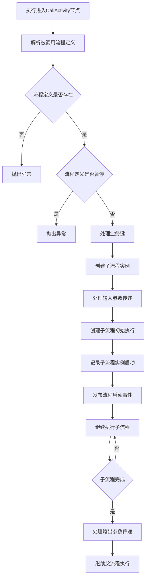

##### TypeScript 实现

```typescript
// call-activity.executor.ts
import { Injectable } from '@nestjs/common';
import { ExecutionEntity } from '../entities/execution.entity';
import { ProcessInstanceEntity } from '../entities/process-instance.entity';
import { BpmnCallActivity, BpmnIOParameter } from '../interfaces/bpmn.interface';
import { ProcessDefinitionService } from './process-definition.service';
import { ProcessInstanceService } from './process-instance.service';
import { ExecutionService } from './execution.service';
import { ExpressionEvaluatorService } from './expression-evaluator.service';
import { EntityLinkService } from './entity-link.service';
import { BusinessException } from '../exceptions/business.exception';

@Injectable()
export class CallActivityExecutorService {
  constructor(
    private readonly processDefinitionService: ProcessDefinitionService,
    private readonly processInstanceService: ProcessInstanceService,
    private readonly executionService: ExecutionService,
    private readonly expressionEvaluator: ExpressionEvaluatorService,
    private readonly entityLinkService: EntityLinkService,
  ) {}

  /**
   * 执行调用活动
   * @param execution 当前执行实例
   * @param callActivity 调用活动定义
   */
  async execute(execution: ExecutionEntity, callActivity: BpmnCallActivity): Promise<void> {
    // 1. 获取被调用的流程定义
    const processDefinition = await this.getProcessDefinition(execution, callActivity);
    
    // 2. 检查流程定义状态
    if (processDefinition.isSuspended) {
      throw new BusinessException(
        `流程定义 ${processDefinition.name} 已暂停，无法启动`,
      );
    }

    // 3. 处理业务键
    const businessKey = await this.resolveBusinessKey(execution, callActivity);

    // 4. 创建子流程实例
    const subProcessInstance = await this.processInstanceService.createSubProcessInstance({
      processDefinitionId: processDefinition.id,
      superProcessInstanceId: execution.processInstanceId,
      superExecutionId: execution.id,
      callActivityId: callActivity.id,
      businessKey,
      startUserId: execution.startUserId,
      tenantId: execution.tenantId,
    });

    // 5. 处理输入参数（从父流程传递到子流程）
    await this.processInParameters(
      execution,
      subProcessInstance,
      callActivity.inParameters || [],
    );

    // 6. 处理变量继承
    if (callActivity.inheritVariables) {
      const parentVariables = await this.executionService.getVariables(execution.id);
      await this.processInstanceService.setVariables(
        subProcessInstance.id,
        parentVariables,
      );
    }

    // 7. 创建实体链接（如果启用）
    if (callActivity.enableEntityLinks) {
      await this.entityLinkService.createEntityLink({
        rootScopeId: execution.processInstanceId,
        rootScopeType: 'bpmn',
        parentScopeId: execution.id,
        parentScopeType: 'bpmn',
        childScopeId: subProcessInstance.id,
        childScopeType: 'bpmn',
        linkType: 'child',
      });
    }

    // 8. 保存子流程实例ID到父流程变量
    if (callActivity.processInstanceIdVariableName) {
      await this.executionService.setVariable(
        execution.id,
        callActivity.processInstanceIdVariableName,
        subProcessInstance.id,
      );
    }

    // 9. 启动子流程执行
    await this.processInstanceService.startSubProcessExecution(subProcessInstance);

    // 10. 发布事件
    await this.publishSubProcessStartedEvent(execution, subProcessInstance);
  }

  /**
   * 获取被调用的流程定义
   */
  private async getProcessDefinition(
    execution: ExecutionEntity,
    callActivity: BpmnCallActivity,
  ): Promise<ProcessDefinition> {
    const calledElement = await this.resolveCalledElement(execution, callActivity);
    
    switch (callActivity.calledElementType) {
      case 'key':
        return this.processDefinitionService.findByKey(
          calledElement,
          execution.tenantId,
          callActivity.fallbackToDefaultTenant,
        );
      case 'id':
        return this.processDefinitionService.findById(calledElement);
      default:
        throw new BusinessException(`不支持的调用元素类型: ${callActivity.calledElementType}`);
    }
  }

  /**
   * 解析被调用元素
   */
  private async resolveCalledElement(
    execution: ExecutionEntity,
    callActivity: BpmnCallActivity,
  ): Promise<string> {
    const calledElement = callActivity.calledElement;
    
    // 支持表达式
    if (this.isExpression(calledElement)) {
      const variables = await this.executionService.getVariables(execution.id);
      return this.expressionEvaluator.evaluate(calledElement, variables);
    }
    
    return calledElement;
  }

  /**
   * 解析业务键
   */
  private async resolveBusinessKey(
    execution: ExecutionEntity,
    callActivity: BpmnCallActivity,
  ): Promise<string | null> {
    // 显式指定业务键
    if (callActivity.businessKey) {
      const variables = await this.executionService.getVariables(execution.id);
      return this.expressionEvaluator.evaluate(callActivity.businessKey, variables);
    }
    
    // 继承父流程业务键
    if (callActivity.inheritBusinessKey) {
      const parentInstance = await this.processInstanceService.findById(
        execution.processInstanceId,
      );
      return parentInstance?.businessKey || null;
    }
    
    return null;
  }

  /**
   * 处理输入参数
   */
  private async processInParameters(
    sourceExecution: ExecutionEntity,
    targetInstance: ProcessInstanceEntity,
    inParameters: BpmnIOParameter[],
  ): Promise<void> {
    const sourceVariables = await this.executionService.getVariables(sourceExecution.id);
    const targetVariables: Record<string, any> = {};

    for (const param of inParameters) {
      const value = param.source
        ? sourceVariables[param.source]
        : this.expressionEvaluator.evaluate(param.sourceExpression, sourceVariables);
      
      const targetName = param.target || param.name;
      if (targetName && value !== undefined) {
        targetVariables[targetName] = value;
      }
    }

    if (Object.keys(targetVariables).length > 0) {
      await this.processInstanceService.setVariables(targetInstance.id, targetVariables);
    }
  }

  /**
   * 子流程完成时的处理
   */
  async completing(
    execution: ExecutionEntity,
    subProcessInstance: ProcessInstanceEntity,
    callActivity: BpmnCallActivity,
  ): Promise<void> {
    // 处理输出参数（从子流程传递到父流程）
    await this.processOutParameters(
      subProcessInstance,
      execution,
      callActivity.outParameters || [],
    );
  }

  /**
   * 处理输出参数
   */
  private async processOutParameters(
    sourceInstance: ProcessInstanceEntity,
    targetExecution: ExecutionEntity,
    outParameters: BpmnIOParameter[],
  ): Promise<void> {
    const sourceVariables = await this.processInstanceService.getVariables(sourceInstance.id);

    for (const param of outParameters) {
      const value = param.source
        ? sourceVariables[param.source]
        : this.expressionEvaluator.evaluate(param.sourceExpression, sourceVariables);
      
      const targetName = param.target || param.name;
      if (targetName && value !== undefined) {
        if (param.useLocalScope) {
          await this.executionService.setVariableLocal(targetExecution.id, targetName, value);
        } else {
          await this.executionService.setVariable(targetExecution.id, targetName, value);
        }
      }
    }
  }

  /**
   * 子流程完成后的处理
   */
  async completed(execution: ExecutionEntity): Promise<void> {
    // 继续执行父流程
    await this.executionService.takeOutgoingFlows(execution, true);
  }

  /**
   * 检查是否为表达式
   */
  private isExpression(value: string): boolean {
    return /^\$\{.+\}$/.test(value) || /^\#\{.+\}$/.test(value);
  }

  /**
   * 发布子流程启动事件
   */
  private async publishSubProcessStartedEvent(
    parentExecution: ExecutionEntity,
    subProcessInstance: ProcessInstanceEntity,
  ): Promise<void> {
    // 实际实现需要发布事件到事件总线
  }
}
```

##### 数据库实体设计

```typescript
// process-instance.entity.ts 中的子流程相关字段
@Entity('process_instance')
export class ProcessInstanceEntity {
  // ... 其他字段

  @Column({ name: 'super_process_instance_id', length: 64, nullable: true })
  superProcessInstanceId: string; // 父流程实例ID

  @Column({ name: 'super_execution_id', length: 64, nullable: true })
  superExecutionId: string; // 父执行ID（CallActivity对应的执行）

  @Column({ name: 'call_activity_id', length: 64, nullable: true })
  callActivityId: string; // 调用活动ID

  // 关联关系
  @ManyToOne(() => ProcessInstanceEntity)
  @JoinColumn({ name: 'super_process_instance_id' })
  superProcessInstance: ProcessInstanceEntity;

  @OneToMany(() => ProcessInstanceEntity, pi => pi.superProcessInstance)
  subProcessInstances: ProcessInstanceEntity[];
}
```

#### 4.6.4 事件子流程（Event SubProcess）

事件子流程是一种特殊的子流程，由事件触发而不是通过顺序流进入。它通常用于异常处理、补偿逻辑等场景。

##### 事件子流程类型

| 触发事件类型 | 行为描述 | 中断类型 |
|------------|---------|---------|
| **错误事件** | 捕获流程中的BPMN错误 | 总是中断 |
| **定时器事件** | 定时触发子流程 | 可配置 |
| **信号事件** | 响应信号广播 | 可配置 |
| **消息事件** | 响应消息接收 | 可配置 |
| **条件事件** | 条件满足时触发 | 可配置 |
| **升级事件** | 响应升级信号 | 可配置 |

##### 执行流程图

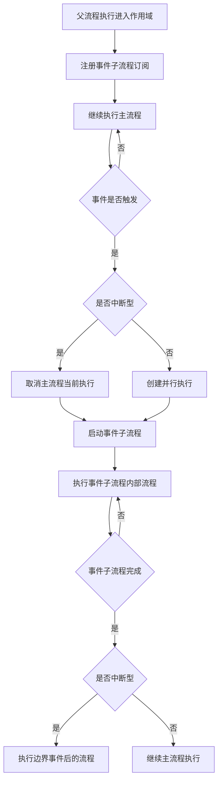

##### TypeScript 实现

```typescript
// event-subprocess.executor.ts
import { Injectable } from '@nestjs/common';
import { ExecutionEntity } from '../entities/execution.entity';
import { BpmnEventSubProcess, BpmnStartEvent, BpmnEventDefinition } from '../interfaces/bpmn.interface';
import { ExecutionService } from './execution.service';
import { EventSubscriptionService } from './event-subscription.service';

@Injectable()
export class EventSubProcessExecutorService {
  constructor(
    private readonly executionService: ExecutionService,
    private readonly eventSubscriptionService: EventSubscriptionService,
  ) {}

  /**
   * 处理可用的事件子流程
   * @param execution 当前执行实例
   * @param scope 作用域（流程或子流程）
   */
  async processAvailableEventSubProcesses(
    execution: ExecutionEntity,
    scope: any,
  ): Promise<void> {
    const eventSubProcesses = this.findEventSubProcesses(scope);
    
    for (const eventSubProcess of eventSubProcesses) {
      const startEvents = this.findStartEvents(eventSubProcess);
      
      for (const startEvent of startEvents) {
        await this.createEventSubscription(execution, eventSubProcess, startEvent);
      }
    }
  }

  /**
   * 查找事件子流程
   */
  private findEventSubProcesses(scope: any): BpmnEventSubProcess[] {
    const flowElements = scope.flowElements || [];
    return flowElements.filter(
      element => element.$type === 'bpmn:SubProcess' && element.triggeredByEvent
    ) as BpmnEventSubProcess[];
  }

  /**
   * 查找事件子流程的起始事件
   */
  private findStartEvents(eventSubProcess: BpmnEventSubProcess): BpmnStartEvent[] {
    const flowElements = eventSubProcess.flowElements || [];
    return flowElements.filter(
      element => element.$type === 'bpmn:StartEvent'
    ) as BpmnStartEvent[];
  }

  /**
   * 创建事件订阅
   */
  private async createEventSubscription(
    execution: ExecutionEntity,
    eventSubProcess: BpmnEventSubProcess,
    startEvent: BpmnStartEvent,
  ): Promise<void> {
    const eventDefinitions = startEvent.eventDefinitions || [];
    
    for (const eventDef of eventDefinitions) {
      const subscription = await this.eventSubscriptionService.create({
        executionId: execution.id,
        processInstanceId: execution.processInstanceId,
        activityId: eventSubProcess.id,
        eventType: this.getEventType(eventDef),
        eventName: this.getEventName(eventDef),
        configuration: JSON.stringify({
          subProcessId: eventSubProcess.id,
          startEventId: startEvent.id,
          isInterrupting: startEvent.isInterrupting !== false,
        }),
      });
    }
  }

  /**
   * 触发事件子流程
   */
  async triggerEventSubProcess(
    execution: ExecutionEntity,
    eventSubscription: any,
  ): Promise<void> {
    const config = JSON.parse(eventSubscription.configuration);
    const isInterrupting = config.isInterrupting;

    if (isInterrupting) {
      // 中断型：取消当前作用域内的所有执行
      await this.cancelCurrentScopeExecutions(execution);
    }

    // 创建事件子流程执行
    const subProcessExecution = await this.executionService.create({
      processInstanceId: execution.processInstanceId,
      parentId: execution.id,
      activityId: config.subProcessId,
      activityType: 'subProcess',
      isActive: true,
      isScope: true,
      isConcurrent: !isInterrupting,
    });

    // 启动事件子流程内部执行
    const startExecution = await this.executionService.create({
      processInstanceId: execution.processInstanceId,
      parentId: subProcessExecution.id,
      activityId: config.startEventId,
      activityType: 'startEvent',
      isActive: true,
    });

    await this.executionService.continueProcess(startExecution);
  }

  /**
   * 取消当前作用域内的执行
   */
  private async cancelCurrentScopeExecutions(execution: ExecutionEntity): Promise<void> {
    const siblingExecutions = await this.executionService.findByParentId(execution.parentId);
    
    for (const sibling of siblingExecutions) {
      if (sibling.id !== execution.id && sibling.isActive) {
        await this.executionService.delete(sibling.id);
      }
    }
  }

  /**
   * 获取事件类型
   */
  private getEventType(eventDef: BpmnEventDefinition): string {
    const typeMap: Record<string, string> = {
      'bpmn:TimerEventDefinition': 'timer',
      'bpmn:MessageEventDefinition': 'message',
      'bpmn:SignalEventDefinition': 'signal',
      'bpmn:ErrorEventDefinition': 'error',
      'bpmn:ConditionalEventDefinition': 'conditional',
      'bpmn:EscalationEventDefinition': 'escalation',
    };
    return typeMap[eventDef.$type] || 'unknown';
  }

  /**
   * 获取事件名称
   */
  private getEventName(eventDef: BpmnEventDefinition): string {
    return eventDef.timerDefinition?.id ||
           eventDef.messageRef?.name ||
           eventDef.signalRef?.name ||
           eventDef.errorRef?.errorCode ||
           eventDef.escalationRef?.name ||
           '';
  }
}
```

#### 4.6.5 变量作用域管理

子流程执行时需要正确管理变量的作用域，确保变量在正确的作用域内可见。

##### 变量作用域规则

| 变量类型 | 作用域 | 可见性 | 生命周期 |
|---------|-------|--------|---------|
| **流程变量** | 整个流程实例 | 所有执行可见 | 流程实例生命周期 |
| **局部变量** | 单个执行 | 仅当前执行可见 | 执行生命周期 |
| **子流程变量** | 子流程作用域 | 子流程内可见 | 子流程生命周期 |

##### TypeScript 实现

```typescript
// variable-scope.service.ts
import { Injectable } from '@nestjs/common';
import { VariableService } from './variable.service';
import { ExecutionService } from './execution.service';

@Injectable()
export class VariableScopeService {
  constructor(
    private readonly variableService: VariableService,
    private readonly executionService: ExecutionService,
  ) {}

  /**
   * 获取变量（向上查找作用域）
   */
  async getVariable(executionId: string, variableName: string): Promise<any> {
    // 1. 首先查找局部变量
    const localValue = await this.variableService.getLocalVariable(
      executionId,
      variableName,
    );
    if (localValue !== undefined) {
      return localValue;
    }

    // 2. 向上查找父执行
    const execution = await this.executionService.findById(executionId);
    if (execution.parentId) {
      return this.getVariable(execution.parentId, variableName);
    }

    // 3. 查找流程实例级别变量
    return this.variableService.getProcessVariable(
      execution.processInstanceId,
      variableName,
    );
  }

  /**
   * 获取所有可见变量
   */
  async getVisibleVariables(executionId: string): Promise<Record<string, any>> {
    const variables: Record<string, any> = {};
    
    // 收集流程实例级别变量
    const execution = await this.executionService.findById(executionId);
    const processVariables = await this.variableService.getProcessVariables(
      execution.processInstanceId,
    );
    Object.assign(variables, processVariables);

    // 收集执行链上的局部变量
    await this.collectParentVariables(executionId, variables);

    // 收集当前执行的局部变量
    const localVariables = await this.variableService.getLocalVariables(executionId);
    Object.assign(variables, localVariables);

    return variables;
  }

  /**
   * 递归收集父执行变量
   */
  private async collectParentVariables(
    executionId: string,
    variables: Record<string, any>,
  ): Promise<void> {
    const execution = await this.executionService.findById(executionId);
    
    if (execution.parentId) {
      const parentLocalVars = await this.variableService.getLocalVariables(
        execution.parentId,
      );
      
      // 父执行的局部变量不覆盖已收集的变量
      for (const [key, value] of Object.entries(parentLocalVars)) {
        if (!(key in variables)) {
          variables[key] = value;
        }
      }
      
      await this.collectParentVariables(execution.parentId, variables);
    }
  }

  /**
   * 设置变量到正确的作用域
   */
  async setVariable(
    executionId: string,
    variableName: string,
    value: any,
    localScope: boolean = false,
  ): Promise<void> {
    if (localScope) {
      await this.variableService.setLocalVariable(executionId, variableName, value);
    } else {
      const execution = await this.executionService.findById(executionId);
      await this.variableService.setProcessVariable(
        execution.processInstanceId,
        variableName,
        value,
      );
    }
  }
}
```

#### 4.6.6 子流程查询API

```typescript
// sub-process.query.service.ts
import { Injectable } from '@nestjs/common';
import { ProcessInstanceRepository } from '../repositories/process-instance.repository';

@Injectable()
export class SubProcessQueryService {
  constructor(
    private readonly processInstanceRepository: ProcessInstanceRepository,
  ) {}

  /**
   * 查询子流程实例
   */
  async findSubProcessInstances(superProcessInstanceId: string): Promise<ProcessInstanceEntity[]> {
    return this.processInstanceRepository.find({
      where: { superProcessInstanceId },
    });
  }

  /**
   * 查询父流程实例
   */
  async findSuperProcessInstance(subProcessInstanceId: string): Promise<ProcessInstanceEntity | null> {
    const subProcess = await this.processInstanceRepository.findOne({
      where: { id: subProcessInstanceId },
      relations: ['superProcessInstance'],
    });
    return subProcess?.superProcessInstance || null;
  }

  /**
   * 查询嵌套子流程层级
   */
  async findNestedSubProcessHierarchy(processInstanceId: string): Promise<ProcessInstanceHierarchy> {
    const hierarchy: ProcessInstanceHierarchy = {
      root: processInstanceId,
      children: [],
    };

    const subProcesses = await this.findSubProcessInstances(processInstanceId);
    
    for (const subProcess of subProcesses) {
      hierarchy.children.push(
        await this.findNestedSubProcessHierarchy(subProcess.id),
      );
    }

    return hierarchy;
  }

  /**
   * 查询完整的流程实例链
   */
  async findProcessInstanceChain(processInstanceId: string): Promise<ProcessInstanceEntity[]> {
    const chain: ProcessInstanceEntity[] = [];
    let currentInstance = await this.processInstanceRepository.findOne({
      where: { id: processInstanceId },
    });

    while (currentInstance) {
      chain.unshift(currentInstance);
      
      if (currentInstance.superProcessInstanceId) {
        currentInstance = await this.processInstanceRepository.findOne({
          where: { id: currentInstance.superProcessInstanceId },
        });
      } else {
        currentInstance = null;
      }
    }

    return chain;
  }
}

interface ProcessInstanceHierarchy {
  root: string;
  children: ProcessInstanceHierarchy[];
}
```

#### 4.6.7 BPMN XML 示例

##### 内嵌子流程示例

```xml
<definitions xmlns="http://www.omg.org/spec/BPMN/20100524/MODEL">
  <process id="embeddedSubProcessExample" name="内嵌子流程示例">
    
    <!-- 开始事件 -->
    <startEvent id="start" name="开始"/>
    
    <!-- 内嵌子流程 -->
    <subProcess id="subProcess1" name="审批子流程">
      <!-- 子流程内的数据对象 -->
      <dataObject id="approvalLevel" name="approvalLevel" value="1"/>
      
      <!-- 子流程内的起始事件 -->
      <startEvent id="subStart" name="子流程开始"/>
      
      <!-- 子流程内的用户任务 -->
      <userTask id="managerApproval" name="经理审批"/>
      <userTask id="directorApproval" name="总监审批"/>
      
      <!-- 子流程内的排他网关 -->
      <exclusiveGateway id="approvalGateway" name="审批网关"/>
      
      <!-- 子流程内的结束事件 -->
      <endEvent id="subEnd" name="子流程结束"/>
      
      <!-- 子流程内的连接线 -->
      <sequenceFlow id="sf1" sourceRef="subStart" targetRef="managerApproval"/>
      <sequenceFlow id="sf2" sourceRef="managerApproval" targetRef="approvalGateway"/>
      <sequenceFlow id="sf3" sourceRef="approvalGateway" targetRef="directorApproval">
        <conditionExpression>${approvalLevel > 1}</conditionExpression>
      </sequenceFlow>
      <sequenceFlow id="sf4" sourceRef="approvalGateway" targetRef="subEnd">
        <conditionExpression>${approvalLevel == 1}</conditionExpression>
      </sequenceFlow>
      <sequenceFlow id="sf5" sourceRef="directorApproval" targetRef="subEnd"/>
    </subProcess>
    
    <!-- 结束事件 -->
    <endEvent id="end" name="结束"/>
    
    <!-- 连接线 -->
    <sequenceFlow id="s1" sourceRef="start" targetRef="subProcess1"/>
    <sequenceFlow id="s2" sourceRef="subProcess1" targetRef="end"/>
    
  </process>
</definitions>
```

##### 调用活动示例

```xml
<definitions xmlns="http://www.omg.org/spec/BPMN/20100524/MODEL"
             xmlns:flowable="http://flowable.org/bpmn">
  <process id="callActivityExample" name="调用活动示例">
    
    <!-- 开始事件 -->
    <startEvent id="start" name="开始"/>
    
    <!-- 调用活动 -->
    <callActivity id="callSubProcess" name="调用审批流程"
                  calledElement="approvalProcess"
                  flowable:inheritVariables="true"
                  flowable:businessKey="${businessKey}">
      
      <!-- 输入参数 -->
      <extensionElements>
        <flowable:in source="parentVar" target="subVar"/>
        <flowable:in sourceExpression="${order.amount}" target="amount"/>
      </extensionElements>
      
      <!-- 输出参数 -->
      <flowable:out source="subResult" target="parentResult"/>
    </callActivity>
    
    <!-- 结束事件 -->
    <endEvent id="end" name="结束"/>
    
    <!-- 连接线 -->
    <sequenceFlow id="s1" sourceRef="start" targetRef="callSubProcess"/>
    <sequenceFlow id="s2" sourceRef="callSubProcess" targetRef="end"/>
    
  </process>
  
  <!-- 被调用的子流程定义 -->
  <process id="approvalProcess" name="审批流程">
    <startEvent id="subStart"/>
    <userTask id="approval" name="审批"/>
    <endEvent id="subEnd"/>
    <sequenceFlow id="sf1" sourceRef="subStart" targetRef="approval"/>
    <sequenceFlow id="sf2" sourceRef="approval" targetRef="subEnd"/>
  </process>
</definitions>
```

##### 事件子流程示例

```xml
<definitions xmlns="http://www.omg.org/spec/BPMN/20100524/MODEL">
  <process id="eventSubProcessExample" name="事件子流程示例">
    
    <!-- 开始事件 -->
    <startEvent id="start" name="开始"/>
    
    <!-- 主流程用户任务 -->
    <userTask id="mainTask" name="主任务"/>
    
    <!-- 事件子流程（错误处理） -->
    <subProcess id="errorSubProcess" name="错误处理" triggeredByEvent="true">
      <!-- 错误起始事件 -->
      <startEvent id="errorStart" name="捕获错误" isInterrupting="true">
        <errorEventDefinition errorRef="businessError"/>
      </startEvent>
      
      <!-- 错误处理任务 -->
      <userTask id="errorHandling" name="错误处理"/>
      
      <!-- 结束事件 -->
      <endEvent id="errorEnd" name="错误处理完成"/>
      
      <!-- 连接线 -->
      <sequenceFlow id="esf1" sourceRef="errorStart" targetRef="errorHandling"/>
      <sequenceFlow id="esf2" sourceRef="errorHandling" targetRef="errorEnd"/>
    </subProcess>
    
    <!-- 事件子流程（定时器监控） -->
    <subProcess id="timerSubProcess" name="定时监控" triggeredByEvent="true">
      <!-- 定时器起始事件 -->
      <startEvent id="timerStart" name="定时触发" isInterrupting="false">
        <timerEventDefinition>
          <timeCycle>0 0/5 * * * ?</timeCycle>
        </timerEventDefinition>
      </startEvent>
      
      <!-- 监控任务 -->
      <serviceTask id="monitorTask" name="执行监控"
                   flowable:class="com.example.MonitorTask"/>
      
      <!-- 结束事件 -->
      <endEvent id="timerEnd"/>
      
      <!-- 连接线 -->
      <sequenceFlow id="tsf1" sourceRef="timerStart" targetRef="monitorTask"/>
      <sequenceFlow id="tsf2" sourceRef="monitorTask" targetRef="timerEnd"/>
    </subProcess>
    
    <!-- 结束事件 -->
    <endEvent id="end" name="结束"/>
    
    <!-- 主流程连接线 -->
    <sequenceFlow id="s1" sourceRef="start" targetRef="mainTask"/>
    <sequenceFlow id="s2" sourceRef="mainTask" targetRef="end"/>
    
  </process>
  
  <!-- 错误定义 -->
  <error id="businessError" name="业务错误" errorCode="BIZ_001"/>
</definitions>
```

#### 4.6.8 子流程设计最佳实践

| 实践项 | 描述 | 原因 |
|-------|------|------|
| **控制嵌套层级** | 子流程嵌套不超过3层 | 避免执行栈过深，便于调试 |
| **合理使用变量作用域** | 明确变量是流程级还是局部级 | 避免变量污染和意外覆盖 |
| **事件子流程命名规范** | 使用清晰的命名标识事件子流程用途 | 提高可读性和可维护性 |
| **调用活动参数映射** | 显式定义输入输出参数 | 避免隐式传递导致的问题 |
| **错误处理设计** | 为关键子流程添加错误事件子流程 | 增强流程健壮性 |
| **事务边界** | 事务子流程内避免长时间操作 | 减少数据库锁持有时间 |

---

## 五、性能优化策略

### 5.1 数据层优化

#### 5.1.1 流程定义 XML 压缩存储

```typescript
// 压缩 BPMN XML
import * as zlib from 'zlib';

async function compressBpmnXml(bpmnXml: string): Promise<Buffer> {
  return new Promise((resolve, reject) => {
    zlib.gzip(bpmnXml, (err, compressed) => {
      if (err) reject(err);
      else resolve(compressed);
    });
  });
}

// 解压 BPMN XML
async function decompressBpmnXml(compressed: Buffer): Promise<string> {
  return new Promise((resolve, reject) => {
    zlib.gunzip(compressed, (err, decompressed) => {
      if (err) reject(err);
      else resolve(decompressed.toString());
    });
  });
}
```

#### 5.1.2 历史数据分表

```typescript
// 按时间分表
export class HistoryPartitionService {
  getHistoryTableName(baseName: string, date: Date): string {
    const year = date.getFullYear();
    const month = String(date.getMonth() + 1).padStart(2, '0');
    return `${baseName}_${year}${month}`;
  }

  async createPartition(tableName: string): Promise<void> {
    const sql = `CREATE TABLE IF NOT EXISTS ${tableName} LIKE history_task`;
    await this.queryRunner.query(sql);
  }
}
```

#### 5.1.3 TypeORM 查询缓存

```typescript
// 启用查询缓存
@Entity('process_definition')
@Index(['key', 'version'])
export class ProcessDefinition {
  // ...
}

// 使用缓存查询
const processDefinition = await this.processDefinitionRepository.findOne({
  where: { key, version },
  cache: true, // 启用缓存
});
```

---

### 5.2 业务层优化

#### 5.2.1 批量操作

```typescript
// 批量完成任务
async completeTasks(taskIds: string[], userId: string): Promise<void> {
  const tasks = await this.taskRepository.find({
    where: { id: In(taskIds) },
  });

  // 批量更新
  await this.taskRepository.update(
    { id: In(taskIds) },
    {
      status: TaskStatus.COMPLETED,
      completeTime: new Date(),
      completeBy: userId,
    }
  );
}
```

#### 5.2.2 异步处理非核心逻辑

```typescript
// 使用消息队列异步处理
async completeTask(taskId: string, dto: CompleteTaskDto): Promise<void> {
  // 1. 完成任务核心逻辑
  const task = await this.taskRepository.findOne({ where: { id: taskId } });
  task.status = TaskStatus.COMPLETED;
  await this.taskRepository.save(task);

  // 2. 异步发送通知
  await this.notificationQueue.add({
    type: 'TASK_COMPLETED',
    taskId,
    userId: dto.userId,
  });
}
```

#### 5.2.3 分页查询优化

```typescript
// 限制最大分页大小
const MAX_PAGE_SIZE = 100;

async findTasks(query: TaskQueryDto): Promise<PageResponse<Task>> {
  const pageSize = Math.min(query.pageSize, MAX_PAGE_SIZE);
  
  const [items, total] = await this.taskRepository.findAndCount({
    where: this.buildWhereCondition(query),
    skip: (query.page - 1) * pageSize,
    take: pageSize,
    order: { createTime: 'DESC' },
  });

  return {
    items,
    total,
    page: query.page,
    pageSize,
    totalPages: Math.ceil(total / pageSize),
  };
}
```

---

### 5.3 缓存策略

#### 5.3.1 Redis 缓存配置

```typescript
// cache.module.ts
import { CacheModule, Module } from '@nestjs/common';
import { RedisCacheModule } from '@nestjs/cache-manager';
import * as redisStore from 'cache-manager-redis-store';

@Module({
  imports: [
    CacheModule.register({
      isGlobal: true,
      stores: [
        {
          store: redisStore,
          host: process.env.REDIS_HOST,
          port: parseInt(process.env.REDIS_PORT),
          ttl: 3600, // 默认过期时间1小时
        },
      ],
    }),
  ],
})
export class CacheModule {}
```

#### 5.3.2 缓存使用示例

```typescript
// 缓存流程定义
async getProcessDefinition(id: string): Promise<ProcessDefinition> {
  const cacheKey = `process_definition:${id}`;
  
  // 先从缓存获取
  let processDefinition = await this.cacheManager.get(cacheKey);
  
  if (!processDefinition) {
    // 缓存未命中，从数据库查询
    processDefinition = await this.processDefinitionRepository.findOne({ 
      where: { id } 
    });
    
    // 写入缓存
    await this.cacheManager.set(cacheKey, processDefinition, { ttl: 3600 });
  }
  
  return processDefinition;
}

// 删除流程定义缓存
async deleteProcessDefinitionCache(id: string): Promise<void> {
  const cacheKey = `process_definition:${id}`;
  await this.cacheManager.del(cacheKey);
}
```

---

## 六、安全性设计

### 6.1 认证授权

#### 6.1.1 JWT 认证

```typescript
// auth.module.ts
import { Module } from '@nestjs/common';
import { JwtModule } from '@nestjs/jwt';
import { PassportModule } from '@nestjs/passport';
import { JwtStrategy } from './jwt.strategy';

@Module({
  imports: [
    PassportModule,
    JwtModule.register({
      secret: process.env.JWT_SECRET,
      signOptions: {
        expiresIn: '2h', // Token 有效期2小时
      },
    }),
  ],
  providers: [JwtStrategy],
  exports: [JwtModule],
})
export class AuthModule {}

// jwt.strategy.ts
import { Injectable, UnauthorizedException } from '@nestjs/common';
import { PassportStrategy } from '@nestjs/passport';
import { ExtractJwt, Strategy } from 'passport-jwt';

@Injectable()
export class JwtStrategy extends PassportStrategy(Strategy) {
  constructor(private readonly identityService: IdentityService) {
    super({
      jwtFromRequest: ExtractJwt.fromAuthHeaderAsBearerToken(),
      ignoreExpiration: false,
      secretOrKey: process.env.JWT_SECRET,
    });
  }

  async validate(payload: any) {
    const user = await this.identityService.findUserById(payload.sub);
    if (!user || !user.isActive) {
      throw new UnauthorizedException('用户不存在或已禁用');
    }
    return user;
  }
}
```

#### 6.1.2 RBAC 权限模型

```typescript
// permission.decorator.ts
import { SetMetadata } from '@nestjs/common';

export const PERMISSION_KEY = 'permission';

export const RequirePermission = (...permissions: string[]) => 
  SetMetadata(PERMISSION_KEY, permissions);

// permission.guard.ts
import { Injectable, CanActivate, ExecutionContext } from '@nestjs/common';
import { Reflector } from '@nestjs/core';

@Injectable()
export class PermissionGuard implements CanActivate {
  constructor(private readonly reflector: Reflector) {}

  canActivate(context: ExecutionContext): boolean {
    const requiredPermissions = this.reflector.getAllAndOverride<string[]>(
      PERMISSION_KEY,
      context.getHandler(),
      context.getClass(),
    );

    if (!requiredPermissions) {
      return true;
    }

    const request = context.switchToHttp().getRequest();
    const user = request.user;
    
    // 检查用户是否拥有所需权限
    return this.hasPermissions(user, requiredPermissions);
  }

  private hasPermissions(user: User, requiredPermissions: string[]): boolean {
    const userPermissions = this.getUserPermissions(user);
    return requiredPermissions.every(perm => 
      userPermissions.includes(perm)
    );
  }

  private getUserPermissions(user: User): string[] {
    // 从用户的角色中获取权限
    const roles = user.roles || [];
    const permissions: string[] = [];
    
    for (const role of roles) {
      permissions.push(...role.permissions);
    }
    
    return [...new Set(permissions)];
  }
}

// 使用示例
@Post()
@RequirePermission('PROCESS_DEFINITION:CREATE')
async deploy(@Body() dto: DeployProcessDefinitionDto) {
  // ...
}
```

---

### 6.2 数据安全

#### 6.2.1 密码加密

```typescript
import * as bcrypt from 'bcrypt';

export class PasswordUtil {
  // 加密密码
  static async hash(password: string): Promise<string> {
    const salt = await bcrypt.genSalt(10);
    return bcrypt.hash(password, salt);
  }

  // 验证密码
  static async verify(password: string, hash: string): Promise<boolean> {
    return bcrypt.compare(password, hash);
  }
}
```

#### 6.2.2 敏感字段加密

```typescript
import * as crypto from 'crypto';

export class EncryptionUtil {
  private static algorithm = 'aes-256-cbc';
  private static key = Buffer.from(process.env.ENCRYPTION_KEY, 'hex');
  private static iv = crypto.randomBytes(16);

  // 加密
  static encrypt(text: string): string {
    const cipher = crypto.createCipheriv(
      this.algorithm,
      this.key,
      this.iv
    );
    let encrypted = cipher.update(text, 'utf8', 'hex');
    encrypted += cipher.final('hex');
    return this.iv.toString('hex') + ':' + encrypted;
  }

  // 解密
  static decrypt(encryptedText: string): string {
    const parts = encryptedText.split(':');
    const iv = Buffer.from(parts[0], 'hex');
    const encrypted = parts[1];
    
    const decipher = crypto.createDecipheriv(
      this.algorithm,
      this.key,
      iv
    );
    let decrypted = decipher.update(encrypted, 'hex', 'utf8');
    decrypted += decipher.final('utf8');
    return decrypted;
  }
}

// 使用示例
const encrypted = EncryptionUtil.encrypt('身份证号');
const decrypted = EncryptionUtil.decrypt(encrypted);
```

#### 6.2.3 SQL 注入防护

```typescript
// TypeORM 自动防护 SQL 注入
// 使用参数化查询
const tasks = await this.taskRepository.find({
  where: {
    assignee: userId, // 自动参数化
    status: TaskStatus.CREATED,
  },
});

// 避免直接拼接 SQL
// 错误示例：
// const sql = `SELECT * FROM task WHERE assignee = '${userId}'`;
```

#### 6.2.4 XSS 防护

```typescript
import * as xss from 'xss';

// 请求参数过滤
export function sanitizeInput(input: any): any {
  if (typeof input === 'string') {
    return xss(input);
  }
  
  if (Array.isArray(input)) {
    return input.map(item => sanitizeInput(item));
  }
  
  if (typeof input === 'object' && input !== null) {
    const sanitized: any = {};
    for (const key in input) {
      sanitized[key] = sanitizeInput(input[key]);
    }
    return sanitized;
  }
  
  return input;
}

// 响应内容转义
export class ResponseInterceptor implements NestInterceptor {
  intercept(context: ExecutionContext, next: CallHandler): Observable<any> {
    return next.handle().pipe(
      map(data => {
        return sanitizeInput(data);
      }),
    );
  }
}
```

---

### 6.3 操作审计

#### 6.3.1 审计日志实体

```typescript
@Entity('audit_log')
export class AuditLog {
  @PrimaryGeneratedColumn('uuid')
  id: string;

  @Column({ name: 'user_id', length: 64 })
  userId: string;

  @Column({ name: 'username', length: 64 })
  username: string;

  @Column({ name: 'operation', length: 64 })
  operation: string; // 操作类型（CREATE/UPDATE/DELETE等）

  @Column({ name: 'resource_type', length: 64 })
  resourceType: string; // 资源类型（PROCESS_DEFINITION/TASK等）

  @Column({ name: 'resource_id', length: 64 })
  resourceId: string; // 资源 ID

  @Column({ name: 'details', type: 'text', nullable: true })
  details: string; // 操作详情（JSON 格式）

  @Column({ name: 'ip_address', length: 64 })
  ipAddress: string;

  @Column({ name: 'user_agent', type: 'text', nullable: true })
  userAgent: string;

  @CreateDateColumn({ name: 'create_time' })
  createTime: Date;
}
```

#### 6.3.2 审计日志服务

```typescript
@Injectable()
export class AuditLogService {
  constructor(
    private readonly auditLogRepository: AuditLogRepository,
  ) {}

  async log(dto: AuditLogDto): Promise<void> {
    const auditLog = this.auditLogRepository.create({
      id: generateUuid(),
      ...dto,
      createTime: new Date(),
    });
    
    await this.auditLogRepository.save(auditLog);
  }
}

// 审计装饰器
export function Audit(operation: string) {
  return (target: any, propertyKey: string, descriptor: PropertyDescriptor) => {
    const originalMethod = descriptor.value;
    
    descriptor.value = async function (...args: any[]) {
      const request = this.switchToHttp().getRequest();
      const user = request.user;
      
      // 执行原方法
      const result = await originalMethod.apply(this, args);
      
      // 记录审计日志
      await this.auditLogService.log({
        userId: user.id,
        username: user.username,
        operation,
        resourceType: this.getResourceType(),
        resourceId: this.getResourceId(args),
        details: JSON.stringify(args),
        ipAddress: request.ip,
        userAgent: request.headers['user-agent'],
      });
      
      return result;
    };
  };
}

// 使用示例
@Post()
@Audit('PROCESS_DEFINITION:DEPLOY')
async deploy(@Body() dto: DeployProcessDefinitionDto) {
  // ...
}
```

---

## 七、总结

本文档提供了 Node.js + NestJS + MySQL 技术栈重新实现 Flowable 流程引擎的完整技术设计方案，包括：

### 核心要点

1. **分层架构**：清晰的表现层、应用层、领域层、数据访问层
2. **模块化设计**：NestJS 模块化，职责清晰
3. **完整的数据库设计**：详细的表结构、索引策略
4. **RESTful API 设计**：统一的请求/响应格式
5. **核心算法流程**：流程启动、任务分配、网关执行等
6. **性能优化策略**：数据层、业务层、缓存策略
7. **安全性设计**：认证授权、数据安全、操作审计

### 技术栈

- **后端框架**：NestJS
- **数据库**：MySQL 8.0+
- **ORM**：TypeORM
- **缓存**：Redis
- **消息队列**：Bull + Redis
- **认证**：JWT
- **表单验证**：class-validator
- **API 文档**：Swagger/OpenAPI 3.0

### 下一步

接下来需要完成以下文档：
1. 实现方案文档（NestJS 模块化、TypeORM 等）
2. 架构设计文档（微服务、缓存、消息队列等）
3. 规范文档（代码规范、Git 策略、CI/CD 等）
4. 总览文档（整合所有文档）
