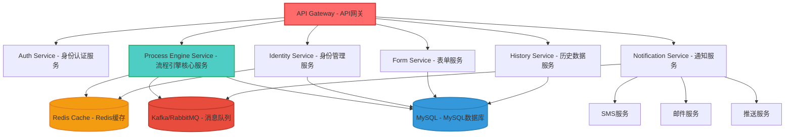
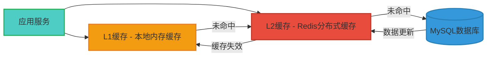
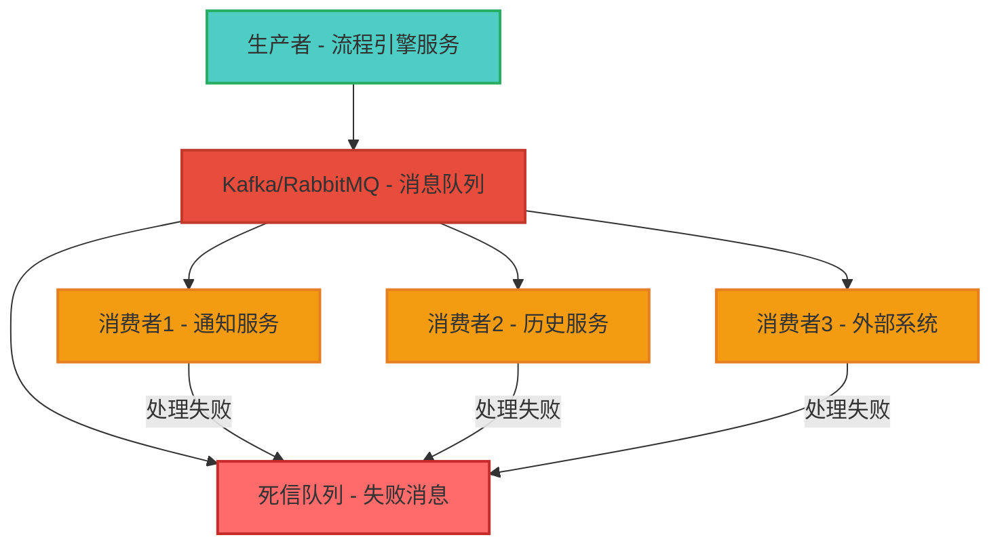
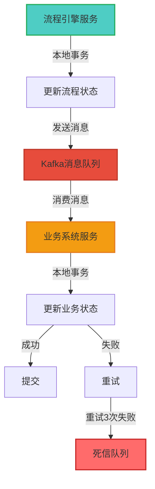
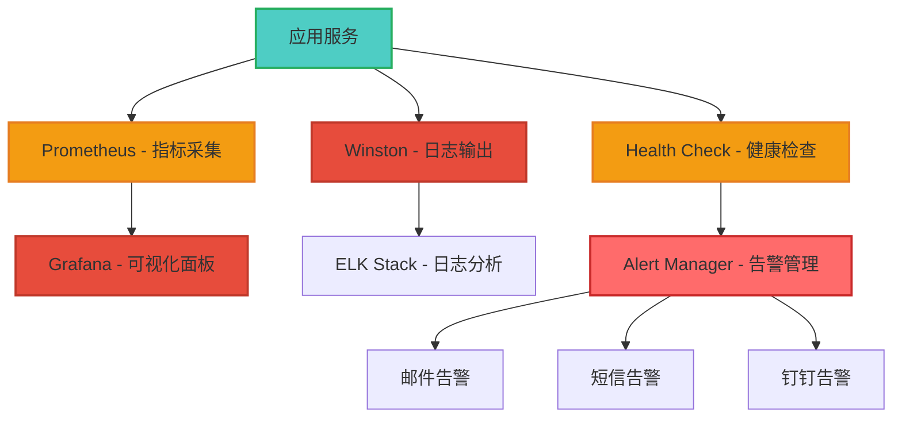

# Flowable 架构设计文档 - Node.js + NestJS + MySQL

## 文档说明

本文档提供 Node.js + NestJS + MySQL 技术栈重新实现 Flowable 流程引擎的完整架构设计方案，包括微服务拆分、缓存策略、消息队列集成、分布式事务、监控运维等。

---

## 一、微服务拆分建议

### 1.1 微服务架构图



---

### 1.2 微服务拆分方案

| 微服务名称 | 核心职责 | 技术栈 | 端口 | 依赖服务 |
|-----------|---------|---------|------|---------|
| **API Gateway** | 统一入口、路由转发、认证鉴权、限流熔断 | NestJS + Nginx | 8080 | 所有业务服务 |
| **Process Engine Service** | 流程定义、实例、任务核心逻辑 | NestJS + MySQL + Redis | 3001 | Identity Service, Cache, MQ |
| **Identity Service** | 用户、角色、组管理、权限校验 | NestJS + MySQL + Redis | 3002 | Cache, DB |
| **Form Service** | 表单定义、数据存储、验证 | NestJS + MySQL | 3003 | DB |
| **Notification Service** | 任务提醒、消息推送、通知管理 | NestJS + Kafka + Redis | 3004 | MQ, SMS, Email, Push |
| **History Service** | 历史数据查询、统计、归档 | NestJS + MySQL + Elasticsearch | 3005 | DB, Elasticsearch |
| **Monitoring Service** | 监控数据采集、告警、可视化 | NestJS + Prometheus + Grafana | 3006 | 所有服务 |

---

### 1.3 API Gateway 设计

#### 1.3.1 网关职责

1. **统一入口**：所有外部请求通过网关进入
2. **路由转发**：根据请求路径转发到对应微服务
3. **认证鉴权**：统一处理 JWT 认证和权限校验
4. **限流熔断**：防止服务过载，保护后端服务
5. **日志记录**：记录所有请求日志
6. **响应缓存**：缓存 GET 请求的响应

#### 1.3.2 网关实现

```typescript
// api-gateway/main.ts
import { NestFactory } from '@nestjs/core';
import { ValidationPipe } from '@nestjs/common';
import { SwaggerModule, DocumentBuilder } from '@nestjs/swagger';
import { RateLimiterRedisModule } from 'nestjs-rate-limiter';
import { RedisModule } from '@nestjs/cache-manager';
import { AppModule } from './app.module';

async function bootstrap() {
  const app = await NestFactory.create(AppModule);

  // 全局验证管道
  app.useGlobalPipes(new ValidationPipe({
    whitelist: true,
    forbidNonWhitelisted: true,
    transform: true,
  }));

  // 启用 CORS
  app.enableCors({
    origin: process.env.ALLOWED_ORIGINS?.split(',') || '*',
    credentials: true,
  });

  // 限流配置
  app.use(
    RateLimiterRedisModule({
      redis: {
        host: process.env.REDIS_HOST,
        port: parseInt(process.env.REDIS_PORT),
      },
      points: 100, // 每分钟100次请求
      duration: 60,
    }),
  );

  // Swagger 文档
  const config = new DocumentBuilder()
    .setTitle('Flowable API Gateway')
    .setDescription('Flowable 流程引擎 API 网关')
    .setVersion('1.0')
    .addBearerAuth()
    .build();
  SwaggerModule.setup('api-docs', app, config);

  await app.listen(8080);
  console.log('API Gateway is running on port 8080');
}

bootstrap();
```

---

### 1.4 服务间通信

#### 1.4.1 同步通信（HTTP）

```typescript
// 使用 NestJS HttpModule 进行服务间调用
import { HttpService } from '@nestjs/axios';

@Injectable()
export class ProcessEngineService {
  constructor(private readonly httpService: HttpService) {}

  async getProcessDefinition(id: string): Promise<ProcessDefinition> {
    const response = await this.httpService.get(
      `http://identity-service:3002/api/v1/process-definitions/${id}`,
      {
        headers: {
          'Authorization': `Bearer ${this.getToken()}`,
        },
      }
    );
    return response.data;
  }
}
```

#### 1.4.2 异步通信（消息队列）

```typescript
// 使用 Kafka 进行服务间异步通信
import { Injectable } from '@nestjs/common';
import { Client, Producer, Consumer, Kafka } from 'kafkajs';

@Injectable()
export class KafkaService {
  private producer: Producer;
  private consumer: Consumer;

  async onModuleInit() {
    const kafka = new Kafka({
      clientId: 'flowable-process-engine',
      brokers: [process.env.KAFKA_BROKERS],
    });

    this.producer = kafka.producer();
    await this.producer.connect();

    this.consumer = kafka.consumer({
      groupId: 'flowable-consumer-group',
    });
    await this.consumer.connect();
    await this.consumer.subscribe({ topic: 'task.completed' });
  }

  // 发送消息
  async publish(topic: string, message: any): Promise<void> {
    await this.producer.send({
      topic,
      messages: [{ value: JSON.stringify(message) }],
    });
  }

  // 消费消息
  async subscribe(topic: string, callback: (message: any) => Promise<void>): Promise<void> {
    await this.consumer.run({
      eachMessage: async ({ topic, partition, message }) => {
        const data = JSON.parse(message.value.toString());
        await callback(data);
      },
    });
  }
}
```

---

## 二、缓存策略设计

### 2.1 缓存架构



---

### 2.2 多级缓存实现

```typescript
// common/services/cache.service.ts
import { Injectable } from '@nestjs/common';
import { Cache } from 'cache-manager';
import { CACHE_MANAGER } from '@nestjs/cache-manager';
import { LRUCache } from 'lru-cache';

@Injectable()
export class CacheService {
  // L1 缓存：本地内存缓存（LRU）
  private readonly l1Cache = new LRUCache<string, any>({
    max: 1000, // 最多缓存1000个键
    ttl: 60 * 1000, // 60秒过期
  });

  // L2 缓存：Redis 分布式缓存
  constructor(
    @Inject(CACHE_MANAGER) private readonly cacheManager: Cache,
  ) {}

  // 获取缓存（先查 L1，未命中再查 L2）
  async get<T>(key: string): Promise<T | null> {
    // 1. 查询 L1 缓存
    const l1Value = this.l1Cache.get(key);
    if (l1Value !== undefined) {
      return l1Value;
    }

    // 2. L1 未命中，查询 L2 缓存
    const l2Value = await this.cacheManager.get<T>(key);
    if (l2Value) {
      // 写入 L1 缓存
      this.l1Cache.set(key, l2Value);
      return l2Value;
    }

    return null;
  }

  // 设置缓存（同时写入 L1 和 L2）
  async set(key: string, value: any, options?: { ttl?: number }): Promise<void> {
    // 1. 写入 L1 缓存
    this.l1Cache.set(key, value);

    // 2. 写入 L2 缓存
    await this.cacheManager.set(key, value, options);
  }

  // 删除缓存（同时删除 L1 和 L2）
  async del(key: string): Promise<void> {
    // 1. 删除 L1 缓存
    this.l1Cache.del(key);

    // 2. 删除 L2 缓存
    await this.cacheManager.del(key);
  }

  // 清空所有缓存
  async reset(): Promise<void> {
    // 1. 清空 L1 缓存
    this.l1Cache.reset();

    // 2. 清空 L2 缓存
    await this.cacheManager.reset();
  }
}
```

---

### 2.3 缓存策略

#### 2.3.1 流程定义缓存

```typescript
// 缓存流程定义
@Injectable()
export class ProcessDefinitionCache {
  constructor(private readonly cacheService: CacheService) {}

  private getCacheKey(id: string): string {
    return `process_definition:${id}`;
  }

  async get(id: string): Promise<ProcessDefinition | null> {
    return this.cacheService.get<ProcessDefinition>(this.getCacheKey(id));
  }

  async set(processDefinition: ProcessDefinition, ttl: number = 3600): Promise<void> {
    await this.cacheService.set(
      this.getCacheKey(processDefinition.id),
      processDefinition,
      { ttl }
    );
  }

  async delete(id: string): Promise<void> {
    await this.cacheService.del(this.getCacheKey(id));
  }

  // 流程定义部署时删除缓存
  async invalidateByDeployment(deploymentId: string): Promise<void> {
    // 查询该部署下的所有流程定义
    const processDefinitions = await this.findByDeploymentId(deploymentId);
    
    // 删除所有相关缓存
    await Promise.all(
      processDefinitions.map(pd => this.delete(pd.id))
    );
  }
}
```

---

#### 2.3.2 用户待办任务缓存

```typescript
// 缓存用户待办任务
@Injectable()
export class UserTaskCache {
  constructor(private readonly cacheService: CacheService) {}

  private getCacheKey(userId: string): string {
    return `user_todo_tasks:${userId}`;
  }

  async get(userId: string): Promise<Task[]> {
    const tasks = await this.cacheService.get<Task[]>(this.getCacheKey(userId));
    return tasks || [];
  }

  async set(userId: string, tasks: Task[], ttl: number = 600): Promise<void> {
    await this.cacheService.set(
      this.getCacheKey(userId),
      tasks,
      { ttl } // 10分钟过期
    );
  }

  // 任务状态变更时更新缓存
  async invalidate(userId: string): Promise<void> {
    await this.cacheService.del(this.getCacheKey(userId));
  }

  // 批量更新多个用户的缓存
  async invalidateMultiple(userIds: string[]): Promise<void> {
    await Promise.all(
      userIds.map(userId => this.invalidate(userId))
    );
  }
}
```

---

#### 2.3.3 权限缓存

```typescript
// 缓存用户权限
@Injectable()
export class PermissionCache {
  constructor(private readonly cacheService: CacheService) {}

  private getCacheKey(userId: string): string {
    return `user_permissions:${userId}`;
  }

  async get(userId: string): Promise<string[]> {
    const permissions = await this.cacheService.get<string[]>(this.getCacheKey(userId));
    return permissions || [];
  }

  async set(userId: string, permissions: string[], ttl: number = 7200): Promise<void> {
    await this.cacheService.set(
      this.getCacheKey(userId),
      permissions,
      { ttl } // 2小时过期
    );
  }

  // 权限变更时删除缓存
  async invalidate(userId: string): Promise<void> {
    await this.cacheService.del(this.getCacheKey(userId));
  }

  async invalidateByRole(roleId: string): Promise<void> {
    // 查询拥有该角色的所有用户
    const users = await this.getUsersByRole(roleId);
    
    // 删除所有相关用户的权限缓存
    await this.invalidateMultiple(users.map(u => u.id));
  }
}
```

---

### 2.4 缓存预热

```typescript
// 应用启动时预热缓存
@Injectable()
export class CacheWarmupService implements OnModuleInit {
  constructor(
    private readonly processDefinitionCache: ProcessDefinitionCache,
    private readonly permissionCache: PermissionCache,
  ) {}

  async onModuleInit(): Promise<void> {
    // 预热流程定义缓存
    await this.warmupProcessDefinitions();

    // 预热权限缓存
    await this.warmupPermissions();
  }

  private async warmupProcessDefinitions(): Promise<void> {
    // 查询所有激活的流程定义
    const processDefinitions = await this.getActiveProcessDefinitions();
    
    // 写入缓存
    await Promise.all(
      processDefinitions.map(pd => 
        this.processDefinitionCache.set(pd)
      )
    );
  }

  private async warmupPermissions(): Promise<void> {
    // 查询所有用户
    const users = await this.getAllUsers();
    
    // 为每个用户加载权限并写入缓存
    await Promise.all(
      users.map(async user => {
        const permissions = await this.getUserPermissions(user.id);
        await this.permissionCache.set(user.id, permissions);
      })
    );
  }
}
```

---

## 三、消息队列集成方案

### 3.1 消息队列架构



---

### 3.2 消息队列选型

| 特性 | Kafka | RabbitMQ | Bull + Redis |
|-----|-------|-----------|--------------|
| **吞吐量** | 极高（百万级/秒） | 高（万级/秒） | 中（千级/秒） |
| **延迟** | 低（毫秒级） | 低（毫秒级） | 中（10-100ms） |
| **可靠性** | 高（持久化+副本） | 高（持久化+确认） | 中（Redis持久化） |
| **复杂度** | 高（需要单独部署） | 中（需要单独部署） | 低（集成简单） |
| **适用场景** | 大规模、高并发 | 中小规模、高可靠 | 中小规模、简单场景 |
| **推荐场景** | 流程引擎核心服务 | 通知服务 | 异步任务处理 |

**推荐方案**：
- **核心流程引擎服务**：使用 Kafka（高吞吐、低延迟）
- **通知服务**：使用 RabbitMQ（高可靠、消息确认）
- **异步任务处理**：使用 Bull + Redis（简单集成、开发效率高）

---

### 3.3 Kafka 集成实现

#### 3.3.1 Kafka 配置

```typescript
// config/kafka.config.ts
export interface KafkaConfig {
  brokers: string[];
  clientId: string;
  groupId: string;
  topics: {
    taskCompleted: string;
    processStarted: string;
    processCompleted: string;
    processTerminated: string;
  };
}

export const kafkaConfig: KafkaConfig = {
  brokers: process.env.KAFKA_BROKERS?.split(',') || ['localhost:9092'],
  clientId: 'flowable-process-engine',
  groupId: 'flowable-consumer-group',
  topics: {
    taskCompleted: 'flowable.task.completed',
    processStarted: 'flowable.process.started',
    processCompleted: 'flowable.process.completed',
    processTerminated: 'flowable.process.terminated',
  },
};
```

---

#### 3.3.2 Kafka 生产者

```typescript
// event/kafka-producer.service.ts
import { Injectable, OnModuleInit } from '@nestjs/common';
import { Client, Producer, Kafka } from 'kafkajs';
import { kafkaConfig } from '../../config/kafka.config';

@Injectable()
export class KafkaProducerService implements OnModuleInit {
  private producer: Producer;

  async onModuleInit(): Promise<void> {
    const kafka = new Kafka({
      clientId: kafkaConfig.clientId,
      brokers: kafkaConfig.brokers,
    });

    this.producer = kafka.producer();
    await this.producer.connect();
  }

  // 发布任务完成事件
  async publishTaskCompleted(event: TaskCompletedEvent): Promise<void> {
    await this.producer.send({
      topic: kafkaConfig.topics.taskCompleted,
      messages: [{
        key: event.taskId,
        value: JSON.stringify(event),
        headers: {
          'eventType': 'TASK_COMPLETED',
          'timestamp': Date.now().toString(),
        },
      }],
    });
  }

  // 发布流程启动事件
  async publishProcessStarted(event: ProcessStartedEvent): Promise<void> {
    await this.producer.send({
      topic: kafkaConfig.topics.processStarted,
      messages: [{
        key: event.processInstanceId,
        value: JSON.stringify(event),
        headers: {
          'eventType': 'PROCESS_STARTED',
          'timestamp': Date.now().toString(),
        },
      }],
    });
  }

  // 发布流程完成事件
  async publishProcessCompleted(event: ProcessCompletedEvent): Promise<void> {
    await this.producer.send({
      topic: kafkaConfig.topics.processCompleted,
      messages: [{
        key: event.processInstanceId,
        value: JSON.stringify(event),
        headers: {
          'eventType': 'PROCESS_COMPLETED',
          'timestamp': Date.now().toString(),
        },
      }],
    });
  }
}
```

---

#### 3.3.3 Kafka 消费者

```typescript
// event/kafka-consumer.service.ts
import { Injectable, OnModuleInit, OnModuleDestroy } from '@nestjs/common';
import { Client, Consumer, ConsumerRunConfig, Kafka, logLevel } from 'kafkajs';
import { kafkaConfig } from '../../config/kafka.config';

@Injectable()
export class KafkaConsumerService implements OnModuleInit, OnModuleDestroy {
  private consumer: Consumer;
  private kafka: Kafka;

  async onModuleInit(): Promise<void> {
    this.kafka = new Kafka({
      clientId: kafkaConfig.clientId,
      brokers: kafkaConfig.brokers,
      logLevel: logLevel.ERROR,
    });

    this.consumer = this.kafka.consumer({
      groupId: kafkaConfig.groupId,
    });

    await this.consumer.connect();
    await this.consumer.subscribe({
      topic: kafkaConfig.topics.taskCompleted,
      fromBeginning: false,
    });
  }

  async onModuleDestroy(): Promise<void> {
    await this.consumer.disconnect();
  }

  // 启动消费者
  async start(): Promise<void> {
    const config: ConsumerRunConfig = {
      autoCommit: true,
      autoCommitInterval: 5000, // 5秒自动提交
      eachBatchAutoResolve: true,
      eachBatch: async ({ batch, resolveOffset }) => {
        // 批量处理消息
        await this.processBatch(batch);
        resolveOffset();
      },
    };

    await this.consumer.run(config);
  }

  // 批量处理消息
  private async processBatch(messages: any[]): Promise<void> {
    for (const message of messages) {
      try {
        const event = JSON.parse(message.value.toString());
        await this.handleEvent(event);
      } catch (error) {
        console.error('Failed to process message:', error);
      }
    }
  }

  // 处理事件
  private async handleEvent(event: any): Promise<void> {
    const eventType = message.headers.eventType;

    switch (eventType) {
      case 'TASK_COMPLETED':
        await this.handleTaskCompleted(event);
        break;
      case 'PROCESS_STARTED':
        await this.handleProcessStarted(event);
        break;
      case 'PROCESS_COMPLETED':
        await this.handleProcessCompleted(event);
        break;
      default:
        console.warn('Unknown event type:', eventType);
    }
  }

  // 处理任务完成事件
  private async handleTaskCompleted(event: TaskCompletedEvent): Promise<void> {
    // 发送通知
    await this.notificationService.sendTaskReminder({
      taskId: event.taskId,
      processInstanceId: event.processInstanceId,
      userId: event.nextAssignee,
    });
  }
}
```

---

### 3.4 Bull + Redis 异步任务

#### 3.4.1 Bull 配置

```typescript
// config/bull.config.ts
export interface BullConfig {
  redis: {
    host: string;
    port: number;
    password?: string;
  };
  defaultJobOptions: {
    attempts: number;
    backoff: {
      type: string;
      delay: number;
    };
    removeOnComplete: number;
    removeOnFail: number;
  };
}

export const bullConfig: BullConfig = {
  redis: {
    host: process.env.REDIS_HOST || 'localhost',
    port: parseInt(process.env.REDIS_PORT || '6379'),
    password: process.env.REDIS_PASSWORD,
  },
  defaultJobOptions: {
    attempts: 3, // 最多重试3次
    backoff: {
      type: 'exponential',
      delay: 2000, // 初始延迟2秒
    },
    removeOnComplete: 100, // 保留最近100个成功任务
    removeOnFail: 50, // 保留最近50个失败任务
  },
};
```

---

#### 3.4.2 异步任务队列

```typescript
// async/async-job.service.ts
import { Injectable, OnModuleInit } from '@nestjs/common';
import { InjectQueue, Queue, QueueEvents } from '@nestjs/bull';
import { bullConfig } from '../../config/bull.config';

@Injectable()
export class AsyncJobService implements OnModuleInit {
  constructor(
    @InjectQueue('async-tasks') private readonly taskQueue: Queue,
    @InjectQueue('async-tasks-events') private readonly taskEvents: QueueEvents,
  ) {}

  async onModuleInit(): Promise<void> {
    // 监听任务事件
    await this.taskEvents.on('completed', this.onTaskCompleted.bind(this));
    await this.taskEvents.on('failed', this.onTaskFailed.bind(this));
  }

  // 添加异步任务
  async addServiceTask(job: ServiceTaskJob): Promise<void> {
    await this.taskQueue.add('service-task', job, {
      attempts: 3,
      backoff: {
        type: 'exponential',
        delay: 2000,
      },
    });
  }

  // 添加历史记录任务
  async addHistoryRecord(job: HistoryRecordJob): Promise<void> {
    await this.taskQueue.add('history-record', job, {
      attempts: 3,
    });
  }

  // 任务完成回调
  private async onTaskCompleted(job: any): Promise<void> {
    console.log(`Job completed: ${job.id}`);
  }

  // 任务失败回调
  private async onTaskFailed(job: any, error: Error): Promise<void> {
    console.error(`Job failed: ${job.id}`, error);
    
    // 超过重试次数，记录到死信队列
    if (job.attemptsMade >= job.opts.attempts) {
      await this.addToDeadLetterQueue(job, error);
    }
  }

  // 添加到死信队列
  private async addToDeadLetterQueue(job: any, error: Error): Promise<void> {
    await this.taskQueue.add('dead-letter', {
      originalJob: job,
      error: error.message,
      failedAt: new Date(),
    });
  }
}
```

---

## 四、分布式事务处理

### 4.1 最终一致性方案

由于 Node.js 缺乏成熟的分布式事务管理器，采用 **最终一致性方案**：



---

### 4.2 Saga 模式实现

```typescript
// async/saga.service.ts
import { Injectable } from '@nestjs/common';
import { KafkaProducerService } from './kafka-producer.service';

@Injectable()
export class SagaService {
  constructor(private readonly kafkaProducer: KafkaProducerService) {}

  // 流程完成 Saga
  async processCompletionSaga(processInstanceId: string): Promise<void> {
    const sagaId = `saga:process:${processInstanceId}`;
    
    try {
      // 步骤1：更新流程状态为已完成
      await this.updateProcessStatus(processInstanceId, 'COMPLETED');
      
      // 步骤2：发送流程完成事件
      await this.kafkaProducer.publishProcessCompleted({
        sagaId,
        processInstanceId,
        status: 'COMPLETED',
      });
      
      // 步骤3：等待业务系统确认
      // 由业务系统服务消费消息并确认
      
    } catch (error) {
      // 补偿操作：将流程状态回滚
      await this.compensateProcessCompletion(processInstanceId, error);
      throw error;
    }
  }

  // 补偿操作
  private async compensateProcessCompletion(
    processInstanceId: string,
    error: Error
  ): Promise<void> {
    // 回滚流程状态
    await this.updateProcessStatus(processInstanceId, 'FAILED');
    
    // 记录失败日志
    console.error('Saga compensation:', {
      processInstanceId,
      error: error.message,
    });
  }

  // 更新流程状态
  private async updateProcessStatus(
    processInstanceId: string,
    status: string
  ): Promise<void> {
    // 本地事务更新流程状态
    await this.processInstanceRepository.update(
      processInstanceId,
      { status }
    );
  }
}
```

---

### 4.3 事务日志

```typescript
// async/transaction-log.service.ts
import { Injectable } from '@nestjs/common';
import { Repository } from 'typeorm';
import { InjectRepository } from '@nestjs/typeorm';
import { TransactionLog } from '../entities/transaction-log.entity';

@Injectable()
export class TransactionLogService {
  constructor(
    @InjectRepository(TransactionLog)
    private readonly transactionLogRepository: Repository<TransactionLog>,
  ) {}

  // 记录事务开始
  async logStart(sagaId: string, step: string): Promise<void> {
    const log = this.transactionLogRepository.create({
      id: generateUuid(),
      sagaId,
      step,
      status: 'STARTED',
      startTime: new Date(),
    });
    
    await this.transactionLogRepository.save(log);
  }

  // 记录事务完成
  async logComplete(sagaId: string, step: string): Promise<void> {
    const log = await this.transactionLogRepository.findOne({
      where: { sagaId, step, status: 'STARTED' },
    });
    
    if (log) {
      log.status = 'COMPLETED';
      log.endTime = new Date();
      log.duration = Date.now() - log.startTime.getTime();
      
      await this.transactionLogRepository.save(log);
    }
  }

  // 记录事务失败
  async logFail(sagaId: string, step: string, error: string): Promise<void> {
    const log = await this.transactionLogRepository.findOne({
      where: { sagaId, step, status: 'STARTED' },
    });
    
    if (log) {
      log.status = 'FAILED';
      log.endTime = new Date();
      log.duration = Date.now() - log.startTime.getTime();
      log.error = error;
      
      await this.transactionLogRepository.save(log);
    }
  }

  // 查询事务日志
  async findBySagaId(sagaId: string): Promise<TransactionLog[]> {
    return this.transactionLogRepository.find({
      where: { sagaId },
      order: { startTime: 'ASC' },
    });
  }
}
```

---

## 五、监控和运维方案

### 5.1 监控架构



---

### 5.2 Prometheus 指标采集

#### 5.2.1 指标类型

```typescript
// monitoring/prometheus.service.ts
import { Injectable } from '@nestjs/common';
import { Counter, Histogram, Gauge, Registry } from 'prom-client';

@Injectable()
export class PrometheusService {
  private readonly register = new Registry();

  // 计数器
  private readonly processInstanceCounter = new Counter({
    name: 'flowable_process_instances_total',
    help: 'Total number of process instances',
    labelNames: ['status', 'process_definition_key'],
  });

  private readonly taskCounter = new Counter({
    name: 'flowable_tasks_total',
    help: 'Total number of tasks',
    labelNames: ['status', 'type'],
  });

  // 直方图
  private readonly processDurationHistogram = new Histogram({
    name: 'flowable_process_duration_seconds',
    help: 'Process instance duration in seconds',
    buckets: [1, 5, 10, 30, 60, 300, 600, 1800, 3600],
    labelNames: ['process_definition_key'],
  });

  private readonly taskDurationHistogram = new Histogram({
    name: 'flowable_task_duration_seconds',
    help: 'Task duration in seconds',
    buckets: [1, 5, 10, 30, 60, 300, 600, 1800],
    labelNames: ['type'],
  });

  // 仪表
  private readonly activeProcessInstancesGauge = new Gauge({
    name: 'flowable_active_process_instances',
    help: 'Number of active process instances',
  });

  private readonly pendingTasksGauge = new Gauge({
    name: 'flowable_pending_tasks',
    help: 'Number of pending tasks',
  });

  constructor() {
    // 注册所有指标
    this.register.registerMetric(this.processInstanceCounter);
    this.register.registerMetric(this.taskCounter);
    this.register.registerMetric(this.processDurationHistogram);
    this.register.registerMetric(this.taskDurationHistogram);
    this.register.registerMetric(this.activeProcessInstancesGauge);
    this.register.registerMetric(this.pendingTasksGauge);
  }

  // 记录流程实例创建
  incProcessInstanceCreated(processDefinitionKey: string): void {
    this.processInstanceCounter.inc({
      status: 'CREATED',
      process_definition_key: processDefinitionKey,
    });
  }

  // 记录流程实例完成
  incProcessInstanceCompleted(processDefinitionKey: string, duration: number): void {
    this.processInstanceCounter.inc({
      status: 'COMPLETED',
      process_definition_key: processDefinitionKey,
    });
    this.processDurationHistogram.observe(
      { process_definition_key: processDefinitionKey },
      duration / 1000
    );
  }

  // 记录任务创建
  incTaskCreated(type: string): void {
    this.taskCounter.inc({
      status: 'CREATED',
      type,
    });
  }

  // 记录任务完成
  incTaskCompleted(type: string, duration: number): void {
    this.taskCounter.inc({
      status: 'COMPLETED',
      type,
    });
    this.taskDurationHistogram.observe(
      { type },
      duration / 1000
    );
  }

  // 更新活跃流程实例数
  setActiveProcessInstances(count: number): void {
    this.activeProcessInstancesGauge.set(count);
  }

  // 更新待办任务数
  setPendingTasks(count: number): void {
    this.pendingTasksGauge.set(count);
  }

  // 暴露指标端点
  getMetrics(): string {
    return this.register.metrics();
  }
}
```

---

#### 5.2.2 健康检查

```typescript
// monitoring/health.controller.ts
import { Controller, Get } from '@nestjs/common';
import { HealthCheck, HealthCheckService, TypeOrmHealthIndicator, RedisHealthIndicator } from '@nestjs/terminus';

@Controller('health')
export class HealthController {
  constructor(
    private readonly health: HealthCheckService,
    private readonly db: TypeOrmHealthIndicator,
    private readonly redis: RedisHealthIndicator,
  ) {}

  @Get()
  @HealthCheck()
  check() {
    return this.health.check([
      () => this.db.pingCheck('mysql'),
      () => this.redis.pingCheck('redis'),
      () => this.kafkaHealthCheck(),
      () => this.memoryHealthCheck(),
      () => this.diskHealthCheck(),
    ]);
  }

  // Kafka 健康检查
  private kafkaHealthCheck() {
    return {
      kafka: {
        status: 'up',
        brokers: process.env.KAFKA_BROKERS,
      },
    };
  }

  // 内存健康检查
  private memoryHealthCheck() {
    const used = process.memoryUsage().heapUsed / 1024 / 1024;
    const total = process.memoryUsage().heapTotal / 1024 / 1024;
    const free = total - used;

    return {
      memory: {
        status: used / total < 0.9 ? 'up' : 'down',
        used: `${used.toFixed(2)} MB`,
        total: `${total.toFixed(2)} MB`,
        free: `${free.toFixed(2)} MB`,
        percentage: `${((used / total) * 100).toFixed(2)}%`,
      },
    };
  }

  // 磁盘健康检查
  private diskHealthCheck() {
    const stats = require('fs').statSync(process.cwd());
    
    return {
      disk: {
        status: 'up',
        path: process.cwd(),
      },
    };
  }
}
```

---

### 5.3 日志收集（ELK Stack）

#### 5.3.1 Filebeat 配置

```yaml
# filebeat/filebeat.yml
filebeat.inputs:
  - type: log
    enabled: true
    paths:
      - /var/log/flowable/*.log
    fields:
      app: flowable
      env: ${NODE_ENV:production}
    fields_under_root: true
    multiline:
      pattern: '^\d{4}-\d{2}-\d{2} \d{2}:\d{2}:\d{2}\.\d{3}'
      negate: true
      match: after
    scan_frequency: 10s

output.elasticsearch:
  hosts: ["${ELASTICSEARCH_HOST:elasticsearch:9200}"]
  indices: "flowable-${NODE_ENV:production}-%{+yyyy.MM.dd}"
  template.name: "flowable"
  template.settings:
    index.number_of_shards: 3
    index.number_of_replicas: 1
```

---

#### 5.3.2 Logstash 配置

```yaml
# logstash/logstash.conf
input {
  beats {
    port => 5044
  }
}

filter {
  if [app] == "flowable" {
    grok {
      match => { "message" => "%{TIMESTAMP_ISO8601:timestamp} %{GREEDYDATA:json_data}" }
      patterns_dir => ["/etc/logstash/patterns"]
    }
    
    json {
      source => "json_data"
    }
    
    date {
      match => [ "timestamp", "log_timestamp" ]
      target => "@timestamp"
    }
  }
}

output {
  elasticsearch {
    hosts => ["${ELASTICSEARCH_HOST:elasticsearch:9200}"]
    index => "flowable-%{+YYYY.MM.dd}"
  }
}
```

---

### 5.4 告警配置

#### 5.4.1 Grafana 告警规则

```yaml
# grafana/alert-rules.yml
groups:
  - name: flowable_alerts
    interval: 30s
    rules:
      - alert: HighErrorRate
        expr: rate(flowable_errors_total[5m]) > 10
        for: 5m
        labels:
          severity: critical
        annotations:
          summary: "High error rate detected"
          description: "Error rate is > 10 errors/5m"

      - alert: ProcessInstanceStuck
        expr: flowable_active_process_instances > 1000
        for: 10m
        labels:
          severity: warning
        annotations:
          summary: "Too many active process instances"
          description: "More than 1000 active process instances"

      - alert: TaskBacklog
        expr: flowable_pending_tasks > 10000
        for: 5m
        labels:
          severity: warning
        annotations:
          summary: "High task backlog"
          description: "More than 10000 pending tasks"

      - alert: DatabaseConnectionFailed
        expr: up{job="mysql"} == 0
        for: 1m
        labels:
          severity: critical
        annotations:
          summary: "Database connection failed"
          description: "MySQL database is down"

      - alert: RedisConnectionFailed
        expr: up{job="redis"} == 0
        for: 1m
        labels:
          severity: critical
        annotations:
          summary: "Redis connection failed"
          description: "Redis cache is down"
```

---

## 六、总结

本文档提供了 Node.js + NestJS + MySQL 技术栈重新实现 Flowable 流程引擎的完整架构设计方案，包括：

### 核心要点

1. **微服务拆分**：清晰的服务划分，职责明确
2. **缓存策略**：多级缓存（L1+L2），提高性能
3. **消息队列**：Kafka/Bull 集成，实现异步和解耦
4. **分布式事务**：最终一致性 + Saga 模式
5. **监控运维**：Prometheus + Grafana + ELK Stack
6. **高可用**：服务冗余、负载均衡、故障转移

### 技术栈

- **API 网关**：NestJS + Nginx
- **流程引擎**：NestJS + MySQL + Redis + Kafka
- **身份服务**：NestJS + MySQL + Redis
- **表单服务**：NestJS + MySQL
- **通知服务**：NestJS + RabbitMQ + Redis
- **历史服务**：NestJS + MySQL + Elasticsearch
- **监控服务**：NestJS + Prometheus + Grafana
- **日志收集**：Winston + Filebeat + Logstash + Elasticsearch + Kibana

### 下一步

接下来需要完成以下文档：
1. 规范文档（代码规范、Git 策略、CI/CD 等）
2. 总览文档（整合所有文档）
