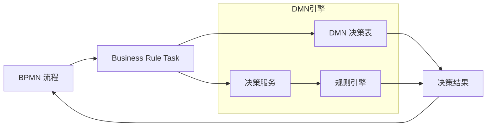
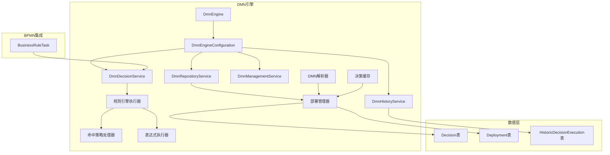

# Flowable DMN决策引擎补充设计文档

## 文档说明

本文档补充设计 Flowable DMN（Decision Model and Notation）决策引擎功能，基于 OMG DMN 1.1 国际标准实现。DMN决策引擎是与 BPMN 引擎解耦、可独立运行、可深度嵌入流程的标准化决策执行内核。

**核心价值**：
- 把业务规则从代码里抽出来，变成可视化、可动态修改、可审计、可复用的决策表
- 彻底解决流程中「规则频繁变、改代码麻烦、难以追溯」的痛点

---

## 一、DMN 概述

### 1.1 什么是 DMN

DMN（Decision Model and Notation）是 OMG（Object Management Group）制定的国际标准，用于描述和建模业务决策。它提供了一种标准化的方式来：

- **可视化决策逻辑**：使用决策表图形化表示业务规则
- **标准化决策执行**：统一的决策执行语义
- **可互操作性**：不同系统间可以交换决策模型

### 1.2 DMN 核心概念

| 概念 | 描述 | 示例 |
|-----|------|------|
| **Decision** | 决策，表示一个业务决策点 | "是否批准贷款" |
| **Decision Table** | 决策表，表示决策的逻辑规则 | 输入条件→输出结果 |
| **Input Clause** | 输入子句，决策表的输入条件 | 年龄、收入、信用分数 |
| **Output Clause** | 输出子句，决策表的输出结果 | 审批结果、额度 |
| **Rule** | 规则，决策表中的一行 | 年龄>18 AND 收入>5000 → 批准 |
| **Hit Policy** | 命中策略，规则匹配策略 | UNIQUE, FIRST, PRIORITY, ANY |
| **Decision Service** | 决策服务，多个决策的组合 | 综合风险评估服务 |

### 1.3 DMN 与 BPMN 的集成



---

## 二、架构设计

### 2.1 模块架构



### 2.2 核心服务

| 服务 | 职责 | 主要方法 |
|-----|------|---------|
| **DmnRepositoryService** | 决策表部署和管理 | deploy, getDecision, createDeployment |
| **DmnDecisionService** | 决策执行 | executeDecision, executeWithAuditTrail |
| **DmnHistoryService** | 历史执行记录查询 | createHistoricDecisionExecutionQuery |
| **DmnManagementService** | 引擎管理和维护 | getTableName, executeCustomSql |

---

## 三、数据模型设计

### 3.1 决策定义实体

```typescript
// dmn/entities/decision.entity.ts
import { Entity, Column, ManyToOne, JoinColumn, OneToMany, Index } from 'typeorm';
import { BaseEntity } from '../../common/entities/base.entity';

@Entity('dmn_decision')
export class DmnDecision extends BaseEntity {
  @Column({ name: 'key', length: 64 })
  @Index()
  key: string;

  @Column({ name: 'name', length: 128, nullable: true })
  name: string;

  @Column({ name: 'version', type: 'int' })
  version: number;

  @Column({ name: 'category', length: 128, nullable: true })
  category: string;

  @Column({ name: 'deployment_id', length: 64, nullable: true })
  @Index()
  deploymentId: string;

  @Column({ name: 'dmn_xml', type: 'text' })
  dmnXml: string;

  @Column({ name: 'decision_table_key', length: 64, nullable: true })
  decisionTableKey: string;

  @Column({ name: 'decision_table_name', length: 128, nullable: true })
  decisionTableName: string;

  @Column({ name: 'hit_policy', length: 20, default: 'UNIQUE' })
  hitPolicy: string;

  @Column({ name: 'input_clauses', type: 'json', nullable: true })
  inputClauses: InputClause[];

  @Column({ name: 'output_clauses', type: 'json', nullable: true })
  outputClauses: OutputClause[];

  @Column({ name: 'rules', type: 'json', nullable: true })
  rules: DecisionRule[];

  @Column({ name: 'tenant_id', length: 64, nullable: true })
  @Index()
  tenantId: string;

  @Column({ name: 'is_active', type: 'tinyint', width: 1, default: 1 })
  isActive: boolean;
}

export interface InputClause {
  id: string;
  name: string;
  label?: string;
  typeRef: string; // string, number, boolean, date
  inputExpression: {
    text: string;
    typeRef: string;
  };
}

export interface OutputClause {
  id: string;
  name: string;
  label?: string;
  typeRef: string;
  outputValues?: string[];
  defaultOutputEntry?: string;
}

export interface DecisionRule {
  id: string;
  ruleNumber: number;
  description?: string;
  inputEntries: RuleInputEntry[];
  outputEntries: RuleOutputEntry[];
}

export interface RuleInputEntry {
  id: string;
  clauseId: string;
  text: string; // 表达式文本，如 "> 18", "== '男'"
}

export interface RuleOutputEntry {
  id: string;
  clauseId: string;
  text: string; // 输出值或表达式
}
```

### 3.2 部署实体

```typescript
// dmn/entities/dmn-deployment.entity.ts
import { Entity, Column, OneToMany, Index } from 'typeorm';
import { BaseEntity } from '../../common/entities/base.entity';
import { DmnDecision } from './decision.entity';

@Entity('dmn_deployment')
export class DmnDeployment extends BaseEntity {
  @Column({ name: 'name', length: 128, nullable: true })
  name: string;

  @Column({ name: 'category', length: 128, nullable: true })
  category: string;

  @Column({ name: 'tenant_id', length: 64, nullable: true })
  @Index()
  tenantId: string;

  @Column({ name: 'parent_deployment_id', length: 64, nullable: true })
  parentDeploymentId: string;

  @OneToMany(() => DmnDecision, decision => decision.deployment)
  decisions: DmnDecision[];

  @OneToMany(() => DmnResource, resource => resource.deployment)
  resources: DmnResource[];
}

@Entity('dmn_resource')
export class DmnResource extends BaseEntity {
  @Column({ name: 'name', length: 256 })
  name: string;

  @Column({ name: 'deployment_id', length: 64 })
  @Index()
  deploymentId: string;

  @Column({ name: 'content', type: 'longblob' })
  content: Buffer;
}
```

### 3.3 历史执行记录实体

```typescript
// dmn/entities/historic-decision-execution.entity.ts
import { Entity, Column, Index } from 'typeorm';
import { BaseEntity } from '../../common/entities/base.entity';

@Entity('dmn_historic_decision_execution')
export class HistoricDecisionExecution extends BaseEntity {
  @Column({ name: 'decision_key', length: 64 })
  @Index()
  decisionKey: string;

  @Column({ name: 'decision_name', length: 128, nullable: true })
  decisionName: string;

  @Column({ name: 'decision_version', type: 'int' })
  decisionVersion: number;

  @Column({ name: 'process_instance_id', length: 64, nullable: true })
  @Index()
  processInstanceId: string;

  @Column({ name: 'execution_id', length: 64, nullable: true })
  executionId: string;

  @Column({ name: 'activity_id', length: 64, nullable: true })
  activityId: string;

  @Column({ name: 'scope_type', length: 20, nullable: true })
  scopeType: string;

  @Column({ name: 'tenant_id', length: 64, nullable: true })
  tenantId: string;

  @Column({ name: 'user_id', length: 64, nullable: true })
  userId: string;

  @Column({ name: 'start_time', type: 'datetime' })
  startTime: Date;

  @Column({ name: 'end_time', type: 'datetime', nullable: true })
  endTime: Date;

  @Column({ name: 'input_variables', type: 'json', nullable: true })
  inputVariables: Record<string, any>;

  @Column({ name: 'output_variables', type: 'json', nullable: true })
  outputVariables: Record<string, any>;

  @Column({ name: 'decision_result', type: 'json', nullable: true })
  decisionResult: Record<string, any>[];

  @Column({ name: 'audit_trail', type: 'json', nullable: true })
  auditTrail: DecisionExecutionAuditContainer;

  @Column({ name: 'failed', type: 'tinyint', width: 1, default: 0 })
  failed: boolean;

  @Column({ name: 'exception_message', type: 'text', nullable: true })
  exceptionMessage: string;
}

export interface DecisionExecutionAuditContainer {
  decisionKey: string;
  decisionName: string;
  startTime: Date;
  endTime?: Date;
  failed: boolean;
  exceptionMessage?: string;
  ruleEntries: RuleAuditEntry[];
  inputEntries: InputAuditEntry[];
  outputEntries: OutputAuditEntry[];
  decisionResult?: Record<string, any>[];
}

export interface RuleAuditEntry {
  ruleNumber: number;
  ruleId: string;
  isValid: boolean;
  inputEntries: InputEntryAudit[];
  outputEntries: OutputEntryAudit[];
}

export interface InputAuditEntry {
  clauseId: string;
  clauseName: string;
  expression: string;
}

export interface OutputAuditEntry {
  clauseId: string;
  clauseName: string;
  typeRef: string;
}

export interface InputEntryAudit {
  entryId: string;
  expression: string;
  result: boolean;
}

export interface OutputEntryAudit {
  entryId: string;
  expression: string;
  result: any;
}
```

---

## 四、命中策略（Hit Policy）设计

### 4.1 命中策略类型

| 命中策略 | 描述 | 使用场景 |
|---------|------|---------|
| **UNIQUE** | 只能有一条规则匹配，多条匹配则报错 | 互斥规则场景 |
| **FIRST** | 返回第一条匹配的规则 | 优先级规则 |
| **PRIORITY** | 按输出优先级返回最高优先级结果 | 有优先级的决策 |
| **ANY** | 允许多条匹配，但输出必须相同 | 宽松匹配场景 |
| **COLLECT** | 收集所有匹配规则的输出 | 多结果场景 |
| **RULE ORDER** | 按规则顺序返回所有匹配结果 | 顺序敏感场景 |
| **OUTPUT ORDER** | 按输出值排序返回所有匹配结果 | 需要排序的场景 |

### 4.2 命中策略实现

```typescript
// dmn/services/hit-policy/hit-policy-behavior.ts
export interface HitPolicyBehavior {
  getHitPolicyName(): string;
  shouldContinueEvaluating(ruleResult: boolean): boolean;
  evaluateRuleValidity(ruleNumber: number, executionContext: RuleExecutionContext): void;
  composeOutput(outputVariableId: string, executionVariable: any, executionContext: RuleExecutionContext): void;
  composeDecisionResults?(executionContext: RuleExecutionContext): void;
}

// dmn/services/hit-policy/hit-policy-unique.ts
import { HitPolicyBehavior, RuleExecutionContext } from './hit-policy-behavior';
import { FlowableException } from '../../../common/exceptions/flowable.exception';

export class HitPolicyUnique implements HitPolicyBehavior {
  private matchedRules: number[] = [];

  getHitPolicyName(): string {
    return 'UNIQUE';
  }

  shouldContinueEvaluating(ruleResult: boolean): boolean {
    return true; // 继续评估所有规则以验证唯一性
  }

  evaluateRuleValidity(ruleNumber: number, executionContext: RuleExecutionContext): void {
    if (this.matchedRules.includes(ruleNumber)) {
      return; // 已经匹配过
    }

    this.matchedRules.push(ruleNumber);

    if (this.matchedRules.length > 1) {
      throw new FlowableException(
        `HitPolicy UNIQUE: 多条规则匹配 (规则 ${this.matchedRules.join(', ')})`
      );
    }
  }

  composeOutput(outputVariableId: string, executionVariable: any, executionContext: RuleExecutionContext): void {
    // 直接设置输出
    executionContext.setOutputVariable(outputVariableId, executionVariable);
  }

  composeDecisionResults(executionContext: RuleExecutionContext): void {
    // UNIQUE策略只产生单个结果
    const result = executionContext.getOutputVariables();
    executionContext.setDecisionResult([result]);
  }
}

// dmn/services/hit-policy/hit-policy-first.ts
export class HitPolicyFirst implements HitPolicyBehavior {
  private hasMatched = false;

  getHitPolicyName(): string {
    return 'FIRST';
  }

  shouldContinueEvaluating(ruleResult: boolean): boolean {
    if (ruleResult) {
      this.hasMatched = true;
      return false; // 找到第一条匹配后停止
    }
    return true;
  }

  evaluateRuleValidity(ruleNumber: number, executionContext: RuleExecutionContext): void {
    // FIRST策略不需要额外验证
  }

  composeOutput(outputVariableId: string, executionVariable: any, executionContext: RuleExecutionContext): void {
    if (!this.hasMatched) {
      return;
    }
    executionContext.setOutputVariable(outputVariableId, executionVariable);
  }

  composeDecisionResults(executionContext: RuleExecutionContext): void {
    const result = executionContext.getOutputVariables();
    executionContext.setDecisionResult([result]);
  }
}

// dmn/services/hit-policy/hit-policy-collect.ts
export class HitPolicyCollect implements HitPolicyBehavior {
  private results: Map<string, any[]> = new Map();

  getHitPolicyName(): string {
    return 'COLLECT';
  }

  shouldContinueEvaluating(ruleResult: boolean): boolean {
    return true; // 收集所有匹配规则
  }

  evaluateRuleValidity(ruleNumber: number, executionContext: RuleExecutionContext): void {
    // COLLECT策略允许任意数量匹配
  }

  composeOutput(outputVariableId: string, executionVariable: any, executionContext: RuleExecutionContext): void {
    if (!this.results.has(outputVariableId)) {
      this.results.set(outputVariableId, []);
    }
    this.results.get(outputVariableId)!.push(executionVariable);
  }

  composeDecisionResults(executionContext: RuleExecutionContext): void {
    const decisionResult: Record<string, any>[] = [];
    
    // 将收集的结果转换为决策结果数组
    const maxLen = Math.max(...Array.from(this.results.values()).map(arr => arr.length));
    
    for (let i = 0; i < maxLen; i++) {
      const resultItem: Record<string, any> = {};
      for (const [key, values] of this.results) {
        resultItem[key] = values[i];
      }
      decisionResult.push(resultItem);
    }
    
    executionContext.setDecisionResult(decisionResult);
  }
}

// dmn/services/hit-policy/hit-policy-priority.ts
export class HitPolicyPriority implements HitPolicyBehavior {
  private matchedRules: Array<{ ruleNumber: number; priority: number; output: Record<string, any> }> = [];

  constructor(private outputPriorities: Map<string, number[]>) {
    // outputPriorities: 输出子句ID -> 优先级值数组
  }

  getHitPolicyName(): string {
    return 'PRIORITY';
  }

  shouldContinueEvaluating(ruleResult: boolean): boolean {
    return true; // 需要评估所有规则以确定最高优先级
  }

  evaluateRuleValidity(ruleNumber: number, executionContext: RuleExecutionContext): void {
    // PRIORITY策略允许任意数量匹配
  }

  composeOutput(outputVariableId: string, executionVariable: any, executionContext: RuleExecutionContext): void {
    const currentOutput = executionContext.getCurrentOutput();
    const priority = this.calculatePriority(outputVariableId, executionVariable);
    
    this.matchedRules.push({
      ruleNumber: executionContext.getCurrentRuleNumber(),
      priority,
      output: { ...currentOutput, [outputVariableId]: executionVariable },
    });
  }

  private calculatePriority(outputVariableId: string, value: any): number {
    const priorities = this.outputPriorities.get(outputVariableId);
    if (!priorities) {
      return 0;
    }
    const index = priorities.indexOf(value);
    return index >= 0 ? priorities.length - index : 0;
  }

  composeDecisionResults(executionContext: RuleExecutionContext): void {
    // 按优先级排序，返回最高优先级的结果
    this.matchedRules.sort((a, b) => b.priority - a.priority);
    
    if (this.matchedRules.length > 0) {
      executionContext.setDecisionResult([this.matchedRules[0].output]);
    } else {
      executionContext.setDecisionResult([]);
    }
  }
}
```

---

## 五、规则引擎执行器设计

### 5.1 规则引擎执行服务

```typescript
// dmn/services/rule-engine-executor.service.ts
import { Injectable, Logger } from '@nestjs/common';
import { InjectRepository } from '@nestjs/typeorm';
import { Repository } from 'typeorm';

import { DmnDecision, DecisionRule, InputClause, OutputClause } from '../entities/decision.entity';
import { 
  DecisionExecutionAuditContainer, 
  RuleAuditEntry,
  InputEntryAudit,
  OutputEntryAudit,
} from '../entities/historic-decision-execution.entity';
import { HitPolicyBehavior } from './hit-policy/hit-policy-behavior';
import { ExpressionEvaluatorService } from '../../core/services/expression-evaluator.service';
import { EventBusService } from '../../core/services/event-bus.service';

export interface ExecuteDecisionContext {
  decisionKey: string;
  decisionId?: string;
  tenantId?: string;
  variables: Record<string, any>;
  processInstanceId?: string;
  executionId?: string;
  activityId?: string;
  userId?: string;
  disableHistory?: boolean;
}

export interface RuleExecutionContext {
  decision: DmnDecision;
  variables: Record<string, any>;
  stackVariables: Record<string, any>;
  auditContainer: DecisionExecutionAuditContainer;
  ruleResults: Map<number, Record<string, any>>;
  decisionResult: Record<string, any>[];
  currentRuleNumber: number;
  currentOutput: Record<string, any>;
}

@Injectable()
export class RuleEngineExecutorService {
  private readonly logger = new Logger(RuleEngineExecutorService.name);
  
  private hitPolicyBehaviors: Map<string, HitPolicyBehavior>;

  constructor(
    @InjectRepository(DmnDecision)
    private readonly decisionRepository: Repository<DmnDecision>,
    private readonly expressionEvaluator: ExpressionEvaluatorService,
    private readonly eventBus: EventBusService,
    // 注入所有命中策略
    hitPolicyUnique: HitPolicyBehavior,
    hitPolicyFirst: HitPolicyBehavior,
    hitPolicyPriority: HitPolicyBehavior,
    hitPolicyAny: HitPolicyBehavior,
    hitPolicyCollect: HitPolicyBehavior,
  ) {
    this.hitPolicyBehaviors = new Map([
      ['UNIQUE', hitPolicyUnique],
      ['FIRST', hitPolicyFirst],
      ['PRIORITY', hitPolicyPriority],
      ['ANY', hitPolicyAny],
      ['COLLECT', hitPolicyCollect],
    ]);
  }

  /**
   * 执行决策
   */
  async execute(decision: DmnDecision, context: ExecuteDecisionContext): Promise<DecisionExecutionAuditContainer> {
    if (!decision) {
      throw new Error('决策不能为空');
    }

    if (!decision.rules || decision.rules.length === 0) {
      throw new Error('决策表中没有规则');
    }

    // 创建执行上下文和审计跟踪
    const ruleExecutionContext = this.createRuleContext(decision, context);

    try {
      // 健全性检查
      this.sanityCheckDecisionTable(decision);

      // 评估决策表
      this.evaluateDecisionTable(decision, ruleExecutionContext);

    } catch (error) {
      this.logger.error('决策表执行失败', error);
      ruleExecutionContext.auditContainer.failed = true;
      ruleExecutionContext.auditContainer.exceptionMessage = this.getExceptionMessage(error);
    } finally {
      // 结束审计跟踪
      ruleExecutionContext.auditContainer.endTime = new Date();
    }

    return ruleExecutionContext.auditContainer;
  }

  /**
   * 创建规则执行上下文
   */
  private createRuleContext(decision: DmnDecision, context: ExecuteDecisionContext): RuleExecutionContext {
    const auditContainer: DecisionExecutionAuditContainer = {
      decisionKey: decision.key,
      decisionName: decision.name,
      startTime: new Date(),
      failed: false,
      ruleEntries: [],
      inputEntries: [],
      outputEntries: [],
    };

    // 添加输入子句审计信息
    if (decision.inputClauses) {
      for (const clause of decision.inputClauses) {
        auditContainer.inputEntries.push({
          clauseId: clause.id,
          clauseName: clause.name,
          expression: clause.inputExpression.text,
        });
      }
    }

    // 添加输出子句审计信息
    if (decision.outputClauses) {
      for (const clause of decision.outputClauses) {
        auditContainer.outputEntries.push({
          clauseId: clause.id,
          clauseName: clause.name,
          typeRef: clause.typeRef,
        });
      }
    }

    return {
      decision,
      variables: { ...context.variables },
      stackVariables: { ...context.variables },
      auditContainer,
      ruleResults: new Map(),
      decisionResult: [],
      currentRuleNumber: 0,
      currentOutput: {},
    };
  }

  /**
   * 评估决策表
   */
  private evaluateDecisionTable(decision: DmnDecision, context: RuleExecutionContext): void {
    this.logger.debug(`开始评估决策表: ${decision.key}`);

    const hitPolicy = this.getHitPolicyBehavior(decision.hitPolicy);
    const validRuleOutputs: Map<number, any[]> = new Map();

    // 评估每条规则的条件
    for (const rule of decision.rules) {
      const ruleResult = this.executeRule(rule, decision.inputClauses, context);

      if (ruleResult) {
        // 评估命中策略有效性
        if (typeof hitPolicy.evaluateRuleValidity === 'function') {
          hitPolicy.evaluateRuleValidity(rule.ruleNumber, context);
        }

        // 添加有效规则的输出
        validRuleOutputs.set(rule.ruleNumber, rule.outputEntries);
      }

      // 是否继续评估
      if (!hitPolicy.shouldContinueEvaluating(ruleResult)) {
        this.logger.debug(`命中策略 ${decision.hitPolicy} 停止继续评估`);
        break;
      }
    }

    // 组装规则结论
    for (const [ruleNumber, outputEntries] of validRuleOutputs) {
      this.executeOutputEntryAction(ruleNumber, outputEntries, decision.outputClauses, decision.hitPolicy, context);
    }

    // 后处理：组装决策结果
    if (typeof hitPolicy.composeDecisionResults === 'function') {
      hitPolicy.composeDecisionResults(context);
    }

    // 设置最终结果
    context.auditContainer.decisionResult = context.decisionResult;

    this.logger.debug(`结束评估决策表: ${decision.key}`);
  }

  /**
   * 执行单条规则
   */
  private executeRule(
    rule: DecisionRule,
    inputClauses: InputClause[],
    context: RuleExecutionContext,
  ): boolean {
    this.logger.debug(`开始评估规则 ${rule.ruleNumber}`);

    context.currentRuleNumber = rule.ruleNumber;

    // 添加规则审计条目
    const ruleAudit: RuleAuditEntry = {
      ruleNumber: rule.ruleNumber,
      ruleId: rule.id,
      isValid: false,
      inputEntries: [],
      outputEntries: [],
    };
    context.auditContainer.ruleEntries.push(ruleAudit);

    let conditionResult = false;

    // 遍历所有输入条件
    for (const inputEntry of rule.inputEntries) {
      const inputClause = inputClauses.find(c => c.id === inputEntry.clauseId);
      if (!inputClause) {
        continue;
      }

      conditionResult = false;

      try {
        // 如果条件为空或"-"，则结果为TRUE
        if (!inputEntry.text || inputEntry.text === '-') {
          conditionResult = true;
        } else {
          conditionResult = this.executeInputExpressionEvaluation(inputClause, inputEntry, context);
        }

        // 添加输入条目审计
        ruleAudit.inputEntries.push({
          entryId: inputEntry.id,
          expression: inputEntry.text,
          result: conditionResult,
        });

        this.logger.debug(`输入条目 ${inputEntry.id}: ${inputClause.inputExpression.text} ${inputEntry.text} = ${conditionResult}`);

      } catch (error) {
        ruleAudit.inputEntries.push({
          entryId: inputEntry.id,
          expression: inputEntry.text,
          result: false,
        });
        throw error;
      }

      // 如果条件为false，退出评估
      if (!conditionResult) {
        break;
      }
    }

    if (conditionResult) {
      ruleAudit.isValid = true;
      context.auditContainer.ruleEntries.find(r => r.ruleNumber === rule.ruleNumber)!.isValid = true;
    }

    this.logger.debug(`结束评估规则 ${rule.ruleNumber}: ${conditionResult}`);
    return conditionResult;
  }

  /**
   * 执行输入表达式评估
   */
  private executeInputExpressionEvaluation(
    inputClause: InputClause,
    inputEntry: { text: string },
    context: RuleExecutionContext,
  ): boolean {
    const inputExpression = inputClause.inputExpression.text;
    const entryExpression = inputEntry.text;

    // 构建条件表达式
    const conditionExpression = this.buildConditionExpression(inputExpression, entryExpression);

    // 使用表达式求值器评估
    return this.expressionEvaluator.evaluateBoolean(conditionExpression, context.stackVariables);
  }

  /**
   * 构建条件表达式
   */
  private buildConditionExpression(inputExpression: string, entryExpression: string): string {
    // 处理比较运算符
    const operators = ['>=', '<=', '!=', '>', '<', '='];
    
    for (const op of operators) {
      if (entryExpression.startsWith(op)) {
        const value = entryExpression.substring(op.length).trim();
        return `${inputExpression} ${op} ${this.formatValue(value)}`;
      }
    }

    // 处理包含运算符
    if (entryExpression.startsWith('not(') || entryExpression.startsWith('not (')) {
      const inner = entryExpression.replace(/^not\s*\(/, '').replace(/\)$/, '');
      return `!(${this.buildConditionExpression(inputExpression, inner)})`;
    }

    // 处理范围表达式
    if (entryExpression.includes('..')) {
      const [start, end] = entryExpression.split('..').map(s => s.trim());
      return `(${inputExpression} >= ${this.formatValue(start)} && ${inputExpression} <= ${this.formatValue(end)})`;
    }

    // 处理枚举值
    if (entryExpression.includes(',')) {
      const values = entryExpression.split(',').map(v => v.trim());
      const formattedValues = values.map(v => this.formatValue(v));
      return `[${formattedValues.join(', ')}].includes(${inputExpression})`;
    }

    // 默认等于比较
    return `${inputExpression} == ${this.formatValue(entryExpression)}`;
  }

  /**
   * 格式化值
   */
  private formatValue(value: string): string {
    // 如果是字符串字面量（用引号包围）
    if ((value.startsWith('"') && value.endsWith('"')) ||
        (value.startsWith("'") && value.endsWith("'"))) {
      return value;
    }

    // 如果是数字
    if (!isNaN(Number(value))) {
      return value;
    }

    // 如果是布尔值
    if (value === 'true' || value === 'false') {
      return value;
    }

    // 如果是变量引用
    if (value.match(/^[a-zA-Z_][a-zA-Z0-9_]*$/)) {
      return value;
    }

    // 默认作为字符串处理
    return `"${value}"`;
  }

  /**
   * 执行输出条目动作
   */
  private executeOutputEntryAction(
    ruleNumber: number,
    outputEntries: any[],
    outputClauses: OutputClause[],
    hitPolicy: string,
    context: RuleExecutionContext,
  ): void {
    this.logger.debug(`开始处理规则 ${ruleNumber} 的输出`);

    context.currentRuleNumber = ruleNumber;
    context.currentOutput = {};

    for (const outputEntry of outputEntries) {
      this.composeOutputEntryResult(ruleNumber, outputEntry, outputClauses, hitPolicy, context);
    }

    this.logger.debug(`结束处理规则 ${ruleNumber} 的输出`);
  }

  /**
   * 组装输出条目结果
   */
  private composeOutputEntryResult(
    ruleNumber: number,
    outputEntry: any,
    outputClauses: OutputClause[],
    hitPolicy: string,
    context: RuleExecutionContext,
  ): void {
    const outputClause = outputClauses.find(c => c.id === outputEntry.clauseId);
    if (!outputClause) {
      return;
    }

    const outputVariableId = outputClause.name;
    const outputVariableType = outputClause.typeRef;

    if (outputEntry.text) {
      try {
        // 执行输出表达式
        const resultValue = this.expressionEvaluator.evaluate(outputEntry.text, context.stackVariables);
        
        // 类型转换
        const executionVariable = this.convertType(resultValue, outputVariableType);

        // 更新执行上下文
        context.stackVariables[outputVariableId] = executionVariable;
        context.currentOutput[outputVariableId] = executionVariable;

        // 调用命中策略处理输出
        const hitPolicyBehavior = this.getHitPolicyBehavior(hitPolicy);
        hitPolicyBehavior.composeOutput(outputVariableId, executionVariable, context);

        // 添加审计条目
        const ruleAudit = context.auditContainer.ruleEntries.find(r => r.ruleNumber === ruleNumber);
        if (ruleAudit) {
          ruleAudit.outputEntries.push({
            entryId: outputEntry.id,
            expression: outputEntry.text,
            result: executionVariable,
          });
        }

        this.logger.debug(`创建输出结果: ${outputVariableId} = ${executionVariable}`);

      } catch (error) {
        // 清除结果变量
        context.ruleResults.clear();

        const ruleAudit = context.auditContainer.ruleEntries.find(r => r.ruleNumber === ruleNumber);
        if (ruleAudit) {
          ruleAudit.outputEntries.push({
            entryId: outputEntry.id,
            expression: outputEntry.text,
            result: null,
          });
        }
        throw error;
      }
    } else {
      this.logger.debug(`输出表达式为空`);

      const ruleAudit = context.auditContainer.ruleEntries.find(r => r.ruleNumber === ruleNumber);
      if (ruleAudit) {
        ruleAudit.outputEntries.push({
          entryId: outputEntry.id,
          expression: '',
          result: null,
        });
      }
    }
  }

  /**
   * 类型转换
   */
  private convertType(value: any, typeRef: string): any {
    if (value === null || value === undefined) {
      return value;
    }

    switch (typeRef.toLowerCase()) {
      case 'string':
        return String(value);
      case 'number':
      case 'integer':
        return Number(value);
      case 'boolean':
        return Boolean(value);
      case 'date':
        return new Date(value);
      default:
        return value;
    }
  }

  /**
   * 获取命中策略处理器
   */
  private getHitPolicyBehavior(hitPolicy: string): HitPolicyBehavior {
    const behavior = this.hitPolicyBehaviors.get(hitPolicy);
    if (!behavior) {
      throw new Error(`未配置命中策略处理器: ${hitPolicy}`);
    }
    return behavior;
  }

  /**
   * 决策表健全性检查
   */
  private sanityCheckDecisionTable(decision: DmnDecision): void {
    // 检查COLLECT策略的聚合配置
    if (decision.hitPolicy === 'COLLECT') {
      // 如果有聚合函数，检查输出类型
      // 实现聚合检查逻辑
    }
  }

  /**
   * 获取异常消息
   */
  private getExceptionMessage(error: Error): string {
    return error.cause?.message || error.message;
  }
}
```

---

## 六、DMN 服务实现

### 6.1 决策服务

```typescript
// dmn/services/dmn-decision.service.ts
import { Injectable, NotFoundException, Logger } from '@nestjs/common';
import { InjectRepository } from '@nestjs/typeorm';
import { Repository, DataSource } from 'typeorm';

import { DmnDecision } from '../entities/decision.entity';
import { HistoricDecisionExecution } from '../entities/historic-decision-execution.entity';
import { RuleEngineExecutorService, ExecuteDecisionContext } from './rule-engine-executor.service';
import { EventBusService } from '../../core/services/event-bus.service';

export interface ExecuteDecisionBuilder {
  decisionKey: string;
  decisionId?: string;
  tenantId?: string;
  variables: Record<string, any>;
  processInstanceId?: string;
  executionId?: string;
  activityId?: string;
  userId?: string;
  disableHistory?: boolean;
}

@Injectable()
export class DmnDecisionService {
  private readonly logger = new Logger(DmnDecisionService.name);

  constructor(
    @InjectRepository(DmnDecision)
    private readonly decisionRepository: Repository<DmnDecision>,
    @InjectRepository(HistoricDecisionExecution)
    private readonly historicRepository: Repository<HistoricDecisionExecution>,
    private readonly ruleEngineExecutor: RuleEngineExecutorService,
    private readonly eventBus: EventBusService,
    private readonly dataSource: DataSource,
  ) {}

  /**
   * 创建决策执行构建器
   */
  createExecuteDecisionBuilder(): ExecuteDecisionBuilder {
    return {
      decisionKey: '',
      variables: {},
    };
  }

  /**
   * 执行决策
   */
  async executeDecision(builder: ExecuteDecisionBuilder): Promise<Record<string, any>[]> {
    const context = this.buildExecuteContext(builder);
    const decision = await this.getDecision(context);

    const auditContainer = await this.ruleEngineExecutor.execute(decision, context);

    // 保存历史记录
    if (!context.disableHistory) {
      await this.persistHistoricExecution(decision, context, auditContainer);
    }

    // 发布事件
    this.eventBus.emit('dmn.decision.executed', {
      decisionKey: decision.key,
      decisionName: decision.name,
      processInstanceId: context.processInstanceId,
      success: !auditContainer.failed,
    });

    return auditContainer.decisionResult || [];
  }

  /**
   * 执行决策（带审计跟踪）
   */
  async executeWithAuditTrail(builder: ExecuteDecisionBuilder): Promise<any> {
    const context = this.buildExecuteContext(builder);
    const decision = await this.getDecision(context);

    const auditContainer = await this.ruleEngineExecutor.execute(decision, context);

    // 保存历史记录
    if (!context.disableHistory) {
      await this.persistHistoricExecution(decision, context, auditContainer);
    }

    return auditContainer;
  }

  /**
   * 执行决策（单结果）
   */
  async executeWithSingleResult(builder: ExecuteDecisionBuilder): Promise<Record<string, any> | null> {
    const results = await this.executeDecision(builder);
    
    if (!results || results.length === 0) {
      return null;
    }

    if (results.length > 1) {
      throw new Error('决策返回多个结果，但期望单个结果');
    }

    return results[0];
  }

  /**
   * 构建执行上下文
   */
  private buildExecuteContext(builder: ExecuteDecisionBuilder): ExecuteDecisionContext {
    return {
      decisionKey: builder.decisionKey,
      decisionId: builder.decisionId,
      tenantId: builder.tenantId,
      variables: builder.variables || {},
      processInstanceId: builder.processInstanceId,
      executionId: builder.executionId,
      activityId: builder.activityId,
      userId: builder.userId,
      disableHistory: builder.disableHistory,
    };
  }

  /**
   * 获取决策定义
   */
  private async getDecision(context: ExecuteDecisionContext): Promise<DmnDecision> {
    let decision: DmnDecision | null = null;

    if (context.decisionId) {
      decision = await this.decisionRepository.findOne({
        where: { id: context.decisionId },
      });
    } else if (context.decisionKey) {
      const queryBuilder = this.decisionRepository.createQueryBuilder('decision');
      
      queryBuilder
        .where('decision.key = :key', { key: context.decisionKey })
        .andWhere('decision.isActive = :isActive', { isActive: true })
        .orderBy('decision.version', 'DESC')
        .limit(1);

      if (context.tenantId) {
        queryBuilder.andWhere('decision.tenantId = :tenantId', { tenantId: context.tenantId });
      }

      decision = await queryBuilder.getOne();
    }

    if (!decision) {
      throw new NotFoundException(`决策不存在: ${context.decisionKey || context.decisionId}`);
    }

    return decision;
  }

  /**
   * 保存历史执行记录
   */
  private async persistHistoricExecution(
    decision: DmnDecision,
    context: ExecuteDecisionContext,
    auditContainer: any,
  ): Promise<void> {
    const historicExecution = this.historicRepository.create({
      id: this.generateUuid(),
      decisionKey: decision.key,
      decisionName: decision.name,
      decisionVersion: decision.version,
      processInstanceId: context.processInstanceId || null,
      executionId: context.executionId || null,
      activityId: context.activityId || null,
      tenantId: context.tenantId || null,
      userId: context.userId || null,
      startTime: auditContainer.startTime,
      endTime: auditContainer.endTime,
      inputVariables: context.variables,
      outputVariables: auditContainer.failed ? null : this.extractOutputVariables(auditContainer.decisionResult),
      decisionResult: auditContainer.decisionResult,
      auditTrail: auditContainer,
      failed: auditContainer.failed,
      exceptionMessage: auditContainer.exceptionMessage || null,
    });

    await this.historicRepository.save(historicExecution);
  }

  /**
   * 提取输出变量
   */
  private extractOutputVariables(decisionResult: Record<string, any>[]): Record<string, any> {
    if (!decisionResult || decisionResult.length === 0) {
      return {};
    }

    // 对于单个结果，直接返回
    if (decisionResult.length === 1) {
      return decisionResult[0];
    }

    // 对于多个结果，返回数组
    return { results: decisionResult };
  }

  private generateUuid(): string {
    return 'xxxxxxxx-xxxx-4xxx-yxxx-xxxxxxxxxxxx'.replace(/[xy]/g, (c) => {
      const r = (Math.random() * 16) | 0;
      const v = c === 'x' ? r : (r & 0x3) | 0x8;
      return v.toString(16);
    });
  }
}
```

### 6.2 仓库服务

```typescript
// dmn/services/dmn-repository.service.ts
import { Injectable, BadRequestException, NotFoundException, Logger } from '@nestjs/common';
import { InjectRepository } from '@nestjs/typeorm';
import { Repository, DataSource } from 'typeorm';

import { DmnDecision } from '../entities/decision.entity';
import { DmnDeployment, DmnResource } from '../entities/dmn-deployment.entity';
import { EventBusService } from '../../core/services/event-bus.service';
import { DmnParserService } from './dmn-parser.service';

export interface CreateDeploymentDto {
  name?: string;
  category?: string;
  tenantId?: string;
  dmnXml: string;
}

export interface DecisionQueryDto {
  key?: string;
  name?: string;
  version?: number;
  latest?: boolean;
  active?: boolean;
  tenantId?: string;
  page?: number;
  pageSize?: number;
}

@Injectable()
export class DmnRepositoryService {
  private readonly logger = new Logger(DmnRepositoryService.name);

  constructor(
    @InjectRepository(DmnDecision)
    private readonly decisionRepository: Repository<DmnDecision>,
    @InjectRepository(DmnDeployment)
    private readonly deploymentRepository: Repository<DmnDeployment>,
    @InjectRepository(DmnResource)
    private readonly resourceRepository: Repository<DmnResource>,
    private readonly dmnParser: DmnParserService,
    private readonly eventBus: EventBusService,
    private readonly dataSource: DataSource,
  ) {}

  /**
   * 创建部署
   */
  async createDeployment(dto: CreateDeploymentDto): Promise<DmnDeployment> {
    const queryRunner = this.dataSource.createQueryRunner();
    await queryRunner.connect();
    await queryRunner.startTransaction();

    try {
      // 1. 解析DMN XML
      const parsedDecisions = await this.dmnParser.parse(dto.dmnXml);

      if (parsedDecisions.length === 0) {
        throw new BadRequestException('DMN XML中没有找到决策定义');
      }

      // 2. 创建部署记录
      const deployment = queryRunner.manager.create(DmnDeployment, {
        id: this.generateUuid(),
        name: dto.name || 'DMN部署',
        category: dto.category || null,
        tenantId: dto.tenantId || null,
      });
      await queryRunner.manager.save(deployment);

      // 3. 保存资源
      const resource = queryRunner.manager.create(DmnResource, {
        id: this.generateUuid(),
        name: `${deployment.id}.dmn`,
        deploymentId: deployment.id,
        content: Buffer.from(dto.dmnXml, 'utf-8'),
      });
      await queryRunner.manager.save(resource);

      // 4. 创建决策定义
      for (const parsedDecision of parsedDecisions) {
        // 获取当前版本
        const existingDecision = await queryRunner.manager.findOne(DmnDecision, {
          where: {
            key: parsedDecision.key,
            tenantId: dto.tenantId || null,
          },
          order: { version: 'DESC' },
        });

        const version = existingDecision ? existingDecision.version + 1 : 1;

        const decision = queryRunner.manager.create(DmnDecision, {
          id: this.generateUuid(),
          key: parsedDecision.key,
          name: parsedDecision.name,
          version,
          category: dto.category || null,
          deploymentId: deployment.id,
          dmnXml: dto.dmnXml,
          decisionTableKey: parsedDecision.decisionTable?.id,
          decisionTableName: parsedDecision.decisionTable?.name,
          hitPolicy: parsedDecision.decisionTable?.hitPolicy || 'UNIQUE',
          inputClauses: parsedDecision.decisionTable?.inputs || [],
          outputClauses: parsedDecision.decisionTable?.outputs || [],
          rules: parsedDecision.decisionTable?.rules || [],
          tenantId: dto.tenantId || null,
          isActive: true,
        });

        await queryRunner.manager.save(decision);
      }

      await queryRunner.commitTransaction();

      // 5. 发布事件
      this.eventBus.emit('dmn.deployment.created', {
        deploymentId: deployment.id,
        name: deployment.name,
        decisionCount: parsedDecisions.length,
      });

      return deployment;
    } catch (error) {
      await queryRunner.rollbackTransaction();
      throw error;
    } finally {
      await queryRunner.release();
    }
  }

  /**
   * 查询决策定义
   */
  async findDecisions(query: DecisionQueryDto): Promise<[DmnDecision[], number]> {
    const queryBuilder = this.decisionRepository.createQueryBuilder('decision');

    if (query.key) {
      queryBuilder.andWhere('decision.key = :key', { key: query.key });
    }

    if (query.name) {
      queryBuilder.andWhere('decision.name LIKE :name', { name: `%${query.name}%` });
    }

    if (query.version !== undefined) {
      queryBuilder.andWhere('decision.version = :version', { version: query.version });
    }

    if (query.active !== undefined) {
      queryBuilder.andWhere('decision.isActive = :isActive', { isActive: query.active });
    }

    if (query.tenantId) {
      queryBuilder.andWhere('decision.tenantId = :tenantId', { tenantId: query.tenantId });
    }

    // 最新版本过滤
    if (query.latest) {
      queryBuilder
        .andWhere('decision.isActive = :isActive', { isActive: true })
        .orderBy('decision.version', 'DESC');
    } else {
      queryBuilder.orderBy('decision.key', 'ASC').addOrderBy('decision.version', 'DESC');
    }

    const page = query.page || 1;
    const pageSize = query.pageSize || 20;

    queryBuilder.skip((page - 1) * pageSize).take(pageSize);

    return queryBuilder.getManyAndCount();
  }

  /**
   * 获取决策定义
   */
  async getDecisionById(id: string): Promise<DmnDecision> {
    const decision = await this.decisionRepository.findOne({ where: { id } });
    if (!decision) {
      throw new NotFoundException(`决策不存在: ${id}`);
    }
    return decision;
  }

  /**
   * 获取决策定义（按Key和版本）
   */
  async getDecisionByKey(key: string, version?: number, tenantId?: string): Promise<DmnDecision> {
    const queryBuilder = this.decisionRepository.createQueryBuilder('decision');
    
    queryBuilder.where('decision.key = :key', { key });
    
    if (version !== undefined) {
      queryBuilder.andWhere('decision.version = :version', { version });
    } else {
      queryBuilder.andWhere('decision.isActive = :isActive', { isActive: true });
      queryBuilder.orderBy('decision.version', 'DESC').limit(1);
    }

    if (tenantId) {
      queryBuilder.andWhere('decision.tenantId = :tenantId', { tenantId });
    }

    const decision = await queryBuilder.getOne();
    if (!decision) {
      throw new NotFoundException(`决策不存在: ${key}`);
    }
    return decision;
  }

  /**
   * 删除部署
   */
  async deleteDeployment(deploymentId: string, cascade: boolean = false): Promise<void> {
    const queryRunner = this.dataSource.createQueryRunner();
    await queryRunner.connect();
    await queryRunner.startTransaction();

    try {
      // 检查是否有关联的决策实例
      const decisions = await queryRunner.manager.find(DmnDecision, {
        where: { deploymentId },
      });

      if (!cascade && decisions.length > 0) {
        throw new BadRequestException('部署下存在决策定义，无法删除');
      }

      // 删除决策定义
      if (cascade) {
        await queryRunner.manager.delete(DmnDecision, { deploymentId });
      }

      // 删除资源
      await queryRunner.manager.delete(DmnResource, { deploymentId });

      // 删除部署
      await queryRunner.manager.delete(DmnDeployment, { id: deploymentId });

      await queryRunner.commitTransaction();

      this.eventBus.emit('dmn.deployment.deleted', { deploymentId });
    } catch (error) {
      await queryRunner.rollbackTransaction();
      throw error;
    } finally {
      await queryRunner.release();
    }
  }

  /**
   * 激活/挂起决策定义
   */
  async setDecisionActive(id: string, isActive: boolean): Promise<DmnDecision> {
    const decision = await this.getDecisionById(id);
    decision.isActive = isActive;
    return this.decisionRepository.save(decision);
  }

  private generateUuid(): string {
    return 'xxxxxxxx-xxxx-4xxx-yxxx-xxxxxxxxxxxx'.replace(/[xy]/g, (c) => {
      const r = (Math.random() * 16) | 0;
      const v = c === 'x' ? r : (r & 0x3) | 0x8;
      return v.toString(16);
    });
  }
}
```

---

## 七、DMN 解析器设计

### 7.1 DMN XML 解析服务

```typescript
// dmn/services/dmn-parser.service.ts
import { Injectable, BadRequestException, Logger } from '@nestjs/common';
import { parseString } from 'xml2js';
import { promisify } from 'util';

const parseXml = promisify(parseString);

export interface ParsedDecision {
  id: string;
  key: string;
  name: string;
  decisionTable?: {
    id: string;
    name?: string;
    hitPolicy: string;
    aggregation?: string;
    inputs: any[];
    outputs: any[];
    rules: any[];
  };
}

@Injectable()
export class DmnParserService {
  private readonly logger = new Logger(DmnParserService.name);

  /**
   * 解析DMN XML
   */
  async parse(dmnXml: string): Promise<ParsedDecision[]> {
    try {
      const result = await parseXml(dmnXml, {
        explicitArray: false,
        mergeAttrs: true,
      });

      const definitions = result['dmn:definitions'] || result['definitions'];
      if (!definitions) {
        throw new BadRequestException('无效的DMN XML：缺少definitions元素');
      }

      const decisions: ParsedDecision[] = [];
      const decisionElements = this.toArray(definitions['dmn:decision'] || definitions['decision'] || []);

      for (const decisionEl of decisionElements) {
        const decision = this.parseDecision(decisionEl);
        if (decision) {
          decisions.push(decision);
        }
      }

      return decisions;
    } catch (error) {
      this.logger.error('解析DMN XML失败', error);
      throw new BadRequestException(`解析DMN XML失败: ${error.message}`);
    }
  }

  /**
   * 解析决策元素
   */
  private parseDecision(decisionEl: any): ParsedDecision | null {
    const id = decisionEl.id;
    const key = decisionEl.name || id;
    const name = decisionEl.label || key;

    const parsed: ParsedDecision = {
      id,
      key,
      name,
    };

    // 解析决策表
    const decisionTableEl = decisionEl['dmn:decisionTable'] || decisionEl['decisionTable'];
    if (decisionTableEl) {
      parsed.decisionTable = this.parseDecisionTable(decisionTableEl);
    }

    return parsed;
  }

  /**
   * 解析决策表
   */
  private parseDecisionTable(tableEl: any): any {
    const id = tableEl.id;
    const name = tableEl.label || tableEl.name;
    const hitPolicy = tableEl.hitPolicy || 'UNIQUE';
    const aggregation = tableEl.aggregation;

    // 解析输入子句
    const inputs = this.parseInputClauses(tableEl['dmn:input'] || tableEl['input'] || []);

    // 解析输出子句
    const outputs = this.parseOutputClauses(tableEl['dmn:output'] || tableEl['output'] || []);

    // 解析规则
    const rules = this.parseRules(tableEl['dmn:rule'] || tableEl['rule'] || [], inputs, outputs);

    return {
      id,
      name,
      hitPolicy,
      aggregation,
      inputs,
      outputs,
      rules,
    };
  }

  /**
   * 解析输入子句
   */
  private parseInputClauses(inputEls: any[]): any[] {
    const inputs: any[] = [];
    const elements = this.toArray(inputEls);

    for (const inputEl of elements) {
      const inputExpressionEl = inputEl['dmn:inputExpression'] || inputEl['inputExpression'];
      
      inputs.push({
        id: inputEl.id,
        name: inputEl.label || inputEl.name || `input_${inputs.length + 1}`,
        label: inputEl.label,
        typeRef: inputExpressionEl?.typeRef || 'string',
        inputExpression: {
          text: inputExpressionEl?.['dmn:text'] || inputExpressionEl?.text || '',
          typeRef: inputExpressionEl?.typeRef || 'string',
        },
      });
    }

    return inputs;
  }

  /**
   * 解析输出子句
   */
  private parseOutputClauses(outputEls: any[]): any[] {
    const outputs: any[] = [];
    const elements = this.toArray(outputEls);

    for (const outputEl of elements) {
      const outputValuesEl = outputEl['dmn:outputValues'] || outputEl['outputValues'];
      const defaultOutputEl = outputEl['dmn:defaultOutputEntry'] || outputEl['defaultOutputEntry'];

      outputs.push({
        id: outputEl.id,
        name: outputEl.label || outputEl.name || `output_${outputs.length + 1}`,
        label: outputEl.label,
        typeRef: outputEl.typeRef || 'string',
        outputValues: outputValuesEl ? this.parseOutputValues(outputValuesEl) : undefined,
        defaultOutputEntry: defaultOutputEl?.text || undefined,
      });
    }

    return outputs;
  }

  /**
   * 解析输出值列表
   */
  private parseOutputValues(valuesEl: any): string[] {
    const textEl = valuesEl['dmn:text'] || valuesEl.text;
    if (typeof textEl === 'string') {
      return textEl.split(',').map(v => v.trim());
    }
    return [];
  }

  /**
   * 解析规则
   */
  private parseRules(ruleEls: any[], inputs: any[], outputs: any[]): any[] {
    const rules: any[] = [];
    const elements = this.toArray(ruleEls);

    for (let i = 0; i < elements.length; i++) {
      const ruleEl = elements[i];
      const ruleNumber = i + 1;

      // 解析输入条目
      const inputEntryEls = this.toArray(ruleEl['dmn:inputEntry'] || ruleEl['inputEntry'] || []);
      const inputEntries = inputEntryEls.map((entryEl, idx) => ({
        id: entryEl.id,
        clauseId: inputs[idx]?.id || `input_${idx + 1}`,
        text: entryEl['dmn:text'] || entryEl.text || '',
      }));

      // 解析输出条目
      const outputEntryEls = this.toArray(ruleEl['dmn:outputEntry'] || ruleEl['outputEntry'] || []);
      const outputEntries = outputEntryEls.map((entryEl, idx) => ({
        id: entryEl.id,
        clauseId: outputs[idx]?.id || `output_${idx + 1}`,
        text: entryEl['dmn:text'] || entryEl.text || '',
      }));

      rules.push({
        id: ruleEl.id,
        ruleNumber,
        description: ruleEl.description,
        inputEntries,
        outputEntries,
      });
    }

    return rules;
  }

  /**
   * 转换为数组
   */
  private toArray(value: any): any[] {
    if (Array.isArray(value)) {
      return value;
    }
    if (value === undefined || value === null) {
      return [];
    }
    return [value];
  }

  /**
   * 验证DMN XML
   */
  async validate(dmnXml: string): Promise<{ valid: boolean; errors: string[] }> {
    const errors: string[] = [];

    try {
      const decisions = await this.parse(dmnXml);

      if (decisions.length === 0) {
        errors.push('DMN XML中没有找到决策定义');
      }

      for (const decision of decisions) {
        if (!decision.decisionTable) {
          errors.push(`决策 ${decision.key} 没有决策表`);
          continue;
        }

        if (!decision.decisionTable.rules || decision.decisionTable.rules.length === 0) {
          errors.push(`决策 ${decision.key} 的决策表没有规则`);
        }

        if (!decision.decisionTable.inputs || decision.decisionTable.inputs.length === 0) {
          errors.push(`决策 ${decision.key} 的决策表没有输入子句`);
        }

        if (!decision.decisionTable.outputs || decision.decisionTable.outputs.length === 0) {
          errors.push(`决策 ${decision.key} 的决策表没有输出子句`);
        }
      }
    } catch (error) {
      errors.push(error.message);
    }

    return {
      valid: errors.length === 0,
      errors,
    };
  }
}
```

---

## 八、BPMN 集成设计

### 8.1 Business Rule Task 执行器

```typescript
// process-instance/services/executors/business-rule-task-executor.ts
import { Injectable, Logger } from '@nestjs/common';
import { Execution } from '../../process-instance/entities/execution.entity';
import { Task } from '../../task/entities/task.entity';
import { DmnDecisionService, ExecuteDecisionBuilder } from '../../dmn/services/dmn-decision.service';
import { VariableService } from '../../process-instance/services/variable.service';
import { EventBusService } from '../../core/services/event-bus.service';

export interface BusinessRuleTaskConfig {
  decisionKey?: string;
  decisionId?: string;
  resultVariable?: string;
  tenantId?: string;
}

@Injectable()
export class BusinessRuleTaskExecutor {
  private readonly logger = new Logger(BusinessRuleTaskExecutor.name);

  constructor(
    private readonly dmnDecisionService: DmnDecisionService,
    private readonly variableService: VariableService,
    private readonly eventBus: EventBusService,
  ) {}

  /**
   * 执行Business Rule Task
   */
  async execute(
    execution: Execution,
    config: BusinessRuleTaskConfig,
  ): Promise<void> {
    this.logger.debug(`执行Business Rule Task: ${execution.activityId}`);

    // 1. 获取决策配置
    const decisionKey = config.decisionKey || execution.activityId;
    const resultVariable = config.resultVariable || `${decisionKey}_result`;

    // 2. 获取流程变量
    const variables = await this.variableService.getVariables(execution.processInstanceId);

    // 3. 构建决策执行参数
    const builder: ExecuteDecisionBuilder = {
      decisionKey,
      decisionId: config.decisionId,
      tenantId: config.tenantId || execution.tenantId,
      variables,
      processInstanceId: execution.processInstanceId,
      executionId: execution.id,
      activityId: execution.activityId,
    };

    // 4. 执行决策
    const decisionResult = await this.dmnDecisionService.executeDecision(builder);

    // 5. 保存决策结果到流程变量
    if (decisionResult && decisionResult.length > 0) {
      // 保存完整结果
      await this.variableService.setVariable(
        execution.processInstanceId,
        resultVariable,
        decisionResult,
      );

      // 如果只有一个结果，将输出字段作为单独的变量保存
      if (decisionResult.length === 1) {
        for (const [key, value] of Object.entries(decisionResult[0])) {
          await this.variableService.setVariable(
            execution.processInstanceId,
            key,
            value,
          );
        }
      }
    }

    // 6. 发布事件
    this.eventBus.emit('business-rule-task.executed', {
      executionId: execution.id,
      processInstanceId: execution.processInstanceId,
      activityId: execution.activityId,
      decisionKey,
      resultCount: decisionResult?.length || 0,
    });

    this.logger.debug(`Business Rule Task执行完成: ${execution.activityId}`);
  }
}
```

---

## 九、API 设计

### 9.1 DMN Controller

```typescript
// dmn/controllers/dmn.controller.ts
import { Controller, Get, Post, Put, Delete, Body, Param, Query } from '@nestjs/common';
import { DmnRepositoryService, CreateDeploymentDto, DecisionQueryDto } from '../services/dmn-repository.service';
import { DmnDecisionService, ExecuteDecisionBuilder } from '../services/dmn-decision.service';

@Controller('api/v1/dmn')
export class DmnController {
  constructor(
    private readonly repositoryService: DmnRepositoryService,
    private readonly decisionService: DmnDecisionService,
  ) {}

  /**
   * 部署决策表
   * POST /api/v1/dmn/deployment
   */
  @Post('deployment')
  async createDeployment(@Body() dto: CreateDeploymentDto) {
    return this.repositoryService.createDeployment(dto);
  }

  /**
   * 查询决策定义列表
   * GET /api/v1/dmn/decisions
   */
  @Get('decisions')
  async findDecisions(@Query() query: DecisionQueryDto) {
    return this.repositoryService.findDecisions(query);
  }

  /**
   * 获取决策定义
   * GET /api/v1/dmn/decisions/:id
   */
  @Get('decisions/:id')
  async getDecision(@Param('id') id: string) {
    return this.repositoryService.getDecisionById(id);
  }

  /**
   * 执行决策
   * POST /api/v1/dmn/execute
   */
  @Post('execute')
  async executeDecision(@Body() builder: ExecuteDecisionBuilder) {
    return this.decisionService.executeDecision(builder);
  }

  /**
   * 执行决策（带审计跟踪）
   * POST /api/v1/dmn/execute/audit
   */
  @Post('execute/audit')
  async executeWithAuditTrail(@Body() builder: ExecuteDecisionBuilder) {
    return this.decisionService.executeWithAuditTrail(builder);
  }

  /**
   * 执行决策（单结果）
   * POST /api/v1/dmn/execute/single
   */
  @Post('execute/single')
  async executeWithSingleResult(@Body() builder: ExecuteDecisionBuilder) {
    return this.decisionService.executeWithSingleResult(builder);
  }

  /**
   * 激活决策定义
   * PUT /api/v1/dmn/decisions/:id/activate
   */
  @Put('decisions/:id/activate')
  async activateDecision(@Param('id') id: string) {
    return this.repositoryService.setDecisionActive(id, true);
  }

  /**
   * 挂起决策定义
   * PUT /api/v1/dmn/decisions/:id/suspend
   */
  @Put('decisions/:id/suspend')
  async suspendDecision(@Param('id') id: string) {
    return this.repositoryService.setDecisionActive(id, false);
  }

  /**
   * 删除部署
   * DELETE /api/v1/dmn/deployment/:id
   */
  @Delete('deployment/:id')
  async deleteDeployment(
    @Param('id') id: string,
    @Query('cascade') cascade: boolean = false,
  ) {
    await this.repositoryService.deleteDeployment(id, cascade);
    return { success: true };
  }
}
```

---

## 十、数据库表结构

```sql
-- 决策定义表
CREATE TABLE `dmn_decision` (
  `id` varchar(64) NOT NULL,
  `key` varchar(64) NOT NULL COMMENT '决策Key',
  `name` varchar(128) DEFAULT NULL COMMENT '决策名称',
  `version` int NOT NULL COMMENT '版本号',
  `category` varchar(128) DEFAULT NULL COMMENT '分类',
  `deployment_id` varchar(64) DEFAULT NULL COMMENT '部署ID',
  `dmn_xml` text NOT NULL COMMENT 'DMN XML内容',
  `decision_table_key` varchar(64) DEFAULT NULL COMMENT '决策表Key',
  `decision_table_name` varchar(128) DEFAULT NULL COMMENT '决策表名称',
  `hit_policy` varchar(20) DEFAULT 'UNIQUE' COMMENT '命中策略',
  `input_clauses` json DEFAULT NULL COMMENT '输入子句',
  `output_clauses` json DEFAULT NULL COMMENT '输出子句',
  `rules` json DEFAULT NULL COMMENT '规则列表',
  `tenant_id` varchar(64) DEFAULT NULL COMMENT '租户ID',
  `is_active` tinyint(1) DEFAULT '1' COMMENT '是否激活',
  `create_time` datetime NOT NULL COMMENT '创建时间',
  `update_time` datetime DEFAULT NULL COMMENT '更新时间',
  PRIMARY KEY (`id`),
  KEY `idx_key` (`key`),
  KEY `idx_deployment_id` (`deployment_id`),
  KEY `idx_tenant_id` (`tenant_id`)
) ENGINE=InnoDB DEFAULT CHARSET=utf8mb4 COMMENT='DMN决策定义表';

-- DMN部署表
CREATE TABLE `dmn_deployment` (
  `id` varchar(64) NOT NULL,
  `name` varchar(128) DEFAULT NULL COMMENT '部署名称',
  `category` varchar(128) DEFAULT NULL COMMENT '分类',
  `tenant_id` varchar(64) DEFAULT NULL COMMENT '租户ID',
  `parent_deployment_id` varchar(64) DEFAULT NULL COMMENT '父部署ID',
  `create_time` datetime NOT NULL COMMENT '创建时间',
  `update_time` datetime DEFAULT NULL COMMENT '更新时间',
  PRIMARY KEY (`id`),
  KEY `idx_tenant_id` (`tenant_id`)
) ENGINE=InnoDB DEFAULT CHARSET=utf8mb4 COMMENT='DMN部署表';

-- DMN资源表
CREATE TABLE `dmn_resource` (
  `id` varchar(64) NOT NULL,
  `name` varchar(256) NOT NULL COMMENT '资源名称',
  `deployment_id` varchar(64) NOT NULL COMMENT '部署ID',
  `content` longblob COMMENT '资源内容',
  `create_time` datetime NOT NULL COMMENT '创建时间',
  PRIMARY KEY (`id`),
  KEY `idx_deployment_id` (`deployment_id`)
) ENGINE=InnoDB DEFAULT CHARSET=utf8mb4 COMMENT='DMN资源表';

-- 历史决策执行记录表
CREATE TABLE `dmn_historic_decision_execution` (
  `id` varchar(64) NOT NULL,
  `decision_key` varchar(64) NOT NULL COMMENT '决策Key',
  `decision_name` varchar(128) DEFAULT NULL COMMENT '决策名称',
  `decision_version` int NOT NULL COMMENT '决策版本',
  `process_instance_id` varchar(64) DEFAULT NULL COMMENT '流程实例ID',
  `execution_id` varchar(64) DEFAULT NULL COMMENT '执行ID',
  `activity_id` varchar(64) DEFAULT NULL COMMENT '活动ID',
  `scope_type` varchar(20) DEFAULT NULL COMMENT '作用域类型',
  `tenant_id` varchar(64) DEFAULT NULL COMMENT '租户ID',
  `user_id` varchar(64) DEFAULT NULL COMMENT '用户ID',
  `start_time` datetime NOT NULL COMMENT '开始时间',
  `end_time` datetime DEFAULT NULL COMMENT '结束时间',
  `input_variables` json DEFAULT NULL COMMENT '输入变量',
  `output_variables` json DEFAULT NULL COMMENT '输出变量',
  `decision_result` json DEFAULT NULL COMMENT '决策结果',
  `audit_trail` json DEFAULT NULL COMMENT '审计跟踪',
  `failed` tinyint(1) DEFAULT '0' COMMENT '是否失败',
  `exception_message` text DEFAULT NULL COMMENT '异常消息',
  `create_time` datetime NOT NULL COMMENT '创建时间',
  PRIMARY KEY (`id`),
  KEY `idx_decision_key` (`decision_key`),
  KEY `idx_process_instance_id` (`process_instance_id`),
  KEY `idx_tenant_id` (`tenant_id`)
) ENGINE=InnoDB DEFAULT CHARSET=utf8mb4 COMMENT='历史决策执行记录表';
```

---

## 十一、总结

本文档补充设计了 DMN 决策引擎的完整功能，包括：

### 核心功能
1. **决策表部署和管理** - 支持DMN XML解析、部署、版本管理
2. **决策执行** - 规则引擎执行器、表达式求值
3. **命中策略** - 支持7种标准命中策略（UNIQUE, FIRST, PRIORITY, ANY, COLLECT, RULE ORDER, OUTPUT ORDER）
4. **审计跟踪** - 完整的决策执行审计记录
5. **历史记录** - 决策执行历史持久化
6. **BPMN集成** - Business Rule Task与DMN引擎集成

### 技术亮点
- **标准化**：基于 OMG DMN 1.1 国际标准
- **解耦设计**：DMN引擎可独立运行，也可深度嵌入BPMN流程
- **可扩展**：命中策略可插拔，易于扩展
- **可审计**：完整的决策执行审计跟踪
- **可追溯**：历史记录支持决策回溯分析