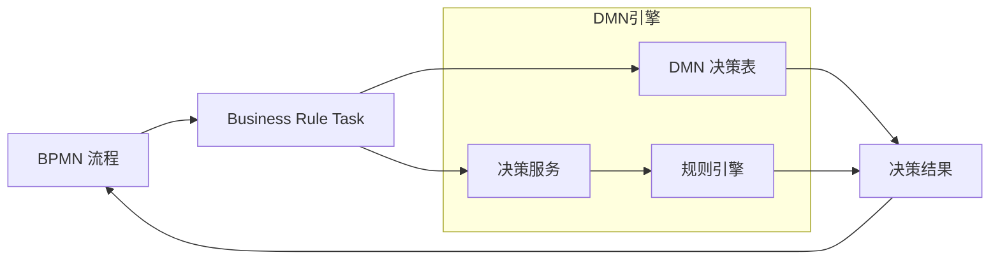
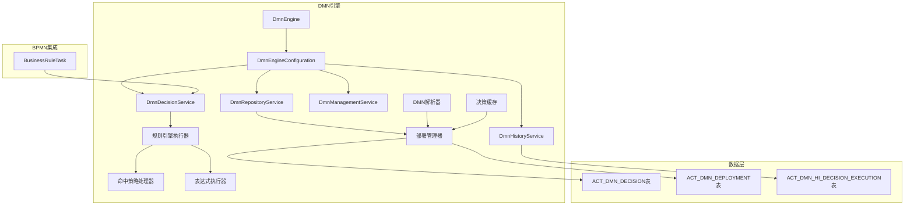

# Flowable DMN决策引擎补充设计文档

## 文档说明

本文档补充设计 Flowable DMN（Decision Model and Notation）决策引擎功能，基于 OMG DMN 1.1 国际标准实现。DMN决策引擎是与 BPMN 引擎解耦、可独立运行、可深度嵌入流程的标准化决策执行内核。

**核心价值**：
- 把业务规则从代码里抽出来，变成可视化、可动态修改、可审计、可复用的决策表
- 彻底解决流程中「规则频繁变、改代码麻烦、难以追溯」的痛点

---

## 一、DMN 概述

### 1.1 什么是 DMN

DMN（Decision Model and Notation）是 OMG（Object Management Group）制定的国际标准，用于描述和建模业务决策。它提供了一种标准化的方式来：

- **可视化决策逻辑**：使用决策表图形化表示业务规则
- **标准化决策执行**：统一的决策执行语义
- **可互操作性**：不同系统间可以交换决策模型

### 1.2 DMN 核心概念

| 概念 | 描述 | 示例 |
|-----|------|------|
| **Decision** | 决策，表示一个业务决策点 | "是否批准贷款" |
| **Decision Table** | 决策表，表示决策的逻辑规则 | 输入条件→输出结果 |
| **Input Clause** | 输入子句，决策表的输入条件 | 年龄、收入、信用分数 |
| **Output Clause** | 输出子句，决策表的输出结果 | 审批结果、额度 |
| **Rule** | 规则，决策表中的一行 | 年龄>18 AND 收入>5000 → 批准 |
| **Hit Policy** | 命中策略，规则匹配策略 | UNIQUE, FIRST, PRIORITY, ANY |
| **Decision Service** | 决策服务，多个决策的组合 | 综合风险评估服务 |
| **Builtin Aggregator** | 内置聚合器，COLLECT策略的聚合函数 | SUM, COUNT, MIN, MAX |

### 1.3 DMN 与 BPMN 的集成



---

## 二、架构设计

### 2.1 模块架构



### 2.2 核心服务

| 服务 | 职责 | 主要方法 |
|-----|------|---------|
| **DmnRepositoryService** | 决策表部署和管理 | createDeployment, getDecision, createDecisionQuery |
| **DmnDecisionService** | 决策执行 | executeDecision, executeDecisionService, executeWithAuditTrail |
| **DmnHistoryService** | 历史执行记录查询 | createHistoricDecisionExecutionQuery |
| **DmnManagementService** | 引擎管理和维护 | getTableName, executeCustomSql |

---

## 三、命中策略（Hit Policy）设计

### 3.1 命中策略类型（与Flowable保持一致）

| 命中策略 | 枚举值 | 描述 | 使用场景 |
|---------|--------|------|---------|
| **UNIQUE** | `UNIQUE` | 只能有一条规则匹配，多条匹配则报错 | 互斥规则场景 |
| **FIRST** | `FIRST` | 返回第一条匹配的规则，找到后停止评估 | 优先级规则 |
| **PRIORITY** | `PRIORITY` | 按输出优先级返回最高优先级结果 | 有优先级的决策 |
| **ANY** | `ANY` | 允许多条匹配，但输出必须相同 | 宽松匹配场景 |
| **COLLECT** | `COLLECT` | 收集所有匹配规则的输出（支持聚合器） | 多结果场景 |
| **RULE ORDER** | `RULE ORDER` | 按规则顺序返回所有匹配结果 | 顺序敏感场景 |
| **OUTPUT ORDER** | `OUTPUT ORDER` | 按输出值排序返回所有匹配结果 | 需要排序的场景 |
| **UNORDERED** | `UNORDERED` | 返回所有匹配结果，无特定顺序 | 不关心顺序的场景 |

### 3.2 COLLECT策略聚合器

COLLECT策略支持以下内置聚合器（`BuiltinAggregator`）：

| 聚合器 | 描述 | 输出类型要求 |
|--------|------|-------------|
| **SUM** | 求和 | number |
| **COUNT** | 计数 | number |
| **MIN** | 最小值 | number |
| **MAX** | 最大值 | number |

**注意**：使用聚合器时，只能有单个输出子句，且输出类型必须为`number`。

### 3.3 命中策略行为接口设计（与Flowable保持一致）

Flowable采用行为分离设计，将命中策略的不同职责拆分为多个接口：

```typescript
// dmn/services/hit-policy/hit-policy-behavior.ts

/**
 * 命中策略基础接口
 */
export interface HitPolicyBehavior {
  getHitPolicyName(): string;
}

/**
 * 继续评估行为接口
 * 控制找到匹配规则后是否继续评估后续规则
 */
export interface ContinueEvaluatingBehavior extends HitPolicyBehavior {
  shouldContinueEvaluating(ruleResult: boolean): boolean;
}

/**
 * 评估规则有效性行为接口
 * 用于UNIQUE等需要验证规则唯一性的策略
 */
export interface EvaluateRuleValidityBehavior extends HitPolicyBehavior {
  evaluateRuleValidity(ruleNumber: number, executionContext: RuleExecutionContext): void;
}

/**
 * 组装规则结果行为接口
 * 处理单个规则的输出结果
 */
export interface ComposeRuleResultBehavior extends HitPolicyBehavior {
  composeRuleResult(ruleNumber: number, outputName: string, outputValue: any, executionContext: RuleExecutionContext): void;
}

/**
 * 组装决策结果行为接口
 * 处理最终决策结果的组装
 */
export interface ComposeDecisionResultBehavior extends HitPolicyBehavior {
  composeDecisionResults(executionContext: RuleExecutionContext): void;
  updateStackWithDecisionResults(decisionResults: Record<string, any>[], executionContext: RuleExecutionContext): void;
}
```

### 3.4 抽象命中策略基类

```typescript
// dmn/services/hit-policy/abstract-hit-policy.ts

/**
 * 命中策略抽象基类（与Flowable AbstractHitPolicy保持一致）
 */
export abstract class AbstractHitPolicy implements 
  ContinueEvaluatingBehavior, 
  ComposeRuleResultBehavior, 
  ComposeDecisionResultBehavior {
  
  protected multipleResults: boolean = false;

  constructor();
  constructor(multipleResults: boolean);
  constructor(multipleResults?: boolean) {
    if (multipleResults !== undefined) {
      this.multipleResults = multipleResults;
    }
  }

  /**
   * 获取命中策略名称
   */
  abstract getHitPolicyName(): string;

  /**
   * 默认继续评估行为：继续评估所有规则
   */
  shouldContinueEvaluating(ruleResult: boolean): boolean {
    return true;
  }

  /**
   * 默认规则结果组装：添加到规则结果集合
   */
  composeRuleResult(ruleNumber: number, outputName: string, outputValue: any, executionContext: RuleExecutionContext): void {
    executionContext.addRuleResult(ruleNumber, outputName, outputValue);
  }

  /**
   * 默认决策结果组装：将所有规则结果转为决策结果
   */
  composeDecisionResults(executionContext: RuleExecutionContext): void {
    const decisionResults = Array.from(executionContext.getRuleResults().values());
    this.updateStackWithDecisionResults(decisionResults, executionContext);
    
    const auditContainer = executionContext.getAuditContainer();
    auditContainer.decisionResult = decisionResults;
    auditContainer.multipleResults = this.multipleResults;
  }

  /**
   * 更新执行堆栈变量
   */
  updateStackWithDecisionResults(decisionResults: Record<string, any>[], executionContext: RuleExecutionContext): void {
    decisionResults.forEach(result => {
      Object.entries(result).forEach(([key, value]) => {
        executionContext.getStackVariables().set(key, value);
      });
    });
  }
}
```

### 3.5 具体命中策略实现

#### 3.5.1 UNIQUE策略

```typescript
// dmn/services/hit-policy/hit-policy-unique.ts

/**
 * UNIQUE命中策略（与Flowable HitPolicyUnique保持一致）
 * 只允许一条规则匹配，多条匹配时根据strictMode抛出异常或记录警告
 */
export class HitPolicyUnique extends AbstractHitPolicy implements EvaluateRuleValidityBehavior {
  
  getHitPolicyName(): string {
    return 'UNIQUE';
  }

  /**
   * 评估规则有效性
   * 检查是否有多条规则匹配
   */
  evaluateRuleValidity(ruleNumber: number, executionContext: RuleExecutionContext): void {
    const ruleExecutions = executionContext.getAuditContainer().ruleExecutions;
    
    for (const [entryRuleNumber, ruleExecution] of Object.entries(ruleExecutions)) {
      const entryRuleNum = parseInt(entryRuleNumber);
      if (entryRuleNum !== ruleNumber && ruleExecution.isValid) {
        const hitPolicyViolatedMessage = 
          `HitPolicy UNIQUE violated; at least rule ${ruleNumber} and rule ${entryRuleNum} are valid.`;
        
        if (executionContext.isStrictMode()) {
          // 严格模式：抛出异常
          ruleExecutions[ruleNumber].exceptionMessage = hitPolicyViolatedMessage;
          ruleExecutions[entryRuleNum].exceptionMessage = hitPolicyViolatedMessage;
          throw new FlowableException('HitPolicy UNIQUE violated.');
        } else {
          // 非严格模式：记录验证消息
          ruleExecutions[ruleNumber].validationMessage = hitPolicyViolatedMessage;
          ruleExecutions[entryRuleNum].validationMessage = hitPolicyViolatedMessage;
          break;
        }
      }
    }
  }

  /**
   * 组装决策结果
   * 非严格模式下，多条匹配时取最后一个有效结果
   */
  composeDecisionResults(executionContext: RuleExecutionContext): void {
    const ruleResults = Array.from(executionContext.getRuleResults().values());
    let decisionResults: Record<string, any>[];

    if (ruleResults.length > 1 && !executionContext.isStrictMode()) {
      // 非严格模式：合并所有结果，取最后一个有效值
      const lastResult: Record<string, any> = {};
      
      for (const ruleResult of ruleResults) {
        for (const [key, value] of Object.entries(ruleResult)) {
          if (value !== null && value !== undefined) {
            lastResult[key] = value;
          }
        }
      }
      
      executionContext.getAuditContainer().validationMessage = 
        'HitPolicy UNIQUE violated; multiple valid rules. Setting last valid rule result as final result.';
      decisionResults = [lastResult];
    } else {
      decisionResults = ruleResults;
    }

    this.updateStackWithDecisionResults(decisionResults, executionContext);
    executionContext.getAuditContainer().decisionResult = decisionResults;
  }
}
```

#### 3.5.2 FIRST策略

```typescript
// dmn/services/hit-policy/hit-policy-first.ts

/**
 * FIRST命中策略（与Flowable HitPolicyFirst保持一致）
 * 返回第一条匹配的规则，找到后停止评估
 */
export class HitPolicyFirst extends AbstractHitPolicy {
  
  getHitPolicyName(): string {
    return 'FIRST';
  }

  /**
   * 找到匹配规则后停止评估
   */
  shouldContinueEvaluating(ruleResult: boolean): boolean {
    return !ruleResult; // 如果规则匹配，停止评估
  }
}
```

#### 3.5.3 COLLECT策略

```typescript
// dmn/services/hit-policy/hit-policy-collect.ts

/**
 * COLLECT命中策略（与Flowable HitPolicyCollect保持一致）
 * 收集所有匹配规则的输出，支持聚合器
 */
export class HitPolicyCollect extends AbstractHitPolicy {
  
  getHitPolicyName(): string {
    return 'COLLECT';
  }

  /**
   * 组装决策结果
   * 支持无聚合器和有聚合器两种模式
   */
  composeDecisionResults(executionContext: RuleExecutionContext): void {
    const decisionResults: Record<string, any>[] = [];
    const ruleResults = executionContext.getRuleResults();
    
    if (ruleResults && ruleResults.size > 0) {
      const aggregator = executionContext.getAggregator();
      
      if (aggregator === null || aggregator === undefined) {
        // 无聚合器：返回所有匹配结果
        decisionResults.push(...Array.from(ruleResults.values()));
      } else {
        // 有聚合器：执行聚合计算
        const outputValuesEntry = this.composeOutputValues(executionContext);
        
        if (outputValuesEntry) {
          const [outputName, values] = outputValuesEntry;
          let aggregatedValue: number;
          
          switch (aggregator) {
            case 'SUM':
              aggregatedValue = this.aggregateSum(values);
              break;
            case 'MIN':
              aggregatedValue = this.aggregateMin(values);
              break;
            case 'MAX':
              aggregatedValue = this.aggregateMax(values);
              break;
            case 'COUNT':
              aggregatedValue = this.aggregateCount(values);
              break;
            default:
              throw new FlowableException(`Unknown aggregator: ${aggregator}`);
          }
          
          decisionResults.push({ [outputName]: aggregatedValue });
        }
      }
    }

    this.updateStackWithDecisionResults(decisionResults, executionContext);
    
    executionContext.getAuditContainer().decisionResult = decisionResults;
    // 无聚合器时返回多个结果
    executionContext.getAuditContainer().multipleResults = 
      (aggregator === null || aggregator === undefined);
  }

  /**
   * 组装输出值列表
   */
  private composeOutputValues(executionContext: RuleExecutionContext): [string, number[]] | null {
    let ruleResults = Array.from(executionContext.getRuleResults().values());
    
    if (executionContext.isForceDMN11()) {
      // DMN 1.1模式：去重
      const uniqueResults = new Set(ruleResults.map(r => JSON.stringify(r)));
      ruleResults = Array.from(uniqueResults).map(s => JSON.parse(s));
    }
    
    return this.createOutputDoubleValues(ruleResults);
  }

  /**
   * 创建输出数值列表
   */
  private createOutputDoubleValues(ruleResults: Record<string, any>[]): [string, number[]] | null {
    const distinctOutputValues: Map<string, number[]> = new Map();
    
    for (const ruleResult of ruleResults) {
      for (const [key, value] of Object.entries(ruleResult)) {
        if (!distinctOutputValues.has(key)) {
          distinctOutputValues.set(key, []);
        }
        distinctOutputValues.get(key)!.push(value as number);
      }
    }
    
    // 返回第一个输出子句的值
    if (distinctOutputValues.size > 0) {
      const firstEntry = distinctOutputValues.entries().next().value;
      return [firstEntry[0], firstEntry[1]];
    }
    
    return null;
  }

  private aggregateSum(values: number[]): number {
    return values.reduce((sum, val) => sum + val, 0);
  }

  private aggregateMin(values: number[]): number {
    return Math.min(...values);
  }

  private aggregateMax(values: number[]): number {
    return Math.max(...values);
  }

  private aggregateCount(values: number[]): number {
    return values.length;
  }
}
```

#### 3.5.4 ANY策略

```typescript
// dmn/services/hit-policy/hit-policy-any.ts

/**
 * ANY命中策略（与Flowable HitPolicyAny保持一致）
 * 允许多条匹配，但所有输出必须相同
 */
export class HitPolicyAny extends AbstractHitPolicy {
  
  getHitPolicyName(): string {
    return 'ANY';
  }

  composeDecisionResults(executionContext: RuleExecutionContext): void {
    const ruleResults = executionContext.getRuleResults();
    let validationFailed = false;
    
    // 检查所有匹配规则的输出是否相同
    const ruleResultsArray = Array.from(ruleResults.entries());
    
    for (let i = 0; i < ruleResultsArray.length; i++) {
      for (let j = i + 1; j < ruleResultsArray.length; j++) {
        const [ruleNumber1, outputValues1] = ruleResultsArray[i];
        const [ruleNumber2, outputValues2] = ruleResultsArray[j];
        
        // 比较输出值
        for (const [outputName, value1] of Object.entries(outputValues1)) {
          const value2 = outputValues2[outputName];
          
          if (value1 !== value2) {
            const hitPolicyViolatedMessage = 
              `HitPolicy ANY violated; both rule ${ruleNumber1} and ${ruleNumber2} are valid but output ${outputName} has different values.`;
            
            if (executionContext.isStrictMode()) {
              executionContext.getAuditContainer().ruleExecutions[ruleNumber1].exceptionMessage = hitPolicyViolatedMessage;
              executionContext.getAuditContainer().ruleExecutions[ruleNumber2].exceptionMessage = hitPolicyViolatedMessage;
              throw new FlowableException('HitPolicy ANY violated.');
            } else {
              executionContext.getAuditContainer().ruleExecutions[ruleNumber1].validationMessage = hitPolicyViolatedMessage;
              executionContext.getAuditContainer().ruleExecutions[ruleNumber2].validationMessage = hitPolicyViolatedMessage;
              validationFailed = true;
            }
          }
        }
      }
    }
    
    // 非严格模式下，取最后一个有效结果
    if (!executionContext.isStrictMode() && validationFailed) {
      executionContext.getAuditContainer().validationMessage = 
        'HitPolicy ANY violated; multiple valid rules with different outcomes. Setting last valid rule result as final result.';
    }
    
    const decisionResults = [ruleResultsArray[ruleResultsArray.length - 1]?.[1] || {}];
    this.updateStackWithDecisionResults(decisionResults, executionContext);
    executionContext.getAuditContainer().decisionResult = decisionResults;
  }
}
```

#### 3.5.5 RULE ORDER策略

```typescript
// dmn/services/hit-policy/hit-policy-rule-order.ts

/**
 * RULE ORDER命中策略（与Flowable HitPolicyRuleOrder保持一致）
 * 按规则顺序返回所有匹配结果
 */
export class HitPolicyRuleOrder extends AbstractHitPolicy {
  
  constructor() {
    super(true); // 多结果模式
  }

  getHitPolicyName(): string {
    return 'RULE ORDER';
  }
}
```

#### 3.5.6 OUTPUT ORDER策略

```typescript
// dmn/services/hit-policy/hit-policy-output-order.ts

/**
 * OUTPUT ORDER命中策略（与Flowable HitPolicyOutputOrder保持一致）
 * 按输出值优先级排序返回所有匹配结果
 */
export class HitPolicyOutputOrder extends AbstractHitPolicy {
  
  constructor() {
    super(true); // 多结果模式
  }

  getHitPolicyName(): string {
    return 'OUTPUT ORDER';
  }

  composeDecisionResults(executionContext: RuleExecutionContext): void {
    const decisionResults: Record<string, any>[] = [];
    const ruleResults = Array.from(executionContext.getRuleResults().values());
    
    if (ruleResults.length > 0) {
      // 获取输出值优先级列表
      const outputValues = executionContext.getOutputClauseOutputValues();
      const outputValuesPresent = outputValues && outputValues.length > 0;
      
      if (!outputValuesPresent) {
        const hitPolicyViolatedMessage = 'HitPolicy OUTPUT ORDER violated; no output values present';
        
        if (executionContext.isStrictMode()) {
          throw new FlowableException(hitPolicyViolatedMessage);
        } else {
          executionContext.getAuditContainer().validationMessage = 
            `${hitPolicyViolatedMessage}. Setting first valid result as final result.`;
          decisionResults.push(...ruleResults);
        }
      } else {
        // 按输出值优先级排序
        const sortedResults = this.sortByOutputValues(ruleResults, outputValues!);
        decisionResults.push(...sortedResults);
      }
    }

    this.updateStackWithDecisionResults(decisionResults, executionContext);
    executionContext.getAuditContainer().decisionResult = decisionResults;
  }

  /**
   * 按输出值优先级排序
   */
  private sortByOutputValues(
    results: Record<string, any>[], 
    outputValues: any[]
  ): Record<string, any>[] {
    return results.sort((a, b) => {
      const aValue = Object.values(a)[0];
      const bValue = Object.values(b)[0];
      
      const aIndex = outputValues.indexOf(aValue);
      const bIndex = outputValues.indexOf(bValue);
      
      // 优先级高的（索引小的）排在前面
      return aIndex - bIndex;
    });
  }
}
```

#### 3.5.7 PRIORITY策略

```typescript
// dmn/services/hit-policy/hit-policy-priority.ts

/**
 * PRIORITY命中策略（与Flowable HitPolicyPriority保持一致）
 * 按输出优先级返回最高优先级结果
 */
export class HitPolicyPriority extends AbstractHitPolicy {
  
  getHitPolicyName(): string {
    return 'PRIORITY';
  }

  composeDecisionResults(executionContext: RuleExecutionContext): void {
    const ruleResults = Array.from(executionContext.getRuleResults().values());
    
    if (ruleResults.length === 0) {
      this.updateStackWithDecisionResults([], executionContext);
      executionContext.getAuditContainer().decisionResult = [];
      return;
    }
    
    // 获取输出值优先级列表
    const outputValues = executionContext.getOutputClauseOutputValues();
    const outputValuesPresent = outputValues && outputValues.length > 0;
    
    if (!outputValuesPresent) {
      const hitPolicyViolatedMessage = 'HitPolicy PRIORITY violated; no output values present';
      
      if (executionContext.isStrictMode()) {
        throw new FlowableException(hitPolicyViolatedMessage);
      } else {
        executionContext.getAuditContainer().validationMessage = 
          `${hitPolicyViolatedMessage}. Setting first valid result as final result.`;
        this.updateStackWithDecisionResults([ruleResults[0]], executionContext);
        executionContext.getAuditContainer().decisionResult = [ruleResults[0]];
        return;
      }
    }
    
    // 按优先级排序，取最高优先级结果
    const sortedResults = this.sortByOutputValues(ruleResults, outputValues!);
    const decisionResults = [sortedResults[0]];
    
    this.updateStackWithDecisionResults(decisionResults, executionContext);
    executionContext.getAuditContainer().decisionResult = decisionResults;
  }

  private sortByOutputValues(
    results: Record<string, any>[], 
    outputValues: any[]
  ): Record<string, any>[] {
    return results.sort((a, b) => {
      const aValue = Object.values(a)[0];
      const bValue = Object.values(b)[0];
      
      const aIndex = outputValues.indexOf(aValue);
      const bIndex = outputValues.indexOf(bValue);
      
      return aIndex - bIndex;
    });
  }
}
```

---

## 四、规则引擎执行器设计

### 4.1 规则引擎执行服务（与Flowable保持一致）

```typescript
// dmn/services/rule-engine-executor.service.ts
import { Injectable, Logger } from '@nestjs/common';

import { Decision, DecisionRule, DecisionTable } from '../models/decision.model';
import { DecisionExecutionAuditContainer } from '../models/audit.model';
import { AbstractHitPolicy } from './hit-policy/abstract-hit-policy';
import { ExpressionManager } from '../../core/services/expression-manager.service';

/**
 * 规则执行上下文（与Flowable ELExecutionContext对应）
 */
export interface RuleExecutionContext {
  decision: Decision;
  variables: Map<string, any>;
  stackVariables: Map<string, any>;
  auditContainer: DecisionExecutionAuditContainer;
  ruleResults: Map<number, Record<string, any>>;
  aggregator: string | null;
  strictMode: boolean;
  forceDMN11: boolean;
  
  addRuleResult(ruleNumber: number, outputName: string, outputValue: any): void;
  getRuleResults(): Map<number, Record<string, any>>;
  getStackVariables(): Map<string, any>;
  getAuditContainer(): DecisionExecutionAuditContainer;
  getAggregator(): string | null;
  isStrictMode(): boolean;
  isForceDMN11(): boolean;
  getOutputClauseOutputValues(): any[] | null;
}

/**
 * 规则引擎执行器（与Flowable RuleEngineExecutorImpl对应）
 */
@Injectable()
export class RuleEngineExecutor {
  private readonly logger = new Logger(RuleEngineExecutor.name);
  
  private hitPolicyBehaviors: Map<string, AbstractHitPolicy>;
  private expressionManager: ExpressionManager;
  private strictMode: boolean = true;

  constructor(
    hitPolicyBehaviors: Map<string, AbstractHitPolicy>,
    expressionManager: ExpressionManager,
    strictMode: boolean = true
  ) {
    this.hitPolicyBehaviors = hitPolicyBehaviors;
    this.expressionManager = expressionManager;
    this.strictMode = strictMode;
  }

  /**
   * 执行决策（与Flowable execute方法对应）
   */
  execute(decision: Decision, executeDecisionContext: ExecuteDecisionContext): DecisionExecutionAuditContainer {
    if (!decision) {
      throw new Error('no decision provided');
    }

    const decisionTable = decision.expression as DecisionTable;
    if (!decisionTable) {
      throw new Error('no decision table present in decision');
    }

    // 创建执行上下文和审计跟踪
    const executionContext = this.createExecutionContext(decision, executeDecisionContext);

    try {
      // 健全性检查
      this.sanityCheckDecisionTable(decisionTable);

      // 评估决策表
      this.evaluateDecisionTable(decisionTable, executionContext);

    } catch (error) {
      this.logger.error('decision table execution failed', error);
      executionContext.getAuditContainer().failed = true;
      executionContext.getAuditContainer().exceptionMessage = this.getExceptionMessage(error);
    } finally {
      // 结束审计跟踪
      executionContext.getAuditContainer().endTime = new Date();
    }

    return executionContext.getAuditContainer();
  }

  /**
   * 评估决策表（与Flowable evaluateDecisionTable方法对应）
   */
  private evaluateDecisionTable(decisionTable: DecisionTable, executionContext: RuleExecutionContext): void {
    if (!decisionTable.rules || decisionTable.rules.length === 0) {
      throw new Error('no rules present in table');
    }

    this.logger.debug(`Start table evaluation: ${decisionTable.id}`);

    const hitPolicy = this.getHitPolicyBehavior(decisionTable.hitPolicy);
    const validRuleOutputEntries: Map<number, any[]> = new Map();

    // 评估每条规则的条件
    for (const rule of decisionTable.rules) {
      const ruleResult = this.executeRule(rule, executionContext);

      if (ruleResult) {
        // 评估命中策略有效性（如UNIQUE策略）
        if (this.isEvaluateRuleValidityBehavior(hitPolicy)) {
          (hitPolicy as any).evaluateRuleValidity(rule.ruleNumber, executionContext);
        }

        // 添加有效规则的输出
        validRuleOutputEntries.set(rule.ruleNumber, rule.outputEntries);
      }

      // 是否继续评估（如FIRST策略找到匹配后停止）
      if (this.isContinueEvaluatingBehavior(hitPolicy)) {
        if (!hitPolicy.shouldContinueEvaluating(ruleResult)) {
          this.logger.debug(`Stopping execution; hit policy ${decisionTable.hitPolicy} specific behaviour`);
          break;
        }
      }
    }

    // 组装规则结论
    for (const [ruleNumber, outputEntries] of validRuleOutputEntries) {
      this.executeOutputEntryAction(ruleNumber, outputEntries, decisionTable.hitPolicy, executionContext);
    }

    // 后处理：组装决策结果
    if (this.isComposeDecisionResultBehavior(hitPolicy)) {
      hitPolicy.composeDecisionResults!(executionContext);
    }

    this.logger.debug(`End table evaluation: ${decisionTable.id}`);
  }

  /**
   * 执行单条规则（与Flowable executeRule方法对应）
   */
  private executeRule(rule: DecisionRule, executionContext: RuleExecutionContext): boolean {
    this.logger.debug(`Start rule ${rule.ruleNumber} evaluation`);

    // 添加审计条目
    executionContext.getAuditContainer().addRuleEntry(rule);

    let conditionResult = false;

    // 遍历所有输入条件
    for (const conditionContainer of rule.inputEntries) {
      const inputEntryId = conditionContainer.id;
      conditionResult = false;

      try {
        const inputEntryText = conditionContainer.text;
        
        // 如果条件为空或"-"，结果为TRUE
        if (!inputEntryText || inputEntryText === '-') {
          conditionResult = true;
        } else {
          conditionResult = this.executeInputExpressionEvaluation(conditionContainer, executionContext);
        }

        // 添加审计条目
        executionContext.getAuditContainer().addInputEntry(
          rule.ruleNumber, 
          inputEntryId, 
          conditionResult
        );

        this.logger.debug(`input entry ${inputEntryId}: ${conditionContainer.inputExpression?.text} ${inputEntryText} = ${conditionResult}`);

      } catch (error) {
        executionContext.getAuditContainer().addInputEntry(
          rule.ruleNumber, 
          inputEntryId, 
          this.getExceptionMessage(error), 
          null
        );
        throw error;
      }

      // 如果条件为false，退出评估
      if (!conditionResult) {
        break;
      }
    }

    if (conditionResult) {
      executionContext.getAuditContainer().markRuleValid(rule.ruleNumber);
    }

    executionContext.getAuditContainer().markRuleEnd(rule.ruleNumber);

    this.logger.debug(`End rule ${rule.ruleNumber} evaluation`);
    return conditionResult;
  }

  /**
   * 执行输入表达式评估
   */
  private executeInputExpressionEvaluation(
    conditionContainer: any, 
    executionContext: RuleExecutionContext
  ): boolean {
    // 使用表达式管理器执行表达式
    return this.expressionManager.evaluateBoolean(
      conditionContainer.inputExpression?.text,
      conditionContainer.text,
      executionContext.getStackVariables()
    );
  }

  /**
   * 执行输出条目动作
   */
  private executeOutputEntryAction(
    ruleNumber: number, 
    ruleOutputContainers: any[], 
    hitPolicy: string, 
    executionContext: RuleExecutionContext
  ): void {
    this.logger.debug('Start conclusion processing');

    for (const clauseContainer of ruleOutputContainers) {
      this.composeOutputEntryResult(ruleNumber, clauseContainer, hitPolicy, executionContext);
    }

    this.logger.debug('End conclusion processing');
  }

  /**
   * 组装输出条目结果
   */
  private composeOutputEntryResult(
    ruleNumber: number, 
    ruleClauseContainer: any, 
    hitPolicy: string, 
    executionContext: RuleExecutionContext
  ): void {
    const outputClause = ruleClauseContainer.outputClause;
    const outputVariableId = outputClause.name;
    const outputVariableType = outputClause.typeRef;
    const outputEntryExpression = ruleClauseContainer.outputEntry;

    this.logger.debug(`Start evaluation conclusion ${outputClause.outputNumber} of valid rule ${ruleNumber}`);

    if (outputEntryExpression?.text) {
      let executionVariable: any = null;
      
      try {
        // 执行输出表达式
        const resultValue = this.expressionManager.evaluate(
          outputEntryExpression.text,
          executionContext.getStackVariables()
        );
        
        // 类型转换
        executionVariable = this.getExecutionVariable(outputVariableType, resultValue);

        // 更新执行上下文
        executionContext.getStackVariables().set(outputVariableId, executionVariable);

        // 创建结果
        if (this.isComposeRuleResultBehavior(this.getHitPolicyBehavior(hitPolicy))) {
          this.getHitPolicyBehavior(hitPolicy).composeRuleResult!(
            ruleNumber, 
            outputVariableId, 
            executionVariable, 
            executionContext
          );
        }

        // 添加审计条目
        executionContext.getAuditContainer().addOutputEntry(
          ruleNumber, 
          outputEntryExpression.id, 
          executionVariable
        );
        executionContext.getAuditContainer().addDecisionResultType(outputVariableId, outputVariableType);

        if (executionVariable !== null) {
          this.logger.debug(`Created conclusion result: ${outputVariableId} with value ${resultValue}`);
        } else {
          this.logger.warn('Could not create conclusion result');
        }

      } catch (error) {
        // 清除结果变量
        executionContext.getRuleResults().clear();

        executionContext.getAuditContainer().addOutputEntry(
          ruleNumber, 
          outputEntryExpression.id, 
          this.getExceptionMessage(error), 
          executionVariable
        );
        throw error;
      }
    } else {
      this.logger.debug('Expression is empty');
      executionContext.getAuditContainer().addOutputEntry(
        ruleNumber, 
        outputEntryExpression.id, 
        null
      );
    }

    this.logger.debug(`End evaluation conclusion ${outputClause.outputNumber} of valid rule ${ruleNumber}`);
  }

  /**
   * 类型转换（与Flowable ExecutionVariableFactory对应）
   */
  private getExecutionVariable(typeRef: string, resultValue: any): any {
    if (resultValue === null || resultValue === undefined) {
      return resultValue;
    }

    switch (typeRef?.toLowerCase()) {
      case 'string':
        return String(resultValue);
      case 'number':
      case 'integer':
        return Number(resultValue);
      case 'boolean':
        return Boolean(resultValue);
      case 'date':
        return new Date(resultValue);
      default:
        return resultValue;
    }
  }

  /**
   * 决策表健全性检查（与Flowable sanityCheckDecisionTable对应）
   */
  private sanityCheckDecisionTable(decisionTable: DecisionTable): void {
    // 检查COLLECT策略的聚合配置
    if (decisionTable.hitPolicy === 'COLLECT' && 
        decisionTable.aggregation && 
        decisionTable.outputs) {
      
      if (decisionTable.outputs.length > 1) {
        throw new FlowableException(
          `HitPolicy: COLLECT has aggregation: ${decisionTable.aggregation} and multiple outputs. This is not supported`
        );
      }
      
      if (decisionTable.outputs[0].typeRef !== 'number') {
        throw new FlowableException(
          `HitPolicy: COLLECT has aggregation: ${decisionTable.aggregation} needs output type number`
        );
      }
    }
  }

  /**
   * 获取命中策略处理器
   */
  private getHitPolicyBehavior(hitPolicy: string): AbstractHitPolicy {
    const behavior = this.hitPolicyBehaviors.get(hitPolicy);
    
    if (!behavior) {
      const errorMessage = `HitPolicy behavior: ${hitPolicy} not configured`;
      this.logger.error(errorMessage);
      throw new FlowableException(errorMessage);
    }
    
    return behavior;
  }

  /**
   * 行为接口检查方法
   */
  private isContinueEvaluatingBehavior(behavior: AbstractHitPolicy): boolean {
    return 'shouldContinueEvaluating' in behavior;
  }

  private isEvaluateRuleValidityBehavior(behavior: AbstractHitPolicy): boolean {
    return 'evaluateRuleValidity' in behavior;
  }

  private isComposeRuleResultBehavior(behavior: AbstractHitPolicy): boolean {
    return 'composeRuleResult' in behavior;
  }

  private isComposeDecisionResultBehavior(behavior: AbstractHitPolicy): boolean {
    return 'composeDecisionResults' in behavior;
  }

  /**
   * 获取异常消息
   */
  private getExceptionMessage(error: any): string {
    if (error.cause?.message) {
      return error.cause.message;
    }
    return error.message || String(error);
  }
}
```

---

## 五、DMN 服务实现

### 5.1 决策服务（与Flowable DmnDecisionService保持一致）

```typescript
// dmn/services/dmn-decision.service.ts
import { Injectable, Logger } from '@nestjs/common';

/**
 * 决策执行构建器（与Flowable ExecuteDecisionBuilder对应）
 */
export interface ExecuteDecisionBuilder {
  decisionKey: string;
  parentDeploymentId?: string;
  instanceId?: string;          // 流程实例ID
  executionId?: string;         // 执行ID
  activityId?: string;          // 活动ID
  scopeType?: string;           // 作用域类型
  tenantId?: string;
  fallbackToDefaultTenant?: boolean;  // 是否回退到默认租户
  variables: Record<string, any>;
  disableHistory?: boolean;
}

/**
 * DMN决策服务（与Flowable DmnDecisionService接口对应）
 */
@Injectable()
export class DmnDecisionService {
  private readonly logger = new Logger(DmnDecisionService.name);

  constructor(
    private readonly ruleEngineExecutor: RuleEngineExecutor,
    private readonly decisionRepository: DecisionRepository,
    private readonly historicRepository: HistoricDecisionExecutionRepository,
  ) {}

  /**
   * 创建决策执行构建器
   */
  createExecuteDecisionBuilder(): ExecuteDecisionBuilder {
    return {
      decisionKey: '',
      variables: {},
    };
  }

  /**
   * 执行决策（返回多个结果）
   * 对应Flowable: executeDecision()
   */
  async executeDecision(builder: ExecuteDecisionBuilder): Promise<Record<string, any>[]> {
    const context = this.buildExecuteContext(builder);
    const decision = await this.getDecision(context);
    const auditContainer = await this.ruleEngineExecutor.execute(decision, context);

    // 保存历史记录
    if (!context.disableHistory) {
      await this.persistHistoricExecution(decision, context, auditContainer);
    }

    return auditContainer.decisionResult || [];
  }

  /**
   * 执行决策服务
   * 对应Flowable: executeDecisionService()
   */
  async executeDecisionService(builder: ExecuteDecisionBuilder): Promise<Record<string, Record<string, any>[]>> {
    // 实现决策服务执行逻辑
    // 决策服务包含多个输出决策
    const results: Record<string, Record<string, any>[]> = {};
    // ... 实现省略
    return results;
  }

  /**
   * 执行决策（带审计跟踪）
   * 对应Flowable: executeWithAuditTrail() / executeDecisionWithAuditTrail()
   */
  async executeWithAuditTrail(builder: ExecuteDecisionBuilder): Promise<DecisionExecutionAuditContainer> {
    const context = this.buildExecuteContext(builder);
    const decision = await this.getDecision(context);
    const auditContainer = await this.ruleEngineExecutor.execute(decision, context);

    if (!context.disableHistory) {
      await this.persistHistoricExecution(decision, context, auditContainer);
    }

    return auditContainer;
  }

  /**
   * 执行决策（单结果）
   * 对应Flowable: executeWithSingleResult() / executeDecisionWithSingleResult()
   */
  async executeWithSingleResult(builder: ExecuteDecisionBuilder): Promise<Record<string, any>> {
    const results = await this.executeDecision(builder);
    
    if (!results || results.length === 0) {
      throw new FlowableException('No results from decision execution');
    }

    if (results.length > 1) {
      throw new FlowableException('Decision returned multiple results, but single result expected');
    }

    return results[0];
  }

  /**
   * 执行决策服务（单结果）
   * 对应Flowable: executeDecisionServiceWithSingleResult()
   */
  async executeDecisionServiceWithSingleResult(builder: ExecuteDecisionBuilder): Promise<Record<string, any>> {
    const results = await this.executeDecisionService(builder);
    
    // 合并所有输出决策的结果
    const mergedResult: Record<string, any> = {};
    for (const [, decisionResult] of Object.entries(results)) {
      if (decisionResult.length > 0) {
        Object.assign(mergedResult, decisionResult[0]);
      }
    }
    
    return mergedResult;
  }

  /**
   * 执行决策服务（带审计跟踪）
   * 对应Flowable: executeDecisionServiceWithAuditTrail()
   */
  async executeDecisionServiceWithAuditTrail(builder: ExecuteDecisionBuilder): Promise<DecisionServiceExecutionAuditContainer> {
    // 实现决策服务带审计跟踪执行
    // ... 实现省略
    return {} as DecisionServiceExecutionAuditContainer;
  }

  // ... 其他辅助方法
}
```

### 5.2 仓库服务（与Flowable DmnRepositoryService保持一致）

```typescript
// dmn/services/dmn-repository.service.ts
import { Injectable, Logger } from '@nestjs/common';

/**
 * DMN仓库服务（与Flowable DmnRepositoryService接口对应）
 */
@Injectable()
export class DmnRepositoryService {
  private readonly logger = new Logger(DmnRepositoryService.name);

  /**
   * 创建部署构建器
   */
  createDeployment(): DmnDeploymentBuilder {
    return new DmnDeploymentBuilderImpl();
  }

  /**
   * 删除部署
   */
  async deleteDeployment(deploymentId: string): Promise<void> {
    // 实现删除部署逻辑
  }

  /**
   * 创建决策查询
   */
  createDecisionQuery(): DmnDecisionQuery {
    return new DmnDecisionQueryImpl();
  }

  /**
   * 创建原生决策查询
   */
  createNativeDecisionQuery(): NativeDecisionQuery {
    return new NativeDecisionQueryImpl();
  }

  /**
   * 设置部署分类
   */
  async setDeploymentCategory(deploymentId: string, category: string): Promise<void> {
    // 实现设置分类逻辑
  }

  /**
   * 设置部署租户ID
   */
  async setDeploymentTenantId(deploymentId: string, newTenantId: string): Promise<void> {
    // 实现设置租户ID逻辑
  }

  /**
   * 更改部署父部署ID
   */
  async changeDeploymentParentDeploymentId(deploymentId: string, newParentDeploymentId: string): Promise<void> {
    // 实现更改父部署ID逻辑
  }

  /**
   * 获取部署资源名称列表
   */
  async getDeploymentResourceNames(deploymentId: string): Promise<string[]> {
    // 实现获取资源名称列表逻辑
    return [];
  }

  /**
   * 获取资源流
   */
  async getResourceAsStream(deploymentId: string, resourceName: string): Promise<Buffer | null> {
    // 实现获取资源流逻辑
    return null;
  }

  /**
   * 创建部署查询
   */
  createDeploymentQuery(): DmnDeploymentQuery {
    return new DmnDeploymentQueryImpl();
  }

  /**
   * 获取决策
   */
  async getDecision(decisionId: string): Promise<DmnDecision | null> {
    // 实现获取决策逻辑
    return null;
  }

  /**
   * 获取DMN资源
   */
  async getDmnResource(decisionId: string): Promise<Buffer | null> {
    // 实现获取DMN资源逻辑
    return null;
  }

  /**
   * 设置决策分类
   */
  async setDecisionCategory(decisionId: string, category: string): Promise<void> {
    // 实现设置分类逻辑
  }

  /**
   * 获取DMN定义
   */
  async getDmnDefinition(decisionId: string): Promise<DmnDefinition | null> {
    // 实现获取DMN定义逻辑
    return null;
  }
}
```

---

## 六、引擎配置设计

### 6.1 引擎配置（与Flowable DmnEngineConfiguration保持一致）

```typescript
// dmn/config/dmn-engine-configuration.ts

/**
 * DMN引擎配置（与Flowable DmnEngineConfiguration对应）
 */
export class DmnEngineConfiguration {
  
  // 命中策略配置
  protected hitPolicyBehaviors: Map<string, AbstractHitPolicy>;
  protected customHitPolicyBehaviors: Map<string, AbstractHitPolicy>;
  
  // 严格模式配置（默认true）
  protected strictMode: boolean = true;
  
  // 表达式管理器
  protected expressionManager: ExpressionManager;
  
  // 其他配置
  protected clock: Clock;
  protected objectMapper: ObjectMapper;

  /**
   * 初始化命中策略
   */
  initHitPolicyBehaviors(): void {
    if (!this.hitPolicyBehaviors) {
      this.hitPolicyBehaviors = this.getDefaultHitPolicyBehaviors();
    }

    // 添加自定义命中策略
    if (this.customHitPolicyBehaviors) {
      for (const [key, value] of this.customHitPolicyBehaviors) {
        this.hitPolicyBehaviors.set(key, value);
      }
    }
  }

  /**
   * 获取默认命中策略
   */
  getDefaultHitPolicyBehaviors(): Map<string, AbstractHitPolicy> {
    const defaultHitPolicyBehaviors = new Map<string, AbstractHitPolicy>();

    // UNIQUE
    const hitPolicyUniqueBehavior = new HitPolicyUnique();
    defaultHitPolicyBehaviors.set(hitPolicyUniqueBehavior.getHitPolicyName(), hitPolicyUniqueBehavior);

    // ANY
    const hitPolicyAnyBehavior = new HitPolicyAny();
    defaultHitPolicyBehaviors.set(hitPolicyAnyBehavior.getHitPolicyName(), hitPolicyAnyBehavior);

    // FIRST
    const hitPolicyFirstBehavior = new HitPolicyFirst();
    defaultHitPolicyBehaviors.set(hitPolicyFirstBehavior.getHitPolicyName(), hitPolicyFirstBehavior);

    // RULE ORDER
    const hitPolicyRuleOrderBehavior = new HitPolicyRuleOrder();
    defaultHitPolicyBehaviors.set(hitPolicyRuleOrderBehavior.getHitPolicyName(), hitPolicyRuleOrderBehavior);

    // PRIORITY
    const hitPolicyPriorityBehavior = new HitPolicyPriority();
    defaultHitPolicyBehaviors.set(hitPolicyPriorityBehavior.getHitPolicyName(), hitPolicyPriorityBehavior);

    // OUTPUT ORDER
    const hitPolicyOutputOrderBehavior = new HitPolicyOutputOrder();
    defaultHitPolicyBehaviors.set(hitPolicyOutputOrderBehavior.getHitPolicyName(), hitPolicyOutputOrderBehavior);

    // COLLECT
    const hitPolicyCollectBehavior = new HitPolicyCollect();
    defaultHitPolicyBehaviors.set(hitPolicyCollectBehavior.getHitPolicyName(), hitPolicyCollectBehavior);

    return defaultHitPolicyBehaviors;
  }

  // Getters and Setters
  
  getHitPolicyBehaviors(): Map<string, AbstractHitPolicy> {
    return this.hitPolicyBehaviors;
  }

  setHitPolicyBehaviors(hitPolicyBehaviors: Map<string, AbstractHitPolicy>): void {
    this.hitPolicyBehaviors = hitPolicyBehaviors;
  }

  getCustomHitPolicyBehaviors(): Map<string, AbstractHitPolicy> {
    return this.customHitPolicyBehaviors;
  }

  setCustomHitPolicyBehaviors(customHitPolicyBehaviors: Map<string, AbstractHitPolicy>): void {
    this.customHitPolicyBehaviors = customHitPolicyBehaviors;
  }

  isStrictMode(): boolean {
    return this.strictMode;
  }

  setStrictMode(strictMode: boolean): void {
    this.strictMode = strictMode;
  }
}
```

---

## 七、数据库表结构（与Flowable保持一致）

### 7.1 表命名规范

Flowable DMN引擎使用 `ACT_DMN_` 前缀，字段使用下划线后缀（如 `ID_`, `KEY_`）。

```sql
-- ============================================
-- DMN部署表（对应 ACT_DMN_DEPLOYMENT）
-- ============================================
CREATE TABLE ACT_DMN_DEPLOYMENT (
    ID_ VARCHAR(255) NOT NULL,
    NAME_ VARCHAR(255) NULL,
    CATEGORY_ VARCHAR(255) NULL,
    DEPLOY_TIME_ DATETIME(3) NULL,
    TENANT_ID_ VARCHAR(255) NULL,
    PARENT_DEPLOYMENT_ID_ VARCHAR(255) NULL,
    CONSTRAINT PK_ACT_DMN_DEPLOYMENT PRIMARY KEY (ID_)
) ENGINE=InnoDB DEFAULT CHARSET=utf8mb4 COMMENT='DMN部署表';

-- ============================================
-- DMN部署资源表（对应 ACT_DMN_DEPLOYMENT_RESOURCE）
-- ============================================
CREATE TABLE ACT_DMN_DEPLOYMENT_RESOURCE (
    ID_ VARCHAR(255) NOT NULL,
    NAME_ VARCHAR(255) NULL,
    DEPLOYMENT_ID_ VARCHAR(255) NULL,
    RESOURCE_BYTES_ LONGBLOB NULL,
    CONSTRAINT PK_ACT_DMN_DEPLOYMENT_RESOURCE PRIMARY KEY (ID_),
    CONSTRAINT ACT_FK_DMN_RSRC_DPL FOREIGN KEY (DEPLOYMENT_ID_) 
        REFERENCES ACT_DMN_DEPLOYMENT (ID_)
) ENGINE=InnoDB DEFAULT CHARSET=utf8mb4 COMMENT='DMN部署资源表';

CREATE INDEX ACT_IDX_DMN_RSRC_DPL ON ACT_DMN_DEPLOYMENT_RESOURCE (DEPLOYMENT_ID_);

-- ============================================
-- DMN决策表（对应 ACT_DMN_DECISION）
-- ============================================
CREATE TABLE ACT_DMN_DECISION (
    ID_ VARCHAR(255) NOT NULL,
    NAME_ VARCHAR(255) NULL,
    VERSION_ INT NULL,
    KEY_ VARCHAR(255) NULL,
    CATEGORY_ VARCHAR(255) NULL,
    DECISION_TYPE_ VARCHAR(255) NULL,  -- 决策类型（DECISION/DECISION_SERVICE）
    DEPLOYMENT_ID_ VARCHAR(255) NULL,
    TENANT_ID_ VARCHAR(255) NULL,
    RESOURCE_NAME_ VARCHAR(255) NULL,
    DESCRIPTION_ VARCHAR(255) NULL,
    CONSTRAINT PK_ACT_DMN_DECISION_TABLE PRIMARY KEY (ID_)
) ENGINE=InnoDB DEFAULT CHARSET=utf8mb4 COMMENT='DMN决策定义表';

-- 唯一索引：Key + Version + TenantId
CREATE UNIQUE INDEX ACT_IDX_DMN_DEC_UNIQ ON ACT_DMN_DECISION(KEY_, VERSION_, TENANT_ID_);

-- ============================================
-- DMN历史决策执行记录表（对应 ACT_DMN_HI_DECISION_EXECUTION）
-- ============================================
CREATE TABLE ACT_DMN_HI_DECISION_EXECUTION (
    ID_ VARCHAR(255) NOT NULL,
    DECISION_DEFINITION_ID_ VARCHAR(255) NULL,
    DEPLOYMENT_ID_ VARCHAR(255) NULL,
    START_TIME_ DATETIME(3) NULL,
    END_TIME_ DATETIME(3) NULL,
    INSTANCE_ID_ VARCHAR(255) NULL,      -- 流程实例ID
    EXECUTION_ID_ VARCHAR(255) NULL,     -- 执行ID
    ACTIVITY_ID_ VARCHAR(255) NULL,      -- 活动ID
    SCOPE_TYPE_ VARCHAR(255) NULL,       -- 作用域类型
    FAILED_ TINYINT DEFAULT 0 NULL,      -- 是否失败
    TENANT_ID_ VARCHAR(255) NULL,
    EXECUTION_JSON_ LONGTEXT NULL,       -- 执行JSON（包含完整的审计信息）
    CONSTRAINT PK_ACT_DMN_HI_DECISION_EXECUTION PRIMARY KEY (ID_)
) ENGINE=InnoDB DEFAULT CHARSET=utf8mb4 COMMENT='DMN历史决策执行记录表';

-- 流程实例ID索引
CREATE INDEX ACT_IDX_DMN_INSTANCE_ID ON ACT_DMN_HI_DECISION_EXECUTION(INSTANCE_ID_);
```

### 7.2 EXECUTION_JSON_ 字段结构

历史执行记录使用单个 `EXECUTION_JSON_` 字段存储完整的执行信息，结构如下：

```json
{
  "decisionId": "decision_id",
  "decisionName": "决策名称",
  "decisionKey": "decision_key",
  "decisionVersion": 1,
  "hitPolicy": "UNIQUE",
  "strictMode": true,
  "startTime": "2024-01-01T10:00:00.000Z",
  "endTime": "2024-01-01T10:00:01.000Z",
  "failed": false,
  "exceptionMessage": null,
  "validationMessage": null,
  "inputVariables": {
    "age": 25,
    "income": 5000
  },
  "decisionResult": [
    {
      "result": "approved",
      "amount": 10000
    }
  ],
  "ruleExecutions": {
    "1": {
      "ruleNumber": 1,
      "ruleId": "rule_1",
      "valid": true,
      "inputEntries": [
        {
          "id": "inputEntry_1",
          "expression": "> 18",
          "result": true
        }
      ],
      "outputEntries": [
        {
          "id": "outputEntry_1",
          "expression": "\"approved\"",
          "result": "approved"
        }
      ]
    }
  },
  "inputClauses": [
    {
      "id": "input_1",
      "name": "age",
      "expression": "age",
      "typeRef": "number"
    }
  ],
  "outputClauses": [
    {
      "id": "output_1",
      "name": "result",
      "typeRef": "string",
      "outputValues": ["approved", "rejected"]
    }
  ],
  "multipleResults": false
}
```

---

## 八、BPMN 集成设计

### 8.1 Business Rule Task 执行器

```typescript
// process-instance/services/executors/business-rule-task-executor.ts
import { Injectable, Logger } from '@nestjs/common';

/**
 * Business Rule Task配置
 */
export interface BusinessRuleTaskConfig {
  decisionKey?: string;
  decisionId?: string;
  resultVariable?: string;
  tenantId?: string;
  fallbackToDefaultTenant?: boolean;
}

/**
 * Business Rule Task执行器
 */
@Injectable()
export class BusinessRuleTaskExecutor {
  private readonly logger = new Logger(BusinessRuleTaskExecutor.name);

  constructor(
    private readonly dmnDecisionService: DmnDecisionService,
    private readonly variableService: VariableService,
  ) {}

  /**
   * 执行Business Rule Task
   */
  async execute(
    execution: Execution,
    config: BusinessRuleTaskConfig
  ): Promise<void> {
    this.logger.debug(`执行Business Rule Task: ${execution.activityId}`);

    // 1. 获取决策配置
    const decisionKey = config.decisionKey || execution.activityId;
    const resultVariable = config.resultVariable || `${decisionKey}_result`;

    // 2. 获取流程变量
    const variables = await this.variableService.getVariables(execution.processInstanceId);

    // 3. 构建决策执行参数（与Flowable ExecuteDecisionBuilder对应）
    const builder: ExecuteDecisionBuilder = {
      decisionKey,
      decisionId: config.decisionId,
      tenantId: config.tenantId || execution.tenantId,
      fallbackToDefaultTenant: config.fallbackToDefaultTenant,
      variables,
      instanceId: execution.processInstanceId,
      executionId: execution.id,
      activityId: execution.activityId,
      scopeType: execution.scopeType,
    };

    // 4. 执行决策
    const decisionResult = await this.dmnDecisionService.executeDecision(builder);

    // 5. 保存决策结果到流程变量
    if (decisionResult && decisionResult.length > 0) {
      // 保存完整结果数组
      await this.variableService.setVariable(
        execution.processInstanceId,
        resultVariable,
        decisionResult,
      );

      // 如果只有一个结果，将输出字段作为单独的变量保存
      if (decisionResult.length === 1) {
        for (const [key, value] of Object.entries(decisionResult[0])) {
          await this.variableService.setVariable(
            execution.processInstanceId,
            key,
            value,
          );
        }
      }
    }

    this.logger.debug(`Business Rule Task执行完成: ${execution.activityId}`);
  }
}
```

---

## 九、API 设计（与Flowable DMN REST保持一致）

### 9.1 REST API端点设计

基于Flowable DMN REST模块（`flowable-dmn-rest`），以下是标准的REST API端点：

| 端点 | 方法 | 描述 | 对应Flowable类 |
|-----|------|------|----------------|
| `/dmn-rule/execute` | POST | 执行决策（自动检测决策或决策服务） | DmnRuleServiceResource.execute() |
| `/dmn-rule/execute/single-result` | POST | 执行决策（期望单结果） | DmnRuleServiceResource.executeWithSingleResult() |
| `/dmn-rule/execute-decision` | POST | 执行决策（明确指定决策） | DmnRuleServiceResource.executeDecision() |
| `/dmn-rule/execute-decision/single-result` | POST | 执行决策（明确指定决策，期望单结果） | DmnRuleServiceResource.executeDecisionWithSingleResult() |
| `/dmn-rule/execute-decision-service` | POST | 执行决策服务 | DmnRuleServiceResource.executeDecisionService() |
| `/dmn-rule/execute-decision-service/single-result` | POST | 执行决策服务（期望单结果） | DmnRuleServiceResource.executeDecisionServiceWithSingleResult() |

### 9.2 请求结构（与Flowable DmnRuleServiceRequest对应）

```typescript
// dmn/dto/dmn-rule-service-request.dto.ts

/**
 * DMN规则服务请求（与Flowable DmnRuleServiceRequest对应）
 */
export class DmnRuleServiceRequest {
  /**
   * 决策Key（必需）
   */
  decisionKey: string;

  /**
   * 租户ID
   */
  tenantId?: string;

  /**
   * 父部署ID
   */
  parentDeploymentId?: string;

  /**
   * 输入变量列表
   */
  inputVariables?: EngineRestVariable[];

  /**
   * 是否禁用历史记录
   */
  disableHistory?: boolean;
}

/**
 * REST变量（与Flowable EngineRestVariable对应）
 */
export interface EngineRestVariable {
  name: string;
  type: string;
  value: any;
  valueUrl?: string;
  scope?: string;
}
```

### 9.3 响应结构（与Flowable DmnRuleServiceResponse对应）

```typescript
// dmn/dto/dmn-rule-service-response.dto.ts

/**
 * DMN规则服务响应（多结果，与Flowable DmnRuleServiceResponse对应）
 */
export class DmnRuleServiceResponse {
  /**
   * 结果变量列表（二维数组，每组代表一条匹配规则的输出）
   */
  resultVariables: EngineRestVariable[][];

  /**
   * 请求URL
   */
  url?: string;
}

/**
 * DMN规则服务单结果响应（与Flowable DmnRuleServiceSingleResponse对应）
 */
export class DmnRuleServiceSingleResponse {
  /**
   * 结果变量列表（单层数组，代表单个决策结果）
   */
  resultVariables: EngineRestVariable[];

  /**
   * 请求URL
   */
  url?: string;
}
```

### 9.4 DMN Controller实现

```typescript
// dmn/controllers/dmn.controller.ts
import { Controller, Get, Post, Put, Delete, Body, Param, Query } from '@nestjs/common';

@Controller('dmn-rule')
export class DmnController {
  constructor(
    private readonly repositoryService: DmnRepositoryService,
    private readonly decisionService: DmnDecisionService,
    private readonly restResponseFactory: DmnRestResponseFactory,
  ) {}

  /**
   * 执行决策（自动检测决策或决策服务，带审计跟踪）
   * POST /dmn-rule/execute
   */
  @Post('execute')
  async execute(@Body() request: DmnRuleServiceRequest): Promise<DmnRuleServiceResponse> {
    const builder = this.buildExecuteDecisionBuilder(request);
    const auditContainer = await this.decisionService.executeWithAuditTrail(builder);
    return this.restResponseFactory.createDmnRuleServiceResponse(auditContainer);
  }

  /**
   * 执行决策（期望单结果）
   * POST /dmn-rule/execute/single-result
   */
  @Post('execute/single-result')
  async executeWithSingleResult(@Body() request: DmnRuleServiceRequest): Promise<DmnRuleServiceSingleResponse> {
    const builder = this.buildExecuteDecisionBuilder(request);
    const result = await this.decisionService.executeWithSingleResult(builder);
    return this.restResponseFactory.createDmnRuleServiceResponse(result);
  }

  /**
   * 执行决策（明确指定决策类型）
   * POST /dmn-rule/execute-decision
   */
  @Post('execute-decision')
  async executeDecision(@Body() request: DmnRuleServiceRequest): Promise<DmnRuleServiceResponse> {
    const builder = this.buildExecuteDecisionBuilder(request);
    const auditContainer = await this.decisionService.executeDecisionWithAuditTrail(builder);
    return this.restResponseFactory.createDmnRuleServiceResponse(auditContainer);
  }

  /**
   * 执行决策（明确指定决策类型，期望单结果）
   * POST /dmn-rule/execute-decision/single-result
   */
  @Post('execute-decision/single-result')
  async executeDecisionWithSingleResult(@Body() request: DmnRuleServiceRequest): Promise<DmnRuleServiceSingleResponse> {
    const builder = this.buildExecuteDecisionBuilder(request);
    const result = await this.decisionService.executeDecisionWithSingleResult(builder);
    return this.restResponseFactory.createDmnRuleServiceResponse(result);
  }

  /**
   * 执行决策服务
   * POST /dmn-rule/execute-decision-service
   */
  @Post('execute-decision-service')
  async executeDecisionService(@Body() request: DmnRuleServiceRequest): Promise<DmnRuleServiceResponse> {
    const builder = this.buildExecuteDecisionBuilder(request);
    const auditContainer = await this.decisionService.executeDecisionServiceWithAuditTrail(builder);
    return this.restResponseFactory.createDmnRuleServiceResponse(auditContainer);
  }

  /**
   * 执行决策服务（期望单结果）
   * POST /dmn-rule/execute-decision-service/single-result
   */
  @Post('execute-decision-service/single-result')
  async executeDecisionServiceWithSingleResult(@Body() request: DmnRuleServiceRequest): Promise<DmnRuleServiceSingleResponse> {
    const builder = this.buildExecuteDecisionBuilder(request);
    const result = await this.decisionService.executeDecisionServiceWithSingleResult(builder);
    return this.restResponseFactory.createDmnRuleServiceResponse(result);
  }

  /**
   * 构建决策执行构建器
   */
  private buildExecuteDecisionBuilder(request: DmnRuleServiceRequest): ExecuteDecisionBuilder {
    const builder = this.decisionService.createExecuteDecisionBuilder();
    builder.decisionKey = request.decisionKey;
    
    if (request.parentDeploymentId) {
      builder.parentDeploymentId = request.parentDeploymentId;
    }
    
    if (request.tenantId) {
      builder.tenantId = request.tenantId;
    }
    
    if (request.disableHistory) {
      builder.disableHistory = true;
    }
    
    if (request.inputVariables) {
      builder.variables = this.composeInputVariables(request.inputVariables);
    }
    
    return builder;
  }

  /**
   * 组装输入变量
   */
  private composeInputVariables(restVariables: EngineRestVariable[]): Record<string, any> {
    const inputVariables: Record<string, any> = {};
    for (const variable of restVariables) {
      if (!variable.name) {
        throw new Error('Variable name is required.');
      }
      inputVariables[variable.name] = this.restResponseFactory.getVariableValue(variable);
    }
    return inputVariables;
  }
}
```

### 9.5 Repository API端点

| 端点 | 方法 | 描述 | 对应Flowable类 |
|-----|------|------|----------------|
| `/repository/deployments` | GET | 获取部署列表 | DmnDeploymentCollectionResource |
| `/repository/deployments/{deploymentId}` | GET | 获取部署详情 | DmnDeploymentResource |
| `/repository/decisions` | GET | 获取决策列表 | DecisionCollectionResource |
| `/repository/decisions/{decisionId}` | GET | 获取决策详情 | DecisionResource |
| `/repository/decision-tables` | GET | 获取决策表列表 | DecisionTableCollectionResource |
| `/repository/decision-tables/{decisionId}` | GET | 获取决策表详情 | DecisionTableResource |

### 9.6 History API端点

| 端点 | 方法 | 描述 | 对应Flowable类 |
|-----|------|------|----------------|
| `/history/historic-decision-executions` | GET | 查询历史决策执行 | HistoryDecisionExecutionCollectionResource |
| `/history/historic-decision-executions/{executionId}` | GET | 获取历史决策执行详情 | HistoricDecisionExecutionResource |
| `/history/historic-decision-executions/{executionId}/data` | GET | 获取历史决策执行数据 | HistoricDecisionExecutionResourceDataResource |

---

## 十、总结

本文档补充设计了 DMN 决策引擎的完整功能，与 Flowable DMN 引擎实现保持一致。

### 核心功能
1. **决策表部署和管理** - 支持DMN XML解析、部署、版本管理
2. **决策执行** - 规则引擎执行器、表达式求值
3. **命中策略** - 支持8种标准命中策略（UNIQUE, FIRST, PRIORITY, ANY, COLLECT, RULE ORDER, OUTPUT ORDER, UNORDERED）
4. **COLLECT聚合器** - 支持SUM, COUNT, MIN, MAX四种聚合函数
5. **严格模式** - 支持strictMode配置，控制命中策略违反时的行为
6. **审计跟踪** - 完整的决策执行审计记录
7. **历史记录** - 决策执行历史持久化
8. **BPMN集成** - Business Rule Task与DMN引擎集成
9. **决策服务** - 支持多决策组合执行

### 与Flowable的关键对齐点
1. **命中策略行为接口分离**：采用ContinueEvaluatingBehavior、EvaluateRuleValidityBehavior、ComposeRuleResultBehavior、ComposeDecisionResultBehavior四个接口
2. **数据库表命名**：使用ACT_DMN_前缀和下划线后缀
3. **历史记录存储**：使用单个EXECUTION_JSON_字段存储完整执行信息
4. **服务方法命名**：executeDecision、executeDecisionService、executeWithAuditTrail等
5. **构建器模式**：ExecuteDecisionBuilder支持parentDeploymentId、fallbackToDefaultTenant等配置

### 技术亮点
- **标准化**：基于 OMG DMN 1.1 国际标准
- **解耦设计**：DMN引擎可独立运行，也可深度嵌入BPMN流程
- **可扩展**：命中策略可插拔，支持自定义命中策略
- **可审计**：完整的决策执行审计跟踪
- **可追溯**：历史记录支持决策回溯分析
- **可配置**：严格模式、自定义命中策略等灵活配置

---

## 十一、DMN XML转换器设计（与Flowable DmnXMLConverter对应）

### 11.1 XML转换器概述

Flowable DMN使用 `DmnXMLConverter` 类实现DMN XML与内存模型之间的双向转换。

```typescript
// dmn/services/converter/dmn-xml-converter.ts

/**
 * DMN XML转换器（与Flowable DmnXMLConverter对应）
 */
export class DmnXMLConverter {
  
  // DMN命名空间
  static readonly DMN_NAMESPACE = 'https://www.omg.org/spec/DMN/20191111/MODEL/';
  static readonly DMN_11_NAMESPACE = 'http://www.omg.org/spec/DMN/20151101/dmn.xsd';
  static readonly DMN_12_NAMESPACE = 'http://www.omg.org/spec/DMN/20180521/MODEL/';
  static readonly DMN_13_NAMESPACE = 'https://www.omg.org/spec/DMN/20191111/MODEL/';
  
  // Flowable扩展命名空间
  static readonly FLOWABLE_EXTENSIONS_NAMESPACE = 'http://flowable.org/dmn';
  static readonly FLOWABLE_EXTENSIONS_PREFIX = 'flowable';
  
  /**
   * 将XML转换为DMN模型
   */
  convertToDmnModel(xmlContent: string, validateSchema: boolean = true): DmnDefinition {
    // 1. 解析XML
    const parser = new XMLParser();
    const document = parser.parse(xmlContent);
    
    // 2. 获取目标命名空间，确定DMN版本
    const targetNamespace = this.getTargetNamespace(document);
    
    // 3. 可选：验证XSD Schema
    if (validateSchema) {
      this.validateModel(document, targetNamespace);
    }
    
    // 4. 转换为DmnDefinition
    return this.parseDmnDefinition(document);
  }
  
  /**
   * 将DMN模型转换为XML
   */
  convertToXML(dmnDefinition: DmnDefinition): string {
    const writer = new XMLWriter();
    
    // 写入definitions根元素
    writer.writeStartElement('definitions');
    writer.writeDefaultNamespace(DmnXMLConverter.DMN_NAMESPACE);
    
    // 写入命名空间声明
    writer.writeNamespace('dmndi', 'http://www.omg.org/spec/DMN/20180521/DMNDI/');
    writer.writeNamespace('dc', 'http://www.omg.org/spec/DMN/20180521/DC/');
    writer.writeNamespace('di', 'http://www.omg.org/spec/DMN/20180521/DI/');
    
    // 写入定义属性
    writer.writeAttribute('id', dmnDefinition.id);
    if (dmnDefinition.name) {
      writer.writeAttribute('name', dmnDefinition.name);
    }
    writer.writeAttribute('namespace', dmnDefinition.namespace);
    
    // 写入InputData、ItemDefinition、Decision、DecisionService
    // ... 实现省略
    
    writer.writeEndElement();
    return writer.toString();
  }
}
```

### 11.2 DMN版本支持

Flowable DMN支持三个版本的DMN规范：

| 版本 | 命名空间 | XSD文件 |
|-----|---------|---------|
| DMN 1.1 | http://www.omg.org/spec/DMN/20151101/dmn.xsd | dmn.xsd |
| DMN 1.2 | http://www.omg.org/spec/DMN/20180521/MODEL/ | DMN12.xsd |
| DMN 1.3 | https://www.omg.org/spec/DMN/20191111/MODEL/ | DMN13.xsd |

### 11.3 元素转换器列表

| 转换器类 | XML元素 | 描述 |
|---------|---------|------|
| InputClauseXMLConverter | input | 输入子句转换器 |
| OutputClauseXMLConverter | output | 输出子句转换器 |
| DecisionRuleXMLConverter | rule | 决策规则转换器 |
| InformationRequirementConverter | informationRequirement | 信息需求转换器 |
| AuthorityRequirementConverter | authorityRequirement | 权限需求转换器 |
| ItemDefinitionXMLConverter | itemDefinition | 项定义转换器 |
| InputDataXMLConverter | inputData | 输入数据转换器 |
| VariableXMLConverter | variable | 变量转换器 |
| DecisionServiceXMLConverter | decisionService | 决策服务转换器 |

---

## 十二、引擎配置器设计（与Flowable DmnEngineConfigurator对应）

### 12.1 配置器实现

```typescript
// dmn/config/dmn-engine-configurator.ts

/**
 * DMN引擎配置器（与Flowable DmnEngineConfigurator对应）
 * 负责将DMN引擎集成到主流程引擎中
 */
export class DmnEngineConfigurator extends AbstractEngineConfigurator<DmnEngine> {
  
  protected dmnEngineConfiguration: DmnEngineConfiguration;
  
  /**
   * 获取配置优先级
   */
  getPriority(): number {
    return EngineConfigurationConstants.PRIORITY_ENGINE_DMN;
  }
  
  /**
   * 获取自定义部署器
   */
  protected getCustomDeployers(): EngineDeployer[] {
    return [new DmnDeployer()];
  }
  
  /**
   * 获取MyBatis配置路径
   */
  protected getMybatisCfgPath(): string {
    return DmnEngineConfiguration.DEFAULT_MYBATIS_MAPPING_FILE;
  }
  
  /**
   * 配置引擎
   */
  configure(engineConfiguration: AbstractEngineConfiguration): void {
    if (!this.dmnEngineConfiguration) {
      this.dmnEngineConfiguration = new StandaloneInMemDmnEngineConfiguration();
    }
    
    // 初始化通用属性
    this.initialiseCommonProperties(engineConfiguration, this.dmnEngineConfiguration);
    
    // 初始化引擎
    this.initEngine();
    
    // 初始化服务配置
    this.initServiceConfigurations(engineConfiguration, this.dmnEngineConfiguration);
  }
  
  /**
   * 构建引擎
   */
  protected buildEngine(): DmnEngine {
    if (!this.dmnEngineConfiguration) {
      throw new Error('DmnEngineConfiguration is required');
    }
    return this.dmnEngineConfiguration.buildDmnEngine();
  }
}
```

---

## 十三、模块依赖关系

### 13.1 DMN相关模块列表

| 模块名称 | 描述 | 主要类 |
|---------|------|-------|
| flowable-dmn-api | DMN API接口定义 | DmnDecisionService, DmnRepositoryService, DmnHistoryService |
| flowable-dmn-model | DMN模型定义 | Decision, DecisionTable, HitPolicy, BuiltinAggregator |
| flowable-dmn-engine | DMN引擎核心实现 | RuleEngineExecutorImpl, AbstractHitPolicy, DmnDecisionServiceImpl |
| flowable-dmn-xml-converter | XML转换器 | DmnXMLConverter, BaseDmnXMLConverter |
| flowable-dmn-rest | REST API | DmnRuleServiceResource, DmnDeploymentCollectionResource |
| flowable-dmn-engine-configurator | 引擎配置器 | DmnEngineConfigurator |
| flowable-dmn-spring | Spring集成 | SpringDmnEngineConfiguration |

### 13.2 模块依赖图

```
flowable-dmn-rest
       │
       ▼
flowable-dmn-engine ──────────► flowable-dmn-api
       │                              │
       ▼                              ▼
flowable-dmn-xml-converter     flowable-dmn-model
       │
       ▼
flowable-dmn-engine-configurator
       │
       ▼
  flowable-engine (BPMN集成)
```

---

## 十四、总结

本文档补充设计了 DMN 决策引擎的完整功能，与 Flowable DMN 引擎实现保持一致。

### 核心功能
1. **决策表部署和管理** - 支持DMN XML解析、部署、版本管理
2. **决策执行** - 规则引擎执行器、表达式求值
3. **命中策略** - 支持8种标准命中策略（UNIQUE, FIRST, PRIORITY, ANY, COLLECT, RULE ORDER, OUTPUT ORDER, UNORDERED）
4. **COLLECT聚合器** - 支持SUM, COUNT, MIN, MAX四种聚合函数
5. **严格模式** - 支持strictMode配置，控制命中策略违反时的行为
6. **审计跟踪** - 完整的决策执行审计记录
7. **历史记录** - 决策执行历史持久化
8. **BPMN集成** - Business Rule Task与DMN引擎集成
9. **决策服务** - 支持多决策组合执行
10. **XML转换** - 支持DMN 1.1/1.2/1.3 XML格式转换

### 与Flowable的关键对齐点
1. **命中策略行为接口分离**：采用ContinueEvaluatingBehavior、EvaluateRuleValidityBehavior、ComposeRuleResultBehavior、ComposeDecisionResultBehavior四个接口
2. **数据库表命名**：使用ACT_DMN_前缀和下划线后缀
3. **历史记录存储**：使用单个EXECUTION_JSON_字段存储完整执行信息
4. **服务方法命名**：executeDecision、executeDecisionService、executeWithAuditTrail等
5. **构建器模式**：ExecuteDecisionBuilder支持parentDeploymentId、fallbackToDefaultTenant、disableHistory等配置
6. **REST API端点**：/dmn-rule/execute、/dmn-rule/execute-decision、/dmn-rule/execute-decision-service等
7. **XML命名空间**：支持DMN 1.1/1.2/1.3三个版本，包含Flowable扩展命名空间
8. **引擎配置器**：通过DmnEngineConfigurator集成到主流程引擎

### 技术亮点
- **标准化**：基于 OMG DMN 1.1/1.2/1.3 国际标准
- **解耦设计**：DMN引擎可独立运行，也可深度嵌入BPMN流程
- **可扩展**：命中策略可插拔，支持自定义命中策略
- **可审计**：完整的决策执行审计跟踪
- **可追溯**：历史记录支持决策回溯分析
- **可配置**：严格模式、自定义命中策略等灵活配置
- **版本兼容**：支持多个DMN规范版本的XML转换
