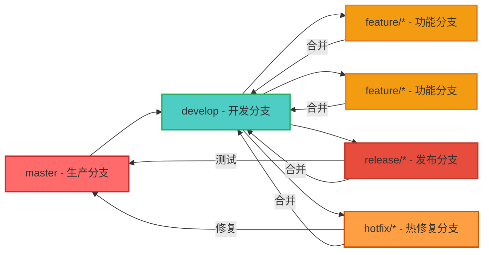

# Flowable 规范文档 - Node.js + NestJS + MySQL

## 文档说明

本文档提供 Node.js + NestJS + MySQL 技术栈重新实现 Flowable 流程引擎的完整规范，包括代码规范、Git 分支管理、接口文档规范、部署规范和 CI/CD 流程等。

---

## 一、代码规范

### 1.1 ESLint + Prettier 配置

#### 1.1.1 ESLint 9 配置（Flat Config）

ESLint 9 使用新的扁平配置格式（Flat Config），配置文件名为 `eslint.config.js`。

```javascript
// eslint.config.js
const js = require('@eslint/js');
const typescriptEslint = require('typescript-eslint');
const importPlugin = require('eslint-plugin-import');
const jsdocPlugin = require('eslint-plugin-jsdoc');
const prettierConfig = require('eslint-config-prettier');
const globals = require('globals');

module.exports = typescriptEslint.config(
  // 全局忽略配置
  {
    ignores: [
      'dist/**',
      'node_modules/**',
      'coverage/**',
      '*.config.js',
      '*.config.ts',
      'bin/**',
      'obj/**',
    ],
  },
  
  // 基础JavaScript推荐配置
  js.configs.recommended,
  
  // TypeScript推荐配置
  ...typescriptEslint.configs.recommended,
  
  // TypeScript类型检查配置（可选，需要项目有tsconfig.json）
  ...typescriptEslint.configs.recommendedTypeChecked,
  
  // 通用配置
  {
    languageOptions: {
      parserOptions: {
        project: './tsconfig.json',
        tsconfigRootDir: __dirname,
        sourceType: 'module',
        ecmaVersion: 2022,
      },
      globals: {
        ...globals.node,
        ...globals.es2021,
        ...globals.jest,
      },
    },
  },
  
  // Import插件配置
  {
    plugins: {
      import: importPlugin,
    },
    rules: {
      // Import排序规则
      'import/order': [
        'error',
        {
          groups: [
            'builtin',   // Node.js内置模块
            'external',   // 第三方库
            'internal',   // 项目内部模块
            'parent',     // 父级目录模块
            'sibling',    // 同级目录模块
            'index',      // 当前目录index
            'object',
            'type',
          ],
          'newlines-between': 'always',
          alphabetize: {
            order: 'asc',
            caseInsensitive: true,
          },
          pathGroups: [
            {
              pattern: '@nestjs/**',
              group: 'external',
              position: 'before',
            },
            {
              pattern: 'typeorm',
              group: 'external',
              position: 'before',
            },
          ],
        },
      ],
      'import/no-unresolved': 'error',
      'import/no-duplicates': 'warn',
      'import/first': 'error',
      'import/newline-after-import': 'error',
      'import/no-cycle': 'error',
      'import/no-self-import': 'error',
    },
    settings: {
      'import/resolver': {
        typescript: {
          alwaysTryTypes: true,
          project: './tsconfig.json',
        },
        node: {
          extensions: ['.js', '.jsx', '.ts', '.tsx'],
        },
      },
    },
  },
  
  // JSDoc插件配置
  {
    plugins: {
      jsdoc: jsdocPlugin,
    },
    rules: {
      'jsdoc/require-jsdoc': 'off',
      'jsdoc/require-description': 'off',
      'jsdoc/check-tag-names': 'warn',
      'jsdoc/check-types': 'warn',
    },
  },
  
  // TypeScript特定规则
  {
    files: ['**/*.ts', '**/*.tsx'],
    rules: {
      // TypeScript规则
      '@typescript-eslint/interface-name-prefix': 'off',
      '@typescript-eslint/explicit-function-return-type': 'off',
      '@typescript-eslint/explicit-module-boundary-types': 'off',
      '@typescript-eslint/no-explicit-any': 'warn',
      '@typescript-eslint/no-unused-vars': [
        'error',
        {
          argsIgnorePattern: '^_',
          varsIgnorePattern: '^_',
          caughtErrorsIgnorePattern: '^_',
        },
      ],
      '@typescript-eslint/no-empty-function': 'warn',
      '@typescript-eslint/no-inferrable-types': 'warn',
      '@typescript-eslint/ban-types': 'off',
      '@typescript-eslint/ban-ts-comment': 'warn',
      '@typescript-eslint/consistent-type-assertions': 'warn',
      '@typescript-eslint/no-misused-new': 'error',
      '@typescript-eslint/no-non-null-assertion': 'warn',
      '@typescript-eslint/prefer-nullish-coalescing': 'warn',
      '@typescript-eslint/prefer-optional-chain': 'warn',
      '@typescript-eslint/strict-boolean-expressions': 'off',
      '@typescript-eslint/unbound-method': 'warn',
      
      // NestJS特定规则
      '@typescript-eslint/no-deprecated': 'warn',
      '@typescript-eslint/no-require-imports': 'warn',
    },
  },
  
  // 测试文件规则（放宽限制）
  {
    files: ['**/*.spec.ts', '**/*.test.ts', '**/test/**/*.ts'],
    rules: {
      '@typescript-eslint/no-explicit-any': 'off',
      '@typescript-eslint/no-non-null-assertion': 'off',
      '@typescript-eslint/no-unsafe-assignment': 'off',
      '@typescript-eslint/no-unsafe-member-access': 'off',
      '@typescript-eslint/no-unsafe-call': 'off',
      '@typescript-eslint/unbound-method': 'off',
      '@typescript-eslint/no-unused-vars': 'off',
    },
  },
  
  // Prettier配置（必须放在最后以覆盖冲突规则）
  prettierConfig,
);
```

---

#### 1.1.2 ESLint 9 依赖安装

```bash
# 安装ESLint 9及相关插件
npm install --save-dev \
  eslint@^9.0.0 \
  @eslint/js@^9.0.0 \
  typescript-eslint@^8.0.0 \
  eslint-plugin-import@^2.29.0 \
  eslint-plugin-jsdoc@^48.0.0 \
  eslint-config-prettier@^9.1.0 \
  eslint-import-resolver-typescript@^3.6.0 \
  globals@^15.0.0
```

---

#### 1.1.3 ESLint 9 package.json脚本配置

```json
{
  "scripts": {
    "lint": "eslint .",
    "lint:fix": "eslint . --fix",
    "lint:ci": "eslint . --max-warnings=0 --format json --output-file eslint-report.json"
  }
}
```

---

#### 1.1.2 Prettier 配置

```javascript
// .prettierrc.js
module.exports = {
  printWidth: 100,
  tabWidth: 2,
  useTabs: false,
  semi: true,
  singleQuote: true,
  quoteProps: 'as-needed',
  jsxSingleQuote: false,
  trailingComma: 'all',
  bracketSpacing: true,
  bracketSameLine: false,
  arrowParens: 'always',
  endOfLine: 'lf',
  proseWrap: 'preserve',
  htmlWhitespaceSensitivity: 'css',
};
```

---

#### 1.1.3 .prettierignore

```
# .prettierignore
node_modules
dist
coverage
*.min.js
*.min.css
package-lock.json
pnpm-lock.yaml
yarn.lock
```

---

### 1.2 TypeScript 规范

#### 1.2.1 命名规范

```typescript
// 类名：PascalCase
export class ProcessDefinitionService {}
export class ProcessInstance {}
export class Task {}

// 接口名：PascalCase，以 I 开头
export interface IProcessDefinition {}
export interface ITaskService {}
export interface IRepository {}

// 枚举名：PascalCase
export enum ProcessInstanceStatus {}
export enum TaskType {}

// 变量名：camelCase
const processInstanceId = '123';
const userName = 'john';

// 常量名：UPPER_SNAKE_CASE
const MAX_RETRY_COUNT = 3;
const DEFAULT_PAGE_SIZE = 20;

// 函数名：camelCase
function getProcessDefinition() {}
function startProcessInstance() {}
function completeTask() {}

// 私有属性：camelCase，以 _ 开头
private readonly _logger: Logger;
private _cache: CacheService;

// 受保护属性：camelCase
protected readonly processDefinitionRepository: Repository<ProcessDefinition>;

// 文件名：kebab-case
// process-definition.service.ts
// process-instance.entity.ts
// task.controller.ts
```

---

#### 1.2.2 类型注解规范

```typescript
// ✅ 推荐：使用接口定义类型
export interface ProcessDefinition {
  id: string;
  name: string;
  key: string;
  version: number;
}

export interface CreateProcessDefinitionDto {
  name: string;
  key: string;
  bpmnXml: string;
}

// ❌ 避免：使用 any 类型
function processData(data: any): void {
  // ...
}

// ✅ 推荐：使用具体类型或泛型
function processData(data: ProcessDefinition): void {
  // ...
}

// ✅ 推荐：使用类型别名
type ProcessDefinitionId = string;
type UserId = string;
type Timestamp = number;

// ✅ 推荐：使用联合类型
type TaskStatus = 'CREATED' | 'CLAIMED' | 'COMPLETED';

// ✅ 推荐：使用可选属性
interface ProcessInstance {
  id: string;
  name: string;
  endTime?: Date; // 可选属性
}
```

---

#### 1.2.3 注释规范

```typescript
/**
 * 流程定义服务
 * 
 * 负责流程定义的部署、查询、激活、暂停等操作
 * 
 * @class ProcessDefinitionService
 * @module process-definition
 */
@Injectable()
export class ProcessDefinitionService {
  /**
   * 部署流程定义
   * 
   * @param dto - 流程定义部署 DTO
   * @returns 部署结果
   * @throws BusinessException - BPMN 验证失败时抛出
   */
  async deploy(dto: DeployProcessDefinitionDto): Promise<Deployment> {
    // 1. 解析 BPMN XML
    const bpmnModel = await this.bpmnParserService.parse(dto.bpmnXml);
    
    // 2. 验证 BPMN 模型
    const errors = this.bpmnParserService.validate(bpmnModel);
    if (errors.length > 0) {
      throw new BusinessException('BPMN 模型验证失败', errors);
    }
    
    // 3. 保存流程定义
    const processDefinition = await this.createProcessDefinition(bpmnModel);
    return await this.processDefinitionRepository.save(processDefinition);
  }

  /**
   * 查询流程定义
   * 
   * @param id - 流程定义 ID
   * @returns 流程定义对象
   */
  async findById(id: string): Promise<ProcessDefinition> {
    return this.processDefinitionRepository.findOne({ where: { id } });
  }
}
```

---

### 1.3 代码组织规范

#### 1.3.1 文件组织原则

```
src/
├── [module-name]/              # 模块目录（kebab-case）
│   ├── [module-name].module.ts  # 模块文件
│   ├── controllers/            # 控制器目录（复数）
│   │   └── [name].controller.ts
│   ├── services/               # 服务目录（复数）
│   │   ├── [name].service.ts
│   │   └── [name].service.spec.ts
│   ├── entities/               # 实体目录（复数）
│   │   └── [name].entity.ts
│   ├── dto/                    # DTO 目录（复数）
│   │   ├── create-[name].dto.ts
│   │   ├── update-[name].dto.ts
│   │   └── query-[name].dto.ts
│   └── interfaces/            # 接口目录（复数）
│       └── [name].interface.ts
```

---

#### 1.3.2 导入顺序规范

```typescript
// 1. Node.js 内置模块
import { Injectable, Logger } from '@nestjs/common';
import { Module } from '@nestjs/common';
import { Controller, Get, Post, Put, Delete, Body, Param } from '@nestjs/common';

// 2. 第三方库
import { Repository } from 'typeorm';
import { validate, ValidationError } from 'class-validator';
import { v4 as uuidv4 } from 'uuid';

// 3. 项目内部模块
import { ProcessDefinition } from '../entities/process-definition.entity';
import { BpmnParserService } from '../../core/services/bpmn-parser.service';
import { EventBusService } from '../../core/services/event-bus.service';

// 4. 类型定义
import type { ProcessDefinition as ProcessDefinitionType } from '../entities/process-definition.entity';
import type { CreateProcessDefinitionDto } from '../dto/create-process-definition.dto';
```

---

## 二、Git 分支管理策略

### 2.1 Git Flow 分支模型



---

### 2.2 分支类型说明

| 分支类型 | 分支名格式 | 用途 | 合并规则 | 生命周期 |
|---------|-----------|------|---------|---------|
| **master** | `master` | 生产环境代码 | 仅从 release/hotfix 分支合并 | 长期存在 |
| **develop** | `develop` | 开发环境代码 | 从 feature 分支合并 | 长期存在 |
| **feature** | `feature/xxx` | 开发新功能 | 完成后合并到 develop 分支 | 功能完成后删除 |
| **release** | `release/v1.0.0` | 预发布测试 | 测试通过后合并到 master + develop | 发布后删除 |
| **hotfix** | `hotfix/v1.0.1` | 生产环境紧急修复 | 修复后合并到 master + develop | 修复后删除 |

---

### 2.3 Git 提交规范

#### 2.3.1 Commit Message 格式

```
<type>(<scope>): <subject>

<body>

<footer>
```

**Type 类型**：
- `feat`: 新功能
- `fix`: Bug 修复
- `docs`: 文档更新
- `style`: 代码格式调整
- `refactor`: 代码重构
- `test`: 测试相关
- `chore`: 构建/工具链相关

**示例**：
```
feat(process-definition): 添加流程定义部署功能

- 解析 BPMN XML
- 验证 BPMN 模型
- 保存流程定义到数据库

Closes #123
```

---

#### 2.3.2 Commit Message 示例

```bash
# 新功能
git commit -m "feat(task): 添加任务认领功能"

# Bug 修复
git commit -m "fix(process-instance): 修复流程实例启动时的变量初始化问题"

# 文档更新
git commit -m "docs: 更新 API 文档"

# 代码重构
git commit -m "refactor(core): 重构事件总线实现，使用 EventEmitter2"

# 测试相关
git commit -m "test(process-definition): 添加流程定义服务单元测试"
```

---

### 2.4 分支操作流程

#### 2.4.1 开发新功能

```bash
# 1. 从 develop 分支创建功能分支
git checkout develop
git pull origin develop
git checkout -b feature/user-task-claim

# 2. 开发功能
# ... 编写代码 ...

# 3. 提交代码
git add .
git commit -m "feat(task): 添加任务认领功能"

# 4. 推送到远程
git push origin feature/user-task-claim

# 5. 创建 Pull Request
# 在 GitHub/GitLab 上创建 PR

# 6. 代码审查通过后合并到 develop
git checkout develop
git merge --no-ff feature/user-task-claim
git push origin develop

# 7. 删除功能分支
git branch -d feature/user-task-claim
```

---

#### 2.4.2 发布版本

```bash
# 1. 从 develop 分支创建发布分支
git checkout develop
git pull origin develop
git checkout -b release/v1.0.0

# 2. 更新版本号
# 更新 package.json 中的版本号
# 更新 CHANGELOG.md

# 3. 提交版本更新
git add .
git commit -m "chore(release): 更新版本号到 v1.0.0"

# 4. 合并到 master
git checkout master
git merge --no-ff release/v1.0.0
git tag v1.0.0
git push origin master --tags

# 5. 合并回 develop
git checkout develop
git merge --no-ff release/v1.0.0
git push origin develop

# 6. 删除发布分支
git branch -d release/v1.0.0
```

---

#### 2.4.3 紧急修复

```bash
# 1. 从 master 分支创建热修复分支
git checkout master
git pull origin master
git checkout -b hotfix/fix-task-assignment-bug

# 2. 修复 Bug
# ... 修复代码 ...

# 3. 提交修复
git add .
git commit -m "fix(task): 修复任务分配时的权限校验问题"

# 4. 推送到远程
git push origin hotfix/fix-task-assignment-bug

# 5. 合并到 master
git checkout master
git merge --no-ff hotfix/fix-task-assignment-bug
git tag v1.0.1
git push origin master --tags

# 6. 合并回 develop
git checkout develop
git merge --no-ff hotfix/fix-task-assignment-bug
git push origin develop

# 7. 删除热修复分支
git branch -d hotfix/fix-task-assignment-bug
```

---

## 三、接口文档规范

### 3.1 RESTful API 设计规范

#### 3.1.1 URL 设计规范

```
# 资源命名：复数形式
GET    /api/v1/process-definitions
GET    /api/v1/process-instances
GET    /api/v1/tasks
GET    /api/v1/users

# 子资源：使用嵌套路径
GET    /api/v1/process-definitions/{id}/tasks
GET    /api/v1/process-instances/{id}/variables
GET    /api/v1/users/{userId}/roles

# 操作命名：使用动词
GET    /api/v1/process-definitions          # 查询列表
GET    /api/v1/process-definitions/{id}       # 查询详情
POST   /api/v1/process-definitions          # 创建
PUT    /api/v1/process-definitions/{id}       # 更新
DELETE /api/v1/process-definitions/{id}       # 删除

# 状态变更：使用子路径
POST   /api/v1/process-definitions/{id}/suspend
POST   /api/v1/process-definitions/{id}/activate
POST   /api/v1/tasks/{id}/claim
POST   /api/v1/tasks/{id}/complete
```

---

#### 3.1.2 HTTP 方法使用规范

| HTTP 方法 | 用途 | 是否幂等 | 示例 |
|-----------|------|---------|------|
| **GET** | 查询资源 | 是 | `GET /api/v1/process-definitions/{id}` |
| **POST** | 创建资源 | 否 | `POST /api/v1/process-definitions` |
| **PUT** | 更新资源 | 是 | `PUT /api/v1/process-definitions/{id}` |
| **PATCH** | 部分更新资源 | 否 | `PATCH /api/v1/tasks/{id}` |
| **DELETE** | 删除资源 | 是 | `DELETE /api/v1/process-definitions/{id}` |

---

#### 3.1.3 状态码规范

| 状态码 | 含义 | 使用场景 |
|-------|------|---------|
| **200** | 请求成功 | 所有成功请求 |
| **400** | 请求参数错误 | 参数验证失败、业务规则校验失败 |
| **401** | 未认证 | Token 无效或过期 |
| **403** | 无权限 | 用户无权访问资源 |
| **404** | 资源不存在 | 查询的资源不存在 |
| **409** | 资源冲突 | 资源已存在（如重复创建） |
| **422** | 请求体格式错误 | JSON 格式错误 |
| **429** | 请求过于频繁 | 触发限流 |
| **500** | 服务器内部错误 | 系统异常、数据库错误 |
| **503** | 服务不可用 | 服务过载或维护中 |

---

### 3.2 Swagger/OpenAPI 文档规范

#### 3.2.1 Swagger 配置

```typescript
// main.ts
import { NestFactory } from '@nestjs/core';
import { SwaggerModule, DocumentBuilder } from '@nestjs/swagger';

async function bootstrap() {
  const app = await NestFactory.create(AppModule);

  // Swagger 配置
  const config = new DocumentBuilder()
    .setTitle('Flowable 流程引擎 API')
    .setDescription('基于 NestJS 的 Flowable 流程引擎 API 文档')
    .setVersion('1.0.0')
    .addBearerAuth(
      'JWT',
      'JWT 认证',
      '在请求头中添加 JWT Token: Authorization: Bearer {token}'
    )
    .addTag('process-definition', '流程定义管理')
    .addTag('process-instance', '流程实例管理')
    .addTag('task', '任务管理')
    .addTag('history', '历史数据')
    .addTag('identity', '身份管理')
    .addTag('form', '表单管理')
    .build();

  SwaggerModule.setup('api-docs', app, config);

  await app.listen(3000);
}
```

---

#### 3.2.2 API 文档注释示例

```typescript
// process-definition.controller.ts
import { Controller, Get, Post, Put, Delete, Body, Param } from '@nestjs/common';
import { ApiTags, ApiOperation, ApiResponse, ApiBearerAuth, ApiBody, ApiParam } from '@nestjs/swagger';

@ApiTags('process-definition')
@ApiBearerAuth('JWT')
@Controller('api/v1/process-definitions')
export class ProcessDefinitionController {
  
  @Get()
  @ApiOperation({ summary: '查询流程定义列表', description: '支持分页查询和条件过滤' })
  @ApiResponse({ status: 200, description: '查询成功', type: [ProcessDefinition] })
  async findAll(@Query() query: ProcessDefinitionQueryDto): Promise<PageResponse<ProcessDefinition>> {
    return this.processDefinitionService.findAll(query);
  }

  @Get(':id')
  @ApiOperation({ summary: '查询流程定义详情' })
  @ApiParam({ name: 'id', description: '流程定义 ID' })
  @ApiResponse({ status: 200, description: '查询成功', type: ProcessDefinition })
  async findById(@Param('id') id: string): Promise<ApiResponse<ProcessDefinition>> {
    return this.processDefinitionService.findById(id);
  }

  @Post()
  @ApiOperation({ summary: '部署流程定义' })
  @ApiBody({ type: DeployProcessDefinitionDto })
  @ApiResponse({ status: 200, description: '部署成功' })
  async deploy(@Body() dto: DeployProcessDefinitionDto): Promise<ApiResponse<Deployment>> {
    return this.processDefinitionService.deploy(dto);
  }

  @Put(':id/suspend')
  @ApiOperation({ summary: '暂停流程定义' })
  @ApiParam({ name: 'id' })
  async suspend(@Param('id') id: string): Promise<ApiResponse<void>> {
    return this.processDefinitionService.suspend(id);
  }

  @Delete(':id')
  @ApiOperation({ summary: '删除流程定义' })
  @ApiParam({ name: 'id' })
  async delete(@Param('id') id: string): Promise<ApiResponse<void>> {
    return this.processDefinitionService.delete(id);
  }
}
```

---

## 四、部署规范和 CI/CD 流程

### 4.1 容器化部署

#### 4.1.1 Dockerfile

```dockerfile
# Dockerfile
# 多阶段构建，减小镜像体积

# 阶段1：构建阶段
FROM node:18-alpine AS builder

WORKDIR /app

# 复制依赖文件
COPY package*.json ./

# 安装依赖
RUN npm ci --registry=https://registry.npmmirror.com

# 复制源代码
COPY . .

# 构建应用
RUN npm run build

# 阶段2：运行阶段
FROM node:18-alpine

WORKDIR /app

# 创建非 root 用户
RUN addgroup -g appuser && adduser -G appuser appuser

# 复制构建产物
COPY --from=builder --chown=appuser:appuser /app/dist ./dist

# 复制依赖文件
COPY --from=builder --chown=appuser:appuser /app/package*.json ./

# 安装生产依赖
RUN npm ci --only=production --registry=https://registry.npmmirror.com

# 切换到非 root 用户
USER appuser

# 暴露端口
EXPOSE 3000

# 健康检查
HEALTHCHECK --interval=30s --timeout=3s \
  CMD node healthcheck.js || exit 1

# 启动命令
CMD ["node", "dist/main.js"]
```

---

#### 4.1.2 docker-compose.yml

```yaml
# docker-compose.yml
version: '3.8'

services:
  # 流程引擎服务
  flowable-engine:
    build:
      context: .
      dockerfile: Dockerfile
    container_name: flowable-engine
    ports:
      - "3000:3000"
    environment:
      - NODE_ENV=${NODE_ENV:-production}
      - DB_HOST=mysql
      - DB_PORT=3306
      - DB_DATABASE=flowable
      - DB_USERNAME=${DB_USERNAME:-flowable}
      - DB_PASSWORD=${DB_PASSWORD:-flowable}
      - REDIS_HOST=redis
      - REDIS_PORT=6379
      - REDIS_PASSWORD=${REDIS_PASSWORD:-}
      - KAFKA_BROKERS=${KAFKA_BROKERS:-kafka:9092}
    depends_on:
      - mysql
      - redis
      - kafka
    networks:
      - flowable-network
    restart: unless-stopped
    healthcheck:
      test: ["CMD", "wget", "--no-verbose", "--tries=1", "--spider", "http://localhost:3000/health"]
      interval: 30s
      timeout: 10s
      retries: 3

  # MySQL 数据库
  mysql:
    image: mysql:8.0
    container_name: flowable-mysql
    ports:
      - "3306:3306"
    environment:
      - MYSQL_ROOT_PASSWORD=${DB_ROOT_PASSWORD:-rootpassword}
      - MYSQL_DATABASE=flowable
      - MYSQL_USER=flowable
      - MYSQL_PASSWORD=${DB_PASSWORD:-flowable}
    volumes:
      - mysql-data:/var/lib/mysql
    networks:
      - flowable-network
    restart: unless-stopped
    command: --default-authentication-plugin=mysql_native_password

  # Redis 缓存
  redis:
    image: redis:7-alpine
    container_name: flowable-redis
    ports:
      - "6379:6379"
    volumes:
      - redis-data:/data
    networks:
      - flowable-network
    restart: unless-stopped
    command: redis-server --appendonly yes

  # Kafka 消息队列
  kafka:
    image: confluentinc/cp-kafka:latest
    container_name: flowable-kafka
    ports:
      - "9092:9092"
    environment:
      - KAFKA_ZOOKEEPER_CLIENT_PORT=2181
      - KAFKA_ADVERTISED_LISTENERS=PLAINTEXT://kafka:9092
      - KAFKA_OFFSETS_TOPIC_REPLICATION_FACTOR=1
    volumes:
      - kafka-data:/var/lib/kafka/data
    networks:
      - flowable-network
    restart: unless-stopped

networks:
  flowable-network:
    driver: bridge

volumes:
  mysql-data:
  redis-data:
  kafka-data:
```

---

### 4.2 Kubernetes 部署

#### 4.2.1 Deployment 配置

```yaml
# k8s/deployment.yaml
apiVersion: apps/v1
kind: Deployment
metadata:
  name: flowable-engine
  labels:
    app: flowable-engine
spec:
  replicas: 3
  selector:
    matchLabels:
      app: flowable-engine
  template:
    metadata:
      labels:
        app: flowable-engine
    spec:
      containers:
      - name: flowable-engine
        image: flowable-engine:1.0.0
        ports:
          - containerPort: 3000
        env:
          - name: NODE_ENV
            value: "production"
          - name: DB_HOST
            valueFrom:
              secretKeyRef:
                name: mysql-secret
                key: host
          - name: DB_PORT
            valueFrom:
              secretKeyRef:
                name: mysql-secret
                key: port
          - name: DB_DATABASE
            valueFrom:
              secretKeyRef:
                name: mysql-secret
                key: database
          - name: DB_USERNAME
            valueFrom:
              secretKeyRef:
                name: mysql-secret
                key: username
          - name: DB_PASSWORD
            valueFrom:
              secretKeyRef:
                name: mysql-secret
                key: password
          - name: REDIS_HOST
            valueFrom:
              secretKeyRef:
                name: redis-secret
                key: host
          - name: REDIS_PORT
            valueFrom:
              secretKeyRef:
                name: redis-secret
                key: port
          - name: REDIS_PASSWORD
            valueFrom:
              secretKeyRef:
                name: redis-secret
                key: password
        resources:
          requests:
            memory: "512Mi"
            cpu: "500m"
          limits:
            memory: "1Gi"
            cpu: "1000m"
        livenessProbe:
          httpGet:
            path: /health
            port: 3000
          initialDelaySeconds: 30
          periodSeconds: 10
          timeoutSeconds: 5
          failureThreshold: 3
        readinessProbe:
          httpGet:
            path: /health
            port: 3000
          initialDelaySeconds: 10
          periodSeconds: 5
          timeoutSeconds: 3
          failureThreshold: 3
---
apiVersion: v1
kind: Service
metadata:
  name: flowable-engine
  labels:
    app: flowable-engine
spec:
  selector:
    app: flowable-engine
  ports:
    - protocol: TCP
      port: 3000
      targetPort: 3000
  type: LoadBalancer
---
apiVersion: v1
kind: ConfigMap
metadata:
  name: flowable-engine-config
data:
  NODE_ENV: "production"
  LOG_LEVEL: "info"
---
apiVersion: v1
kind: Secret
metadata:
  name: mysql-secret
type: Opaque
data:
  host: bW15c3Fs
  port: MzMwNg==
  database: Zmxvd2Js
  username: Zmxvd2Js
  password: Zmxvd2Jz
---
apiVersion: v1
kind: Secret
metadata:
  name: redis-secret
type: Opaque
data:
  host: cmVka
  port: NjM3
  password: cmVka
```

---

### 4.3 CI/CD 流程

#### 4.3.1 GitHub Actions 配置

```yaml
# .github/workflows/ci-cd.yml
name: CI/CD Pipeline

on:
  push:
    branches: [develop, master]
    tags:
      - 'v*'
  pull_request:
    branches: [develop]

env:
  NODE_VERSION: '18.x'
  REGISTRY: ghcr.io
  IMAGE_NAME: ${{ github.repository }}

jobs:
  # 构建和测试
  build-and-test:
    runs-on: ubuntu-latest
    strategy:
      matrix:
        node-version: [16.x, 18.x]
    steps:
      - name: Checkout code
        uses: actions/checkout@v4

      - name: Setup Node.js ${{ matrix.node-version }}
        uses: actions/setup-node@v4
        with:
          node-version: ${{ matrix.node-version }}
          cache: 'npm'

      - name: Install dependencies
        run: npm ci

      - name: Run linter
        run: npm run lint

      - name: Run tests
        run: npm run test:coverage

      - name: Upload coverage
        uses: codecov/codecov-action@v3
        with:
          files: ./coverage/lcov.info

  # 构建并推送 Docker 镜像
  build-and-push:
    needs: build-and-test
    runs-on: ubuntu-latest
    if: github.event_name == 'push' && github.ref == 'refs/heads/master'
    steps:
      - name: Checkout code
        uses: actions/checkout@v4

      - name: Set up Docker Buildx
        uses: docker/setup-buildx-action@v3

      - name: Login to Container Registry
        uses: docker/login-action@v3
        with:
          registry: ${{ env.REGISTRY }}
          username: ${{ github.actor }}
          password: ${{ secrets.GITHUB_TOKEN }}

      - name: Build and push Docker image
        run: |
          docker buildx build \
            --platform linux/amd64 \
            --tag ${{ env.REGISTRY }}/${{ env.IMAGE_NAME }}:${{ github.sha }} \
            --tag ${{ env.REGISTRY }}/${{ env.IMAGE_NAME }}:latest \
            --file . \
            --push
```

  # 部署到 Kubernetes
  deploy:
    needs: build-and-push
    runs-on: ubuntu-latest
    if: github.event_name == 'push' && github.ref == 'refs/heads/master'
    steps:
      - name: Checkout code
        uses: actions/checkout@v4

      - name: Configure kubectl
        uses: azure/setup-kubectl@v3
        with:
          version: 'v1.24.0'

      - name: Deploy to Kubernetes
        run: |
          kubectl set image deployment/flowable-engine flowable-engine=${{ env.REGISTRY }}/${{ env.IMAGE_NAME }}:${{ github.sha }}
          kubectl rollout restart deployment/flowable-engine
```

---

#### 4.3.2 package.json 脚本

```json
{
  "name": "flowable-engine",
  "version": "1.0.0",
  "description": "Flowable 流程引擎 - Node.js + NestJS 实现",
  "main": "dist/main.js",
  "scripts": {
    "prebuild": "rimraf dist",
    "build": "nest build",
    "format": "prettier --write \"src/**/*.ts\" \"test/**/*.ts\"",
    "format:check": "prettier --check \"src/**/*.ts\" \"test/**/*.ts\"",
    "lint": "eslint \"{src,test}/**/*.ts\" --fix",
    "lint:fix": "eslint \"{src,test}/**/*.ts\"",
    "test": "jest",
    "test:watch": "jest --watch",
    "test:cov": "jest --coverage",
    "test:debug": "node --inspect-brk dist/main.js",
    "typeorm": "ts-node -r tsconfig.json node_modules/.bin/typeorm migration:run",
    "migration:generate": "ts-node -r tsconfig.json node_modules/.bin/typeorm migration:generate -d",
    "migration:run": "ts-node -r tsconfig.json node_modules/.bin/typeorm migration:run",
    "migration:revert": "ts-node -r tsconfig.json node_modules/.bin/typeorm migration:revert",
    "start: "nest start",
    "start:debug": "nest start --debug",
    "start:prod": "node dist/main.js",
    "docker:build": "docker build -t flowable-engine .",
    "docker:push": "docker push flowable-engine"
  },
  "dependencies": {
    "@nestjs/common": "^10.0.0",
    "@nestjs/core": "^10.0.0",
    "@nestjs/platform-express": "^10.0.0",
    "@nestjs/config": "^3.0.0",
    "@nestjs/typeorm": "^10.0.0",
    "@nestjs/swagger": "^7.0.0",
    "@nestjs/event-emitter": "^2.0.0",
    "@nestjs/schedule": "^4.0.0",
    "@nestjs/bull": "^10.0.0",
    "typeorm": "^0.3.17",
    "mysql2": "^3.6.0",
    "ioredis": "^5.0.0",
    "kafkajs": "^2.2.0",
    "uuid": "^9.0.0",
    "class-validator": "^0.14.0",
    "class-transformer": "^0.5.1",
    "winston": "^3.8.0",
    "winston-daily-rotate-file": "^4.6.0",
    "prom-client": "^15.0.0",
    "nest-cli": "^10.0.0",
    "prettier": "^3.0.0",
    "eslint": "^8.0.0",
    "@typescript-eslint/eslint-plugin": "^6.0.0",
    "@typescript-eslint/parser": "^6.0.0",
    "eslint-plugin-import": "^2.27.5",
    "eslint-plugin-jsdoc": "^46.4.6",
    "@types/node": "^20.0.0"
  },
  "devDependencies": {
    "@nestjs/cli": "^10.0.0",
    "@types/node": "^20.0.0",
    "@types/jest": "^29.0.0",
    "prettier": "^3.0.0",
    "eslint": "^8.0.0",
    "@typescript-eslint/eslint-plugin": "^6.0.0",
    "@typescript-eslint/parser": "^6.0.0"
  },
  "engines": {
    "node": ">=18.0.0",
    "npm": ">=9.0.0"
  }
}
```

---

## 五、总结

本文档提供了 Node.js + NestJS + MySQL 技术栈重新实现 Flowable 流程引擎的完整规范，包括：

### 核心要点

1. **代码规范**：ESLint + Prettier + TypeScript 规范
2. **Git 管理**：Git Flow 分支模型 + 提交规范
3. **接口文档**：RESTful 设计 + Swagger/OpenAPI 文档
4. **部署规范**：Docker + Kubernetes + CI/CD 流程

### 技术栈

- **代码规范**：ESLint 8.x + Prettier 3.x
- **版本控制**：Git + GitHub/GitLab
- **CI/CD**：GitHub Actions
- **容器化**：Docker + Docker Compose
- **编排**：Kubernetes
- **监控**：Prometheus + Grafana
- **日志**：Winston + ELK Stack

### 下一步

接下来需要完成以下文档：
1. 总览文档（整合所有文档）
