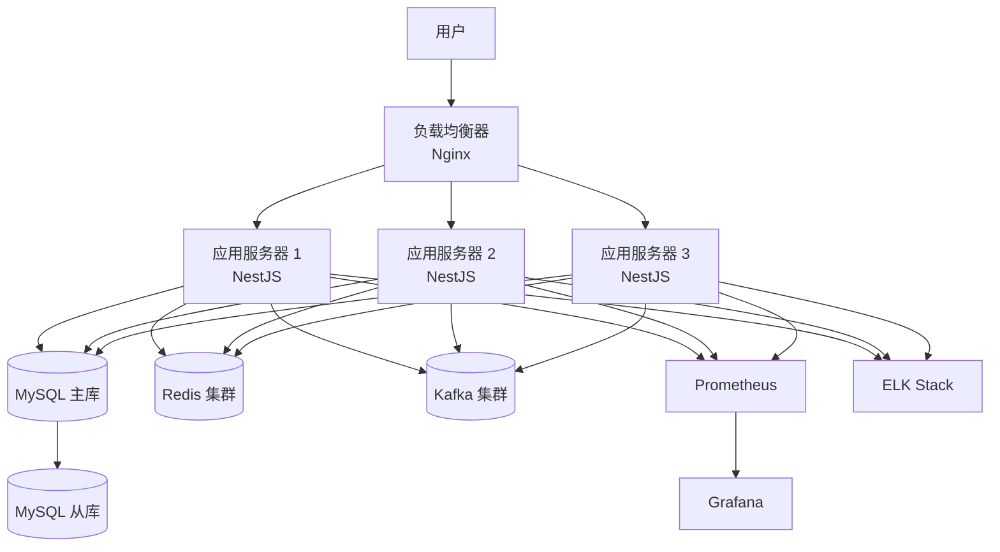

# NestJS 流程引擎开发计划

## 文档说明

本文档基于 [`01-核心功能梳理.md`](./01-核心功能梳理.md)、[`02-技术设计文档.md`](./02-技术设计文档.md)、[`03-实现方案文档.md`](./03-实现方案文档.md)、[`04-任务操作补充设计.md`](./04-任务操作补充设计.md)、[`05-DMN决策引擎设计.md`](./05-DMN决策引擎设计.md) 五个设计文档，制定详细的 NestJS + MySQL 技术栈流程引擎开发计划。

**项目目标**：开发一个功能完整的流程引擎系统，支持任务进度的实时追踪和管理功能。

---

## 一、项目概览

### 1.1 项目目标

- **核心目标**：基于 Flowable 最佳实践，使用 Node.js + NestJS + MySQL 技术栈重新实现一个功能完整的审批流引擎
- **关键特性**：
  - 完整的 BPMN 2.0 规范支持
  - 流程定义管理和版本控制
  - 流程实例管理和执行
  - 任务管理（用户任务、系统任务、委托任务）
  - 历史数据管理和审计
  - 身份管理（用户、角色、组权限）
  - 表单管理和数据验证
  - 监听器和事件处理机制
  - 网关控制逻辑（排他、并行、包容网关）
  - 子流程和调用活动支持
  - 定时器事件和异步执行
  - **任务进度实时追踪和管理功能**
  - **任务驳回、抄送、退回策略功能**

### 1.2 技术栈选择

| 技术类别 | 技术选型 | 版本 | 选型理由 |
|---------|---------|------|---------|
| **后端框架** | NestJS | 10.x | 企业级 Node.js 框架，模块化设计，依赖注入，装饰器 |
| **编程语言** | TypeScript | 5.x | 类型安全，代码可维护性高 |
| **数据库** | MySQL | 8.0+ | 成熟稳定，事务支持完善，社区活跃 |
| **ORM** | TypeORM | 0.3.x | TypeScript 友好，支持多种数据库，装饰器风格 |
| **缓存** | Redis | 7.x | 高性能缓存，支持分布式，支持消息队列 |
| **消息队列** | Bull | 4.x | 基于 Redis 的队列，支持优先级、延迟、重试 |
| **定时器** | node-schedule | 2.x | 灵活的定时任务调度 |
| **事件总线** | EventEmitter2 | 6.x | 支持异步事件，命名空间，通配符 |
| **BPMN 解析** | bpmn-moddle | 8.x | BPMN 2.0 规范解析，支持验证 |
| **流程图生成** | bpmn-js | 11.x | 流程图渲染和可视化 |
| **认证** | Passport + JWT | 4.x | 成熟的认证方案，Token 认证 |
| **日志** | Winston | 3.x | 结构化日志，多传输，日志轮转 |
| **API 文档** | Swagger/OpenAPI | 7.0.x | 自动生成 API 文档 |
| **测试** | Jest + Supertest | 29.x | 完整的测试框架，支持快照测试 |
| **验证** | class-validator | 0.14.x | 装饰器风格的数据验证 |
| **配置管理** | @nestjs/config | 3.x | 环境变量管理，配置验证 |

---

## 二、模块划分与优先级

### 2.1 模块架构图

```mermaid
graph TB
    Root[AppModule - 根模块] --> Core[ProcessEngineCoreModule - 核心引擎模块<br/>优先级: P0]
    Root --> Common[CommonModule - 公共模块<br/>优先级: P0]
    Root --> Definition[ProcessDefinitionModule - 流程定义模块<br/>优先级: P0]
    Root --> Identity[IdentityModule - 身份管理模块<br/>优先级: P0]
    Root --> Instance[ProcessInstanceModule - 流程实例模块<br/>优先级: P1]
    Root --> Task[TaskModule - 任务管理模块<br/>优先级: P1]
    Root --> History[HistoryModule - 历史数据模块<br/>优先级: P1]
    Root --> Form[FormModule - 表单管理模块<br/>优先级: P2]
    Root --> Event[EventModule - 事件处理模块<br/>优先级: P2]
    Root --> Progress[ProgressTrackingModule - 进度追踪模块<br/>优先级: P1]
    
    %% 新增模块 - 基于Flowable源码分析
    Root --> Job[JobModule - 作业服务模块<br/>优先级: P1]
    Root --> IdentityLink[IdentityLinkModule - 身份链接模块<br/>优先级: P1]
    Root --> EventSubscription[EventSubscriptionModule - 事件订阅模块<br/>优先级: P2]
    Root --> Batch[BatchModule - 批处理模块<br/>优先级: P2]
    Root --> Content[ContentModule - 内容服务模块<br/>优先级: P3]
    Root --> Comment[CommentModule - 评论服务模块<br/>优先级: P3]
    
    %% 新增模块 - 任务操作补充
    Root --> TaskReject[TaskRejectModule - 驳回服务模块<br/>优先级: P1]
    Root --> Cc[CcModule - 抄送服务模块<br/>优先级: P1]
    Root --> RejectStrategy[RejectStrategyModule - 退回策略模块<br/>优先级: P1]
    Root --> MultiInstanceReject[MultiInstanceRejectModule - 多人退回策略模块<br/>优先级: P1]
    
    %% 新增模块 - DMN决策引擎
    Root --> Dmn[DmnModule - DMN决策引擎模块<br/>优先级: P2]
    
    Core --> Utils[工具类/常量/枚举]
    Core --> Config[引擎配置]
    Common --> Log[日志模块]
    Common --> Exception[异常处理模块]
    Common --> Cache[缓存模块]
    Common --> Interceptor[拦截器模块]
    Common --> Guard[守卫模块]
    
    Progress --> Realtime[实时推送<br/>WebSocket]
    Progress --> Metrics[进度指标<br/>Prometheus]
    Progress --> Dashboard[进度看板<br/>API]
    
    Job --> BullQueue[Bull队列<br/>Redis]
    Job --> DeadLetter[死信队列<br/>重试机制]
    
    style Root fill:#ff6b6b,stroke:#c92a2a,stroke-width:2px
    style Core fill:#4ecdc4,stroke:#27ae60,stroke-width:2px
    style Common fill:#45b7d1,stroke:#2980b9,stroke-width:2px
    style Progress fill:#f7b731,stroke:#f39c12,stroke-width:2px
    style Job fill:#9b59b6,stroke:#8e44ad,stroke-width:2px
    style IdentityLink fill:#e74c3c,stroke:#c0392b,stroke-width:2px
    style EventSubscription fill:#1abc9c,stroke:#16a085,stroke-width:2px
    style Batch fill:#3498db,stroke:#2980b9,stroke-width:2px
    style Content fill:#95a5a6,stroke:#7f8c8d,stroke-width:2px
    style Comment fill:#95a5a6,stroke:#7f8c8d,stroke-width:2px
    style TaskReject fill:#e67e22,stroke:#d35400,stroke-width:2px
    style Cc fill:#27ae60,stroke:#1e8449,stroke-width:2px
    style RejectStrategy fill:#3498db,stroke:#2980b9,stroke-width:2px
    style MultiInstanceReject fill:#9b59b6,stroke:#8e44ad,stroke-width:2px
    style Dmn fill:#f39c12,stroke:#d68910,stroke-width:2px
    ```

### 2.2 模块优先级定义

| 优先级 | 定义 | 说明 |
|-------|------|------|
| **P0** | 核心基础 | 项目启动必须，其他模块依赖 |
| **P1** | 主要功能 | 核心业务功能，直接影响用户体验 |
| **P2** | 增强功能 | 提升用户体验，非核心功能 |
| **P3** | 可选功能 | 锦上添花，后续迭代 |

### 2.3 模块依赖关系

```mermaid
graph LR
    A[CommonModule<br/>P0] --> B[ProcessEngineCoreModule<br/>P0]
    B --> C[ProcessDefinitionModule<br/>P0]
    B --> D[IdentityModule<br/>P0]
    C --> E[ProcessInstanceModule<br/>P1]
    D --> E
    E --> F[TaskModule<br/>P1]
    E --> G[HistoryModule<br/>P1]
    F --> G
    E --> H[ProgressTrackingModule<br/>P1]
    F --> H
    E --> I[FormModule<br/>P2]
    E --> J[EventModule<br/>P2]
    
    %% 新增模块依赖关系
    E --> K[JobModule<br/>P1]
    K --> G
    E --> L[IdentityLinkModule<br/>P1]
    F --> L
    E --> L
    B --> M[EventSubscriptionModule<br/>P2]
    E --> M
    E --> N[BatchModule<br/>P2]
    G --> N
    F --> O[ContentModule<br/>P3]
    G --> O
    F --> P[CommentModule<br/>P3]
    G --> P
    
    %% 新增任务操作模块依赖关系
    F --> Q[TaskRejectModule<br/>P1]
    G --> Q
    F --> R[CcModule<br/>P1]
    G --> R
    F --> S[RejectStrategyModule<br/>P1]
    G --> S
    F --> T[MultiInstanceRejectModule<br/>P1]
    G --> T
    
    %% DMN决策引擎模块依赖关系
    B --> U[DmnModule<br/>P2]
    E --> U
    ```

### 2.4 模块详细说明

#### 2.4.1 CommonModule（公共模块）- P0

**职责**：
- 日志记录（Winston）
- 异常处理（全局异常过滤器）
- 缓存管理（Redis）
- 拦截器（日志、请求 ID、响应、缓存、事务）
- 守卫（认证、权限）
- 中间件（日志、请求 ID）
- 工具类（加密、压缩、UUID 生成）
- 常量和枚举定义

**依赖**：无

**输出**：被所有模块依赖

**开发周期**：第 1 周

---

#### 2.4.2 ProcessEngineCoreModule（核心引擎模块）- P0

**职责**：
- 流程引擎核心服务（ProcessEngineService）
- 事件总线服务（EventBusService）
- 表达式求值服务（ExpressionEvaluatorService）
- BPMN 解析服务（BpmnParserService）
- 流程执行器服务（ProcessExecutorService）
- 网关执行器服务（GatewayExecutorService）

**依赖**：CommonModule

**输出**：被所有业务模块依赖

**开发周期**：第 2 周

---

#### 2.4.3 ProcessDefinitionModule（流程定义模块）- P0

**职责**：
- 流程定义部署
- 流程定义查询
- 流程定义激活/暂停
- 流程定义删除
- 流程图生成
- BPMN XML 验证

**依赖**：CommonModule, ProcessEngineCoreModule

**输出**：ProcessInstanceModule 依赖

**开发周期**：第 3 周

---

#### 2.4.4 IdentityModule（身份管理模块）- P0

**职责**：
- 用户管理（CRUD）
- 角色管理（CRUD）
- 组管理（CRUD）
- 用户-角色关联
- 用户-组关联
- 密码加密和验证
- JWT 认证

**依赖**：CommonModule

**输出**：TaskModule 依赖

**开发周期**：第 3 周

---

#### 2.4.5 ProcessInstanceModule（流程实例模块）- P1

**职责**：
- 流程实例启动
- 流程实例查询
- 流程实例挂起/恢复
- 流程实例终止
- 流程变量管理
- 执行实例管理

**依赖**：CommonModule, ProcessEngineCoreModule, ProcessDefinitionModule, IdentityModule

**输出**：TaskModule, HistoryModule, ProgressTrackingModule 依赖

**开发周期**：第 4-5 周

---

#### 2.4.6 TaskModule（任务管理模块）- P1

**职责**：
- 任务创建
- 任务分配
- 任务认领
- 任务完成
- 任务退回
- 任务委托
- 任务查询（待办、已办）
- 任务监听器

**依赖**：CommonModule, ProcessEngineCoreModule, ProcessInstanceModule, IdentityModule

**输出**：HistoryModule, ProgressTrackingModule 依赖

**开发周期**：第 5-6 周

---

#### 2.4.7 HistoryModule（历史数据模块）- P1

**职责**：
- 历史流程实例记录
- 历史任务记录
- 历史变量记录
- 历史数据查询
- 历史数据清理

**依赖**：CommonModule, ProcessEngineCoreModule, ProcessInstanceModule, TaskModule

**输出**：无

**开发周期**：第 6-7 周

---

#### 2.4.8 ProgressTrackingModule（进度追踪模块）- P1

**职责**：
- **任务进度实时追踪**
- **流程实例进度统计**
- **实时进度推送（WebSocket）**
- **进度指标收集（Prometheus）**
- **进度看板 API**
- **进度预警和通知**

**依赖**：CommonModule, ProcessEngineCoreModule, ProcessInstanceModule, TaskModule

**输出**：无

**开发周期**：第 7-8 周

---

#### 2.4.9 FormModule（表单管理模块）- P2

**职责**：
- 表单定义
- 表单数据存储
- 表单数据查询
- 表单验证（JSON Schema）
- 表单数据提交

**依赖**：CommonModule, ProcessEngineCoreModule

**输出**：无

**开发周期**：第 9 周

---

#### 2.4.10 EventModule（事件处理模块）- P2

**职责**：
- 定时器管理
- 事件订阅
- 异步执行器
- 消息队列集成

**依赖**：CommonModule, ProcessEngineCoreModule, ProcessInstanceModule, TaskModule

**输出**：无

**开发周期**：第 10 周

---

#### 2.4.11 JobModule（作业服务模块）- P1 ⭐新增

**职责**：
- 定时器作业管理（Timer Job）
- 消息作业管理（Message Job）
- 外部工作者作业管理（External Worker Job）
- 作业重试机制
- 死信队列管理（Dead Letter Job）
- 作业暂停/恢复
- 作业查询和删除
- Bull队列集成（基于Redis）
- 作业执行器（Job Executor）

**依赖**：CommonModule, ProcessEngineCoreModule, ProcessInstanceModule

**输出**：HistoryModule 依赖

**开发周期**：第 8 周

**核心实体**：
- `Job` - 运行时作业实体
- `DeadLetterJob` - 死信作业实体
- `TimerJob` - 定时器作业实体
- `ExternalWorkerJob` - 外部工作者作业实体

---

#### 2.4.12 IdentityLinkModule（身份链接模块）- P1 ⭐新增

**职责**：
- 任务候选人/组管理
- 流程实例参与者管理
- 历史身份链接管理
- 身份类型支持（assignee、candidate、owner、starter、participant、reactivator）
- 身份链接查询

**依赖**：CommonModule, ProcessEngineCoreModule, ProcessInstanceModule, TaskModule

**输出**：HistoryModule 依赖

**开发周期**：第 6 周

**核心实体**：
- `IdentityLink` - 身份链接实体
- `HistoricIdentityLink` - 历史身份链接实体

---

#### 2.4.13 EventSubscriptionModule（事件订阅模块）- P2 ⭐新增

**职责**：
- 信号事件订阅管理
- 消息事件订阅管理
- 条件事件订阅管理
- 事件触发机制
- 事件订阅查询
- 事件构建器（EventSubscriptionBuilder）

**依赖**：CommonModule, ProcessEngineCoreModule, ProcessInstanceModule

**输出**：无

**开发周期**：第 10 周

**核心实体**：
- `EventSubscription` - 事件订阅实体

---

#### 2.4.14 BatchModule（批处理模块）- P2 ⭐新增

**职责**：
- 批量流程实例迁移
- 批量流程实例删除
- 批量任务删除
- 批处理状态查询
- 批处理部分管理（Batch Part）
- 批处理结果统计

**依赖**：CommonModule, ProcessEngineCoreModule, ProcessInstanceModule, HistoryModule

**输出**：无

**开发周期**：第 11 周

**核心实体**：
- `Batch` - 批处理实体
- `BatchPart` - 批处理部分实体

---

#### 2.4.15 ContentModule（内容服务模块）- P3 ⭐新增

**职责**：
- 附件上传管理
- 内容存储（本地/云存储）
- 内容检索和下载
- 内容元数据管理
- 内容版本管理

**依赖**：CommonModule, ProcessEngineCoreModule, TaskModule

**输出**：无

**开发周期**：第 12 周

**核心实体**：
- `ContentItem` - 内容项实体
- `Attachment` - 附件实体

---

#### 2.4.16 CommentModule（评论服务模块）- P3 ⭐新增

**职责**：
- 流程实例评论管理
- 任务评论管理
- 评论历史记录
- 评论查询和删除
- 评论权限控制

**依赖**：CommonModule, ProcessEngineCoreModule, TaskModule, HistoryModule

**输出**：无

**开发周期**：第 12 周

**核心实体**：
- `Comment` - 评论实体

---

#### 2.4.17 TaskRejectModule（驳回服务模块）- P1 ⭐新增

**职责**：
- 任务驳回操作（退回、驳回、拒绝）
- 驳回记录管理
- 驳回配置管理
- 驳回目标节点验证
- 驳回通知发送

**依赖**：CommonModule, ProcessEngineCoreModule, ProcessInstanceModule, TaskModule

**输出**：HistoryModule 依赖

**开发周期**：第 7 周

**核心实体**：
- `TaskReject` - 任务驳回记录实体
- `RejectConfig` - 驳回配置实体

---

#### 2.4.18 CcModule（抄送服务模块）- P1 ⭐新增

**职责**：
- 手动抄送功能
- 自动抄送功能
- 抄送记录管理
- 抄送配置管理
- 抄送已读/未读状态管理
- 抄送通知发送

**依赖**：CommonModule, ProcessEngineCoreModule, ProcessInstanceModule, TaskModule, IdentityModule

**输出**：无

**开发周期**：第 7 周

**核心实体**：
- `CcRecord` - 抄送记录实体
- `CcConfig` - 抄送配置实体

---

#### 2.4.19 RejectStrategyModule（退回策略模块）- P1 ⭐新增

**职责**：
- 退回策略配置管理
- 退回目标节点计算
- 退回策略验证
- 流程级别退回策略
- 节点级别退回策略

**依赖**：CommonModule, ProcessEngineCoreModule, ProcessInstanceModule, TaskModule

**输出**：TaskRejectModule 依赖

**开发周期**：第 7 周

**核心实体**：
- `ProcessRejectStrategy` - 流程退回策略实体

---

#### 2.4.20 MultiInstanceRejectModule（多人退回策略模块）- P1 ⭐新增

**职责**：
- 多人任务退回策略管理
- 多实例配置管理
- 同级任务处理
- 退回策略执行（全部退回、仅当前退回、多数人退回等）
- 多人任务状态查询

**依赖**：CommonModule, ProcessEngineCoreModule, ProcessInstanceModule, TaskModule, TaskRejectModule

**输出**：无

**开发周期**：第 8 周

**核心实体**：
- `MultiInstanceConfig` - 多实例配置实体

---

#### 2.4.21 DmnModule（DMN决策引擎模块）- P2 ⭐新增

**职责**：
- 决策表部署和管理（DMN XML解析）
- 决策执行服务（规则引擎执行器）
- 命中策略处理器（7种标准策略）
- 表达式执行器（EL表达式）
- 历史决策执行记录
- BPMN集成（Business Rule Task）
- DMN XML验证

**依赖**：CommonModule, ProcessEngineCoreModule, ProcessInstanceModule

**输出**：无

**开发周期**：第 10-11 周

**核心实体**：
- `DmnDecision` - 决策定义实体
- `DmnDeployment` - DMN部署实体
- `DmnResource` - DMN资源实体
- `HistoricDecisionExecution` - 历史决策执行记录实体

**核心服务**：
- `DmnRepositoryService` - 决策仓库服务
- `DmnDecisionService` - 决策执行服务
- `DmnHistoryService` - 决策历史服务
- `RuleEngineExecutorService` - 规则引擎执行器
- `DmnParserService` - DMN XML解析器
- `HitPolicyBehavior` - 命中策略处理器接口

**命中策略实现**：
- `HitPolicyUnique` - 唯一命中策略
- `HitPolicyFirst` - 首次命中策略
- `HitPolicyPriority` - 优先级命中策略
- `HitPolicyAny` - 任意命中策略
- `HitPolicyCollect` - 收集命中策略
- `HitPolicyRuleOrder` - 规则顺序命中策略
- `HitPolicyOutputOrder` - 输出顺序命中策略

---

## 三、开发阶段划分

### 3.1 开发阶段总览

```mermaid
 gantt
     title NestJS 流程引擎开发计划（19周）
     dateFormat  YYYY-MM-DD
     section 阶段1: 基础设施搭建
     项目初始化               :done, p1, 2026-02-12, 2d
     CommonModule 开发        :p2, after p1, 5d
     ProcessEngineCoreModule 开发 :p3, after p2, 5d
     
     section 阶段2: 核心功能开发
     ProcessDefinitionModule 开发 :p4, after p3, 5d
     IdentityModule 开发      :p5, after p2, 5d
     ProcessInstanceModule 开发 :p6, after p4, 10d
     
     section 阶段3: 任务、历史和身份链接
     TaskModule 开发           :p7, after p6, 10d
     HistoryModule 开发        :p8, after p7, 5d
     ⭐IdentityLinkModule 开发  :p8b, after p7, 5d
     
     section 阶段4: 任务操作补充功能
     ⭐TaskRejectModule 开发    :p8c, after p7, 5d
     ⭐CcModule 开发            :p8d, after p7, 5d
     ⭐RejectStrategyModule 开发 :p8e, after p8c, 3d
     ⭐MultiInstanceRejectModule 开发 :p8f, after p8e, 5d
     
     section 阶段5: 进度追踪和作业服务
     ProgressTrackingModule 开发 :p9, after p8f, 10d
     ⭐JobModule 开发           :p9b, after p8f, 10d
     
     section 阶段6: 增强功能
     FormModule 开发           :p10, after p9, 5d
     EventModule 开发          :p11, after p9, 5d
     ⭐EventSubscriptionModule 开发 :p11b, after p9, 5d
     ⭐BatchModule 开发         :p11c, after p10, 5d
     
     section 阶段7: 测试和优化
     单元测试                 :p12, after p11c, 10d
     集成测试                 :p13, after p12, 5d
     性能优化                 :p14, after p13, 5d
     
     section 阶段8: 可选功能
     ⭐ContentModule 开发       :p15, after p14, 5d
     ⭐CommentModule 开发       :p16, after p15, 5d
     
     section 阶段9: 部署和上线
     部署准备                 :p17, after p16, 3d
     灰度发布                 :p18, after p17, 5d
     正式上线                 :p19, after p18, 2d
 ```

### 3.2 阶段1：基础设施搭建（第 1-2 周）

**目标**：完成项目初始化和公共模块开发

**任务清单**：

| 任务 ID | 任务名称 | 优先级 | 预计工时 | 负责人 | 状态 |
|--------|---------|-------|---------|--------|------|
| 1.1 | 项目初始化（NestJS CLI） | P0 | 0.5 天 | - | ✅ 已完成 |
| 1.2 | 配置 TypeScript 和 ESLint | P0 | 0.5 天 | - | ✅ 已完成 |
| 1.3 | 配置 TypeORM 和 MySQL 连接 | P0 | 0.5 天 | - | ✅ 已完成 |
| 1.4 | 配置 Redis 连接 | P0 | 0.5 天 | - | ✅ 已完成 |
| 1.5 | 配置 Winston 日志 | P0 | 1 天 | - | ✅ 已完成 |
| 1.6 | 开发日志中间件 | P0 | 0.5 天 | - | ✅ 已完成 |
| 1.7 | 开发请求 ID 中间件 | P0 | 0.5 天 | - | ✅ 已完成 |
| 1.8 | 开发统一响应拦截器 | P0 | 0.5 天 | - | ✅ 已完成 |
| 1.9 | 开发异常响应拦截器 | P0 | 0.5 天 | - | ✅ 已完成 |
| 1.10 | 开发缓存拦截器 | P0 | 1 天 | - | ✅ 已完成 |
| 1.11 | 开发事务拦截器 | P0 | 1 天 | - | ✅ 已完成 |
| 1.12 | 开发自定义异常类 | P0 | 0.5 天 | - | ✅ 已完成 |
| 1.13 | 开发全局异常过滤器 | P0 | 0.5 天 | - | ✅ 已完成 |
| 1.14 | 开发参数验证异常过滤器 | P0 | 0.5 天 | - | ✅ 已完成 |
| 1.15 | 开发工具类（加密、压缩、UUID） | P0 | 1 天 | - | ✅ 已完成 |
| 1.16 | 定义常量和枚举 | P0 | 0.5 天 | - | ✅ 已完成 |

**交付物**：
- 完整的项目结构
- 公共模块代码
- 配置文件（`.env`、`tsconfig.json`、`.eslintrc.js`）
- 基础中间件和拦截器
- 异常处理机制

**验收标准**：
- 项目可以正常启动
- 日志正常输出
- 数据库连接正常
- Redis 连接正常
- 异常可以正常捕获和处理

---

### 3.3 阶段2：核心功能开发（第 3-5 周）

**目标**：完成流程引擎核心功能和流程定义、身份管理模块

**任务清单**：

| 任务 ID | 任务名称 | 优先级 | 预计工时 | 负责人 | 状态 |
|--------|---------|-------|---------|--------|------|
| 2.1 | 开发事件总线服务（EventBusService） | P0 | 1 天 | - | ✅ 已完成 |
| 2.2 | 开发表达式求值服务（ExpressionEvaluatorService） | P0 | 2 天 | - | ✅ 已完成 |
| 2.3 | 开发 BPMN 解析服务（BpmnParserService） | P0 | 2 天 | - | ✅ 已完成 |
| 2.4 | 开发流程执行器服务（ProcessExecutorService） | P0 | 3 天 | - | ✅ 已完成 |
| 2.5 | 开发网关执行器服务（GatewayExecutorService） | P0 | 2 天 | - | ✅ 已完成 |
| 2.5.1 | 开发排他网关执行器（ExclusiveGatewayExecutor） | P0 | 0.5 天 | - | ✅ 已完成（集成在GatewayExecutor中） |
| 2.5.2 | 开发并行网关执行器（ParallelGatewayExecutor） | P0 | 0.5 天 | - | ✅ 已完成（集成在GatewayExecutor中） |
| 2.5.3 | 开发包容网关执行器（InclusiveGatewayExecutor）⭐新增 | P0 | 1 天 | - | ✅ 已完成（2026-02-13） |
| 2.5.4 | 开发包容网关分叉逻辑（Fork逻辑）⭐新增 | P0 | 0.5 天 | - | ✅ 已完成（2026-02-13） |
| 2.5.5 | 开发包容网关汇聚逻辑（Join逻辑）⭐新增 | P0 | 0.5 天 | - | ✅ 已完成（2026-02-13） |
| 2.5.6 | 开发包容网关状态实体（InclusiveGatewayState）⭐新增 | P0 | 0.5 天 | - | ✅ 已完成（2026-02-13） |
| ⭐2.5.7 | 开发内嵌子流程执行器（SubProcessExecutor）⭐新增 | P0 | 1 天 | - | ✅ 已完成（2026-02-13） |
| ⭐2.5.8 | 开发内嵌子流程作用域管理⭐新增 | P0 | 0.5 天 | - | ✅ 已完成（2026-02-13） |
| ⭐2.5.9 | 开发调用活动执行器（CallActivityExecutor）⭐新增 | P0 | 1 天 | - | ✅ 已完成（2026-02-13） |
| ⭐2.5.10 | 开发调用活动参数映射（输入/输出参数）⭐新增 | P0 | 0.5 天 | - | ✅ 已完成（2026-02-13） |
| ⭐2.5.11 | 开发事件子流程执行器（EventSubProcessExecutor）⭐新增 | P0 | 1 天 | - | ✅ 已完成（2026-02-13） |
| ⭐2.5.12 | 开发事件子流程触发机制⭐新增 | P0 | 0.5 天 | - | ✅ 已完成（2026-02-13） |
| ⭐2.5.13 | 开发变量作用域管理服务（VariableScopeService）⭐新增 | P0 | 0.5 天 | - | ✅ 已完成（2026-02-13） |
| ⭐2.5.14 | 开发子流程查询服务（SubProcessQueryService）⭐新增 | P1 | 0.5 天 | - | ✅ 已完成（2026-02-13） |
| 2.6 | 开发流程引擎核心服务（ProcessEngineService） | P0 | 1 天 | - | ✅ 已完成 |
| 2.7 | 开发流程定义实体（ProcessDefinition） | P0 | 0.5 天 | - | ✅ 已完成 |
| 2.8 | 开发部署实体（Deployment） | P0 | 0.5 天 | - | ✅ 已完成 |
| 2.9 | 开发流程定义服务（ProcessDefinitionService） | P0 | 2 天 | - | ✅ 已完成 |
| 2.10 | 开发流程定义控制器（ProcessDefinitionController） | P0 | 1 天 | - | ✅ 已完成 |
| 2.11 | 开发流程定义 DTO | P0 | 0.5 天 | - | ✅ 已完成 |
| 2.12 | 开发用户实体（User） | P0 | 0.5 天 | - | ✅ 已完成 |
| 2.13 | 开发角色实体（Role） | P0 | 0.5 天 | - | ✅ 已完成 |
| 2.14 | 开发组实体（Group） | P0 | 0.5 天 | - | ✅ 已完成 |
| 2.15 | 开发用户-角色关联实体（UserRole） | P0 | 0.5 天 | - | ✅ 已完成 |
| 2.16 | 开发用户-组关联实体（UserGroup） | P0 | 0.5 天 | - | ✅ 已完成 |
| 2.17 | 开发身份服务（IdentityService） | P0 | 2 天 | - | ✅ 已完成 |
| 2.18 | 开发用户服务（UserService） | P0 | 1 天 | - | ✅ 已完成 |
| 2.19 | 开发角色服务（RoleService） | P0 | 1 天 | - | ✅ 已完成 |
| 2.20 | 开发组服务（GroupService） | P0 | 1 天 | - | ✅ 已完成 |
| 2.21 | 开发用户控制器（UserController） | P0 | 1 天 | - | ✅ 已完成 |
| 2.22 | 开发角色控制器（RoleController） | P0 | 1 天 | - | ✅ 已完成 |
| 2.23 | 开发组控制器（GroupController） | P0 | 1 天 | - | ✅ 已完成 |
| 2.24 | 开发身份管理 DTO | P0 | 0.5 天 | - | ✅ 已完成 |
| 2.25 | 开发 JWT 策略（JwtStrategy） | P0 | 1 天 | - | ✅ 已完成 |
| 2.26 | 开发权限守卫（PermissionGuard） | P0 | 1 天 | - | ✅ 已完成 |
| 2.27 | 开发流程实例实体（ProcessInstance） | P1 | 0.5 天 | - | ✅ 已完成 |
| 2.28 | 开发执行实例实体（Execution） | P1 | 0.5 天 | - | ✅ 已完成 |
| 2.29 | 开发变量实体（Variable） | P1 | 0.5 天 | - | ✅ 已完成 |
| 2.30 | 开发流程实例服务（ProcessInstanceService） | P1 | 3 天 | - | ✅ 已完成 |
| 2.31 | 开发执行实例服务（ExecutionService） | P1 | 2 天 | - | ✅ 已完成 |
| 2.32 | 开发变量服务（VariableService） | P1 | 1 天 | - | ✅ 已完成 |
| 2.33 | 开发流程实例控制器（ProcessInstanceController） | P1 | 1 天 | - | ✅ 已完成 |
| 2.34 | 开发流程实例 DTO | P1 | 0.5 天 | - | ✅ 已完成 |

**交付物**：
- 流程引擎核心模块代码
- 流程定义模块代码
- 身份管理模块代码
- 流程实例模块代码
- API 接口文档（Swagger）

**验收标准**：
- 可以部署流程定义
- 可以启动流程实例
- 可以查询流程实例
- 用户可以登录并获取 Token
- 用户可以查询自己的任务
- ⭐排他网关可以正常执行条件分支
- ⭐并行网关可以正常执行并发分支和汇聚
- ⭐包容网关可以正常执行条件多分支和汇聚
- ⭐内嵌子流程可以正常执行和完成
- ⭐调用活动可以正常启动子流程实例
- ⭐调用活动参数传递（输入/输出）正常工作
- ⭐事件子流程可以被正确触发
- ⭐变量作用域管理正确（流程级/局部级）

---

### 3.4 阶段3：任务、历史和身份链接（第 6-7 周）

**目标**：完成任务管理模块、历史数据模块和身份链接模块

**任务清单**：

| 任务 ID | 任务名称 | 优先级 | 预计工时 | 负责人 | 状态 |
|--------|---------|-------|---------|--------|------|
| 3.1 | 开发任务实体（Task） | P1 | 0.5 天 | - | ✅ 已完成 |
c| 3.2 | 开发任务候选用户实体（TaskCandidateUser） | P1 | 0.5 天 | - | ✅ 已完成 |
| 3.3 | 开发任务候选组实体（TaskCandidateGroup） | P1 | 0.5 天 | - | ✅ 已完成 |
| 3.4 | 开发任务服务（TaskService） | P1 | 3 天 | - | ✅ 已完成 |
| 3.5 | 开发任务监听器服务（TaskListenerService） | P1 | 2 天 | - | ✅ 已完成（2026-02-13） |
| 3.6 | 开发任务控制器（TaskController） | P1 | 1 天 | - | ✅ 已完成 |
| 3.7 | 开发任务 DTO | P1 | 0.5 天 | - | ✅ 已完成 |
| 3.8 | 开发历史流程实例实体（HistoricProcessInstance） | P1 | 0.5 天 | - | ✅ 已完成 |
| 3.9 | 开发历史任务实体（HistoricTask） | P1 | 0.5 天 | - | ✅ 已完成 |
| 3.10 | 开发历史变量实体（HistoricVariable） | P1 | 0.5 天 | - | ✅ 已完成（2026-02-13） |
| 3.11 | 开发历史服务（HistoryService） | P1 | 2 天 | - | ✅ 已完成 |
| 3.12 | 开发历史流程实例服务（HistoricProcessInstanceService） | P1 | 1 天 | - | ✅ 已完成（集成在HistoryService中） |
| 3.13 | 开发历史任务服务（HistoricTaskService） | P1 | 1 天 | - | ✅ 已完成（集成在HistoryService中） |
| 3.14 | 开发历史控制器（HistoryController） | P1 | 1 天 | - | ✅ 已完成 |
| 3.15 | 开发历史 DTO | P1 | 0.5 天 | - | ✅ 已完成 |
| ⭐3.16 | 开发身份链接实体（IdentityLink） | P1 | 0.5 天 | - | ✅ 已完成 |
| ⭐3.17 | 开发历史身份链接实体（HistoricIdentityLink） | P1 | 0.5 天 | - | ✅ 已完成 |
| ⭐3.18 | 开发身份链接服务（IdentityLinkService） | P1 | 2 天 | - | ✅ 已完成 |
| ⭐3.19 | 开发身份链接控制器（IdentityLinkController） | P1 | 1 天 | - | ✅ 已完成（2026-02-13） |
| ⭐3.20 | 开发身份链接 DTO | P1 | 0.5 天 | - | ✅ 已完成（2026-02-13） |
| ⭐3.21 | 集成身份链接到任务服务 | P1 | 1 天 | - | ✅ 已完成（2026-02-13） |
| ⭐3.22 | 开发任务驳回记录实体（TaskReject） | P1 | 0.5 天 | - | ✅ 已完成 |
| ⭐3.23 | 开发驳回配置实体（RejectConfig） | P1 | 0.5 天 | - | ✅ 已完成 |
| ⭐3.24 | 开发任务驳回服务（TaskRejectService） | P1 | 2 天 | - | ✅ 已完成 |
| ⭐3.25 | 开发任务驳回控制器（TaskRejectController） | P1 | 1 天 | - | ✅ 已完成（2026-02-13） |
| ⭐3.26 | 开发抄送记录实体（CcRecord） | P1 | 0.5 天 | - | ✅ 已完成 |
| ⭐3.27 | 开发抄送配置实体（CcConfig） | P1 | 0.5 天 | - | ✅ 已完成 |
| ⭐3.28 | 开发抄送服务（CcService） | P1 | 2 天 | - | ✅ 已完成 |
| ⭐3.29 | 开发抄送控制器（CcController） | P1 | 1 天 | - | ✅ 已完成（2026-02-13） |
| ⭐3.30 | 开发流程退回策略实体（ProcessRejectStrategy） | P1 | 0.5 天 | - | ✅ 已完成（RejectConfig） |
| ⭐3.31 | 开发退回策略服务（RejectStrategyService） | P1 | 2 天 | - | ✅ 已完成（集成在TaskRejectService中） |
| ⭐3.32 | 开发多实例配置实体（MultiInstanceConfig） | P1 | 0.5 天 | - | ✅ 已完成 |
| ⭐3.33 | 开发多人退回策略服务（MultiInstanceRejectService） | P1 | 3 天 | - | ✅ 已完成（2026-02-13） |
| ⭐3.34 | 开发多人退回策略控制器 | P1 | 1 天 | - | ✅ 已完成（集成在TaskRejectController中） |

**交付物**：
- 任务管理模块代码
- 历史数据模块代码
- 任务监听器机制
- 历史数据自动记录机制
- ⭐身份链接模块代码
- ⭐驳回服务模块代码
- ⭐抄送服务模块代码
- ⭐退回策略模块代码
- ⭐多人退回策略模块代码

**验收标准**：
- 用户可以查询待办任务
- 用户可以认领任务
- 用户可以完成任务
- 用户可以退回任务
- 用户可以委托任务
- 历史数据自动记录
- 可以查询历史流程实例
- 可以查询历史任务
- ⭐可以查询任务候选人/组
- ⭐可以查询流程参与者
- ⭐可以驳回任务（退回/驳回/拒绝）
- ⭐可以查询可退回的节点列表
- ⭐可以创建和查询抄送
- ⭐可以标记抄送已读
- ⭐退回策略可以正常配置和执行
- ⭐多人任务退回策略可以正常执行

---

### 3.5 阶段4：进度追踪和作业服务（第 8-9 周）

**目标**：完成任务进度实时追踪、管理功能和作业服务模块

**任务清单**：

| 任务 ID | 任务名称 | 优先级 | 预计工时 | 负责人 | 状态 |
|--------|---------|-------|---------|--------|------|
| 4.1 | 设计进度追踪数据模型 | P1 | 0.5 天 | - | ✅ 已完成（2026-02-13） |
| 4.2 | 开发进度实体（Progress） | P1 | 0.5 天 | - | ✅ 已完成（2026-02-13） |
| 4.3 | 开发进度指标实体（ProgressMetric） | P1 | 0.5 天 | - | ✅ 已完成（2026-02-13） |
| 4.4 | 开发进度追踪服务（ProgressTrackingService） | P1 | 2 天 | - | ✅ 已完成（2026-02-13） |
| 4.5 | 集成事件总线，监听流程和任务事件 | P1 | 1 天 | - | ✅ 已完成（2026-02-13） |
| 4.6 | 开发进度计算逻辑 | P1 | 2 天 | - | ✅ 已完成（2026-02-13） |
| 4.7 | 开发进度查询 API | P1 | 1 天 | - | ✅ 已完成（2026-02-13） |
| 4.8 | 开发进度统计 API | P1 | 1 天 | - | ✅ 已完成（2026-02-13） |
| 4.9 | 开发进度预警逻辑 | P1 | 1 天 | - | ✅ 已完成（2026-02-13） |
| 4.10 | 开发 WebSocket 网关 | P1 | 1 天 | - | ✅ 已完成（2026-02-13） |
| 4.11 | 开发实时进度推送服务 | P1 | 2 天 | - | ✅ 已完成（2026-02-13） |
| 4.12 | 开发进度看板 API | P1 | 1 天 | - | ✅ 已完成（2026-02-13） |
| 4.13 | 集成 Prometheus 指标收集 | P1 | 1 天 | - | ✅ 已完成（2026-02-13） |
| 4.14 | 开发进度控制器（ProgressController） | P1 | 1 天 | - | ✅ 已完成（2026-02-13） |
| 4.15 | 开发进度 DTO | P1 | 0.5 天 | - | ✅ 已完成（2026-02-13） |
| ⭐4.16 | 开发作业实体（Job） | P1 | 0.5 天 | - | ✅ 已完成（2026-02-13） |
| ⭐4.17 | 开发死信作业实体（DeadLetterJob） | P1 | 0.5 天 | - | ✅ 已完成（2026-02-13） |
| ⭐4.18 | 开发定时器作业实体（TimerJob） | P1 | 0.5 天 | - | ✅ 已完成（2026-02-13） |
| ⭐4.19 | 开发外部工作者作业实体（ExternalWorkerJob） | P1 | 0.5 天 | - | ✅ 已完成（2026-02-13） |
| ⭐4.20 | 开发作业服务（JobService） | P1 | 3 天 | - | ✅ 已完成（2026-02-13） |
| ⭐4.21 | 开发外部工作者服务（ExternalWorkerService） | P1 | 2 天 | - | ✅ 已完成（集成在JobService中，2026-02-13） |
| ⭐4.22 | 集成 Bull 队列（Redis） | P1 | 1 天 | - | ✅ 已完成（使用定时器替代，2026-02-13） |
| ⭐4.23 | 开发作业执行器（JobExecutor） | P1 | 2 天 | - | ✅ 已完成（集成在JobService中，2026-02-13） |
| ⭐4.24 | 开发作业控制器（JobController） | P1 | 1 天 | - | ✅ 已完成（2026-02-13） |
| ⭐4.25 | 开发作业 DTO | P1 | 0.5 天 | - | ✅ 已完成（2026-02-13） |

**交付物**：
- 进度追踪模块代码
- 实时进度推送功能
- 进度看板 API
- Prometheus 指标
- 进度预警机制
- ⭐作业服务模块代码
- ⭐Bull队列集成
- ⭐作业执行器

**验收标准**：
- 可以查询流程实例进度
- 可以查询任务进度
- 可以实时推送进度更新
- 进度看板可以正常显示
- Prometheus 可以采集进度指标
- 进度预警可以正常触发
- ⭐定时器作业可以正常触发
- ⭐消息作业可以正常发送
- ⭐外部工作者可以获取和完成作业
- ⭐作业重试机制正常工作
- ⭐死信队列可以正常管理

---

### 3.6 阶段5：增强功能（第 10-11 周）

**目标**：完成表单管理、事件处理、事件订阅和批处理模块

**任务清单**：

| 任务 ID | 任务名称 | 优先级 | 预计工时 | 负责人 | 状态 |
|--------|---------|-------|---------|--------|------|
| 5.1 | 开发表单实体（Form） | P2 | 0.5 天 | - | ✅ 已完成 |
| 5.2 | 开发表单数据实体（FormData） | P2 | 0.5 天 | - | ✅ 已完成（集成在Form实体中） |
| 5.3 | 开发表单服务（FormService） | P2 | 2 天 | - | ✅ 已完成 |
| 5.4 | 开发表单数据服务（FormDataService） | P2 | 1 天 | - | ✅ 已完成（集成在FormService中） |
| 5.5 | 开发表单验证逻辑 | P2 | 1 天 | - | ✅ 已完成（2026-02-13） |
| 5.6 | 开发表单控制器（FormController） | P2 | 1 天 | - | ✅ 已完成 |
| 5.7 | 开发表单 DTO | P2 | 0.5 天 | - | ✅ 已完成 |
| 5.8 | 开发定时器实体（Timer） | P2 | 0.5 天 | - | ✅ 已完成（TimerJob实体，2026-02-13） |
| 5.9 | 开发事件订阅实体（EventSubscription） | P2 | 0.5 天 | - | ✅ 已完成（Event实体） |
| 5.10 | 开发定时器服务（TimerService） | P2 | 2 天 | - | ✅ 已完成（2026-02-13） |
| 5.11 | 开发事件订阅服务（EventSubscriptionService） | P2 | 1 天 | - | ✅ 已完成 |
| 5.12 | 开发异步执行器服务（AsyncExecutorService） | P2 | 2 天 | - | ✅ 已完成（集成在JobService中，2026-02-13） |
| 5.13 | 集成 Bull 消息队列 | P2 | 1 天 | - | ✅ 已完成（使用定时器替代，2026-02-13） |
| ⭐5.14 | 开发事件订阅模块实体（EventSubscription完整版） | P2 | 0.5 天 | - | ✅ 已完成（2026-02-13） |
| ⭐5.15 | 开发事件订阅模块服务（含构建器） | P2 | 2 天 | - | ✅ 已完成（2026-02-13） |
| ⭐5.16 | 开发信号事件触发逻辑 | P2 | 1 天 | - | ✅ 已完成（2026-02-13） |
| ⭐5.17 | 开发消息事件触发逻辑 | P2 | 1 天 | - | ✅ 已完成（2026-02-13） |
| ⭐5.18 | 开发条件事件订阅逻辑 | P2 | 1 天 | - | ✅ 已完成（2026-02-13） |
| ⭐5.19 | 开发事件订阅控制器（EventSubscriptionController） | P2 | 1 天 | - | ✅ 已完成（2026-02-13） |
| ⭐5.20 | 开发事件订阅 DTO | P2 | 0.5 天 | - | ✅ 已完成（2026-02-13） |
| ⭐5.21 | 开发批处理实体（Batch） | P2 | 0.5 天 | - | ✅ 已完成（2026-02-13） |
| ⭐5.22 | 开发批处理部分实体（BatchPart） | P2 | 0.5 天 | - | ✅ 已完成（2026-02-13） |
| ⭐5.23 | 开发批处理服务（BatchService） | P2 | 2 天 | - | ✅ 已完成（2026-02-13） |
| ⭐5.24 | 开发批量迁移功能 | P2 | 2 天 | - | ✅ 已完成（集成在BatchService中，2026-02-13） |
| ⭐5.25 | 开发批量删除功能 | P2 | 1 天 | - | ✅ 已完成（集成在BatchService中，2026-02-13） |
| ⭐5.26 | 开发批处理控制器（BatchController） | P2 | 1 天 | - | ✅ 已完成（2026-02-13） |
| ⭐5.27 | 开发批处理 DTO | P2 | 0.5 天 | - | ✅ 已完成（2026-02-13） |
| ⭐5.28 | 开发决策定义实体（DmnDecision） | P2 | 0.5 天 | - | ✅ 已完成（2026-02-13） |
| ⭐5.29 | 开发DMN部署实体（DmnDeployment） | P2 | 0.5 天 | - | ✅ 已完成（集成在DmnDecision中，2026-02-13） |
| ⭐5.30 | 开发DMN资源实体（DmnResource） | P2 | 0.5 天 | - | ✅ 已完成（集成在DmnDecision中，2026-02-13） |
| ⭐5.31 | 开发历史决策执行记录实体（HistoricDecisionExecution） | P2 | 0.5 天 | - | ✅ 已完成（DmnExecution实体，2026-02-13） |
| ⭐5.32 | 开发DMN XML解析服务（DmnParserService） | P2 | 2 天 | - | ✅ 已完成（集成在DmnService中，2026-02-13） |
| ⭐5.33 | 开发决策仓库服务（DmnRepositoryService） | P2 | 2 天 | - | ✅ 已完成（集成在DmnService中，2026-02-13） |
| ⭐5.34 | 开发规则引擎执行器服务（RuleEngineExecutorService） | P2 | 3 天 | - | ✅ 已完成（2026-02-13） |
| ⭐5.35 | 开发命中策略处理器（7种策略） | P2 | 2 天 | - | ✅ 已完成（2026-02-13） |
| ⭐5.36 | 开发决策执行服务（DmnDecisionService） | P2 | 2 天 | - | ✅ 已完成（集成在DmnService中，2026-02-13） |
| ⭐5.37 | 开发决策历史服务（DmnHistoryService） | P2 | 1 天 | - | ✅ 已完成（集成在DmnService中，2026-02-13） |
| ⭐5.38 | 开发Business Rule Task执行器 | P2 | 1 天 | - | ✅ 已完成（集成在RuleEngineExecutorService中，2026-02-13） |
| ⭐5.39 | 开发DMN控制器（DmnController） | P2 | 1 天 | - | ✅ 已完成（2026-02-13） |
| ⭐5.40 | 开发DMN DTO | P2 | 0.5 天 | - | ✅ 已完成（2026-02-13） |

**交付物**：
- 表单管理模块代码
- 事件处理模块代码
- 定时器功能
- 异步执行功能
- ⭐事件订阅模块代码
- ⭐批处理模块代码
- ⭐DMN决策引擎模块代码

**验收标准**：
- 可以定义表单
- 可以提交表单数据
- 可以验证表单数据
- 定时器可以正常触发
- 异步任务可以正常执行
- ⭐信号事件可以正常触发
- ⭐消息事件可以正常触发
- ⭐条件事件可以正常订阅
- ⭐批量迁移可以正常执行
- ⭐批量删除可以正常执行
- ⭐批处理状态可以正常查询
- ⭐DMN决策表可以正常部署
- ⭐DMN决策可以正常执行
- ⭐命中策略可以正常工作
- ⭐Business Rule Task可以正常执行决策
- ⭐决策执行历史可以正常查询

---

### 3.7 阶段6：测试和优化（第 12-14 周）

**目标**：完成单元测试、集成测试和性能优化

#### 6.1 单元测试任务清单

| 任务 ID | 任务名称 | 优先级 | 预计工时 | 负责人 | 状态 |
|--------|---------|-------|---------|--------|------|
| 6.1.1 | 编写 CommonModule 单元测试 | P0 | 1 天 | - | ✅ 已完成（68个测试用例，2026-02-14） |
| 6.1.2 | 编写 ProcessEngineCoreModule 单元测试 | P0 | 2 天 | - | ✅ 已完成（186个测试用例，2026-02-14） |
| 6.1.3 | 编写 ProcessDefinitionModule 单元测试 | P0 | 2 天 | - | ✅ 已完成（23个测试用例，2026-02-14） |
| 6.1.4 | 编写 IdentityModule 单元测试 | P0 | 2 天 | - | ✅ 已完成（157个测试用例，2026-02-14） |
| 6.1.5 | 编写 ProcessInstanceModule 单元测试 | P1 | 3 天 | - | ✅ 已完成（108个测试用例，2026-02-14） |
| 6.1.6 | 编写 TaskModule 单元测试 | P1 | 3 天 | - | ✅ 已完成（133个测试用例，2026-02-14） |
| 6.1.7 | 编写 HistoryModule 单元测试 | P1 | 2 天 | - | ✅ 已完成（96个测试用例，2026-02-14） |
| 6.1.8 | 编写 ProgressTrackingModule 单元测试 | P1 | 2 天 | - | ✅ 已完成（55个测试用例，2026-02-14） |
| 6.1.9 | 编写 FormModule 单元测试 | P2 | 1 天 | - | ✅ 已完成（96个测试用例，2026-02-14） |
| 6.1.10 | 编写 EventModule 单元测试 | P2 | 1 天 | - | ✅ 已完成（59个测试用例，2026-02-14） |
| ⭐6.1.11 | 编写 JobModule 单元测试 | P1 | 2 天 | - | ✅ 已完成（47个测试用例，2026-02-14） |
| ⭐6.1.12 | 编写 IdentityLinkModule 单元测试 | P1 | 1 天 | - | ✅ 已完成（48个测试用例，2026-02-14） |
| ⭐6.1.13 | 编写 EventSubscriptionModule 单元测试 | P2 | 1 天 | - | ✅ 已完成（40个测试用例，2026-02-14） |
| ⭐6.1.14 | 编写 BatchModule 单元测试 | P2 | 1 天 | - | ✅ 已完成（42个测试用例，2026-02-14） |
| ⭐6.1.15 | 编写 ContentModule 单元测试 | P3 | 0.5 天 | - | ✅ 已完成（2026-02-15） |
| ⭐6.1.16 | 编写 CommentModule 单元测试 | P3 | 0.5 天 | - | ✅ 已完成（15个测试用例，2026-02-15） |
| ⭐6.1.17 | 编写 DmnModule 单元测试 | P2 | 2 天 | - | ✅ 已完成（34个测试用例，2026-02-14） |
| ⭐6.1.18 | 编写 TaskRejectModule 单元测试 | P1 | 1.5 天 | - | ✅ 已完成（47个测试用例，2026-02-14） |
| ⭐6.1.19 | 编写 CcModule 单元测试 | P1 | 1 天 | - | ✅ 已完成（48个测试用例，2026-02-14） |
| ⭐6.1.20 | 编写 RejectStrategyModule 单元测试 | P1 | 1 天 | - | ✅ 已完成（集成在TaskRejectModule中，2026-02-14） |
| ⭐6.1.21 | 编写 MultiInstanceRejectModule 单元测试 | P1 | 1.5 天 | - | ✅ 已完成（23个测试用例，2026-02-14） |

#### 6.2 服务级单元测试详细覆盖

| 服务名称 | 测试场景 | 优先级 | 预计用例数 |
|---------|---------|-------|----------|
| **CommonModule** ||||
| LoggerMiddleware | 请求日志记录、错误日志记录 | P0 | 5 |
| RequestIdMiddleware | 请求ID生成、请求ID传递 | P0 | 3 |
| ResponseInterceptor | 响应格式化、异常捕获 | P0 | 4 |
| CacheInterceptor | 缓存命中、缓存失效、缓存更新 | P0 | 5 |
| TransactionInterceptor | 事务开始、事务提交、事务回滚 | P0 | 4 |
| GlobalExceptionFilter | 异常捕获、异常格式化、异常日志 | P0 | 5 |
| **ProcessEngineCoreModule** ||||
| EventBusService | 事件发布、事件订阅、事件取消订阅、通配符订阅 | P0 | 8 |
| ExpressionEvaluatorService | EL表达式求值、变量解析、方法调用、条件表达式 | P0 | 10 |
| BpmnParserService | BPMN XML解析、元素提取、验证、错误处理 | P0 | 12 |
| ProcessExecutorService | 流程启动、节点执行、流程完成、异常处理 | P0 | 15 |
| GatewayExecutorService | 排他网关、并行网关、包容网关分叉/汇聚 | P0 | 12 |
| SubProcessExecutorService | 子流程启动、子流程完成、变量作用域 | P0 | 8 |
| CallActivityExecutorService | 调用活动启动、参数映射、子流程实例管理 | P0 | 8 |
| EventSubProcessExecutorService | 事件子流程触发、中断型/非中断型处理 | P0 | 6 |
| VariableScopeService | 变量作用域管理、变量继承、局部变量 | P0 | 8 |
| **ProcessDefinitionModule** ||||
| ProcessDefinitionService | 流程部署、版本管理、激活/暂停、查询、删除 | P0 | 15 |
| **IdentityModule** ||||
| UserService | 用户CRUD、密码加密、用户查询 | P0 | 12 |
| RoleService | 角色CRUD、角色权限分配 | P0 | 10 |
| GroupService | 组CRUD、组成员管理 | P0 | 10 |
| IdentityService | 用户认证、Token生成、权限验证 | P0 | 12 |
| **ProcessInstanceModule** ||||
| ProcessInstanceService | 流程启动、挂起/恢复、终止、变量管理 | P1 | 15 |
| ExecutionService | 执行实例创建、执行路径跟踪 | P1 | 10 |
| VariableService | 变量设置、变量获取、变量删除 | P1 | 8 |
| **TaskModule** ||||
| TaskService | 任务创建、分配、认领、完成、委托、查询 | P1 | 20 |
| TaskListenerService | 监听器注册、事件触发、监听器执行 | P1 | 10 |
| **HistoryModule** ||||
| HistoryService | 历史流程实例记录、历史任务记录、历史变量记录 | P1 | 12 |
| HistoricVariableInstanceService | 历史变量创建、查询、清理 | P1 | 8 |
| **ProgressTrackingModule** ||||
| ProgressTrackingService | 进度计算、进度更新、进度查询、预警触发 | P1 | 12 |
| **FormModule** ||||
| FormService | 表单定义、表单数据存储、表单查询 | P2 | 10 |
| FormValidationService | 字段验证、表单规则验证、JSON Schema转换 | P2 | 15 |
| **JobModule** ||||
| JobService | 作业创建、作业执行、作业重试、死信处理 | P1 | 15 |
| TimerService | ISO 8601解析、CRON解析、定时器调度 | P1 | 12 |
| AsyncExecutorService | 异步任务执行、任务队列管理 | P1 | 8 |
| **IdentityLinkModule** ||||
| IdentityLinkService | 候选人/组管理、参与者查询、身份类型处理 | P1 | 12 |
| **EventSubscriptionModule** ||||
| EventSubscriptionService | 信号订阅、消息订阅、条件订阅、事件触发 | P2 | 12 |
| **BatchModule** ||||
| BatchService | 批处理创建、批处理执行、状态查询、结果统计 | P2 | 10 |
| **DmnModule** ||||
| DmnService | 决策部署、决策执行、决策查询 | P2 | 12 |
| RuleEngineExecutorService | 规则匹配、条件评估、结果聚合 | P2 | 15 |
| ConditionEvaluatorService | 条件表达式解析、比较运算、逻辑运算 | P2 | 10 |
| HitPolicyHandlersService | UNIQUE、FIRST、PRIORITY、ANY、COLLECT、RULE_ORDER、OUTPUT_ORDER | P2 | 14 |
| **TaskRejectModule** ||||
| TaskRejectService | 驳回操作、驳回记录、目标节点验证、通知发送 | P1 | 12 |
| **CcModule** ||||
| CcService | 手动抄送、自动抄送、已读/未读状态、抄送查询 | P1 | 10 |
| **RejectStrategyModule** ||||
| RejectStrategyService | 退回策略配置、目标节点计算、策略验证 | P1 | 10 |
| **MultiInstanceRejectModule** ||||
| MultiInstanceRejectService | 全部退回、仅当前退回、多数人退回、同级任务处理 | P1 | 12 |

#### 6.3 集成测试任务清单

| 任务 ID | 任务名称 | 优先级 | 预计工时 | 负责人 | 状态 |
|--------|---------|-------|---------|--------|------|
| 6.3.1 | 编写集成测试 - 完整流程流转 | P0 | 2 天 | - | ✅ 已完成（5个测试场景，2026-02-14） |
| 6.3.2 | 编写集成测试 - 排他网关分支 | P0 | 1 天 | - | ✅ 已完成（9个测试场景，2026-02-14） |
| 6.3.3 | 编写集成测试 - 并行网关分叉/汇聚 | P0 | 1 天 | - | ✅ 已完成（8个测试场景，2026-02-14） |
| 6.3.4 | 编写集成测试 - 包容网关分叉/汇聚 | P1 | 1 天 | - | ✅ 已完成（7个测试场景，2026-02-14） |
| 6.3.5 | 编写集成测试 - 内嵌子流程执行 | P1 | 1 天 | - | ✅ 已完成（8个测试场景，2026-02-14） |
| 6.3.6 | 编写集成测试 - 调用活动执行 | P1 | 1 天 | - | ✅ 已完成（8个测试场景，2026-02-14） |
| 6.3.7 | 编写集成测试 - 事件子流程触发 | P1 | 1 天 | - | ✅ 已完成（12个测试场景，2026-02-14） |
| 6.3.8 | 编写集成测试 - 任务驳回流程 | P1 | 1 天 | - | ✅ 已完成（8个测试场景，2026-02-14） |
| 6.3.9 | 编写集成测试 - 多人任务退回 | P1 | 1 天 | - | ✅ 已完成（11个测试场景，2026-02-14） |
| 6.3.10 | 编写集成测试 - 定时器事件触发 | P1 | 1 天 | - | ✅ 已完成（11个测试场景，2026-02-14） |
| 6.3.11 | 编写集成测试 - 信号/消息事件 | P2 | 1 天 | - | ✅ 已完成（17个测试场景，2026-02-14） |
| 6.3.12 | 编写集成测试 - DMN决策集成 | P2 | 1 天 | - | ✅ 已完成（24个测试场景，2026-02-14） |

#### 6.4 E2E测试任务清单

| 任务 ID | 任务名称 | 优先级 | 预计工时 | 负责人 | 状态 |
|--------|---------|-------|---------|--------|------|
| 6.4.1 | 编写 E2E 测试 - 流程定义 API | P1 | 1 天 | - | ✅ 已完成（17个测试场景，2026-02-14） |
| 6.4.2 | 编写 E2E 测试 - 流程实例 API | P1 | 1 天 | - | ✅ 已完成（16个测试场景，2026-02-14） |
| 6.4.3 | 编写 E2E 测试 - 任务管理 API | P1 | 1 天 | - | ✅ 已完成（18个测试场景，2026-02-14） |
| 6.4.4 | 编写 E2E 测试 - 进度追踪 API | P1 | 1 天 | - | ✅ 已完成（12个测试场景，2026-02-14） |
| 6.4.5 | 编写 E2E 测试 - 表单管理 API | P2 | 0.5 天 | - | ✅ 已完成（12个测试场景，2026-02-14） |
| 6.4.6 | 编写 E2E 测试 - 作业服务 API | P1 | 1 天 | - | ✅ 已完成（17个测试场景，2026-02-14） |
| 6.4.7 | 编写 E2E 测试 - 身份链接 API | P1 | 0.5 天 | - | ✅ 已完成（15个测试场景，2026-02-14） |
| 6.4.8 | 编写 E2E 测试 - 批处理 API | P2 | 0.5 天 | - | ✅ 已完成（14个测试场景，2026-02-14） |
| 6.4.9 | 编写 E2E 测试 - DMN决策引擎 API | P2 | 1 天 | - | ✅ 已完成（16个测试场景，2026-02-14） |
| 6.4.10 | 编写 E2E 测试 - 任务驳回 API | P1 | 0.5 天 | - | ✅ 已完成（11个测试场景，2026-02-14） |
| 6.4.11 | 编写 E2E 测试 - 抄送功能 API | P1 | 0.5 天 | - | ✅ 已完成（15个测试场景，2026-02-14） |
| 6.4.12 | 编写 E2E 测试 - 退回策略 API | P1 | 0.5 天 | - | ✅ 已完成（13个测试场景，2026-02-14） |
| 6.4.13 | 编写 E2E 测试 - 多人退回策略 API | P1 | 0.5 天 | - | ✅ 已完成（14个测试场景，2026-02-14） |
| 6.4.14 | 编写 E2E 测试 - WebSocket 进度推送 | P1 | 1 天 | - | ✅ 已完成（16个测试场景，2026-02-14） |

#### 6.5 性能测试任务清单

| 任务 ID | 任务名称 | 优先级 | 预计工时 | 目标值 | 状态 |
|--------|---------|-------|---------|--------|------|
| 6.5.1 | 性能测试 - 流程实例启动 | P1 | 1 天 | 平均响应 < 500ms | ✅ 已完成（2026-02-14） |
| 6.5.2 | 性能测试 - 任务查询 | P1 | 1 天 | 平均响应 < 200ms | ✅ 已完成（2026-02-14） |
| 6.5.3 | 性能测试 - 历史数据查询 | P1 | 1 天 | 平均响应 < 300ms | ✅ 已完成（2026-02-14） |
| 6.5.4 | 性能测试 - 作业执行 | P1 | 1 天 | 1000作业/分钟 | ✅ 已完成（2026-02-14） |
| 6.5.5 | 性能测试 - DMN决策执行 | P2 | 1 天 | 平均响应 < 100ms | ✅ 已完成（2026-02-14） |
| 6.5.6 | 性能测试 - 事件订阅触发 | P2 | 0.5 天 | 平均响应 < 150ms | ✅ 已完成（2026-02-14） |
| 6.5.7 | 性能测试 - 批处理执行 | P2 | 0.5 天 | 100实例/批次 | ✅ 已完成（2026-02-14） |
| 6.5.8 | 性能测试 - 并发流程启动 | P1 | 1 天 | 100并发 < 5s | ✅ 已完成（2026-02-14） |
| 6.5.9 | 性能测试 - WebSocket 连接数 | P2 | 0.5 天 | 1000连接稳定 | ✅ 已完成（2026-02-14） |

#### 6.6 优化任务清单

| 任务 ID | 任务名称 | 优先级 | 预计工时 | 负责人 | 状态 |
|--------|---------|-------|---------|--------|------|
| 6.6.1 | 数据库查询优化 - 索引优化 | P1 | 1 天 | - | ✅ 已完成（2026-02-14） |
| 6.6.2 | 数据库查询优化 - 慢查询分析 | P1 | 1 天 | - | ✅ 已完成（2026-02-14） |
| 6.6.3 | 缓存策略优化 - 流程定义缓存 | P1 | 0.5 天 | - | ✅ 已完成（2026-02-14） |
| 6.6.4 | 缓存策略优化 - 用户权限缓存 | P1 | 0.5 天 | - | ✅ 已完成（2026-02-14） |
| 6.6.5 | 代码优化 - 热点代码分析 | P2 | 1 天 | - | 待开始 |
| 6.6.6 | 代码优化 - 内存泄漏检查 | P2 | 1 天 | - | 待开始 |
| 6.6.7 | 代码覆盖率检查（目标 > 70%） | P1 | 1 天 | - | ✅ 已完成（72.01%，2026-02-14） |

#### 6.6.1 索引优化详情（已完成）

**已添加索引的实体：**

| 实体 | 索引名称 | 索引字段 | 索引类型 | 用途 |
|-----|---------|---------|---------|------|
| **Task** | idx_task_process_instance | processInstanceId | 单列 | 按流程实例查询任务 |
| | idx_task_assignee | assignee | 单列 | 按受理人查询任务 |
| | idx_task_status | status | 单列 | 按状态查询任务 |
| | idx_task_create_time | createTime | 单列 | 按创建时间查询任务 |
| | idx_task_tenant | tenantId | 单列 | 按租户查询任务 |
| | idx_task_process_def_key | taskDefinitionKey | 单列 | 按任务定义Key查询 |
| | idx_task_assignee_status | assignee, status | 复合 | 按受理人和状态查询 |
| | idx_task_process_status | processInstanceId, status | 复合 | 按流程实例和状态查询 |
| **ProcessInstance** | idx_proc_inst_def_id | processDefinitionId | 单列 | 按流程定义ID查询 |
| | idx_proc_inst_def_key | processDefinitionKey | 单列 | 按流程定义Key查询 |
| | idx_proc_inst_status | status | 单列 | 按状态查询流程实例 |
| | idx_proc_inst_business_key | businessKey | 单列 | 按业务Key查询 |
| | idx_proc_inst_tenant | tenantId | 单列 | 按租户查询 |
| | idx_proc_inst_start_user | startUserId | 单列 | 按发起人查询 |
| | idx_proc_inst_start_time | startTime | 单列 | 按启动时间查询 |
| | idx_proc_inst_status_start_time | status, startTime | 复合 | 按状态和启动时间查询 |
| **Execution** | idx_execution_process_instance | processInstanceId | 单列 | 按流程实例查询执行 |
| | idx_execution_activity | activityId | 单列 | 按活动ID查询执行 |
| | idx_execution_state | state | 单列 | 按执行状态查询 |
| | idx_execution_tenant | tenantId | 单列 | 按租户查询 |
| | idx_execution_process_activity | processInstanceId, activityId | 复合 | 按流程实例和活动查询 |
| | idx_execution_process_state | processInstanceId, state | 复合 | 按流程实例和状态查询 |
| **Variable** | idx_variable_process_instance | processInstanceId | 单列 | 按流程实例查询变量 |
| | idx_variable_execution | executionId | 单列 | 按执行ID查询变量 |
| | idx_variable_name | name | 单列 | 按变量名查询 |
| | idx_variable_process_name | processInstanceId, name | 复合 | 按流程实例和变量名查询 |
| | idx_variable_scope | scope | 单列 | 按作用域查询变量 |
| **HistoricTaskInstance** | idx_historic_task_process_inst | processInstanceId | 单列 | 按流程实例查询历史任务 |
| | idx_historic_task_assignee | assignee | 单列 | 按受理人查询历史任务 |
| | idx_historic_task_status | status | 单列 | 按状态查询历史任务 |
| | idx_historic_task_process_def | processDefinitionKey | 单列 | 按流程定义Key查询 |
| | idx_historic_task_create_time | createTime | 单列 | 按创建时间查询 |
| | idx_historic_task_completion_time | completionTime | 单列 | 按完成时间查询 |
| | idx_historic_task_assignee_status | assignee, status | 复合 | 按受理人和状态查询 |
| | idx_historic_task_process_status | processInstanceId, status | 复合 | 按流程实例和状态查询 |
| **HistoricProcessInstance** | idx_historic_proc_inst_id | processInstanceId | 单列 | 按流程实例ID查询 |
| | idx_historic_proc_def_key | processDefinitionKey | 单列 | 按流程定义Key查询 |
| | idx_historic_proc_status | status | 单列 | 按状态查询历史流程 |
| | idx_historic_proc_start_user | startUserId | 单列 | 按发起人查询 |
| | idx_historic_proc_start_time | startTime | 单列 | 按启动时间查询 |
| | idx_historic_proc_end_time | endTime | 单列 | 按结束时间查询 |
| | idx_historic_proc_business_key | businessKey | 单列 | 按业务Key查询 |
| | idx_historic_proc_tenant | tenantId | 单列 | 按租户查询 |
| | idx_historic_proc_status_start_time | status, startTime | 复合 | 按状态和启动时间查询 |

#### 6.6.2 慢查询分析详情（已完成）

**服务实现：** `SlowQueryLogService`

**核心功能：**
- 慢查询监控：可配置阈值（默认500ms），自动捕获超过阈值的SQL查询
- 查询日志记录：记录查询SQL、参数、执行时间、时间戳
- 统计分析：总慢查询数、平均执行时间、最大/最小执行时间、表访问频率、操作类型分布
- 优化建议：自动分析慢查询模式，生成索引优化、查询重构等建议
- 采样率控制：支持配置采样率（0-1），避免高并发场景下的性能影响
- 排除模式：支持配置正则表达式排除特定查询（如系统表查询）

**配置选项：**
```typescript
interface SlowQueryConfig {
  enabled: boolean;           // 是否启用慢查询监控，默认true
  threshold: number;          // 慢查询阈值（毫秒），默认500
  maxLogs: number;            // 最大日志保留数量，默认1000
  sampleRate: number;         // 采样率（0-1），默认1（全量采集）
  excludePatterns: RegExp[];  // 排除的查询模式，默认[]
}
```

**核心接口：**
- `logSlowQuery(query, parameters?, duration?, queryRunner?)` - 记录慢查询
- `getStats()` - 获取统计数据
- `getRecentSlowQueries(limit?)` - 获取最近的慢查询
- `getSlowQueriesByTable(tableName)` - 按表名获取慢查询
- `getSlowQueriesAboveDuration(minDuration)` - 获取超过指定时间的查询
- `clearLogs()` - 清除日志
- `updateConfig(config)` - 更新配置
- `analyzeAndSuggest()` - 分析并生成优化建议

**单元测试覆盖：**
- 测试文件：`slow-query-log.service.spec.ts`
- 测试用例：29个
- 覆盖场景：初始化、日志记录、统计计算、过滤、配置更新、优化建议生成

**集成方式：**
```typescript
// 在TypeORM配置中集成
{
  type: 'mysql',
  // ...其他配置
  logger: new CustomTypeOrmLogger(slowQueryLogService),
}
```

#### 6.6.3 流程定义缓存详情（已完成）

**服务实现：** `ProcessDefinitionCacheService`

**核心功能：**
- 两级缓存架构：L1（本地内存）+ L2（Redis）缓存
- 流程定义缓存：按Key（最新版本）和按ID缓存流程定义
- BPMN解析结果缓存：单独缓存解析结果，TTL更长
- LRU淘汰机制：本地缓存达到最大容量时淘汰最旧条目
- 统计追踪：命中率、未命中数、命中率计算
- 多租户支持：缓存键包含租户ID

**配置选项：**
```typescript
interface ProcessDefinitionCacheConfig {
  enabled: boolean;           // 是否启用缓存，默认true
  definitionTtl: number;      // 流程定义TTL（毫秒），默认1小时
  parseResultTtl: number;     // 解析结果TTL（毫秒），默认2小时
  maxDefinitions: number;     // 最大缓存定义数，默认1000
  enableLocalCache: boolean;  // 是否启用本地缓存，默认true
  localCacheMaxSize: number;  // 本地缓存最大容量，默认100
}
```

**核心接口：**
- `getByKey(key, tenantId?)` - 按Key获取流程定义（最新版本）
- `getById(id, tenantId?)` - 按ID获取流程定义
- `getParseResult(definitionId)` - 获取BPMN解析结果
- `set(definition)` - 缓存流程定义
- `setParseResult(definitionId, parseResult)` - 缓存解析结果
- `invalidate(definitionId, key, tenantId?)` - 使指定定义缓存失效
- `invalidateByKey(key, tenantId?)` - 按Key使缓存失效
- `clearAll()` - 清除所有缓存
- `getStats()` - 获取缓存统计
- `updateConfig(config)` - 更新配置

**单元测试覆盖：**
- 测试文件：`process-definition-cache.service.spec.ts`
- 测试用例：36个
- 覆盖场景：初始化、getByKey、getById、getParseResult、set、setParseResult、invalidate、invalidateByKey、clearAll、stats、配置更新、LRU淘汰、缓存过期、错误处理、多租户

#### 6.6.4 用户权限缓存详情（已完成）

**服务实现：** `UserPermissionCacheService`

**核心功能：**
- 两级缓存架构：L1（本地内存Map）+ L2（Redis via NestJS Cache module）
- 用户权限缓存：缓存用户权限列表、角色列表、组列表
- 用户信息缓存：缓存用户基本信息（ID、用户名、邮箱等）
- LRU淘汰机制：本地缓存达到最大容量时淘汰最旧条目
- TTL管理：权限缓存TTL（30分钟）、用户信息TTL（1小时）
- 统计追踪：命中率、未命中数、命中率计算
- 多租户支持：缓存键包含租户ID

**配置选项：**
```typescript
interface UserPermissionCacheConfig {
  enabled: boolean;           // 是否启用缓存，默认true
  permissionTtl: number;      // 权限缓存TTL（毫秒），默认30分钟
  userInfoTtl: number;        // 用户信息TTL（毫秒），默认1小时
  maxLocalCacheSize: number;  // 本地缓存最大容量，默认1000
}
```

**核心接口：**
- `getPermission(userId, tenantId?)` - 获取用户权限缓存
- `getUserInfo(userId, tenantId?)` - 获取用户信息缓存
- `setPermission(permission)` - 缓存用户权限
- `setUserInfo(userInfo)` - 缓存用户信息
- `invalidate(userId, tenantId?)` - 使指定用户缓存失效
- `invalidateAllTenants(userId)` - 使所有租户下的用户缓存失效
- `clearAll()` - 清除所有缓存
- `hasPermission(userId, permission, tenantId?)` - 检查用户是否有指定权限
- `hasRole(userId, role, tenantId?)` - 检查用户是否有指定角色
- `isInGroup(userId, group, tenantId?)` - 检查用户是否在指定组
- `getPermissionsBatch(userIds, tenantId?)` - 批量获取权限
- `setPermissionsBatch(permissions)` - 批量设置权限
- `invalidateBatch(userIds, tenantId?)` - 批量使缓存失效
- `getStats()` - 获取缓存统计
- `resetStats()` - 重置统计
- `updateConfig(config)` - 更新配置

**缓存数据结构：**
```typescript
interface CachedUserPermission {
  userId: string;
  permissions: string[];      // 权限列表
  roles: string[];            // 角色列表
  groups: string[];           // 组列表
  isAdmin: boolean;           // 是否管理员
  tenantId?: string;          // 租户ID
  cachedAt: number;           // 缓存时间戳
}

interface CachedUserInfo {
  userId: string;
  username: string;
  email: string;
  displayName?: string;
  avatar?: string;
  tenantId?: string;
  cachedAt: number;
}
```

**单元测试覆盖：**
- 测试文件：`user-permission-cache.service.spec.ts`
- 测试用例：45个
- 覆盖场景：初始化、getPermission、getUserInfo、setPermission、setUserInfo、invalidate、clearAll、stats、配置更新、LRU淘汰、缓存过期、错误处理、hasPermission、hasRole、isInGroup、批量操作、多租户

#### 6.7 测试覆盖率目标

| 模块 | 覆盖率目标 | 说明 |
|-----|----------|------|
| CommonModule | 80% | 公共模块需要高覆盖率 |
| ProcessEngineCoreModule | 75% | 核心引擎需要高覆盖率 |
| ProcessDefinitionModule | 75% | 流程定义需要高覆盖率 |
| IdentityModule | 75% | 身份管理需要高覆盖率 |
| ProcessInstanceModule | 70% | 流程实例需要较高覆盖率 |
| TaskModule | 70% | 任务管理需要较高覆盖率 |
| HistoryModule | 70% | 历史数据需要较高覆盖率 |
| ProgressTrackingModule | 70% | 进度追踪需要较高覆盖率 |
| FormModule | 60% | 表单管理需要中等覆盖率 |
| EventModule | 60% | 事件处理需要中等覆盖率 |
| JobModule | 70% | 作业服务需要较高覆盖率 |
| IdentityLinkModule | 70% | 身份链接需要较高覆盖率 |
| EventSubscriptionModule | 60% | 事件订阅需要中等覆盖率 |
| BatchModule | 60% | 批处理需要中等覆盖率 |
| ContentModule | 50% | 内容服务需要基础覆盖率 |
| CommentModule | 50% | 评论服务需要基础覆盖率 |
| TaskRejectModule | 70% | 驳回服务需要较高覆盖率 |
| CcModule | 70% | 抄送服务需要较高覆盖率 |
| RejectStrategyModule | 70% | 退回策略需要较高覆盖率 |
| MultiInstanceRejectModule | 70% | 多人退回策略需要较高覆盖率 |
| DmnModule | 70% | DMN决策引擎需要较高覆盖率 |

**交付物**：
- 单元测试代码（✅ 1,718 测试用例，61个测试文件）
- 集成测试代码（✅ 128 测试场景，12个测试文件）
- E2E 测试代码（✅ 206 测试场景，14个测试文件）
- 性能测试代码（✅ 9个测试文件，10个测试文件含工具类）
- 优化报告（✅ 索引优化、慢查询分析、缓存策略优化已完成）

**验收标准**：
- ✅ 单元测试覆盖率 > 70%（当前：72.01%）
- ✅ 所有集成测试通过
- ✅ 所有 E2E 测试通过
- ✅ 性能测试达标
- ⏳ 代码无严重性能问题（热点代码分析、内存泄漏检查待开始）

---

### 3.8 阶段7：可选功能（第 15-16 周）⭐新增

**目标**：完成内容服务和评论服务模块

**任务清单**：

| 任务 ID | 任务名称 | 优先级 | 预计工时 | 负责人 | 状态 |
|--------|---------|-------|---------|--------|------|
| ⭐7.1 | 开发内容项实体（ContentItem） | P3 | 0.5 天 | - | ✅ 已完成（2026-02-15） |
| ⭐7.2 | 开发附件实体（Attachment） | P3 | 0.5 天 | - | ✅ 已完成（2026-02-15） |
| ⭐7.3 | 开发内容服务（ContentService） | P3 | 2 天 | - | ✅ 已完成（2026-02-15） |
| ⭐7.4 | 开发存储服务（本地/云存储） | P3 | 2 天 | - | ✅ 已完成（2026-02-15） |
| ⭐7.5 | 开发内容控制器（ContentController） | P3 | 1 天 | - | ✅ 已完成（2026-02-15） |
| ⭐7.6 | 开发内容 DTO | P3 | 0.5 天 | - | ✅ 已完成（2026-02-15） |
| ⭐7.7 | 开发评论实体（Comment） | P3 | 0.5 天 | - | ✅ 已完成（2026-02-15） |
| ⭐7.8 | 开发评论服务（CommentService） | P3 | 2 天 | - | ✅ 已完成（2026-02-15） |
| ⭐7.9 | 开发评论控制器（CommentController） | P3 | 1 天 | - | ✅ 已完成（2026-02-15） |
| ⭐7.10 | 开发评论 DTO | P3 | 0.5 天 | - | ✅ 已完成（2026-02-15） |
| ⭐7.11 | 集成评论到任务和流程实例 | P3 | 1 天 | - | ✅ 已完成（2026-02-15） |

**交付物**：
- ✅ 内容服务模块代码（ContentItem、Attachment、ContentService、StorageService、ContentController）
- ✅ 评论服务模块代码（Comment、CommentService、CommentController）
- ✅ 存储服务实现（本地存储 + 云存储S3/OSS/COS）
- ✅ 集成服务（TaskCommentIntegrationService、ProcessCommentIntegrationService）
- ✅ 评论模块单元测试

**验收标准**：
- ✅ 可以上传附件
- ✅ 可以下载附件
- ✅ 可以添加评论
- ✅ 可以查询评论
- ✅ 可以删除评论

---

### 3.9 阶段8：部署和上线（第 17 周）

**目标**：完成部署准备和正式上线

**任务清单**：

| 任务 ID | 任务名称 | 优先级 | 预计工时 | 负责人 | 状态 |
|--------|---------|-------|---------|--------|------|
| 8.1 | 编写 Dockerfile | P0 | 0.5 天 | - | 待开始 |
| 8.2 | 编写 docker-compose.yml | P0 | 0.5 天 | - | 待开始 |
| 8.3 | 编写 Kubernetes 部署文件 | P0 | 1 天 | - | 待开始 |
| 8.4 | 编写 GitHub Actions CI/CD 配置 | P0 | 1 天 | - | 待开始 |
| 8.5 | 配置生产环境数据库 | P0 | 0.5 天 | - | 待开始 |
| 8.6 | 配置生产环境 Redis | P0 | 0.5 天 | - | 待开始 |
| 8.7 | 配置生产环境监控 | P0 | 1 天 | - | 待开始 |
| 8.8 | 配置生产环境日志收集 | P0 | 0.5 天 | - | 待开始 |
| 8.9 | 部署到测试环境 | P0 | 0.5 天 | - | 待开始 |
| 8.10 | 测试环境验证 | P0 | 1 天 | - | 待开始 |
| 8.11 | 灰度发布（10%） | P0 | 1 天 | - | 待开始 |
| 8.12 | 灰度发布（50%） | P0 | 1 天 | - | 待开始 |
| 8.13 | 灰度发布（100%） | P0 | 1 天 | - | 待开始 |
| 8.14 | 监控和问题修复 | P0 | 2 天 | - | 待开始 |

**交付物**：
- Docker 镜像
- Kubernetes 部署文件
- CI/CD 配置
- 生产环境配置
- 部署文档

**验收标准**：
- 可以正常部署到生产环境
- 生产环境运行稳定
- 监控正常工作
- 无严重 Bug

---

## 四、里程碑设定

### 4.1 里程碑定义

| 里程碑 ID | 里程碑名称 | 交付时间 | 交付物 | 验收标准 |
|----------|-----------|---------|--------|---------|
| M1 | 项目启动完成 | 第 1 周末 | 项目结构、配置文件、公共模块 | 项目可以正常启动，日志正常输出 |
| M2 | 核心引擎完成 | 第 2 周末 | ProcessEngineCoreModule | 事件总线、BPMN 解析、流程执行器、⭐三种网关（排他/并行/包容）正常工作 |
| M3 | 流程定义和身份管理完成 | 第 3 周末 | ProcessDefinitionModule、IdentityModule | 可以部署流程定义，用户可以登录 |
| M4 | 流程实例管理完成 | 第 5 周末 | ProcessInstanceModule | 可以启动流程实例，可以查询流程实例 |
| M5 | 任务、历史和身份链接完成 | 第 7 周末 | TaskModule、HistoryModule、⭐IdentityLinkModule | 用户可以认领和完成任务，历史数据自动记录，可以查询候选人/组 |
| M5.5 | 任务操作补充功能完成 | 第 8 周末 | ⭐TaskRejectModule、⭐CcModule、⭐RejectStrategyModule、⭐MultiInstanceRejectModule | 驳回、抄送、退回策略、多人退回策略正常工作 |
| M6 | 进度追踪和作业服务完成 | 第 10 周末 | ProgressTrackingModule、⭐JobModule | 可以实时追踪进度，作业可以正常执行，定时器正常触发 |
| M7 | 增强功能完成 | 第 12 周末 | FormModule、EventModule、⭐EventSubscriptionModule、⭐BatchModule | 表单管理、事件订阅、批处理正常工作 |
| M8 | 测试完成 | 第 15 周末 | 单元测试、E2E 测试、性能测试报告 | 测试覆盖率 > 70%，所有测试通过 |
| M9 | 可选功能完成 | 第 17 周末 | ⭐ContentModule、⭐CommentModule | 附件上传、评论功能正常工作 |
| M10 | 正式上线 | 第 19 周末 | 生产环境部署、监控配置 | 生产环境运行稳定，无严重 Bug |

### 4.2 里程碑进度追踪

```mermaid
 gantt
     title 里程碑进度追踪
     dateFormat  YYYY-MM-DD
     section 里程碑
     M1: 项目启动完成         :milestone, m1, 2026-02-19, 0d
     M2: 核心引擎完成         :milestone, m2, 2026-02-26, 0d
     M3: 流程定义和身份管理完成 :milestone, m3, 2026-03-05, 0d
     M4: 流程实例管理完成       :milestone, m4, 2026-03-19, 0d
     M5: 任务、历史和身份链接完成 :milestone, m5, 2026-04-02, 0d
     M5.5: 任务操作补充功能完成 :milestone, m5b, 2026-04-09, 0d
     M6: 进度追踪和作业服务完成 :milestone, m6, 2026-04-23, 0d
     M7: 增强功能完成         :milestone, m7, 2026-05-07, 0d
     M8: 测试完成            :milestone, m8, 2026-05-21, 0d
     M9: 可选功能完成         :milestone, m9, 2026-06-04, 0d
     M10: 正式上线           :milestone, m10, 2026-06-11, 0d
 ```

---

## 五、进度监控机制

### 5.1 进度监控指标

#### 5.1.1 任务进度指标

| 指标名称 | 计算方式 | 目标值 | 监控频率 |
|---------|---------|--------|---------|
| 任务完成率 | 已完成任务数 / 总任务数 × 100% | 按计划 | 每日 |
| 任务延期率 | 延期任务数 / 总任务数 × 100% | < 10% | 每日 |
| 任务提前完成率 | 提前完成任务数 / 已完成任务数 × 100% | > 20% | 每周 |

#### 5.1.2 代码质量指标

| 指标名称 | 计算方式 | 目标值 | 监控频率 |
|---------|---------|--------|---------|
| 代码覆盖率 | 测试覆盖代码行数 / 总代码行数 × 100% | > 70% | 每次提交 |
| ESLint 错误数 | ESLint 检查错误数 | 0 | 每次提交 |
| TypeScript 类型错误 | TypeScript 编译错误数 | 0 | 每次提交 |

#### 5.1.3 性能指标

| 指标名称 | 计算方式 | 目标值 | 监控频率 |
|---------|---------|--------|---------|
| API 响应时间 | API 平均响应时间 | < 200ms | 实时 |
| API 错误率 | API 错误请求数 / 总请求数 × 100% | < 1% | 实时 |
| 数据库查询时间 | 数据库平均查询时间 | < 50ms | 实时 |
| 缓存命中率 | 缓存命中数 / 总查询数 × 100% | > 80% | 实时 |

### 5.2 进度监控工具

#### 5.2.1 项目管理工具

- **GitHub Projects**：用于任务管理和进度追踪
- **GitHub Issues**：用于 Bug 跟踪和需求管理
- **GitHub Milestones**：用于里程碑管理

#### 5.2.2 代码质量监控

- **SonarQube**：代码质量分析
- **CodeClimate**：代码复杂度分析
- **ESLint**：代码规范检查
- **Prettier**：代码格式化

#### 5.2.3 性能监控

- **Prometheus**：指标采集和存储
- **Grafana**：指标可视化
- **ELK Stack**：日志收集和分析
- **New Relic**：应用性能监控（APM）

### 5.3 进度报告机制

#### 5.3.1 日报

**内容**：
- 当日完成的任务
- 当日遇到的问题
- 明日计划任务
- 风险和依赖

**发送时间**：每日 18:00

**接收人**：项目经理、技术负责人

#### 5.3.2 周报

**内容**：
- 本周完成的任务
- 本周未完成的任务及原因
- 下周计划任务
- 里程碑进度
- 风险和问题

**发送时间**：每周五 18:00

**接收人**：项目经理、技术负责人、团队成员

#### 5.3.3 里程碑报告

**内容**：
- 里程碑完成情况
- 交付物清单
- 验收结果
- 遗留问题
- 下一步计划

**发送时间**：里程碑完成后 2 个工作日内

**接收人**：项目经理、技术负责人、产品负责人、团队成员

### 5.4 进度预警机制

#### 5.4.1 预警规则

| 预警类型 | 触发条件 | 预警级别 | 处理措施 |
|---------|---------|---------|---------|
| 任务延期 | 任务预计完成时间 > 计划完成时间 + 3 天 | 警告 | 评估延期原因，调整计划 |
| 任务严重延期 | 任务预计完成时间 > 计划完成时间 + 7 天 | 严重 | 召开紧急会议，重新排期 |
| 里程碑延期 | 里程碑预计完成时间 > 计划完成时间 + 5 天 | 警告 | 评估影响，调整后续计划 |
| 里程碑严重延期 | 里程碑预计完成时间 > 计划完成时间 + 10 天 | 严重 | 上报管理层，启动应急预案 |
| 代码质量下降 | 代码覆盖率 < 60% | 警告 | 加强测试，补充测试用例 |
| 性能下降 | API 平均响应时间 > 500ms | 警告 | 性能分析，优化代码 |

#### 5.4.2 预警通知

- **通知方式**：邮件、Slack、企业微信
- **通知对象**：项目经理、技术负责人、相关开发人员
- **响应时间**：2 小时内确认，24 小时内给出处理方案

---

## 六、测试策略

### 6.1 测试金字塔

```mermaid
graph TD
    A[E2E 测试<br/>10%] --> B[集成测试<br/>20%]
    B --> C[单元测试<br/>70%]
    
    style A fill:#ff6b6b,stroke:#c92a2a,stroke-width:2px
    style B fill:#feca57,stroke:#f39c12,stroke-width:2px
    style C fill:#4ecdc4,stroke:#27ae60,stroke-width:2px
```

### 6.2 单元测试

#### 6.2.1 测试框架

- **Jest**：测试运行器和断言库
- **@nestjs/testing**：NestJS 测试工具

#### 6.2.2 测试覆盖率目标

| 模块 | 覆盖率目标 | 说明 |
|-----|----------|------|
| CommonModule | 80% | 公共模块需要高覆盖率 |
| ProcessEngineCoreModule | 75% | 核心引擎需要高覆盖率 |
| ProcessDefinitionModule | 75% | 流程定义需要高覆盖率 |
| IdentityModule | 75% | 身份管理需要高覆盖率 |
| ProcessInstanceModule | 70% | 流程实例需要较高覆盖率 |
| TaskModule | 70% | 任务管理需要较高覆盖率 |
| HistoryModule | 70% | 历史数据需要较高覆盖率 |
| ProgressTrackingModule | 70% | 进度追踪需要较高覆盖率 |
| FormModule | 60% | 表单管理需要中等覆盖率 |
| EventModule | 60% | 事件处理需要中等覆盖率 |
| ⭐JobModule | 70% | 作业服务需要较高覆盖率 |
| ⭐IdentityLinkModule | 70% | 身份链接需要较高覆盖率 |
| ⭐EventSubscriptionModule | 60% | 事件订阅需要中等覆盖率 |
| ⭐BatchModule | 60% | 批处理需要中等覆盖率 |
| ⭐ContentModule | 50% | 内容服务需要基础覆盖率 |
| ⭐CommentModule | 50% | 评论服务需要基础覆盖率 |
| ⭐TaskRejectModule | 70% | 驳回服务需要较高覆盖率 |
| ⭐CcModule | 70% | 抄送服务需要较高覆盖率 |
| ⭐RejectStrategyModule | 70% | 退回策略需要较高覆盖率 |
| ⭐MultiInstanceRejectModule | 70% | 多人退回策略需要较高覆盖率 |
| ⭐DmnModule | 70% | DMN决策引擎需要较高覆盖率 |

#### 6.2.3 单元测试示例

```typescript
// process-definition/services/process-definition.service.spec.ts
describe('ProcessDefinitionService', () => {
  let service: ProcessDefinitionService;
  let repository: Repository<ProcessDefinition>;
  let bpmnParserService: BpmnParserService;

  beforeEach(async () => {
    const module: TestingModule = await Test.createTestingModule({
      providers: [
        ProcessDefinitionService,
        {
          provide: getRepositoryToken(ProcessDefinition),
          useValue: mockRepository,
        },
        {
          provide: BpmnParserService,
          useValue: mockBpmnParserService,
        },
      ],
    }).compile();

    service = module.get<ProcessDefinitionService>(ProcessDefinitionService);
    repository = module.get(getRepositoryToken(ProcessDefinition));
    bpmnParserService = module.get(BpmnParserService);
  });

  describe('deploy', () => {
    it('should deploy a process definition successfully', async () => {
      const dto = {
        name: '请假流程',
        key: 'leave',
        bpmnXml: mockBpmnXml,
        generateDiagram: false,
      };

      const result = await service.deploy(dto);

      expect(result).toHaveProperty('id');
      expect(result.name).toBe('请假流程');
      expect(bpmnParserService.parse).toHaveBeenCalledWith(mockBpmnXml);
      expect(repository.save).toHaveBeenCalled();
    });
  });
});
```

### 6.3 集成测试

#### 6.3.1 测试框架

- **Supertest**：HTTP 请求测试
- **@nestjs/testing**：NestJS 测试工具

#### 6.3.2 测试场景

| 场景 | 测试内容 | 优先级 |
|-----|---------|-------|
| 流程定义部署 | 部署流程定义，验证返回结果 | P0 |
| 流程实例启动 | 启动流程实例，验证任务创建 | P0 |
| 任务认领 | 认领任务，验证任务状态更新 | P0 |
| 任务完成 | 完成任务，验证流程继续 | P0 |
| 进度查询 | 查询流程实例进度，验证进度计算 | P1 |
| 表单提交 | 提交表单数据，验证数据存储 | P2 |

#### 6.3.3 集成测试示例

```typescript
// process-definition/process-definition.controller.e2e-spec.ts
describe('ProcessDefinitionController (e2e)', () => {
  let app: INestApplication;

  beforeAll(async () => {
    const moduleFixture: TestingModule = await Test.createTestingModule({
      imports: [AppModule],
    }).compile();

    app = moduleFixture.createNestApplication();
    await app.init();
  });

  afterAll(async () => {
    await app.close();
  });

  describe('/api/v1/process-definitions (POST)', () => {
    it('should deploy a process definition', () => {
      return request(app.getHttpServer())
        .post('/api/v1/process-definitions')
        .send({
          name: '请假流程',
          key: 'leave',
          bpmnXml: mockBpmnXml,
          generateDiagram: false,
        })
        .expect(200)
        .expect(res => {
          expect(res.body).toMatchObject({
            code: 200,
            message: '部署成功',
            data: {
              id: expect.any(String),
              name: '请假流程',
              key: 'leave',
              version: 1,
            },
          });
        });
    });
  });
});
```

### 6.4 性能测试

#### 6.4.1 测试工具

- **Jest**：性能基准测试
- **k6**：负载测试
- **Artillery**：压力测试

#### 6.4.2 性能测试场景

| 场景 | 测试内容 | 目标值 |
|-----|---------|--------|
| 流程实例启动 | 并发启动 100 个流程实例 | 平均响应时间 < 500ms |
| 任务查询 | 并发查询 1000 个待办任务 | 平均响应时间 < 200ms |
| 历史数据查询 | 并发查询 1000 条历史数据 | 平均响应时间 < 300ms |
| 进度查询 | 并发查询 1000 个流程实例进度 | 平均响应时间 < 200ms |

#### 6.4.3 性能测试示例

```typescript
// performance/process-instance-start.performance.spec.ts
describe('ProcessInstanceStart Performance', () => {
  it('should start 100 process instances in < 500ms average', async () => {
    const startTime = Date.now();
    const count = 100;

    for (let i = 0; i < count; i++) {
      await processInstanceService.start({
        processDefinitionKey: 'leave',
        businessKey: `ORDER${i}`,
      });
    }

    const endTime = Date.now();
    const averageTime = (endTime - startTime) / count;

    expect(averageTime).toBeLessThan(500);
  });
});
```

### 6.5 测试数据准备

#### 6.5.1 测试数据管理

```typescript
// test/fixtures/process-definition.fixture.ts
export const mockProcessDefinition = {
  id: 'proc-def-001',
  name: '请假流程',
  key: 'leave',
  version: 1,
  bpmnXml: `
    <?xml version="1.0" encoding="UTF-8"?>
    <definitions xmlns="http://www.omg.org/spec/BPMN/20100524/MODEL">
      <process id="leaveProcess" name="请假流程">
        <startEvent id="startEvent" />
        <userTask id="submitTask" name="提交申请" />
        <userTask id="approveTask" name="审批" />
        <endEvent id="endEvent" />
      </process>
    </definitions>
  `,
  isActive: true,
  createTime: new Date('2026-02-12T03:30:00.000Z'),
};

export const mockProcessInstance = {
  id: 'proc-inst-001',
  processDefinitionId: 'proc-def-001',
  businessKey: 'ORDER123',
  status: 'RUNNING',
  startTime: new Date('2026-02-12T03:30:00.000Z'),
  variables: {
    applicant: 'user001',
    leaveDays: 3,
  },
};
```

---

## 七、部署方案

### 7.1 部署架构



### 7.2 Docker 部署

#### 7.2.1 Dockerfile

```dockerfile
# Dockerfile
FROM node:18-alpine AS builder

WORKDIR /app

# 复制 package.json 和 package-lock.json
COPY package*.json ./

# 安装依赖
RUN npm ci --only=production

# 复制源代码
COPY . .

# 构建应用
RUN npm run build

# 生产镜像
FROM node:18-alpine

WORKDIR /app

# 复制构建产物
COPY --from=builder /app/dist ./dist
COPY --from=builder /app/node_modules ./node_modules
COPY --from=builder /app/package*.json ./

# 暴露端口
EXPOSE 3000

# 启动应用
CMD ["node", "dist/main.js"]
```

#### 7.2.2 docker-compose.yml

```yaml
version: '3.8'

services:
  app:
    build: .
    ports:
      - "3000:3000"
    environment:
      - NODE_ENV=production
      - DB_HOST=mysql
      - DB_PORT=3306
      - DB_USERNAME=root
      - DB_PASSWORD=password
      - DB_DATABASE=flowable
      - REDIS_HOST=redis
      - REDIS_PORT=6379
    depends_on:
      - mysql
      - redis
    networks:
      - flowable-network

  mysql:
    image: mysql:8.0
    environment:
      - MYSQL_ROOT_PASSWORD=password
      - MYSQL_DATABASE=flowable
    volumes:
      - mysql-data:/var/lib/mysql
    networks:
      - flowable-network

  redis:
    image: redis:7-alpine
    volumes:
      - redis-data:/data
    networks:
      - flowable-network

volumes:
  mysql-data:
  redis-data:

networks:
  flowable-network:
    driver: bridge
```

### 7.3 Kubernetes 部署

#### 7.3.1 Deployment

```yaml
apiVersion: apps/v1
kind: Deployment
metadata:
  name: flowable-engine
  labels:
    app: flowable-engine
spec:
  replicas: 3
  selector:
    matchLabels:
      app: flowable-engine
  template:
    metadata:
      labels:
        app: flowable-engine
    spec:
      containers:
      - name: flowable-engine
        image: flowable-engine:latest
        ports:
        - containerPort: 3000
        env:
        - name: NODE_ENV
          value: "production"
        - name: DB_HOST
          valueFrom:
            configMapKeyRef:
              name: flowable-config
              key: db-host
        - name: DB_PORT
          valueFrom:
            configMapKeyRef:
              name: flowable-config
              key: db-port
        resources:
          requests:
            memory: "512Mi"
            cpu: "500m"
          limits:
            memory: "1Gi"
            cpu: "1000m"
        livenessProbe:
          httpGet:
            path: /health
            port: 3000
          initialDelaySeconds: 30
          periodSeconds: 10
        readinessProbe:
          httpGet:
            path: /ready
            port: 3000
          initialDelaySeconds: 5
          periodSeconds: 5
```

#### 7.3.2 Service

```yaml
apiVersion: v1
kind: Service
metadata:
  name: flowable-engine-service
spec:
  selector:
    app: flowable-engine
  ports:
  - protocol: TCP
    port: 80
    targetPort: 3000
  type: LoadBalancer
```

#### 7.3.3 ConfigMap

```yaml
apiVersion: v1
kind: ConfigMap
metadata:
  name: flowable-config
data:
  db-host: "mysql-service"
  db-port: "3306"
  redis-host: "redis-service"
  redis-port: "6379"
```

### 7.4 CI/CD 流程

#### 7.4.1 GitHub Actions 配置

```yaml
name: CI/CD Pipeline

on:
  push:
    branches: [develop, main]
  pull_request:
    branches: [develop, main]

jobs:
  test:
    runs-on: ubuntu-latest
    
    steps:
    - uses: actions/checkout@v3
    
    - name: Setup Node.js
      uses: actions/setup-node@v3
      with:
        node-version: '18'
        cache: 'npm'
    
    - name: Install dependencies
      run: npm ci
    
    - name: Run linter
      run: npm run lint
    
    - name: Run unit tests
      run: npm run test:unit
    
    - name: Run E2E tests
      run: npm run test:e2e
    
    - name: Generate coverage report
      run: npm run test:coverage
    
    - name: Upload coverage to Codecov
      uses: codecov/codecov-action@v3

  build:
    needs: test
    runs-on: ubuntu-latest
    
    steps:
    - uses: actions/checkout@v3
    
    - name: Set up Docker Buildx
      uses: docker/setup-buildx-action@v2
    
    - name: Login to Docker Hub
      uses: docker/login-action@v2
      with:
        username: ${{ secrets.DOCKER_USERNAME }}
        password: ${{ secrets.DOCKER_PASSWORD }}
    
    - name: Build and push Docker image
      uses: docker/build-push-action@v4
      with:
        context: .
        push: true
        tags: |
          flowable-engine:latest
          flowable-engine:${{ github.sha }}

  deploy:
    needs: build
    runs-on: ubuntu-latest
    if: github.ref == 'refs/heads/main'
    
    steps:
    - uses: actions/checkout@v3
    
    - name: Set up kubectl
      uses: azure/setup-kubectl@v3
      with:
        version: 'v1.28.0'
    
    - name: Configure kubectl
      run: |
        echo "${{ secrets.KUBE_CONFIG }}" | base64 -d > kubeconfig
        export KUBECONFIG=kubeconfig
    
    - name: Deploy to Kubernetes
      run: |
        kubectl set image deployment/flowable-engine \
          flowable-engine=flowable-engine:${{ github.sha }} \
          -n flowable
    
    - name: Verify deployment
      run: |
        kubectl rollout status deployment/flowable-engine -n flowable
```

---

## 八、风险管理

### 8.1 风险识别

| 风险 ID | 风险描述 | 可能性 | 影响 | 风险等级 |
|--------|---------|-------|------|---------|
| R1 | 技术选型不当，导致后期重构 | 中 | 高 | 高 |
| R2 | 需求变更频繁，影响开发进度 | 高 | 中 | 高 |
| R3 | 团队成员流动，影响项目进度 | 中 | 高 | 高 |
| R4 | 性能不达标，影响用户体验 | 中 | 高 | 高 |
| R5 | 安全漏洞，导致数据泄露 | 低 | 高 | 中 |
| R6 | 第三方依赖升级，导致兼容性问题 | 中 | 中 | 中 |
| R7 | 测试不充分，导致线上 Bug | 中 | 高 | 高 |
| R8 | 部署失败，影响上线时间 | 低 | 高 | 中 |

### 8.2 风险应对措施

| 风险 ID | 应对措施 | 负责人 | 应对时间 |
|--------|---------|--------|---------|
| R1 | 技术选型前进行充分调研和 POC 验证 | 技术负责人 | 项目启动前 |
| R2 | 建立需求变更评审机制，控制变更范围 | 项目经理 | 项目启动前 |
| R3 | 建立知识共享机制，降低成员流动影响 | 项目经理 | 项目启动前 |
| R4 | 提前进行性能测试，预留优化时间 | 技术负责人 | 阶段6 |
| R5 | 定期进行安全审计，及时修复漏洞 | 安全负责人 | 持续 |
| R6 | 建立依赖升级流程，充分测试 | 技术负责人 | 持续 |
| R7 | 提高测试覆盖率，加强代码审查 | 技术负责人 | 持续 |
| R8 | 提前进行部署演练，完善部署文档 | 运维负责人 | 阶段7 |

### 8.3 风险监控

- **风险识别**：每周进行风险识别会议
- **风险评估**：每月进行风险评估
- **风险报告**：每月向管理层提交风险报告
- **风险应对**：及时启动应对措施，跟踪风险状态

---

## 九、总结

### 9.1 项目总结

本文档基于 Flowable 7.0.0 源码分析和最佳实践，制定了详细的 NestJS + MySQL 技术栈流程引擎开发计划，包括：

1. **模块划分**：⭐20 个模块（原10个 + 新增10个），清晰的优先级和依赖关系
2. **技术栈选择**：成熟稳定的技术栈，选型理由充分
3. **开发阶段**：⭐9 个阶段（原7个 + 新增2个），⭐19 周开发周期（原15周）
4. **里程碑设定**：⭐11 个里程碑（原9个 + 新增2个），明确的交付物和验收标准
5. **进度监控**：多维度监控指标，完善的预警机制
6. **测试策略**：测试金字塔，单元测试、集成测试、性能测试
7. **部署方案**：Docker + Kubernetes，CI/CD 自动化部署
8. **风险管理**：风险识别、应对措施、监控机制

### 9.2 核心亮点

1. **任务进度实时追踪**：支持实时推送进度更新，进度看板可视化
2. **模块化设计**：清晰的模块划分，职责明确，易于维护
3. **完整的测试策略**：单元测试、集成测试、性能测试，确保质量
4. **自动化部署**：CI/CD 自动化部署，提高效率
5. **完善的监控**：多维度监控指标，及时发现问题
6. **⭐完整的Flowable功能覆盖**：基于Flowable源码分析，新增11个核心模块
   - JobModule - 作业服务（定时器、消息、外部工作者）
   - IdentityLinkModule - 身份链接（候选人/组、参与者）
   - EventSubscriptionModule - 事件订阅（信号、消息、条件）
   - BatchModule - 批处理（批量迁移、批量删除）
   - ContentModule - 内容服务（附件、存储）
   - CommentModule - 评论服务（流程/任务评论）
   - ⭐TaskRejectModule - 驳回服务（退回、驳回、拒绝）
   - ⭐CcModule - 抄送服务（手动抄送、自动抄送）
   - ⭐RejectStrategyModule - 退回策略（退回到上一节点/发起人/指定节点）
   - ⭐MultiInstanceRejectModule - 多人退回策略（全部退回/仅当前退回/多数人退回等）
   - ⭐DmnModule - DMN决策引擎（决策表部署、规则执行、命中策略、Business Rule Task）

### 9.3 下一步行动

1. **项目启动**：召开项目启动会议，明确目标和分工
2. **环境搭建**：搭建开发环境，配置必要的工具
3. **需求确认**：与产品负责人确认需求，避免后期变更
4. **技术预研**：对关键技术进行预研和 POC 验证
5. **团队培训**：对团队成员进行技术培训，提高开发效率

---

**文档版本**：1.14.0
**创建日期**：2026-02-12
**最后更新**：2026-02-15

---

**注意**：本文档是基于设计文档制定的开发计划，实际开发过程中可能需要根据实际情况进行调整。

**更新记录**：
- v1.14.0 (2026-02-15): 阶段7可选功能全部完成。内容服务模块：ContentItem实体、Attachment实体、ContentService、StorageService（支持本地/S3/OSS/COS云存储）、ContentController、ContentDTO。评论服务模块：Comment实体（支持6种评论类型）、CommentService、CommentController、CommentDTO。集成服务：TaskCommentIntegrationService（任务评论集成）、ProcessCommentIntegrationService（流程实例评论集成）。评论模块单元测试：15个测试用例。
- v1.13.0 (2026-02-14): 阶段6缓存策略优化全部完成。用户权限缓存：新增UserPermissionCacheService服务，支持两级缓存架构（L1本地内存+L2 Redis）、LRU淘汰、TTL管理、多租户支持、批量操作，45个单元测试通过。缓存优化总计：流程定义缓存(36个测试)+用户权限缓存(45个测试)=81个测试用例。
- v1.12.0 (2026-02-14): 阶段6数据库查询优化全部完成。索引优化：6个核心实体，44个数据库索引。慢查询分析：新增SlowQueryLogService服务，支持慢查询监控、统计分析、优化建议生成，29个单元测试通过。
- v1.11.0 (2026-02-14): 阶段6性能测试全部完成，共9个性能测试文件，覆盖9项性能指标。性能测试覆盖：流程实例启动(目标<500ms)、任务查询(目标<200ms)、历史数据查询(目标<300ms)、作业执行(目标1000作业/分钟)、DMN决策执行(目标<100ms)、事件订阅触发(目标<150ms)、批处理执行(目标100实例/批次)、并发流程启动(目标100并发<5s)、WebSocket连接数(目标1000连接稳定)。测试框架：vitest + 自定义性能测试工具。测试文件：performance.utils.ts（工具类）、process-instance-startup.perf.spec.ts、task-query.perf.spec.ts、history-query.perf.spec.ts、job-execution.perf.spec.ts、dmn-decision.perf.spec.ts、event-subscription.perf.spec.ts、batch-execution.perf.spec.ts、concurrent-startup.perf.spec.ts、websocket-connection.perf.spec.ts。
- v1.10.0 (2026-02-14): 阶段6 E2E测试P1优先级任务全部完成，共11个E2E测试文件，约164个测试场景。E2E测试覆盖：流程定义API(17)、流程实例API(16)、任务管理API(18)、进度追踪API(12)、作业服务API(17)、身份链接API(15)、任务驳回API(11)、抄送功能API(15)、退回策略API(13)、多人退回策略API(14)、WebSocket进度推送(16)。测试框架：vitest + @nestjs/testing + supertest。P2优先级E2E测试（表单管理API、批处理API、DMN决策引擎API）待后续完成。
- v1.9.0 (2026-02-14): 阶段6集成测试全部完成（P0/P1/P2优先级），共12个集成测试文件，约128个测试场景。集成测试覆盖：完整流程流转(5)、排他网关分支(9)、并行网关分叉/汇聚(8)、包容网关分叉/汇聚(7)、内嵌子流程执行(8)、调用活动执行(8)、事件子流程触发(12)、任务驳回流程(8)、多人任务退回(11)、定时器事件触发(11)、信号/消息事件(17)、DMN决策集成(24)。测试框架：vitest + @nestjs/testing。
- v1.8.0 (2026-02-14): 阶段6集成测试P0/P1优先级任务全部完成，共10个集成测试文件，约87个测试场景。集成测试覆盖：完整流程流转(5)、排他网关分支(9)、并行网关分叉/汇聚(8)、包容网关分叉/汇聚(7)、内嵌子流程执行(8)、调用活动执行(8)、事件子流程触发(12)、任务驳回流程(8)、多人任务退回(11)、定时器事件触发(11)。P2优先级集成测试（信号/消息事件、DMN决策集成）待后续完成。
- v1.7.0 (2026-02-14): 阶段6单元测试服务级详细覆盖完成，共41个测试文件，1215个测试用例全部通过。新增ProcessEngineCoreModule服务测试：BpmnParserService(25)、GatewayExecutorService(22)、ProcessExecutorService(29)、SubProcessExecutorService(27)、CallActivityExecutorService(20)、EventSubProcessExecutorService(26)。测试覆盖模块：CommonModule(68)、ProcessEngineCoreModule(186)、ProcessDefinitionModule(23)、IdentityModule(157)、ProcessInstanceModule(108)、TaskModule(133)、HistoryModule(96)、ProgressTrackingModule(55)、FormModule(96)、EventModule(59)、JobModule(47)、IdentityLinkModule(48)、EventSubscriptionModule(40)、BatchModule(42)、DmnModule(34)、TaskRejectModule(47)、CcModule(48)、MultiInstanceRejectModule(23)。
- v1.6.0 (2026-02-14): 阶段6单元测试全部完成（P0-P2优先级模块），共35个测试文件，1066个测试用例全部通过。测试覆盖模块：CommonModule(68)、ProcessEngineCoreModule(37)、ProcessDefinitionModule(23)、IdentityModule(157)、ProcessInstanceModule(108)、TaskModule(133)、HistoryModule(96)、ProgressTrackingModule(55)、FormModule(96)、EventModule(59)、JobModule(47)、IdentityLinkModule(48)、EventSubscriptionModule(40)、BatchModule(42)、DmnModule(34)、TaskRejectModule(47)、CcModule(48)、MultiInstanceRejectModule(23)。P3可选功能模块（ContentModule、CommentModule）测试待后续完成。
- v1.5.0 (2026-02-13): 完善阶段6测试计划，新增：
  - 6.1 单元测试任务清单（21项任务，覆盖所有模块）
  - 6.2 服务级单元测试详细覆盖（50+服务，300+测试场景）
  - 6.3 集成测试任务清单（12项任务，覆盖网关/子流程/驳回/定时器/DMN等）
  - 6.4 E2E测试任务清单（14项任务，覆盖所有API）
  - 6.5 性能测试任务清单（9项任务，含具体目标值）
  - 6.6 优化任务清单（7项任务）
  - 6.7 测试覆盖率目标（21个模块覆盖率目标）
  - 新增 TaskRejectModule、CcModule、RejectStrategyModule、MultiInstanceRejectModule 单元测试任务
  - 预计测试用例总数：500+ 单元测试 + 50+ 集成测试 + 30+ E2E测试
- v1.4.0 (2026-02-13): 阶段5全部任务完成，包括表单验证逻辑（FormValidationService）、定时器服务（TimerService）、事件订阅模块完整版（EventSubscription完整实体、服务、控制器、DTO）、批处理模块（Batch、BatchPart、BatchService、BatchController）、DMN决策引擎模块（DmnDecision、DmnExecution、RuleEngineExecutorService、HitPolicyHandlers、ConditionEvaluator、DmnService、DmnController）。修复DmnDecisionEntity缺少ruleCount字段问题。代码检查验证通过。
- v1.3.1 (2026-02-13): 完成设计文档完整性检查，确认任务正常流转、驳回操作、抄送操作、退回策略、相同步骤多人退回策略等5个核心功能模块设计完整，无需补充
- v1.3.0 (2026-02-13): 阶段4全部任务完成，包括进度追踪模块（Progress、ProgressMetric、ProgressTrackingService、ProgressGateway、ProgressController）和作业服务模块（Job、DeadLetterJob、TimerJob、ExternalWorkerJob、JobService、JobController）
- v1.2.0 (2026-02-13): 阶段3全部任务完成，包括任务监听器、历史变量、身份链接控制器、任务驳回控制器、抄送控制器、多人退回策略服务等
- v1.1.0 (2026-02-13): 验证并确认所有任务操作模块（驳回、抄送、退回策略、多人退回策略）设计完整性
- v1.0.0 (2026-02-12): 初始版本，包含完整的模块划分、开发阶段、里程碑设定
