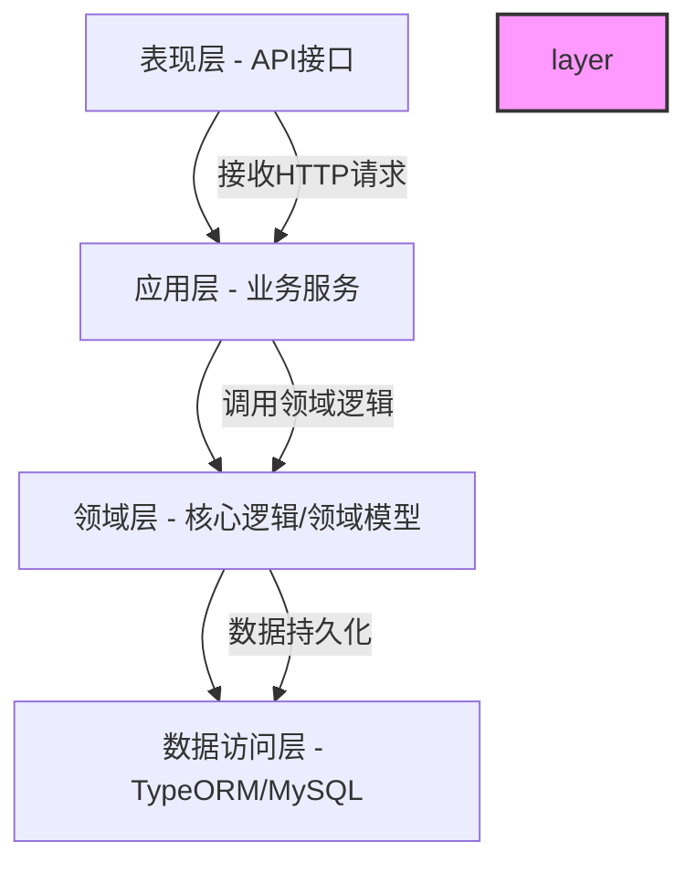
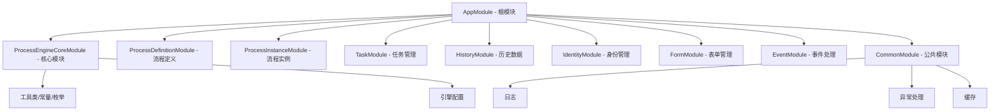
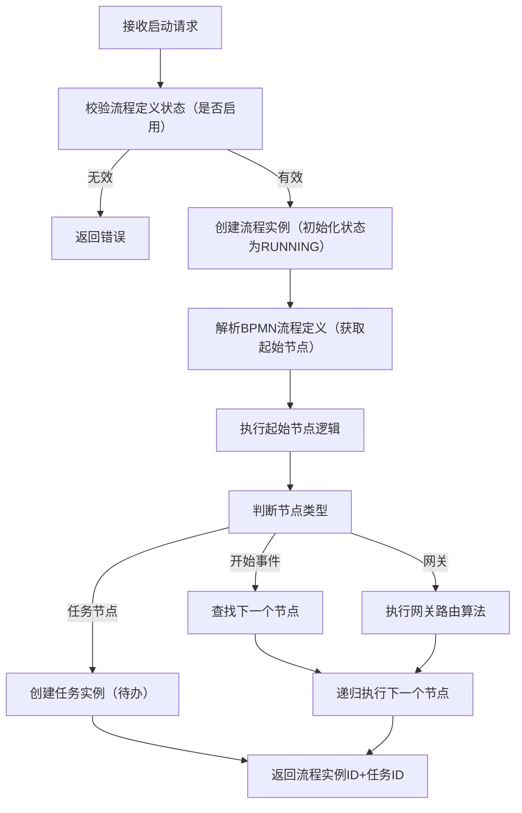

# Flowable 核心功能复刻 - Node.js + NestJS + MySQL 审批流引擎技术设计文档
## 一、需求核心确认
你希望基于 Flowable 最佳实践，采用 Node.js + NestJS + MySQL 技术栈重新实现一套功能完整的审批流引擎，需要覆盖流程定义、实例管理、任务处理等 Flowable 核心能力，并输出包含核心功能梳理、技术设计、实现方案、架构设计、规范文档的完整技术方案，用于指导开发团队落地实现。

## 二、核心功能梳理（对标 Flowable 最佳实践）
### 2.1 核心功能清单及实现思路
| 功能模块                | 核心能力                                                                 | Node.js + NestJS 实现思路                                                                 |
|-------------------------|--------------------------------------------------------------------------|------------------------------------------------------------------------------------------|
| 流程定义管理（BPMN 2.0）| 解析/部署/版本管理/查询/禁用/删除 BPMN 2.0 流程定义                        | 基于 `bpmn-moddle` 解析 BPMN XML；NestJS 服务层封装部署逻辑；MySQL 存储流程定义元数据+XML |
| 流程实例管理            | 实例创建/启动/暂停/终止/挂起/查询/变量管理                                | NestJS 服务层实现实例生命周期；TypeORM 管理实例状态；事务控制确保状态一致性               |
| 任务管理                | 用户任务（认领/完成/退回/委派）、系统任务（自动执行）、委托任务（权限转交） | 基于 RBAC 权限模型分配任务；系统任务通过消息队列异步执行；任务状态机管理生命周期          |
| 历史数据管理            | 实例/任务/变量/操作日志的历史记录存储与查询                              | 分表存储（运行表+历史表）；历史数据归档策略；分页查询优化                                 |
| 身份管理                | 用户/角色/组的CRUD、权限关联、任务权限校验                                | NestJS Auth 模块 + JWT；TypeORM 实现多对多关联（用户-角色-组）；权限拦截器校验            |
| 表单管理                | 流程节点关联表单、表单数据存储、表单校验                                  | 独立表单模块；JSON Schema 定义表单结构；表单数据与流程实例/任务关联                       |
| 监听器和事件处理        | 流程/任务生命周期事件（启动/完成/异常）、自定义监听器                      | NestJS EventEmitter 实现事件发布订阅；监听器注册机制；异步事件处理                        |
| 网关控制逻辑            | 排他网关（单分支）、并行网关（多分支）、包容网关（混合分支）               | 解析 BPMN 网关规则；实现分支路由算法；并行网关通过异步任务并行执行                        |
| 子流程和调用活动        | 内嵌子流程、调用外部流程                                                  | 流程解析时递归处理子流程；调用活动通过流程定义ID关联外部流程                             |
| 定时器事件和异步执行    | 启动定时器/边界定时器、异步任务执行                                      | 基于 `node-schedule` 实现定时器；Kafka/RabbitMQ 处理异步任务；MySQL 存储定时器配置        |

### 2.2 Flowable 核心组件适配（NestJS 分层实现）
| Flowable 组件          | 职责描述                                                                 | NestJS 对应实现方式                                                                 |
|------------------------|--------------------------------------------------------------------------|-------------------------------------------------------------------------------------|
| Process Engine         | 核心引擎，协调各组件工作                                                 | `ProcessEngineCoreModule` 核心模块，统一管理各服务实例、上下文、配置                 |
| Repository Service     | 流程定义的CRUD、部署管理                                                 | `ProcessDefinitionService` 封装流程定义相关操作，依赖 `BpmnParserService`            |
| Runtime Service        | 流程实例的创建、启动、状态管理、变量操作                                 | `ProcessInstanceService` 核心服务，处理实例生命周期，依赖 `GatewayExecutorService`    |
| Task Service           | 任务的分配、认领、完成、查询、委派                                       | `TaskService` 封装任务操作，依赖 `IdentityService` 做权限校验                        |
| History Service        | 历史数据查询、统计                                                       | `HistoryService` 封装历史表查询，支持多维度筛选                                     |
| Identity Service       | 用户/角色/组管理、权限校验                                               | `IdentityService` 对接用户体系，提供权限校验接口                                     |
| Form Service           | 表单定义与数据管理                                                       | `FormService` 管理表单元数据和提交数据                                               |
| Event Dispatcher       | 事件发布与监听                                                           | NestJS 内置 `EventEmitterModule` + 自定义 `EventBusService`                          |

## 三、技术设计文档
### 3.1 系统架构设计
#### 3.1.1 分层架构（经典四层）

- **表现层**：NestJS Controller，提供 RESTful API，处理请求参数校验、响应格式化；
- **应用层**：NestJS Service，封装业务流程，协调领域层组件，无核心业务逻辑；
- **领域层**：核心领域模型（如 `ProcessInstance`、`Task`）、网关执行算法、流程解析逻辑，是引擎核心；
- **数据访问层**：TypeORM Repository，封装数据库操作，屏蔽底层存储细节。

#### 3.1.2 模块划分（NestJS 模块化）


### 3.2 数据库表结构设计
#### 3.2.1 E-R 核心关系图（Mermaid）
```mermaid
erDiagram
    PROCESS_DEFINITION {
        varchar(64) id PK
        varchar(128) name
        varchar(128) key
        int version
        text bpmn_xml
        tinyint(1) is_active
        datetime create_time
        datetime update_time
    }
    
    PROCESS_INSTANCE {
        varchar(64) id PK
        varchar(64) process_definition_id FK
        varchar(64) business_key
        varchar(20) status # RUNNING/SUSPENDED/COMPLETED/TERMINATED
        text variables
        datetime create_time
        datetime start_time
        datetime end_time
    }
    
    TASK {
        varchar(64) id PK
        varchar(64) process_instance_id FK
        varchar(64) process_definition_id FK
        varchar(64) task_def_key
        varchar(128) name
        varchar(20) type # USER/SYSTEM/DELEGATE
        varchar(20) status # CREATED/CLAIMED/COMPLETED/REJECTED
        varchar(64) assignee
        text candidate_users
        text candidate_groups
        text variables
        datetime create_time
        datetime claim_time
        datetime complete_time
    }
    
    HISTORY_PROCESS_INSTANCE {
        varchar(64) id PK
        varchar(64) process_instance_id
        varchar(64) process_definition_id FK
        varchar(64) business_key
        varchar(20) status
        text variables
        datetime create_time
        datetime start_time
        datetime end_time
        varchar(64) end_by
    }
    
    HISTORY_TASK {
        varchar(64) id PK
        varchar(64) task_id
        varchar(64) process_instance_id
        varchar(20) type
        varchar(20) status
        varchar(64) assignee
        text variables
        datetime create_time
        datetime complete_time
        varchar(64) complete_by
    }
    
    USER {
        varchar(64) id PK
        varchar(64) username
        varchar(64) password # 加密存储
        varchar(64) real_name
        tinyint(1) is_active
    }
    
    ROLE {
        varchar(64) id PK
        varchar(64) name
        varchar(256) description
    }
    
    GROUP {
        varchar(64) id PK
        varchar(64) name
        varchar(256) description
    }
    
    USER_ROLE {
        varchar(64) id PK
        varchar(64) user_id FK
        varchar(64) role_id FK
    }
    
    USER_GROUP {
        varchar(64) id PK
        varchar(64) user_id FK
        varchar(64) group_id FK
    }
    
    FORM {
        varchar(64) id PK
        varchar(64) name
        text schema # JSON Schema
        tinyint(1) is_active
    }
    
    TASK_FORM {
        varchar(64) id PK
        varchar(64) task_def_key
        varchar(64) process_definition_id FK
        varchar(64) form_id FK
        varchar(20) type # START/TASK/END
    }
    
    PROCESS_DEFINITION ||--o{ PROCESS_INSTANCE : "包含"
    PROCESS_INSTANCE ||--o{ TASK : "包含"
    PROCESS_DEFINITION ||--o{ HISTORY_PROCESS_INSTANCE : "生成"
    TASK ||--o{ HISTORY_TASK : "生成"
    USER ||--o{ USER_ROLE : "关联"
    ROLE ||--o{ USER_ROLE : "关联"
    USER ||--o{ USER_GROUP : "关联"
    GROUP ||--o{ USER_GROUP : "关联"
    PROCESS_DEFINITION ||--o{ TASK_FORM : "关联"
    FORM ||--o{ TASK_FORM : "关联"
```

#### 3.2.2 核心表字段说明（节选）
| 表名                  | 核心字段                | 说明                                                                 |
|-----------------------|-------------------------|----------------------------------------------------------------------|
| `process_definition`  | `key`+`version`         | 流程定义唯一标识（相同key不同version实现版本管理）|
|                       | `bpmn_xml`              | 存储BPMN 2.0 XML原文（压缩存储优化性能）|
|                       | `is_active`             | 是否启用（禁用后无法创建新实例）|
| `process_instance`    | `business_key`          | 关联业务系统主键（如订单ID）|
|                       | `status`                | 实例状态：RUNNING/SUSPENDED/COMPLETED/TERMINATED                     |
|                       | `variables`             | 流程变量（JSON格式存储）|
| `task`                | `task_def_key`          | BPMN中任务节点的ID                                                   |
|                       | `candidate_users/groups`| 候选用户/组（逗号分隔）|
|                       | `assignee`              | 认领人（空表示未认领）|
| `history_task`        | `complete_by`           | 完成人ID（审计追溯）|

#### 3.2.3 索引策略
1. **主键索引**：所有表的 `id` 字段设为主键（varchar(64)，UUID生成）；
2. **联合索引**：
    - `process_definition`：`key + version`（唯一索引，确保版本唯一）；
    - `process_instance`：`process_definition_id + status`（查询指定流程的运行实例）；
    - `task`：`process_instance_id + status + assignee`（查询用户待办任务）；
    - `history_task`：`process_instance_id + complete_time`（按时间查询历史任务）；
3. **单字段索引**：
    - `task`：`candidate_users`（模糊查询候选用户任务）；
    - `process_instance`：`business_key`（通过业务主键关联查询实例）。

### 3.3 API 接口设计（RESTful 风格）
#### 3.3.1 通用请求/响应格式
- **请求头**：统一携带 `Authorization: Bearer {JWT_TOKEN}`，`Content-Type: application/json`；
- **响应格式**：
  ```json
  {
    "code": 200, // 200成功/4xx客户端错误/5xx服务端错误
    "message": "操作成功",
    "data": {}, // 业务数据
    "timestamp": 1740000000000
  }
  ```

#### 3.3.2 核心接口示例
| 接口路径                          | 请求方法 | 接口描述               | 请求参数示例                                                                 |
|-----------------------------------|----------|------------------------|------------------------------------------------------------------------------|
| `/api/process-definitions`        | POST     | 部署流程定义           | `{ "name": "请假流程", "key": "leave", "bpmnXml": "<bpmn...>" }`             |
| `/api/process-definitions/{id}`   | GET      | 查询单个流程定义       | -                                                                            |
| `/api/process-instances`          | POST     | 启动流程实例           | `{ "processDefinitionId": "xxx", "businessKey": "ORDER123", "variables": {} }` |
| `/api/tasks/claim`                | POST     | 认领任务               | `{ "taskId": "xxx", "userId": "user01" }`                                    |
| `/api/tasks/complete`             | POST     | 完成任务               | `{ "taskId": "xxx", "variables": {}, "comment": "审批通过" }`                 |
| `/api/history/process-instances`  | GET      | 查询历史流程实例       | `processDefinitionKey=leave&status=COMPLETED`                                 |

### 3.4 核心算法流程图
#### 3.4.1 流程实例启动流程


#### 3.4.2 任务分配算法流程
```mermaid
graph TD
    A[解析BPMN任务节点的分配规则] --> B{分配类型}
    B -->|指定用户| C[直接设置assignee]
    B -->|候选用户| D[设置candidate_users]
    B -->|候选组| E[查询组下所有用户→设置candidate_users]
    B -->|表达式| F[解析EL表达式（如${initiator}）→获取用户]
    C --> G[创建任务实例]
    D --> G
    E --> G
    F --> G
    G --> H[发布任务创建事件]
    H --> I[返回任务ID]
```

### 3.5 性能优化策略
1. **数据层优化**：
    - 流程定义XML压缩存储（gzip），查询时解压，减少存储占用；
    - 历史数据分表（按时间分表，如 `history_task_202602`），降低单表数据量；
    - TypeORM 开启查询缓存，高频查询（如流程定义）缓存到Redis；
2. **业务层优化**：
    - 批量操作（如批量完成任务）使用TypeORM `saveMany`/`deleteMany`，减少SQL执行次数；
    - 异步处理非核心逻辑（如通知、日志），通过消息队列解耦；
    - 分页查询默认限制最大条数（如1000条），避免全表扫描；
3. **缓存策略**：
    - 热点数据（流程定义、用户权限）缓存到Redis，过期时间1小时，更新时主动失效；
    - 任务待办列表缓存（用户维度），认领/完成任务时更新缓存；

### 3.6 安全性设计
1. **认证授权**：
    - 基于JWT实现身份认证，Token有效期2小时，支持刷新Token；
    - RBAC权限模型：用户→角色→权限（如流程定义查看/编辑、任务处理）；
    - 接口级权限拦截：NestJS Guard 校验用户是否有接口访问权限；
2. **数据安全**：
    - 密码存储：使用 `bcrypt` 加盐哈希，不可逆；
    - 敏感字段加密：流程变量中的敏感数据（如身份证）使用AES-256加密存储；
    - SQL注入防护：TypeORM 参数化查询，禁止直接拼接SQL；
    - XSS防护：请求参数过滤（`xss` 库），响应内容转义；
3. **操作审计**：
    - 所有核心操作（部署流程、完成任务）记录操作日志（用户、时间、操作内容、IP）；
    - 关键数据变更（如流程实例终止）需记录操作人及原因。

## 三、实现方案
### 3.1 NestJS 模块化设计
#### 3.1.1 模块结构示例
```
src/
├── app.module.ts                # 根模块
├── core/                        # 核心模块
│   ├── process-engine-core.module.ts
│   ├── services/
│   │   └── bpmn-parser.service.ts # BPMN解析核心服务
│   └── constants/               # 全局常量/枚举
├── process-definition/          # 流程定义模块
│   ├── process-definition.module.ts
│   ├── controllers/
│   │   └── process-definition.controller.ts
│   ├── services/
│   │   └── process-definition.service.ts
│   ├── entities/
│   │   └── process-definition.entity.ts
│   └── dto/                     # 请求参数校验DTO
├── process-instance/            # 流程实例模块
├── task/                        # 任务模块
├── common/                      # 公共模块
│   ├── common.module.ts
│   ├── filters/                 # 全局异常过滤器
│   ├── interceptors/            # 响应拦截器
│   └── guards/                  # 权限守卫
└── config/                      # 配置文件
    └── database.config.ts       # MySQL配置
```

#### 3.1.2 核心模块注册示例
```typescript
// src/core/process-engine-core.module.ts
import { Module, Global } from '@nestjs/common';
import { BpmnParserService } from './services/bpmn-parser.service';
import { GatewayExecutorService } from './services/gateway-executor.service';

// 全局模块，所有模块可直接注入
@Global()
@Module({
  providers: [BpmnParserService, GatewayExecutorService],
  exports: [BpmnParserService, GatewayExecutorService],
})
export class ProcessEngineCoreModule {}
```

### 3.2 TypeORM 实体关系映射
#### 3.2.1 核心实体示例（流程实例）
```typescript
// src/process-instance/entities/process-instance.entity.ts
import {
  Entity,
  Column,
  PrimaryGeneratedColumn,
  CreateDateColumn,
  UpdateDateColumn,
  ManyToOne,
  JoinColumn,
  OneToMany,
} from 'typeorm';
import { ProcessDefinition } from '../../process-definition/entities/process-definition.entity';
import { Task } from '../../task/entities/task.entity';

export enum ProcessInstanceStatus {
  RUNNING = 'RUNNING',
  SUSPENDED = 'SUSPENDED',
  COMPLETED = 'COMPLETED',
  TERMINATED = 'TERMINATED',
}

@Entity('process_instance')
export class ProcessInstance {
  @PrimaryGeneratedColumn('uuid') // 生成UUID主键
  id: string;

  @Column({ name: 'process_definition_id' })
  processDefinitionId: string;

  // 关联流程定义（多对一）
  @ManyToOne(() => ProcessDefinition)
  @JoinColumn({ name: 'process_definition_id' })
  processDefinition: ProcessDefinition;

  @Column({ name: 'business_key', nullable: true })
  businessKey: string;

  @Column({
    type: 'enum',
    enum: ProcessInstanceStatus,
    default: ProcessInstanceStatus.RUNNING,
  })
  status: ProcessInstanceStatus;

  @Column({ type: 'json', nullable: true }) // JSON格式存储变量
  variables: Record<string, any>;

  @CreateDateColumn({ name: 'create_time' })
  createTime: Date;

  @Column({ name: 'start_time', nullable: true })
  startTime: Date;

  @Column({ name: 'end_time', nullable: true })
  endTime: Date;

  // 关联任务（一对多）
  @OneToMany(() => Task, (task) => task.processInstance)
  tasks: Task[];
}
```

### 3.3 中间件和拦截器设计
#### 3.3.1 全局日志中间件
```typescript
// src/common/middlewares/logger.middleware.ts
import { Injectable, NestMiddleware } from '@nestjs/common';
import { Request, Response, NextFunction } from 'express';
import { Logger } from '@nestjs/common';

@Injectable()
export class LoggerMiddleware implements NestMiddleware {
  private logger = new Logger('HTTP');

  use(req: Request, res: Response, next: NextFunction) {
    const { method, originalUrl, ip } = req;
    const startTime = Date.now();

    // 响应完成后记录日志
    res.on('finish', () => {
      const { statusCode } = res;
      const duration = Date.now() - startTime;
      this.logger.log(
        `${method} ${originalUrl} ${statusCode} ${duration}ms - ${ip}`,
      );
    });

    next();
  }
}
```

#### 3.3.2 统一响应拦截器
```typescript
// src/common/interceptors/response.interceptor.ts
import {
  Injectable,
  NestInterceptor,
  ExecutionContext,
  CallHandler,
} from '@nestjs/common';
import { Observable } from 'rxjs';
import { map } from 'rxjs/operators';

@Injectable()
export class ResponseInterceptor implements NestInterceptor {
  intercept(context: ExecutionContext, next: CallHandler): Observable<any> {
    return next.handle().pipe(
      map((data) => ({
        code: 200,
        message: '操作成功',
        data: data || null,
        timestamp: Date.now(),
      })),
    );
  }
}
```

### 3.4 异常处理机制
#### 3.4.1 自定义异常类
```typescript
// src/common/exceptions/business.exception.ts
import { HttpException, HttpStatus } from '@nestjs/common';

export class BusinessException extends HttpException {
  constructor(message: string, code = 400) {
    super(
      {
        code,
        message,
        timestamp: Date.now(),
      },
      HttpStatus.OK, // 统一返回200，通过code区分错误
    );
  }
}
```

#### 3.4.2 全局异常过滤器
```typescript
// src/common/filters/global-exception.filter.ts
import {
  ExceptionFilter,
  Catch,
  ArgumentsHost,
  HttpException,
  Logger,
} from '@nestjs/common';
import { Request, Response } from 'express';

@Catch() // 捕获所有异常
export class GlobalExceptionFilter implements ExceptionFilter {
  private logger = new Logger('ExceptionFilter');

  catch(exception: any, host: ArgumentsHost) {
    const ctx = host.switchToHttp();
    const response = ctx.getResponse<Response>();
    const request = ctx.getRequest<Request>();

    // 区分业务异常和系统异常
    if (exception instanceof HttpException) {
      const res = exception.getResponse() as any;
      response.status(200).json({
        code: res.code || exception.getStatus(),
        message: res.message || exception.message,
        data: null,
        timestamp: Date.now(),
      });
    } else {
      // 系统异常记录日志
      this.logger.error(
        `URL: ${request.originalUrl}, Error: ${exception.stack}`,
      );
      response.status(200).json({
        code: 500,
        message: '服务器内部错误',
        data: null,
        timestamp: Date.now(),
      });
    }
  }
}
```

### 3.5 日志记录策略
#### 3.5.1 技术选型
使用 `winston` 作为日志核心库，支持：
- 多级别日志（debug/info/warn/error）；
- 控制台+文件双输出；
- 按日期分割日志文件；

#### 3.5.2 日志配置示例
```typescript
// src/common/utils/logger.util.ts
import * as winston from 'winston';
import * as DailyRotateFile from 'winston-daily-rotate-file';

// 日志格式
const format = winston.format.combine(
  winston.format.timestamp({ format: 'YYYY-MM-DD HH:mm:ss' }),
  winston.format.json(),
);

// 日志传输配置
const transports = [
  // 控制台输出
  new winston.transports.Console({
    format: winston.format.combine(winston.format.colorize(), winston.format.simple()),
  }),
  // 按日期分割的文件输出
  new DailyRotateFile({
    filename: 'logs/app-%DATE%.log',
    datePattern: 'YYYY-MM-DD',
    maxSize: '20m',
    maxFiles: '14d', // 保留14天日志
  }),
  // 单独的错误日志
  new DailyRotateFile({
    filename: 'logs/error-%DATE%.log',
    datePattern: 'YYYY-MM-DD',
    level: 'error',
    maxSize: '20m',
    maxFiles: '30d',
  }),
];

export const logger = winston.createLogger({
  level: process.env.NODE_ENV === 'production' ? 'info' : 'debug',
  format,
  transports,
});
```

### 3.6 单元测试和集成测试方案
#### 3.6.1 技术选型
- 单元测试：Jest（NestJS 内置）；
- 集成测试：Supertest（HTTP接口测试）；
- 测试数据库：MySQL 测试库（每次测试前清空表数据）；

#### 3.6.2 单元测试示例（流程定义服务）
```typescript
// src/process-definition/services/process-definition.service.spec.ts
import { Test, TestingModule } from '@nestjs/testing';
import { ProcessDefinitionService } from './process-definition.service';
import { getRepositoryToken } from '@nestjs/typeorm';
import { ProcessDefinition } from '../entities/process-definition.entity';

describe('ProcessDefinitionService', () => {
  let service: ProcessDefinitionService;

  beforeEach(async () => {
    const module: TestingModule = await Test.createTestingModule({
      providers: [
        ProcessDefinitionService,
        {
          provide: getRepositoryToken(ProcessDefinition),
          useValue: {
            find: jest.fn().mockResolvedValue([]),
            save: jest.fn().mockResolvedValue({ id: '123', name: '测试流程' }),
          },
        },
      ],
    }).compile();

    service = module.get<ProcessDefinitionService>(ProcessDefinitionService);
  });

  it('should be defined', () => {
    expect(service).toBeDefined();
  });

  it('should create a process definition', async () => {
    const result = await service.create({
      name: '测试流程',
      key: 'test',
      bpmnXml: '<bpmn...>',
    });
    expect(result).toHaveProperty('id');
    expect(result.name).toBe('测试流程');
  });
});
```

#### 3.6.3 集成测试示例（流程实例启动接口）
```typescript
// src/process-instance/process-instance.controller.spec.ts
import { Test, TestingModule } from '@nestjs/testing';
import { INestApplication } from '@nestjs/common';
import * as request from 'supertest';
import { ProcessInstanceModule } from './process-instance.module';
import { ProcessEngineCoreModule } from '../core/process-engine-core.module';
import { TypeOrmModule } from '@nestjs/typeorm';

describe('ProcessInstanceController (e2e)', () => {
  let app: INestApplication;

  beforeEach(async () => {
    const moduleFixture: TestingModule = await Test.createTestingModule({
      imports: [
        ProcessInstanceModule,
        ProcessEngineCoreModule,
        TypeOrmModule.forRoot({
          type: 'mysql',
          host: 'localhost',
          port: 3306,
          username: 'test',
          password: 'test',
          database: 'flow_test',
          autoLoadEntities: true,
          synchronize: true, // 测试环境自动建表
        }),
      ],
    }).compile();

    app = moduleFixture.createNestApplication();
    await app.init();
  });

  it('/api/process-instances (POST)', () => {
    return request(app.getHttpServer())
      .post('/api/process-instances')
      .send({
        processDefinitionId: '123',
        businessKey: 'TEST001',
        variables: { applyUserId: 'user01' },
      })
      .expect(200)
      .expect((res) => {
        expect(res.body.data).toHaveProperty('id');
        expect(res.body.data.status).toBe('RUNNING');
      });
  });
});
```

## 四、架构设计
### 4.1 微服务拆分建议
若系统规模较大，建议拆分为以下微服务（基于 NestJS 微服务 + Kafka 通信）：
| 微服务名称         | 核心职责                     | 技术栈                  |
|--------------------|------------------------------|-------------------------|
| 流程引擎核心服务   | 流程定义/实例/任务核心逻辑   | NestJS + MySQL + Redis  |
| 身份认证服务       | 用户/角色/组管理、认证授权   | NestJS + MySQL + JWT    |
| 表单服务           | 表单定义/数据存储/校验       | NestJS + MySQL          |
| 通知服务           | 任务提醒（短信/邮件/站内信） | NestJS + Kafka + 第三方SDK |
| 日志服务           | 操作日志/审计日志存储查询    | NestJS + Elasticsearch  |

### 4.2 缓存策略设计
| 缓存类型         | 缓存内容                | 缓存工具 | 过期策略                  | 更新策略                  |
|------------------|-------------------------|----------|---------------------------|---------------------------|
| 流程定义缓存     | 流程定义元数据+BPMN XML | Redis    | 1小时（非频繁变更）| 部署/更新流程时主动删除缓存 |
| 用户待办任务缓存 | 用户待办任务列表        | Redis    | 10分钟（高频变更）| 认领/完成任务时更新缓存    |
| 权限缓存         | 用户-角色-组关联关系    | Redis    | 2小时                     | 权限变更时主动删除缓存     |

### 4.3 消息队列集成方案
#### 4.3.1 技术选型
选择 Kafka 作为消息队列（高吞吐、持久化、分区机制），核心场景：
1. 异步执行系统任务（如自动审批、数据同步）；
2. 流程/任务事件通知（如任务创建后推送通知）；
3. 分布式事务最终一致性（如流程完成后同步业务系统）；

#### 4.3.2 集成示例（任务完成后发送通知）
```typescript
// 1. 发布事件（任务服务）
@Injectable()
export class TaskService {
  constructor(private readonly kafkaProducer: KafkaProducerService) {}

  async completeTask(taskId: string, params: CompleteTaskDto) {
    // 1. 完成任务核心逻辑
    const task = await this.taskRepository.findOne({ where: { id: taskId } });
    task.status = TaskStatus.COMPLETED;
    await this.taskRepository.save(task);

    // 2. 发布任务完成事件到Kafka
    await this.kafkaProducer.send('task.completed', {
      taskId,
      processInstanceId: task.processInstanceId,
      completeBy: params.userId,
      completeTime: new Date(),
    });
  }
}

// 2. 消费事件（通知服务）
@Injectable()
export class TaskNotificationConsumer {
  @Consumer('task.completed') // 自定义装饰器，监听Kafka主题
  async handleTaskCompleted(message: any) {
    const { taskId, processInstanceId } = message.value;
    // 查询下一个任务的候选用户，发送通知
    await this.notificationService.send({
      userId: 'nextAssignee',
      content: `有新的审批任务需要处理（流程实例：${processInstanceId}）`,
      type: 'TASK_REMINDER',
    });
  }
}
```

### 4.4 分布式事务处理
由于 Node.js 缺乏成熟的分布式事务管理器，建议采用 **最终一致性方案**：
1. **核心思路**：
    - 本地事务完成后，发送消息到 Kafka；
    - 消费端处理消息，若失败则重试（最多3次）；
    - 重试失败则记录死信队列，人工介入处理；
2. **示例场景**：流程实例完成后同步业务系统状态
   ```mermaid
   graph TD
    A[流程引擎服务] --> B[完成流程实例（本地事务）]
    B --> C[发送“流程完成”消息到Kafka]
    C --> D[业务系统服务消费消息]
    D --> E[更新业务状态（本地事务）]
    E -->|成功| F[提交]
    E -->|失败| G[重试（最多3次）]
    G -->|失败| H[进入死信队列]
   ```

### 4.5 监控和运维方案
#### 4.5.1 监控指标（Prometheus + Grafana）
| 指标类型         | 核心指标                     | 监控方式                          |
|------------------|------------------------------|-----------------------------------|
| 系统指标         | CPU/内存/磁盘/网络           | Node Exporter + Prometheus        |
| 应用指标         | 接口QPS/响应时间/错误率      | NestJS + prom-client 暴露指标     |
| 业务指标         | 流程实例数/待办任务数/审批耗时 | 自定义埋点 + Prometheus           |

#### 4.5.2 日志收集（ELK）
1. 应用日志输出到文件（按日期分割）；
2. Filebeat 采集日志文件，发送到 Logstash；
3. Logstash 过滤/格式化日志，写入 Elasticsearch；
4. Kibana 可视化查询日志；

#### 4.5.3 健康检查
NestJS 提供 `TerminusModule` 实现健康检查：
```typescript
// src/app.module.ts
import { TerminusModule } from '@nestjs/terminus';

@Module({
  imports: [
    TerminusModule,
    // ...其他模块
  ],
})
export class AppModule {}

// src/health/health.controller.ts
import { Controller, Get } from '@nestjs/common';
import {
  HealthCheck,
  HealthCheckService,
  TypeOrmHealthIndicator,
  RedisHealthIndicator,
} from '@nestjs/terminus';

@Controller('health')
export class HealthController {
  constructor(
    private health: HealthCheckService,
    private db: TypeOrmHealthIndicator,
    private redis: RedisHealthIndicator,
  ) {}

  @Get()
  @HealthCheck()
  check() {
    return this.health.check([
      () => this.db.pingCheck('mysql'),
      () => this.redis.pingCheck('redis'),
    ]);
  }
}
```

## 五、规范文档
### 5.1 代码规范
#### 5.1.1 ESLint + Prettier 配置
```
// .eslintrc.js
module.exports = {
  parser: '@typescript-eslint/parser',
  parserOptions: {
    project: 'tsconfig.json',
    tsconfigRootDir: __dirname,
    sourceType: 'module',
  },
  plugins: ['@typescript-eslint/eslint-plugin'],
  extends: [
    'plugin:@typescript-eslint/recommended',
    'plugin:prettier/recommended',
  ],
  root: true,
  env: {
    node: true,
    jest: true,
  },
  ignorePatterns: ['.eslintrc.js'],
  rules: {
    '@typescript-eslint/interface-name-prefix': 'off',
    '@typescript-eslint/explicit-function-return-type': 'off',
    '@typescript-eslint/explicit-module-boundary-types': 'off',
    '@typescript-eslint/no-explicit-any': 'warn',
    'prettier/prettier': [
      'error',
      {
        singleQuote: true,
        trailingComma: 'all',
        printWidth: 100,
        tabWidth: 2,
      },
    ],
  },
};
```

#### 5.1.2 TypeScript 规范
1. 强制使用类型注解（避免 `any`，除非特殊场景）；
2. 类名使用 PascalCase（如 `ProcessDefinitionService`）；
3. 方法/变量名使用 camelCase（如 `createProcessInstance`）；
4. 常量使用 UPPER_SNAKE_CASE（如 `PROCESS_INSTANCE_STATUS`）；
5. 接口名前缀为 `I`（如 `IProcessInstance`）；

### 5.2 Git 分支管理策略
采用 Git Flow 分支模型：
| 分支类型   | 分支名格式       | 用途                     | 合并规则                          |
|------------|------------------|--------------------------|-----------------------------------|
| 主分支     | master           | 生产环境代码             | 仅从 release/hotfix 分支合并      |
| 开发分支   | develop          | 开发环境代码             | 从 feature 分支合并               |
| 功能分支   | feature/xxx      | 开发新功能               | 完成后合并到 develop 分支         |
| 发布分支   | release/v1.0.0   | 预发布测试               | 测试通过后合并到 master + develop |
| 热修复分支 | hotfix/v1.0.1    | 生产环境紧急修复         | 修复后合并到 master + develop     |

### 5.3 接口文档规范
1. 基于 Swagger/OpenAPI 3.0 生成接口文档；
2. 接口路径统一前缀：`/api/v1/xxx`（版本化管理）；
3. 每个接口必须包含：
    - 接口描述、请求方法、路径；
    - 请求参数（字段名、类型、是否必填、说明）；
    - 响应参数（字段名、类型、说明）；
    - 错误码说明；

#### 5.3.1 Swagger 配置示例
```typescript
// src/main.ts
import { SwaggerModule, DocumentBuilder } from '@nestjs/swagger';

async function bootstrap() {
  const app = await NestFactory.create(AppModule);
  
  const config = new DocumentBuilder()
    .setTitle('审批流引擎API文档')
    .setDescription('基于NestJS的Flowable复刻版API文档')
    .setVersion('1.0')
    .addBearerAuth() // 添加JWT认证
    .build();
  const document = SwaggerModule.createDocument(app, config);
  SwaggerModule.setup('api-docs', app, document);
  
  await app.listen(3000);
}
```

### 5.4 部署规范和 CI/CD 流程
#### 5.4.1 部署规范
1. 容器化部署：每个服务打包为 Docker 镜像，通过 Docker Compose/K8s 编排；
2. 配置分离：使用环境变量/配置中心管理不同环境（开发/测试/生产）配置；
3. 数据持久化：MySQL/Redis 数据挂载宿主机目录，避免容器销毁丢失；

#### 5.4.2 Dockerfile 示例
```dockerfile
FROM node:18-alpine AS builder
WORKDIR /app
COPY package*.json ./
RUN npm install --registry=https://registry.npm.taobao.org
COPY . .
RUN npm run build

FROM node:18-alpine
WORKDIR /app
COPY --from=builder /app/dist ./dist
COPY --from=builder /app/package*.json ./
RUN npm install --production --registry=https://registry.npm.taobao.org
EXPOSE 3000
CMD ["node", "dist/main.js"]
```

#### 5.4.3 CI/CD 流程（GitHub Actions）
```yaml
# .github/workflows/ci-cd.yml
name: CI/CD

on:
  push:
    branches: [ develop, master ]
  pull_request:
    branches: [ develop ]

jobs:
  build-and-test:
    runs-on: ubuntu-latest
    steps:
      - uses: actions/checkout@v4
      - name: Set up Node.js
        uses: actions/setup-node@v4
        with:
          node-version: '18'
      - name: Install dependencies
        run: npm install
      - name: Lint
        run: npm run lint
      - name: Test
        run: npm run test
      - name: Build
        run: npm run build

  deploy:
    needs: build-and-test
    runs-on: ubuntu-latest
    if: github.ref == 'refs/heads/master'
    steps:
      - uses: actions/checkout@v4
      - name: Build Docker image
        run: docker build -t flow-engine:${{ github.sha }} .
      - name: Push to registry
        run: |
          docker login -u ${{ secrets.DOCKER_USERNAME }} -p ${{ secrets.DOCKER_PASSWORD }}
          docker tag flow-engine:${{ github.sha }} your-registry/flow-engine:latest
          docker push your-registry/flow-engine:latest
      - name: Deploy to K8s
        run: |
          kubectl apply -f k8s/deployment.yaml
          kubectl rollout restart deployment flow-engine
```

## 六、总结
### 6.1 核心关键点
1. **功能对齐**：基于 Flowable 最佳实践，覆盖流程定义、实例、任务等核心能力，适配 BPMN 2.0 规范；
2. **技术栈适配**：Node.js + NestJS 实现分层模块化设计，TypeORM 管理 MySQL 数据，保证代码可维护性；
3. **性能与安全**：通过缓存、分表、异步处理优化性能，JWT + RBAC 保障安全，日志/监控保障可运维性；
4. **扩展性设计**：支持微服务拆分、消息队列集成、分布式事务最终一致性，适配大规模场景。

### 6.2 潜在问题及解决方案
| 潜在问题               | 解决方案                                   |
|------------------------|--------------------------------------------|
| BPMN 解析复杂度高      | 基于成熟库 `bpmn-moddle`，封装解析工具类   |
| 流程节点执行性能瓶颈   | 核心节点异步执行，并行网关多线程处理       |
| 分布式事务一致性       | 采用最终一致性方案，消息队列+重试+死信队列 |
| 历史数据量过大         | 分表存储+归档策略，定期迁移冷数据到归档库 |